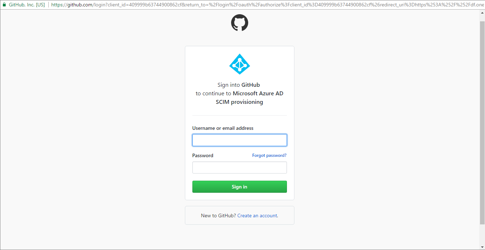

# Configure GitHub for automatic user provisioning in Microsoft Entra ID

The objective of this article is to show you the steps you need to perform in GitHub and Microsoft Entra ID to automate provisioning of GitHub Enterprise Cloud organization membership.

> [!NOTE]
> The Microsoft Entra provisioning integration relies on the [GitHub SCIM API](https://developer.github.com/v3/scim/), which is available to [GitHub Enterprise Cloud](https://help.github.com/articles/github-s-products/#github-enterprise) customers on the [GitHub Enterprise billing plan](https://help.github.com/articles/github-s-billing-plans/#billing-plans-for-organizations).

## Prerequisites

The scenario outlined in this article assumes that you already have the following items:

[!INCLUDE [common-prerequisites.md](~/identity/saas-apps/includes/common-prerequisites.md)]
* A GitHub organization created in [GitHub Enterprise Cloud](https://help.github.com/articles/github-s-products/#github-enterprise), which requires the [GitHub Enterprise billing plan](https://help.github.com/articles/github-s-billing-plans/#billing-plans-for-organizations)
* A user account in GitHub with Admin permissions to the organization
* [SAML configured for the GitHub Enterprise Cloud organization](./github-tutorial.md)
* Ensure that OAuth access has been provided for your organization as described [here](https://help.github.com/en/github/setting-up-and-managing-organizations-and-teams/approving-oauth-apps-for-your-organization)
* SCIM provisioning to a single organization is supported only when SSO is enabled at the organization level

> [!NOTE]
> This integration is also available to use from Microsoft Entra US Government Cloud environment. You can find this application in the Microsoft Entra US Government Cloud Application Gallery and configure it in the same way as you do from public cloud.

## Assigning users to GitHub

Microsoft Entra ID uses a concept called "assignments" to determine which users should receive access to selected apps. In the context of automatic user account provisioning, only the users and groups that have been "assigned" to an application in Microsoft Entra ID is synchronized. 

Before configuring and enabling the provisioning service, you need to decide what users and/or groups in Microsoft Entra ID represent the users who need access to your GitHub Organization. Once decided, you can assign these users by following the instructions here:

For more information, see [Assign a user or group to an enterprise app](~/identity/enterprise-apps/assign-user-or-group-access-portal.md).

### Important tips for assigning users to GitHub

* We recommend that you assign a single Microsoft Entra user to GitHub to test the provisioning configuration. Additional users and/or groups may be assigned later.

* When assigning a user to GitHub, you must select either the **User** role, or another valid application-specific role (if available) in the assignment dialog. The **Default Access** role doesn't work for provisioning, and these users are skipped.

## Configuring user provisioning to GitHub

This section guides you through connecting your Microsoft Entra ID to GitHub's SCIM provisioning API to automate provisioning of GitHub organization membership. This integration, which leverages an [OAuth app](https://docs.github.com/en/free-pro-team@latest/github/authenticating-to-github/authorizing-oauth-apps#oauth-apps-and-organizations), automatically adds, manages, and removes members' access to a GitHub Enterprise Cloud organization based on user and group assignment in Microsoft Entra ID. When users are [provisioned to a GitHub organization via SCIM](https://docs.github.com/en/rest/enterprise-admin/scim), an email invitation is sent to the user's email address.

### Configure automatic user account provisioning to GitHub in Microsoft Entra ID

1. Sign in to the [Microsoft Entra admin center](https://entra.microsoft.com) as at least a [Cloud Application Administrator](~/identity/role-based-access-control/permissions-reference.md#cloud-application-administrator).
1. Browse to **Entra ID** > **Enterprise apps**.

1. If you have already configured GitHub for single sign-on, search for your instance of GitHub using the search field.

1. Select your instance of GitHub, then select the **Provisioning** tab.

1. Select **+ New configuration**.

   

1. In the **Tenant URL** field, input your GitHub Tenant URL and Secret Token. Select **Test Connection** to ensure Microsoft Entra ID can connect to GitHub. If the connection fails, ensure your GitHub account has the required admin permissions and try again.

   

1. In the new window, sign into GitHub using your Admin account. In the resulting authorization dialog, select the GitHub Organization that you want to enable provisioning for, and then select **Authorize**. Once completed, return to the Azure portal to complete the provisioning configuration.

   

1. Select **Create** to create your configuration.

1. Select **Properties** on the **Overview** page.

1. Select the **Edit** icon to edit the properties. Enable notification emails and provide an email to receive quarantine notifications. Enable **Accidental deletions prevention**. Select **Apply** to save the changes.

1. In the **Notification Email** field, enter the email address of a person who should receive the provisioning error notifications and select the **Send an email notification when a failure occurs** check box.

   

1. Select **Attribute Mapping** in the left panel and select **users**.

1. In the **Attribute Mappings** section, review the user attributes that are synchronized from Microsoft Entra ID to GitHub. The attributes selected as **Matching** properties are used to match the user accounts in GitHub for update operations. don't enable the **Matching precedence** setting for the other default attributes in the **Provisioning** section because errors might occur. Select **Save** to commit any changes.

1. To configure scoping filters, refer to the instructions provided in the [Scoping filter article](~/identity/app-provisioning/define-conditional-rules-for-provisioning-user-accounts.md).

1. Use [on-demand provisioning](~/identity/app-provisioning/provision-on-demand.md) to validate sync with a small number of users before deploying more broadly in your organization. 

1. When you're ready to provision, select **Start Provisioning** from the **Overview** page.

For more information on how to read the Microsoft Entra provisioning logs, see [Reporting on automatic user account provisioning](~/identity/app-provisioning/check-status-user-account-provisioning.md).

## Additional resources

* [Managing user account provisioning for Enterprise Apps](~/identity/app-provisioning/configure-automatic-user-provisioning-portal.md)
* [What is application access and single sign-on with Microsoft Entra ID?](~/identity/enterprise-apps/what-is-single-sign-on.md)

## Related content

* [Learn how to review logs and get reports on provisioning activity](~/identity/app-provisioning/check-status-user-account-provisioning.md)