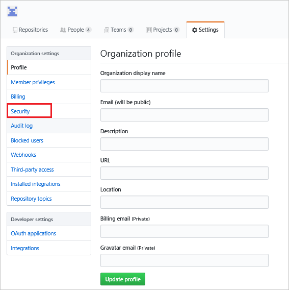
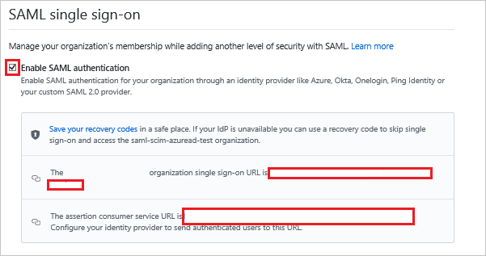
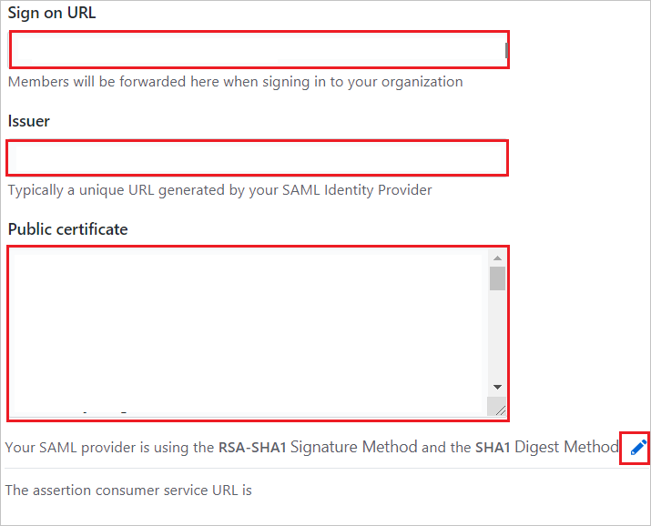
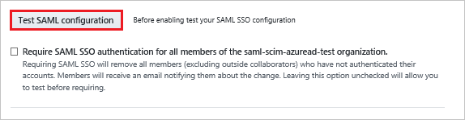
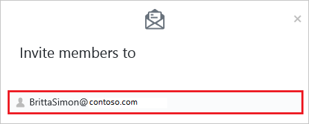
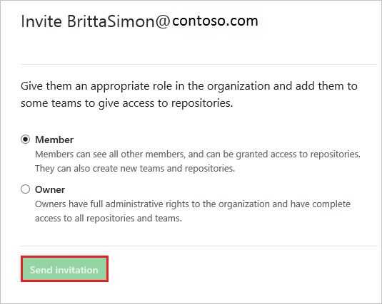

# Configure a GitHub Enterprise Cloud Organization for Single sign-on with Microsoft Entra ID

In this article,  you learn how to integrate a GitHub Enterprise Cloud **Organization** with Microsoft Entra ID. When you integrate a GitHub Enterprise Cloud Organization with Microsoft Entra ID, you can:

* Control in Microsoft Entra ID who has access to your GitHub Enterprise Cloud Organization.
* Manage access to your GitHub Enterprise Cloud Organization in one central location.

## Prerequisites

The scenario outlined in this article assumes that you already have the following prerequisites:

[!INCLUDE [common-prerequisites.md](~/identity/saas-apps/includes/common-prerequisites.md)]
* A GitHub organization created in [GitHub Enterprise Cloud](https://help.github.com/articles/github-s-products/#github-enterprise), which requires the [GitHub Enterprise billing plan](https://help.github.com/articles/github-s-billing-plans/#billing-plans-for-organizations).

## Scenario description

In this article,  you configure and test Microsoft Entra single sign-on in a test environment.

* GitHub supports **SP** initiated SSO.

* GitHub supports [**Automated** user provisioning (organization invitations)](github-provisioning-tutorial.md).

## Adding GitHub from the gallery

To configure the integration of GitHub into Microsoft Entra ID, you need to add GitHub from the gallery to your list of managed SaaS apps.

1. Sign in to the [Microsoft Entra admin center](https://entra.microsoft.com) as at least a [Cloud Application Administrator](~/identity/role-based-access-control/permissions-reference.md#cloud-application-administrator).
1. Browse to **Entra ID** > **Enterprise apps** > **New application**.
1. In the **Add from the gallery** section, type **GitHub** in the search box.
1. Select **GitHub Enterprise Cloud - Organization** from results panel and then add the app. Wait a few seconds while the app is added to your tenant.

 [!INCLUDE [sso-wizard.md](~/identity/saas-apps/includes/sso-wizard.md)]

## Configure and test Microsoft Entra SSO for GitHub

Configure and test Microsoft Entra SSO with GitHub using a test user called **B.Simon**. For SSO to work, you need to establish a link relationship between a Microsoft Entra user and the related user in GitHub.

To configure and test Microsoft Entra SSO with GitHub, perform the following steps:

1. **[Configure Microsoft Entra SSO](#configure-azure-ad-sso)** - to enable your users to use this feature.
    1. **Create a Microsoft Entra test user** - to test Microsoft Entra single sign-on with B.Simon.
    1. **Assign the Microsoft Entra test user** - to enable B.Simon to use Microsoft Entra single sign-on.
1. **[Configure GitHub SSO](#configure-github-sso)** - to configure the single sign-on settings on application side.
    1. **[Create GitHub test user](#create-github-test-user)** - to have a counterpart of B.Simon in GitHub that's linked to the Microsoft Entra representation of user.
1. **[Test SSO](#test-sso)** - to verify whether the configuration works.

## Configure Microsoft Entra SSO

Follow these steps to enable Microsoft Entra SSO.

1. Sign in to the [Microsoft Entra admin center](https://entra.microsoft.com) as at least a [Cloud Application Administrator](~/identity/role-based-access-control/permissions-reference.md#cloud-application-administrator).
1. Browse to **Entra ID** > **Enterprise apps** > **GitHub** > **Single sign-on**.
1. On the **Select a single sign-on method** page, select **SAML**.
1. On the **Set up single sign-on with SAML** page, select the pencil icon for **Basic SAML Configuration** to edit the settings.

   

1. On the **Basic SAML Configuration** section, enter the values for the following fields:

    a. In the **Identifier (Entity ID)** text box, type a URL using the following pattern:
    `https://github.com/orgs/<Organization ID>`

    b. In the **Reply URL** text box, type a URL using the following pattern:
    `https://github.com/orgs/<Organization ID>/saml/consume`

    c. In the **Sign on URL** text box, type a URL using the following pattern:
    `https://github.com/orgs/<Organization ID>/sso`

	> [!NOTE]
	> Please note that these aren't the real values. You have to update these values with the actual Identifier,Reply URL and Sign on URL. Here we suggest you to use the unique value of string in the Identifier. Go to GitHub Admin section to retrieve these values.

5. Your GitHub application expects the SAML assertions in a specific format, which requires you to add custom attribute mappings to your SAML token attributes configuration. The following screenshot shows the list of default attributes, whereas **Unique User Identifier (Name ID)** is mapped with **user.userprincipalname**. GitHub application expects **Unique User Identifier (Name ID)** to be mapped with **user.mail**, so you need to edit the attribute mapping by selecting **Edit** icon and change the attribute mapping.

	

6. On the **Set up Single Sign-On with SAML** page, in the **SAML Signing Certificate** section, select **Download** to download the **Certificate (Base64)** from the given options as per your requirement and save it on your computer.

	

7. On the **Set up GitHub** section, copy the appropriate URL(s) as per your requirement.

	

[!INCLUDE [create-assign-users-sso.md](~/identity/saas-apps/includes/create-assign-users-sso.md)]

## Configure GitHub SSO

1. In a different web browser window, sign into your GitHub organization site as an administrator.

2. Navigate to **Settings** and select **Security**.

    

3. Check the **Enable SAML authentication** box, revealing the Single Sign-on configuration fields, perform the following steps:

    

    a. Copy **single sign-on URL** value and paste this value into the **Sign on URL** text box in the **Basic SAML Configuration**.
    
    b. Copy **assertion consumer service URL** value and paste this value into the **Reply URL** text box in the **Basic SAML Configuration**.

4. Configure the following fields:

    

    a. In the **Sign on URL** textbox, paste **Login URL** value which you copied previously.

    b. In the **Issuer** textbox, paste **Microsoft Entra Identifier** value which you copied previously.

    c. Open the downloaded certificate from Azure portal in notepad, paste the content into the **Public Certificate** textbox.

    d. Select **Edit** icon to edit the **Signature Method** and **Digest Method** from **RSA-SHA1** and **SHA1** to **RSA-SHA256** and **SHA256** as shown below.
    
    e. Update the **assertion consumer service URL (Reply URL)** from the default URL so that it the URL in GitHub matches the URL in the Azure app registration.

    

5. Select **Test SAML configuration** to confirm that no validation failures or errors during SSO.

    

6. Select **Save**

> [!NOTE]
> Single sign-on in GitHub authenticates to a specific organization in GitHub and doesn't replace the authentication of GitHub itself. Therefore, if the user's github.com session has expired, you may be asked to authenticate with GitHub's ID/password during the single sign-on process.

### Create GitHub test user

The objective of this section is to create a user called Britta Simon in GitHub. GitHub supports automatic user provisioning, which is by default enabled. You can find more details [here](github-provisioning-tutorial.md) on how to configure automatic user provisioning.

**If you need to create user manually, perform following steps:**

1. Log in to your GitHub company site as an administrator.

2. Select **People**.

    

3. Select **Invite member**.

    

4. On the **Invite member** dialog page, perform the following steps:

    a. In the **Email** textbox, type the email address of Britta Simon account.

    

    b. Select **Send Invitation**.

    

    > [!NOTE]
    > The Microsoft Entra account holder will receive an email and follow a link to confirm their account before it becomes active.

## Test SSO 

In this section, you test your Microsoft Entra single sign-on configuration with following options. 

* Select **Test this application**, this option redirects to GitHub Sign-on URL where you can initiate the login flow. 

* Go to GitHub Sign-on URL directly and initiate the login flow from there.

* You can use Microsoft My Apps. When you select the GitHub tile in the My Apps, this option redirects to GitHub Sign-on URL. For more information about the My Apps, see [Introduction to the My Apps](https://support.microsoft.com/account-billing/sign-in-and-start-apps-from-the-my-apps-portal-2f3b1bae-0e5a-4a86-a33e-876fbd2a4510).

## Related content

Once you configure GitHub you can enforce Session control, which protects exfiltration and infiltration of your organization’s sensitive data in real time. Session control extends from Conditional Access. [Learn how to enforce session control with Microsoft Defender for Cloud Apps](/cloud-app-security/proxy-deployment-aad).
