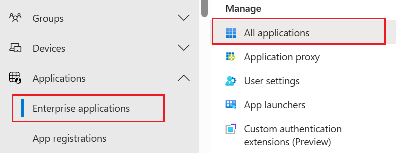
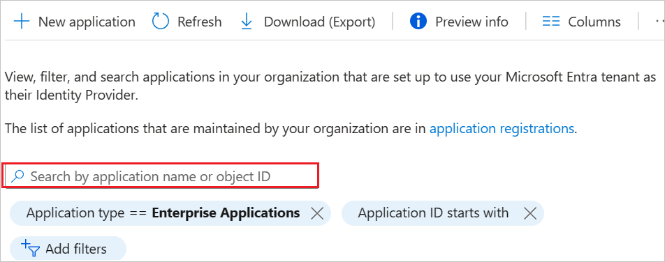
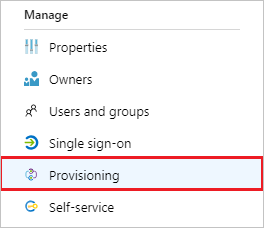
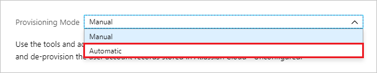
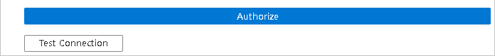
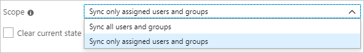

# Configure Gong for automatic user provisioning with Microsoft Entra ID

This article describes the steps you need to perform in both Gong and Microsoft Entra ID to configure automatic user provisioning. When configured, Microsoft Entra ID automatically provisions and de-provisions users and groups to [Gong](https://www.gong.io/) using the Microsoft Entra provisioning service. For important details on what this service does, how it works, and frequently asked questions, see [Automate user provisioning and deprovisioning to SaaS applications with Microsoft Entra ID](~/identity/app-provisioning/user-provisioning.md). 

## Capabilities supported
> [!div class="checklist"]
> * Create users in Gong.
> * Remove users in Gong when they don't require access anymore.
> * Keep user attributes synchronized between Microsoft Entra ID and Gong.
> * Provision groups and group memberships in Gong.

## Prerequisites

The scenario outlined in this article assumes that you already have the following prerequisites:

* [A Microsoft Entra tenant](~/identity-platform/quickstart-create-new-tenant.md). 
* One of the following roles: [Application Administrator](/entra/identity/role-based-access-control/permissions-reference#application-administrator), [Cloud Application Administrator](/entra/identity/role-based-access-control/permissions-reference#cloud-application-administrator), or [Application Owner](/entra/fundamentals/users-default-permissions#owned-enterprise-applications). 
* A user account in Gong with **Technical Administrator** privilege.

## Step 1: Plan your provisioning deployment
1. Learn about [how the provisioning service works](~/identity/app-provisioning/user-provisioning.md).
1. Determine who's in [scope for provisioning](~/identity/app-provisioning/define-conditional-rules-for-provisioning-user-accounts.md).
1. Determine what data to [map between Microsoft Entra ID and Gong](~/identity/app-provisioning/customize-application-attributes.md). 

## Step 2: Configure Gong to support provisioning with Microsoft Entra ID

1. Go to your company settings page > **PEOPLE** area > **Team Member Provisioning**.
1. Select **Microsoft Entra ID** as the provisioning source.
1. To assign data capture, workspace, and permission settings to Microsoft Entra groups:
    1. In the **Assign settings** area, select **ADD ASSIGNMENT**.
    1. Give the assignment a name. 
    1. In the **Microsoft Entra groups** area, select the Microsoft Entra group you want to define the settings for.
    1. In the **Data capture** area, select the home workspace and the data capture settings for people that belong to this group.
    1. In the **Workspaces and permissions** area, set the permissions profile for other workspaces in your org. 
    1. In the **Update settings** area, define how settings can be managed for this assignment:
        * Select **Manual editing** to manage data capture and permission settings for users in this assignment in Gong. 
          After you create the assignment: if you make changes to group settings in Microsoft Entra ID, they aren't pushed to Gong. However, you can edit the group settings manually in Gong.
        * (Recommended) Select **Automatic updates** to give Microsoft Entra ID control over data capture and permission settings in Gong. 
          Define data capture and permission settings in Gong only when creating an assignment. Thereafter, other changes will only be applied to users in groups with this assignment when pushed from Microsoft Entra ID.
    1. Select **ADD ASSIGNMENT**.
1. For org's that don't have assignments (step 3), select the permission profile to apply to for automatically provisioned users.

	[More information on permission profiles](https://help.gong.io/hc/en-us/articles/360028568911#UUID-34baef91-0aba-1295-4032-ff49102cb182).

1. In the **Manager's provisioning settings** area:
    1. Select **Notify direct managers with recorded teams when a new team member is imported** to keep your team managers in the loop.
    1. Select **Managers can turn data capture on or off for their team** to give your team managers some autonomy.

    > [!TIP]
    > For more information, see "What are Manager's provisioning settings" in the [FAQ for team member provisioning](https://help.gong.io/hc/en-us/articles/360042352912#UUID-0d3df83a-44d1-11b9-ddf5-3ec649c2f594) article.
1. Select **Update** to save your settings.

> [!NOTE]
> If you later change the provisioning source from Microsoft Entra ID and then want to return to Microsoft Entra ID  provisioning, you need to re-authenticate to Microsoft Entra ID .

## Step 3: Add Gong from the Microsoft Entra application gallery

Add Gong from the Microsoft Entra application gallery to start managing provisioning to Gong. If you have previously setup Gong for SSO, you can use the same application. However, we recommend that you create a separate app when testing out the integration initially. Learn more about adding an application from the gallery [here](~/identity/enterprise-apps/add-application-portal.md). 

## Step 4: Define who is in scope for provisioning 

[!INCLUDE [create-assign-users-provisioning.md](~/identity/saas-apps/includes/create-assign-users-provisioning.md)]

## Step 5: Configure automatic user provisioning to Gong 

This section guides you through the steps to configure the Microsoft Entra provisioning service to create, update, and disable users and/or groups in Gong based on user and/or group assignments in Microsoft Entra ID.

### To configure automatic user provisioning for Gong in Microsoft Entra ID:

1. Sign in to the [Microsoft Entra admin center](https://entra.microsoft.com) as at least a [Cloud Application Administrator](~/identity/role-based-access-control/permissions-reference.md#cloud-application-administrator).
1. Browse to **Entra ID** > **Enterprise apps**

	

1. In the applications list, select **Gong**.

	

1. Select the **Provisioning** tab.

	

1. Set the **Provisioning Mode** to **Automatic**.

	

1. In the **Admin Credentials** section, select Authorize, make sure that you enter your Gong account's Admin credentials. Select **Test Connection** to ensure Microsoft Entra ID can connect to Gong. If the connection fails, ensure your Gong account has Admin permissions and try again.

   
   
1. In the **Notification Email** field, enter the email address of a person or group who should receive the provisioning error notifications and select the **Send an email notification when a failure occurs** check box.

	

1. Select **Save**.

1. Under the **Mappings** section, select **Synchronize Microsoft Entra users to Gong**.

1. Review the user attributes that are synchronized from Microsoft Entra ID to Gong in the **Attribute-Mapping** section. The attributes selected as **Matching** properties are used to match the user accounts in Gong for update operations. If you choose to change the [matching target attribute](~/identity/app-provisioning/customize-application-attributes.md), you need to ensure that the Gong API supports filtering users based on that attribute. Select the **Save** button to commit any changes.

    |Attribute|Type|Supported for filtering|Required by Gong|
    |---|---|---|---|
    |userName|String|&check;|&check;|
    |urn:ietf:params:scim:schemas:extension:enterprise:2.0:User:manager|String|||
    |active|Boolean|||
    |title|String|||
    |emails[type eq "work"].value|String||&check;|
    |name.givenName|String||&check;|
    |name.familyName|String||&check;|
    |phoneNumbers[type eq "work"].value|String|||
    |externalId|String|||
    |locale|String|||
    |timezone|String|||
    |urn:ietf:params:scim:schemas:extension:Gong:2.0:User:stateOrProvince|String|||
    |urn:ietf:params:scim:schemas:extension:Gong:2.0:User:country|String|||
          
1. Under the **Mappings** section, select **Synchronize Microsoft Entra groups to Gong**.

1. Review the group attributes that are synchronized from Microsoft Entra ID to Gong in the **Attribute-Mapping** section. The attributes selected as **Matching** properties are used to match the groups in Gong for update operations. Select the **Save** button to commit any changes.

    |Attribute|Type|Supported for filtering|Required by Gong|
    |---|---|---|---|
    |displayName|String|&check;|&check;|
    |members|Reference|||

1. To configure scoping filters, refer to the following instructions provided in the [Scoping filter article](~/identity/app-provisioning/define-conditional-rules-for-provisioning-user-accounts.md).

1. To enable the Microsoft Entra provisioning service for Gong, change the **Provisioning Status** to **On** in the **Settings** section.

	

1. Define the users and/or groups that you would like to provision to Gong by choosing the desired values in **Scope** in the **Settings** section.

	

1. When you're ready to provision, select **Save**.

	

This operation starts the initial synchronization cycle of all users and groups defined in **Scope** in the **Settings** section. The initial cycle takes longer to perform than subsequent cycles, which occur approximately every 40 minutes as long as the Microsoft Entra provisioning service is running. 

## Step 6: Monitor your deployment

[!INCLUDE [monitor-deployment.md](~/identity/saas-apps/includes/monitor-deployment.md)]

## Change Log
* 03/23/2022 - Added support for **Group Provisioning**.
* 04/21/2022 - **emails[type eq "work"].value** has been marked as required attribute.

## More resources

* [Managing user account provisioning for Enterprise Apps](~/identity/app-provisioning/configure-automatic-user-provisioning-portal.md)
* [What is application access and single sign-on with Microsoft Entra ID?](~/identity/enterprise-apps/what-is-single-sign-on.md)

## Related content

* [Learn how to review logs and get reports on provisioning activity](~/identity/app-provisioning/check-status-user-account-provisioning.md)
