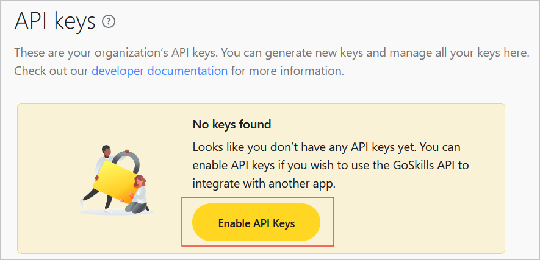
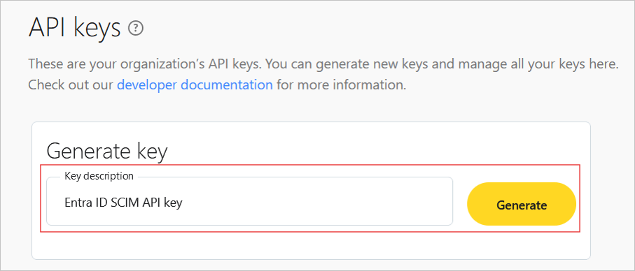

# Configure GoSkills for automatic user provisioning with Microsoft Entra ID

This article describes the steps you need to perform in both GoSkills and Microsoft Entra ID to configure automatic user and group provisioning. When configured, Microsoft Entra ID automatically provisions and deprovisions users and groups to [GoSkills](https://www.goskills.com/) using the Microsoft Entra provisioning service. For important details on what this service does, how it works, and frequently asked questions, see [Automate user provisioning and deprovisioning to SaaS applications with Microsoft Entra ID](~/identity/app-provisioning/user-provisioning.md). 

## Supported capabilities
> [!div class="checklist"]
> * Create users in GoSkills.
> * Remove users in GoSkills when they don't require access anymore.
> * Keep user attributes synchronized between Microsoft Entra ID and GoSkills.
> * Provision groups and group memberships in GoSkills.
> * [Single sign-on](~/identity/enterprise-apps/add-application-portal-setup-oidc-sso.md) to GoSkills (recommended).

## Prerequisites

The scenario outlined in this article assumes that you already have the following prerequisites:

* [A Microsoft Entra tenant](~/identity-platform/quickstart-create-new-tenant.md) 
* One of the following roles: [Application Administrator](/entra/identity/role-based-access-control/permissions-reference#application-administrator), [Cloud Application Administrator](/entra/identity/role-based-access-control/permissions-reference#cloud-application-administrator), or [Application Owner](/entra/fundamentals/users-default-permissions#owned-enterprise-applications).
* A user account in GoSkills with Admin permissions.

## Step 1: Plan your provisioning deployment
* Learn about [how the provisioning service works](~/identity/app-provisioning/user-provisioning.md).
* Determine who's in [scope for provisioning](~/identity/app-provisioning/define-conditional-rules-for-provisioning-user-accounts.md).
* Determine what data to [map between Microsoft Entra ID and GoSkills](~/identity/app-provisioning/customize-application-attributes.md).
 
## Step 2: Obtain your GoSkills API key

1. Log in to your GoSkills Admin account [here](https://www.goskills.com/login).
1. Browse to **API Keys** under **Admin** > **Manage**.

	

1. Select **Enable API keys** if you have not used API keys before.

	

1. Enter a description for your API key and select **Generate**.

	

1. Copy the generated API key for use in a later step. Be sure to keep your API key secret.

## Step 3: Add GoSkills from the Microsoft Entra application gallery

Add GoSkills from the Microsoft Entra application gallery to start managing provisioning to GoSkills. If you have previously setup GoSkills for SSO, you can use the same application. However it's recommended that you create a separate app when testing out the integration initially. Learn more about adding an application from the gallery [here](~/identity/enterprise-apps/add-application-portal.md). 

## Step 4: Define who is in scope for provisioning 

[!INCLUDE [create-assign-users-provisioning.md](~/identity/saas-apps/includes/create-assign-users-provisioning.md)]

## Step 5: Configure automatic user provisioning to GoSkills 

This section guides you through the steps to configure the Microsoft Entra provisioning service to create, update, and disable users and groups in GoSkills based on user assignments in Microsoft Entra ID.

### To configure automatic user provisioning for GoSkills in Microsoft Entra ID:

1. Sign in to the [Microsoft Entra admin center](https://entra.microsoft.com) as at least a [Cloud Application Administrator](~/identity/role-based-access-control/permissions-reference.md#cloud-application-administrator).
1. Browse to **Entra ID** > **Enterprise apps**

	

1. In the applications list, select **GoSkills**.

	

1. Select the **Provisioning** tab.

	

1. Set the **Provisioning Mode** to **Automatic**.

	

1. In the **Admin Credentials** section, enter `https://scim.goskills.com/api/v2/scim` for the **Tenant Url** and your GoSkills API key for the **Secret Token**. Select **Test Connection** to ensure Microsoft Entra ID can connect to GoSkills. If the connection fails, please check your API key has been entered correctly, and try again.

 	

1. In the **Notification Email** field, enter the email address of a person who should receive the provisioning error notifications and select the **Send an email notification when a failure occurs** check box.

	

1. Select **Save**.

1. Under the **Mappings** section, select **Synchronize Microsoft Entra users to GoSkills**.

1. Review the user attributes that are synchronized from Microsoft Entra ID to GoSkills in the **Attribute-Mapping** section. The attributes selected as **Matching** properties are used to match the user accounts in GoSkills for update operations. If you choose to change the [matching target attribute](~/identity/app-provisioning/customize-application-attributes.md), you need to ensure that the GoSkills API supports filtering users based on that attribute. Select the **Save** button to commit any changes. For automatic provisioning of SSO, please ensure the **externalId** attribute is mapped to **objectId**, and contact your GoSkills account manager to enable SSO provisioning.

      |Attribute|Type|Supported for filtering|Required by GoSkills|
      |---|---|---|---|
      |userName|String|&check;|&check;|
      |active|Boolean||&check;|
      |displayName|String||&check;|
      |externalId|String||&check;|

1. Under the **Mappings** section, select **Synchronize Microsoft Entra ID Groups to GoSkills**.

1. Review the group attributes that are synchronized from Microsoft Entra ID to GoSkills in the **Attribute-Mapping** section. The attributes selected as **Matching** properties are used to match the groups in GoSkills for update operations. Select the **Save** button to commit any changes.

      |Attribute|Type|Supported for filtering|Required by GoSkills|
      |---|---|---|---|
      |displayName|String|&check;|&check;|
      |members|Reference|||

1. To configure scoping filters, refer to the following instructions provided in the [Scoping filter article](~/identity/app-provisioning/define-conditional-rules-for-provisioning-user-accounts.md).

1. To enable the Microsoft Entra provisioning service for GoSkills, change the **Provisioning Status** to **On** in the **Settings** section.

	

1. Define the users and/or groups that you would like to provision to Airtable by choosing the desired values in **Scope** in the **Settings** section.
1. Define the users  that you would like to provision to GoSkills by choosing the desired values in **Scope** in the **Settings** section.

	

1. When you're ready to provision, select **Save**.

	

This operation starts the initial synchronization cycle of all users and groups defined in **Scope** in the **Settings** section. The initial cycle takes longer to perform than subsequent cycles, which occur approximately every 40 minutes as long as the Microsoft Entra provisioning service is running. 

## Step 6: Monitor your deployment

[!INCLUDE [monitor-deployment.md](~/identity/saas-apps/includes/monitor-deployment.md)]

## More resources

* [Managing user account provisioning for Enterprise Apps](~/identity/app-provisioning/configure-automatic-user-provisioning-portal.md)
* [What is application access and single sign-on with Microsoft Entra ID?](~/identity/enterprise-apps/what-is-single-sign-on.md)

## Related content

* [Learn how to review logs and get reports on provisioning activity](~/identity/app-provisioning/check-status-user-account-provisioning.md)