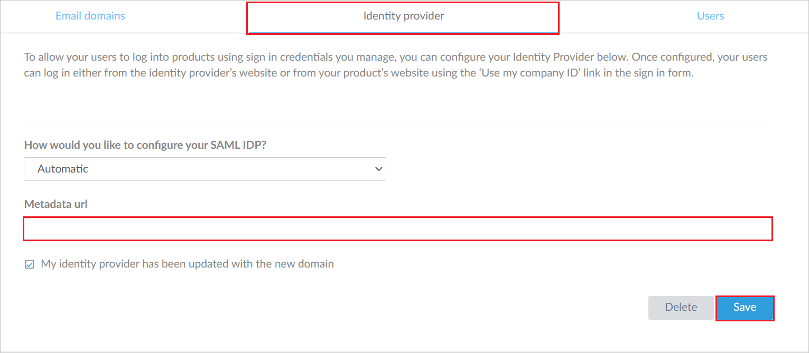
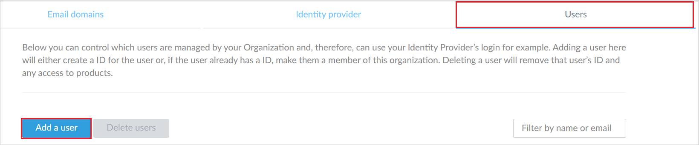
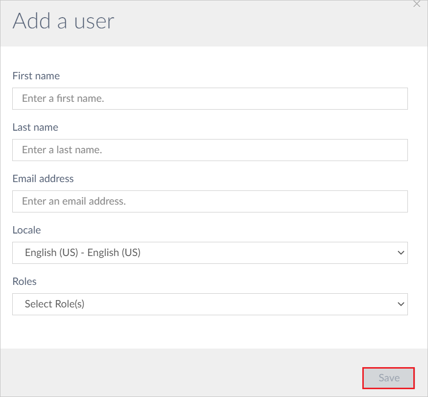

# Configure GoTo for Single sign-on with Microsoft Entra ID

In this article,  you learn how to integrate GoTo with Microsoft Entra ID. When you integrate GoTo with Microsoft Entra ID, you can:

* Control in Microsoft Entra ID who has access to GoTo.
* Enable your users to be automatically signed-in to GoTo with their Microsoft Entra accounts.
* Manage your accounts in one central location.

## Prerequisites

The scenario outlined in this article assumes that you already have the following prerequisites:

[!INCLUDE [common-prerequisites.md](~/identity/saas-apps/includes/common-prerequisites.md)]
* GoTo single sign-on (SSO) enabled subscription.

## Scenario description

In this article,  you configure and test Microsoft Entra SSO in a test environment.

* GoTo supports **SP and IDP** initiated SSO.
* GoTo supports [Automated user provisioning](goto-provisioning-tutorial.md).

## Adding GoTo from the gallery

To configure the integration of GoTo into Microsoft Entra ID, you need to add GoTo from the gallery to your list of managed SaaS apps.

1. Sign in to the [Microsoft Entra admin center](https://entra.microsoft.com) as at least a [Cloud Application Administrator](~/identity/role-based-access-control/permissions-reference.md#cloud-application-administrator).
1. Browse to **Entra ID** > **Enterprise apps** > **New application**.
1. In the **Add from the gallery** section, type **GoTo** in the search box.
1. Select **GoTo** from results panel and then add the app. Wait a few seconds while the app is added to your tenant.

 [!INCLUDE [sso-wizard.md](~/identity/saas-apps/includes/sso-wizard.md)]

## Configure and test Microsoft Entra SSO for GoTo

Configure and test Microsoft Entra SSO with GoTo using a test user called **B.Simon**. For SSO to work, you need to establish a link relationship between a Microsoft Entra user and the related user in GoTo.

To configure and test Microsoft Entra SSO with GoTo, perform the following steps:

1. **[Configure Microsoft Entra SSO](#configure-azure-ad-sso)** - to enable your users to use this feature.
    * **Create a Microsoft Entra test user** - to test Microsoft Entra single sign-on with B.Simon.
    * **Assign the Microsoft Entra test user** - to enable B.Simon to use Microsoft Entra single sign-on.
1. **[Configure GoTo SSO](#configure-goto-sso)** - to configure the single sign-on settings on application side.
    * **[Create GoTo test user](#create-goto-test-user)** - to have a counterpart of B.Simon in GoTo that's linked to the Microsoft Entra representation of user.
1. **[Test SSO](#test-sso)** - to verify whether the configuration works.

## Configure Microsoft Entra SSO

Follow these steps to enable Microsoft Entra SSO.

1. Sign in to the [Microsoft Entra admin center](https://entra.microsoft.com) as at least a [Cloud Application Administrator](~/identity/role-based-access-control/permissions-reference.md#cloud-application-administrator).
1. Browse to **Entra ID** > **Enterprise apps** > **GoTo** > **Single sign-on**.
1. On the **Select a single sign-on method** page, select **SAML**.
1. On the **Set up single sign-on with SAML** page, select the pencil icon for **Basic SAML Configuration** to edit the settings.

   

1. On the **Basic SAML Configuration** section, the user doesn't have to perform any steps as the app is already pre-integrated with Azure.

1. Select **Set additional URLs** and perform the following steps if you wish to configure the application in **SP** initiated mode:

	a. In the **Sign-on URL** text box, type the URL:
    `https://authentication.gotoinc.com/login?service=https%3A%2F%2Fmyaccount.gotoinc.com`

1. Your GoTo application expects the SAML assertions in a specific format, which requires you to add custom attribute mappings to your SAML token attributes configuration. The following screenshot shows the list of default attributes, whereas **Unique User Identifier** is mapped with **user.userprincipalname**. GoTo application expects **Unique User Identifier** to be mapped with **user.mail**, so you need to edit the attribute mapping by selecting **Edit** icon and change the attribute mapping.

	

1. On the **Set up single sign-on with SAML** page, In the **SAML Signing Certificate** section, select copy button to copy **App Federation Metadata Url** and save it on your computer.

	

6. On the **Set up GoTo** section, copy the appropriate URL(s) as per your requirement.

	

[!INCLUDE [create-assign-users-sso.md](~/identity/saas-apps/includes/create-assign-users-sso.md)]

## Configure GoTo SSO

1. In a different web browser window, sign in to your GoTo company site as an administrator

1. Go to the **Identity Provider** tab and in the **Metadata url** textbox, paste the **Federation Metadata URL**, which you copied previously.

    

1. Select **Save**.

### Create GoTo test user

1. In a different browser window, log in to your GoTo website as an administrator.

1. Go to the **Users** tab and select **Add a user**.

    

1. Fill the required fields in the following page and select **Save**.

    

> [!NOTE]
> GoTo also supports automatic user provisioning, you can find more details [here](./goto-provisioning-tutorial.md) on how to configure automatic user provisioning.

## Test SSO 

In this section, you test your Microsoft Entra single sign-on configuration with following options. 

#### SP initiated:

* Select **Test this application**, this option redirects to GoTo Sign on URL where you can initiate the login flow.  

* Go to GoTo Sign-on URL directly and initiate the login flow from there.

#### IDP initiated:

* Select **Test this application**, and you should be automatically signed in to the GoTo for which you set up the SSO 

You can also use Microsoft My Apps to test the application in any mode. When you select the GoTo tile in the My Apps, if configured in SP mode you would be redirected to the application sign on page for initiating the login flow and if configured in IDP mode, you should be automatically signed in to the GoTo for which you set up the SSO. For more information about the My Apps, see [Introduction to the My Apps](https://support.microsoft.com/account-billing/sign-in-and-start-apps-from-the-my-apps-portal-2f3b1bae-0e5a-4a86-a33e-876fbd2a4510).

## Related content

Once you configure the GoTo you can enforce session controls, which protects exfiltration and infiltration of your organization’s sensitive data in real time. Session controls extends from Conditional Access. [Learn how to enforce session control with Microsoft Defender for Cloud Apps](/cloud-app-security/proxy-deployment-aad).
