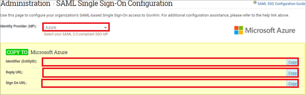
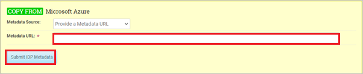
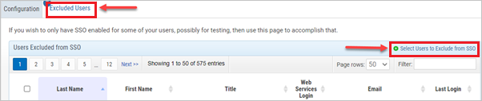

# Configure GovWin IQ for Single sign-on with Microsoft Entra ID

In this article,  you learn how to integrate GovWin IQ with Microsoft Entra ID. GovWin IQ by Deltek is the industry-leading platform providing the most comprehensive market intelligence for U.S. federal, state and local, and Canadian governments. When you integrate GovWin IQ with Microsoft Entra ID, you can:

* Control in Microsoft Entra ID who has access to GovWin IQ.
* Enable your users to be automatically signed-in to GovWin IQ with their Microsoft Entra accounts.
* Manage your accounts in one central location.

## Prerequisites

The scenario outlined in this article assumes that you already have the following prerequisites:

[!INCLUDE [common-prerequisites.md](~/identity/saas-apps/includes/common-prerequisites.md)]
* An active GovWin IQ Subscription. Single sign-on can be enabled at no cost. Make sure your Customer Success Manager has enabled a user at your organization as a SAML SSO Admin to perform the following steps.
* All users must have same email address in Azure as provisioned in GovWin IQ.

## Scenario description

In this article,  you configure and test Microsoft Entra SSO in a test environment.

* GovWin IQ supports only **SP** initiated SSO.

> [!NOTE] 
> Identifier of this application is a fixed string value so only one instance can be configured in one tenant.

## Adding GovWin IQ from the gallery

To configure the integration of GovWin IQ into Microsoft Entra ID, you need to add GovWin IQ from the gallery to your list of managed SaaS apps.

1. Sign in to the [Microsoft Entra admin center](https://entra.microsoft.com) as at least a [Cloud Application Administrator](~/identity/role-based-access-control/permissions-reference.md#cloud-application-administrator).
1. Browse to **Entra ID** > **Enterprise apps** > **New application**.
1. In the **Add from the gallery** section, type **GovWin IQ** in the search box.
1. Select **GovWin IQ** from results panel and then add the app. Wait a few seconds while the app is added to your tenant.

[!INCLUDE [sso-wizard.md](~/identity/saas-apps/includes/sso-wizard.md)]

## Configure and test Microsoft Entra SSO for GovWin IQ

Configure and test Microsoft Entra SSO with GovWin IQ using a test user called **B.Simon**. For SSO to work, you need to establish a link relationship between a Microsoft Entra user and the related user in GovWin IQ.

To configure and test Microsoft Entra SSO with GovWin IQ, perform the following steps:

1. **[Configure Microsoft Entra SSO](#configure-microsoft-entra-sso)** - to enable your users to use this feature.
    1. **Create a Microsoft Entra test user** - to enable B.Simon to use Microsoft Entra single sign-on.
1. **[Configure GovWin IQ SSO](#configure-govwin-iq-sso)** - to configure the single sign-on settings on application side.
    1. **[Assign GovWin IQ test user to SSO](#assign-govwin-iq-test-user-to-sso)** - to have a counterpart of B.Simon in GovWin IQ that's linked to the Microsoft Entra ID representation of user.
1. **[Test SSO](#test-sso)** - to verify whether the configuration works.

## Configure Microsoft Entra SSO

Follow these steps to enable Microsoft Entra SSO in the Microsoft Entra admin center.

1. Sign in to the [Microsoft Entra admin center](https://entra.microsoft.com) as at least a [Cloud Application Administrator](~/identity/role-based-access-control/permissions-reference.md#cloud-application-administrator).
1. Browse to **Entra ID** > **Enterprise apps** > **GovWin IQ** > **Single sign-on**.
1. On the **Select a single sign-on method** page, select **SAML**.
1. On the **Set up single sign-on with SAML** page, select the pencil icon for **Basic SAML Configuration** to edit the settings.

   

1. On the **Basic SAML Configuration** section, perform the following steps:

    a. In the **Identifier** textbox, type the URL:
    `https://iq.govwin.com/cas`

    b. In the **Reply URL** textbox, enter the value from the GovWin IQ Reply URL field.
    
    Reply URL is of the following pattern:
    `https://iq.govwin.com/cas/login?client_name=ORG_<ID>`

	c. In the **Sign on URL** textbox, enter the value from the GovWIn IQ Sign On URL field. 

    Sign on URL is of the following pattern: 
    `https://iq.govwin.com/cas/clientredirect?client_name=ORG_<ID>`

	> [!NOTE]
    > Update these values with the actual Reply URL and Sign on URL found in the GovWin SAML Single Sign-On Configuration page, accessible by your designated SAML SSO Admin. Reach out to your [Customer Success Manager](mailto:CustomerSuccess@iq.govwin.com) for assistance. You can also refer to the patterns shown in the **Basic SAML Configuration** section in the Microsoft Entra admin center.

1. On the **Set up single sign-on with SAML** page, in the **SAML Signing Certificate** section, select copy button to copy **App Federation Metadata Url** and save it on your computer.

	

### Assign the Microsoft Entra ID test user

In this section, you enable a test user to use Microsoft Entra single sign-on by granting access to GovWin IQ.

   > [!Note]
   > The user selected for testing must have an existing active GovWin IQ account. 

1. Sign in to the [Microsoft Entra admin center](https://entra.microsoft.com) as at least a [Cloud Application Administrator](~/identity/role-based-access-control/permissions-reference.md#cloud-application-administrator).
1. Browse to **Entra ID** > **Enterprise apps** > **GovWin IQ**.
1. In the app's overview page, select **Users and groups**.
1. Select **Add user/group**, then select **Users and groups** in the **Add Assignment** dialog.
   1. In the **Users and groups** dialog, select a test user from the Users list, then select the **Select** button at the bottom of the screen.
   1. If you're expecting a role to be assigned to the users, you can select it from the **Select a role** dropdown. If no role has been set up for this app, you see "Default Access" role selected.
   1. In the **Add Assignment** dialog, select the **Assign** button.

## Configure GovWin IQ SSO

1. Log in to GovWin IQ company site as the SAML SSO Admin user.

1. Navigate to [**SAML Single Sign-On Configuration** page](https://iq.govwin.com/neo/authenticationConfiguration/viewSamlSSOConfig) and perform the following steps:

    

    1. Select **Azure** from the Identity Provider (IdP) dropdown.
    1. Copy **Identifier (EntityID)** value, paste this value into the **Identifier** textbox in the **Basic SAML Configuration** section in Microsoft Entra admin center.
    1. Copy **Reply URL** value, paste this value into the **Reply URL** textbox in the **Basic SAML Configuration** section in Microsoft Entra admin center.
    1. Copy **Sign On URL** value, paste this value into the **Sign on URL** textbox in the **Basic SAML Configuration** section in Microsoft Entra admin center.

1. In the **Metadata URL** textbox, paste the **App Federation Metadata Url**, which you have copied from the Microsoft Entra admin center.

    

1. Select **Submit IDP Metadata**.

### Assign GovWin IQ test user to SSO

1. In the [**SAML Single Sign-On Configuration** page](https://iq.govwin.com/neo/authenticationConfiguration/viewSamlSSOConfig), navigate to **Excluded Users** tab  and select **Select Users to Exclude from SSO**.

    

    > [!Note] 
    > Here you can select users to include or exclude from SSO. If you have a webservices subscription, the webservices user should always be excluded from SSO.

1. Next, select **Exclude All Users from SSO** for testing purposes. This is to prevent any impact to existing access for users while testing SSO.

1. Next, select the test user and select Add Selected Users to SSO.

1. Once testing is successful, add the rest of the users you want to enable for SSO.

## Test SSO 

In this section, you test your Microsoft Entra single sign-on configuration with following options.

> [!Note]
> It may take up to 10 minutes for the configuration to sync.

* Select **Test this application** in Microsoft Entra admin center. this option redirects to GovWin IQ Sign-on URL where you can initiate the login flow.

* Go to GovWin IQ Sign-on URL directly and initiate the login flow from there.

* You can use Microsoft My Apps. When you select the GovWin IQ tile in the My Apps, this option redirects to GovWin IQ Sign-on URL. For more information about the My Apps, see [Introduction to the My Apps](https://support.microsoft.com/account-billing/sign-in-and-start-apps-from-the-my-apps-portal-2f3b1bae-0e5a-4a86-a33e-876fbd2a4510).

## Related content

Add all remaining users to the Microsoft Entra ID GovWin IQ app to enable SSO access. Once you configure GovWin IQ you can enforce session control, which protects exfiltration and infiltration of your organization's sensitive data in real time. Session control extends from Conditional Access. [Learn how to enforce session control with Microsoft Defender for Cloud Apps](/cloud-app-security/proxy-deployment-any-app).