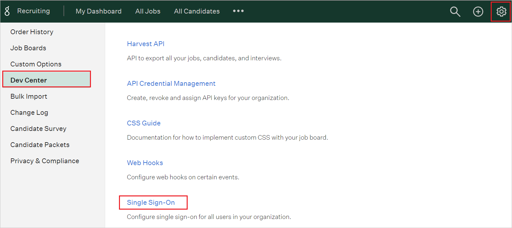
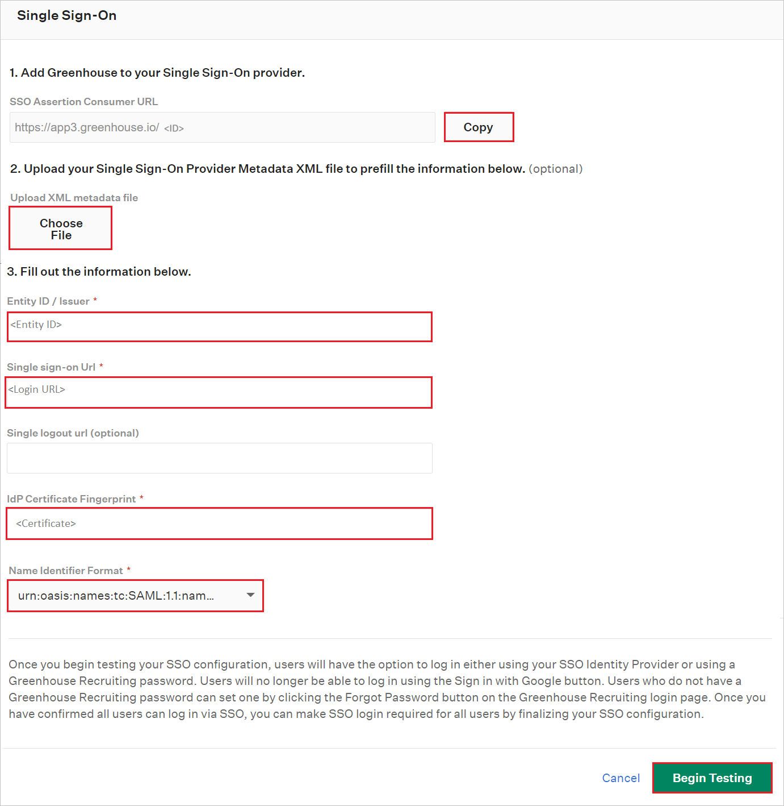
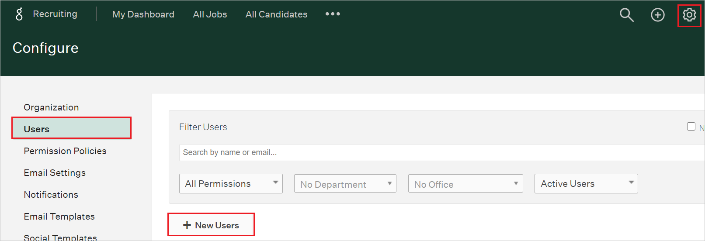
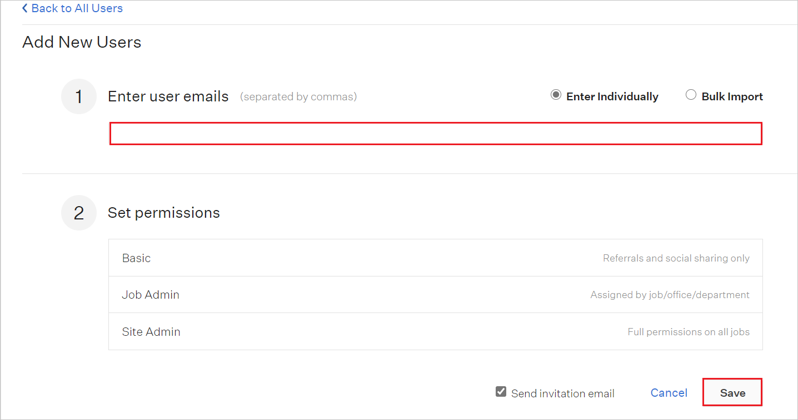

# Configure Greenhouse for Single sign-on with Microsoft Entra ID

In this article,  you learn how to integrate Greenhouse with Microsoft Entra ID. When you integrate Greenhouse with Microsoft Entra ID, you can:

* Control in Microsoft Entra ID who has access to Greenhouse.
* Enable your users to be automatically signed-in to Greenhouse with their Microsoft Entra accounts.
* Manage your accounts in one central location.

## Prerequisites

The scenario outlined in this article assumes that you already have the following prerequisites:

[!INCLUDE [common-prerequisites.md](~/identity/saas-apps/includes/common-prerequisites.md)]
* Greenhouse single sign-on (SSO) enabled subscription.

> [!NOTE] 
> This integration is also available to use from Microsoft Entra US Government Cloud environment. You can find this application in the Microsoft Entra US Government Cloud Application Gallery and configure it in the same way as you do from public cloud. 

## Scenario description

In this article,  you configure and test Microsoft Entra SSO in a test environment.

* Greenhouse supports **SP and IDP** initiated SSO.

## Adding Greenhouse from the gallery

To configure the integration of Greenhouse into Microsoft Entra ID, you need to add Greenhouse from the gallery to your list of managed SaaS apps.

1. Sign in to the [Microsoft Entra admin center](https://entra.microsoft.com) as at least a [Cloud Application Administrator](~/identity/role-based-access-control/permissions-reference.md#cloud-application-administrator).
1. Browse to **Entra ID** > **Enterprise apps** > **New application**.
1. In the **Add from the gallery** section, type **Greenhouse** in the search box.
1. Select **Greenhouse** from results panel and then add the app. Wait a few seconds while the app is added to your tenant.

 [!INCLUDE [sso-wizard.md](~/identity/saas-apps/includes/sso-wizard.md)]

## Configure and test Microsoft Entra SSO for Greenhouse

Configure and test Microsoft Entra SSO with Greenhouse using a test user called **B.Simon**. For SSO to work, you need to establish a link relationship between a Microsoft Entra user and the related user in Greenhouse.

To configure and test Microsoft Entra SSO with Greenhouse, perform the following steps:

1. **[Configure Microsoft Entra SSO](#configure-azure-ad-sso)** - to enable your users to use this feature.
    1. **Create a Microsoft Entra test user** - to test Microsoft Entra single sign-on with Britta Simon.
    1. **Assign the Microsoft Entra test user** - to enable Britta Simon to use Microsoft Entra single sign-on.
2. **[Configure Greenhouse SSO](#configure-greenhouse-sso)** - to configure the Single Sign-On settings on application side.
    1. **[Create Greenhouse test user](#create-greenhouse-test-user)** - to have a counterpart of Britta Simon in Greenhouse that's linked to the Microsoft Entra representation of user.
3. **[Test SSO](#test-sso)** - to verify whether the configuration works.

## Configure Microsoft Entra SSO

Follow these steps to enable Microsoft Entra SSO.

1. Sign in to the [Microsoft Entra admin center](https://entra.microsoft.com) as at least a [Cloud Application Administrator](~/identity/role-based-access-control/permissions-reference.md#cloud-application-administrator).
1. Browse to **Entra ID** > **Enterprise apps** > **Greenhouse** > **Single sign-on**.
1. On the **Select a single sign-on method** page, select **SAML**.
1. On the **Set up single sign-on with SAML** page, select the pencil icon for **Basic SAML Configuration** to edit the settings.

	

> [!NOTE]
> The [Greenhouse Client support team](https://www.greenhouse.io/contact) recommends configuring Entra ID side application settings for **IDP** initiated mode. Contact the Greenhouse Client support team for more details and to get the correct values mentioned below. 

1. On the **Basic SAML Configuration** section enter the values for the following fields:

    a. In the **Identifier** text box, type the value:
    `greenhouse.io`

    b. In the **Reply URL** text box, type a URL using the following pattern: 
    `https://<COMPANYNAME>.greenhouse.io/<ENTITY ID>/users/saml/consume`

1. Leave the **Sign-on URL** text box empty. 

4. On the **Set up Single Sign-On with SAML** page, in the **SAML Signing Certificate** section, select **Download** to download the **Federation Metadata XML** from the given options as per your requirement and save it on your computer.

	

6. On the **Set up Greenhouse** section, copy the appropriate URL(s) as per your requirement.

	

### Create a Microsoft Entra test user

In this section, you create a test user called B.Simon.

1. Sign in to the [Microsoft Entra admin center](https://entra.microsoft.com) as at least a [User Administrator](~/identity/role-based-access-control/permissions-reference.md#user-administrator).
1. Browse to **Entra ID** > **Users**.
1. Select **New user** > **Create new user**, at the top of the screen.
1. In the **User** properties, follow these steps:
   1. In the **Display name** field, enter `B.Simon`.  
   1. In the **User principal name** field, enter the username@companydomain.extension. For example, `B.Simon@contoso.com`.
   1. Select the **Show password** check box, and then write down the value that's displayed in the **Password** box.
   1. Select **Review + create**.
1. Select **Create**.

### Assign the Microsoft Entra test user

In this section, you enable B.Simon to use single sign-on by granting access to Greenhouse.

1. Sign in to the [Microsoft Entra admin center](https://entra.microsoft.com) as at least a [Cloud Application Administrator](~/identity/role-based-access-control/permissions-reference.md#cloud-application-administrator).
1. Browse to **Entra ID** > **Enterprise apps** > **Greenhouse**.
1. In the app's overview page, select **Users and groups**.
1. Select **Add user/group**, then select **Users and groups** in the **Add Assignment** dialog.
   1. In the **Users and groups** dialog, select **B.Simon** from the Users list, then select the **Select** button at the bottom of the screen.
   1. If you're expecting a role to be assigned to the users, you can select it from the **Select a role** dropdown. If no role has been set up for this app, you see "Default Access" role selected.
   1. In the **Add Assignment** dialog, select the **Assign** button.

## Configure Greenhouse SSO

1. In a different web browser window, sign into Greenhouse website as an administrator.

1. Go to the **Configure > Dev Center > Single Sign-On**.

    

1. Perform the following steps in the **Single Sign-On** page.

    

    a. Copy **SSO Assertion Consumer URL** value, paste this value into the **Reply URL** text box in the **Basic SAML Configuration** section.

    b. In the **Entity ID/Issuer** textbox, paste the **Microsoft Entra Identifier** value which you copied previously.

    c. In the **Single Sign-On URL** textbox, paste the **Login URL** value which you copied previously.

    d. Open the downloaded **Federation Metadata XML** into Notepad and paste the content into the **IdP Certificate Fingerprint** textbox.

    e. Select the **Name Identifier Format** value from the dropdown.

    f. Select **Begin Testing**.

    >[!NOTE]
    >Alternatively you can also upload the **Federation Metadata XML** file by selecting the **Choose File** option.

### Create Greenhouse test user

In order to enable Microsoft Entra users to log into Greenhouse, they must be provisioned into Greenhouse. In the case of Greenhouse, provisioning is a manual task.

>[!NOTE]
>You can use any other Greenhouse user account creation tools or APIs provided by Greenhouse to provision Microsoft Entra user accounts. 

**To provision a user accounts, perform the following steps:**

1. Log in to your **Greenhouse** company site as an administrator.

2. Go to the **Configure > Users > New Users**
   
    

4. In the **Add New Users** section, perform the following steps:
   
    

    a. In the **Enter user emails** textbox, type the email address of a valid Microsoft Entra account you want to provision.

    b. Select **Save**.    
   
      >[!NOTE]
      >The Microsoft Entra account holders will receive an email including a link to confirm the account before it becomes active.

## Test SSO 

In this section, you test your Microsoft Entra single sign-on configuration with following options. 

#### SP initiated:

* Select **Test this application**, this option redirects to Greenhouse Sign on URL where you can initiate the login flow.  

* Go to Greenhouse Sign-on URL directly and initiate the login flow from there.

#### IDP initiated:

* Select **Test this application**, and you should be automatically signed in to the Greenhouse for which you set up the SSO 

You can also use Microsoft My Apps to test the application in any mode. When you select the Greenhouse tile in the My Apps, if configured in SP mode you would be redirected to the application sign on page for initiating the login flow and if configured in IDP mode, you should be automatically signed in to the Greenhouse for which you set up the SSO. For more information about the My Apps, see [Introduction to the My Apps](https://support.microsoft.com/account-billing/sign-in-and-start-apps-from-the-my-apps-portal-2f3b1bae-0e5a-4a86-a33e-876fbd2a4510).

## Related content

Once you configure Greenhouse you can enforce session control, which protects exfiltration and infiltration of your organization’s sensitive data in real time. Session control extends from Conditional Access. [Learn how to enforce session control with Microsoft Defender for Cloud Apps](/cloud-app-security/proxy-deployment-any-app).
