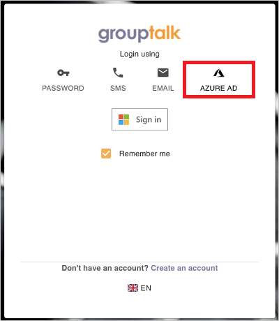

# Configure GroupTalk for automatic user provisioning with Microsoft Entra ID

This article describes the steps you need to perform in both GroupTalk and Microsoft Entra ID to configure automatic user provisioning. When configured, Microsoft Entra ID automatically provisions and de-provisions users and groups to [GroupTalk](https://www.grouptalk.com/) using the Microsoft Entra provisioning service. For important details on what this service does, how it works, and frequently asked questions, see [Automate user provisioning and deprovisioning to SaaS applications with Microsoft Entra ID](~/identity/app-provisioning/user-provisioning.md). 

## Capabilities Supported
> [!div class="checklist"]
> * Create users in GroupTalk
> * Remove users in GroupTalk when they don't require access anymore
> * Keep user attributes synchronized between Microsoft Entra ID and GroupTalk
> * Provision groups and group memberships in GroupTalk

## Prerequisites

The scenario outlined in this article assumes that you already have the following prerequisites:

* [!INCLUDE [common-prerequisites.md](~/identity/saas-apps/includes/common-prerequisites.md)]
* A user account in GroupTalk with Admin permissions.

## Step 1: Plan your provisioning deployment
1. Learn about [how the provisioning service works](~/identity/app-provisioning/user-provisioning.md).
1. Determine who's in [scope for provisioning](~/identity/app-provisioning/define-conditional-rules-for-provisioning-user-accounts.md).
1. Determine what data to [map between Microsoft Entra ID and GroupTalk](~/identity/app-provisioning/customize-application-attributes.md). 

## Step 2: Configure GroupTalk to support provisioning with Microsoft Entra ID

1. Reach out to GroupTalk Support at support@grouptalk.com with the **Tenant name** and **ID** you would like to integrate with  Microsoft Entra ID.
1. When you've been notified that the necessary setup for your Microsoft Entra integration is ready, login to GroupTalk Admin and navigate to your Organization view. 
1. A Microsoft Entra Integration configuration item should be visible. Select it to verify the **Tenant name** and **ID**  to obtain a **JWT (Secret Token)**. 
1. The GroupTalk Tenant URL is `https://api.grouptalk.com/api/scim/`. The **Tenant URL** and the **Secret Token** retrieved in the previous step is entered in the Provisioning tab of your GroupTalk application. 

## Step 3: Add GroupTalk from the Microsoft Entra application gallery

Add **GroupTalk** from the Microsoft Entra application gallery to start managing provisioning to GroupTalk.

1. Select the **Sign up for GroupTalk** button, which will route you to the GroupTalk administrative application.
1. If you're already logged in to GroupTalk, logout to get to the login screen. Select the Microsoft Entra ID tab, and select the **Sign in** button.

	

1. Login with your AD Administrative account, and accept the GroupTalk application's access rights. You get an error message after this is done indicating the user isn't present. This is expected since your user isn't provisioned to GroupTalk yet but you have now added GroupTalk to your tenant.
1. Go back to the Azure portal and verify that **GroupTalk** is now added to your Enterprise Applications.

Learn more about adding an application from the gallery [here](~/identity/enterprise-apps/add-application-portal.md). 

## Step 4: Define who is in scope for provisioning 

[!INCLUDE [create-assign-users-provisioning.md](~/identity/saas-apps/includes/create-assign-users-provisioning.md)]

## Step 5: Configure automatic user provisioning to GroupTalk 

This section guides you through the steps to configure the Microsoft Entra provisioning service to create, update, and disable users and/or groups in TestApp based on user and/or group assignments in Microsoft Entra ID.

### To configure automatic user provisioning for GroupTalk in Microsoft Entra ID:

1. Sign in to the [Microsoft Entra admin center](https://entra.microsoft.com) as at least a [Cloud Application Administrator](~/identity/role-based-access-control/permissions-reference.md#cloud-application-administrator).
1. Browse to **Entra ID** > **Enterprise apps**

	

1. In the applications list, select **GroupTalk**.

	

1. Select the **Provisioning** tab.

	

1. Select **+ New configuration**.

	

1. In the **Tenant URL** field, input your GroupTalk Tenant URL and Secret Token. Select **Test Connection** to ensure Microsoft Entra ID can connect to GroupTalk. If the connection fails, ensure your GroupTalk account has the required admin permissions and try again.

   

1. Select **Create** to create your configuration.

1. Select **Properties** on the **Overview** page.

1. In the **Notification Email** field, enter the email address of a person who should receive the provisioning error notifications and select the **Send an email notification when a failure occurs** check box.

   

1. Select **Attribute Mapping** in the left panel and select **users**.

1. Review the user attributes that are synchronized from Microsoft Entra ID to GroupTalk in the **Attribute-Mapping** section. The attributes selected as **Matching** properties are used to match the user accounts in GroupTalk for update operations. If you choose to change the [matching target attribute](~/identity/app-provisioning/customize-application-attributes.md), you need to ensure that the GroupTalk API supports filtering users based on that attribute. Select the **Save** button to commit any changes.

   |Attribute|Type|Supported for filtering|
   |---|---|---|
   |userName|String|&check;|
   |phoneNumbers[type eq "mobile"].value|String|&check;|
   |emails[type eq "work"].value|String|&check;|
   |active|Boolean||
   |name.givenName|String||
   |name.familyName|String||
   |externalId|String||
   |urn:ietf:params:scim:schemas:extension:enterprise:2.0:User:costCenter|String||
   |urn:ietf:params:scim:schemas:extension:enterprise:2.0:User:organization|String||
   |urn:ietf:params:scim:schemas:extension:grouptalk:2.0:User:label1|String||
   |urn:ietf:params:scim:schemas:extension:grouptalk:2.0:User:label2|String||
   |urn:ietf:params:scim:schemas:extension:grouptalk:2.0:User:label3|String||
   |urn:ietf:params:scim:schemas:extension:grouptalk:2.0:User:label4|String||
   |urn:ietf:params:scim:schemas:extension:grouptalk:2.0:User:label5|String||

1. Review the group attributes that are synchronized from Microsoft Entra ID to GroupTalk in the **Attribute-Mapping** section. The attributes selected as **Matching** properties are used to match the groups in GroupTalk for update operations. Select the **Save** button to commit any changes.

      |Attribute|Type|Supported for filtering|
      |---|---|---|
      |displayName|String|&check;|
      |members|Reference||
      |externalId|String||
      |urn:ietf:params:scim:schemas:extension:grouptalk:2.0:Group:description|String||

1. To configure scoping filters, refer to the instructions provided in the [Scoping filter article](~/identity/app-provisioning/define-conditional-rules-for-provisioning-user-accounts.md).

1. Use [on-demand provisioning](~/identity/app-provisioning/provision-on-demand.md) to validate sync with a small number of users before deploying more broadly in your organization.  

1. When you're ready to provision, select **Start Provisioning** from the **Overview** page.

## Step 6: Monitor your deployment

[!INCLUDE [monitor-deployment.md](~/identity/saas-apps/includes/monitor-deployment.md)]

## Additional resources

* [Managing user account provisioning for Enterprise Apps](~/identity/app-provisioning/configure-automatic-user-provisioning-portal.md)
* [What is application access and single sign-on with Microsoft Entra ID?](~/identity/enterprise-apps/what-is-single-sign-on.md)

## Related content

* [Learn how to review logs and get reports on provisioning activity](~/identity/app-provisioning/check-status-user-account-provisioning.md)
