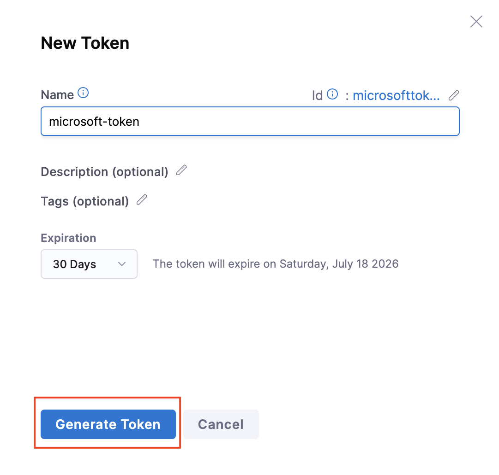

## Configure Harness for automatic user provisioning with Microsoft Entra ID

This article explains how to configure Microsoft Entra ID to automatically provision and deprovision users or groups to Harness. Automatic provisioning eliminates manual user management by synchronizing user lifecycle changes from your identity provider to Harness.

> [!NOTE]
> This article describes a connector that is built on top of the Microsoft Entra user provisioning service. For information about this service, see [Automate user provisioning and deprovisioning to SaaS applications with Microsoft Entra ID](~/identity/app-provisioning/user-provisioning.md).
>
> This connector is currently in preview. For more information about previews, see [Universal License Terms For Online Services](https://www.microsoft.com/licensing/terms/product/ForOnlineServices/all).

## Prerequisites

The scenario outlined in this article assumes that you have the following prerequisites:

[!INCLUDE [common-prerequisites.md](~/identity/saas-apps/includes/common-prerequisites.md)]
* [A Harness tenant](https://harness.io/pricing/)
* A user account in Harness with *Admin* permissions

## Assign users to Harness

Before you configure provisioning, you must assign users or groups to the Harness application in Microsoft Entra ID. Microsoft Entra ID uses **assignments** to determine which users should receive access to selected applications. In the context of automatic user provisioning, only the users or groups that have been assigned to an application in Microsoft Entra ID are synchronized.

Before you configure and enable automatic user provisioning, decide which users or groups in Microsoft Entra ID need access to Harness. You can then assign these users or groups to Harness by following the instructions in [Assign a user or group to an enterprise app](~/identity/enterprise-apps/assign-user-or-group-access-portal.md).

###  Recommendations for user assignment

Start with a small test group before you roll out provisioning to your entire organization. Assign a single Microsoft Entra user to Harness to test the automatic user provisioning configuration. After you verify that provisioning works correctly, you can assign additional users or groups.

When you assign a user to Harness, you must select a valid application-specific role (if available) in the **Assignment** dialog box. Users with the *Default Access* role are excluded from provisioning.

If you currently have a Harness FirstGen App Integration setup in Microsoft Entra ID and are now trying to set up one for Harness NextGen, ensure that the user information is also included in the FirstGen App Integration before you attempt to log into Harness NextGen through SSO.

## Set up Harness for provisioning

You must generate a SCIM API token in Harness before you can configure provisioning in Microsoft Entra ID. This token allows Microsoft Entra ID to securely connect to the Harness SCIM endpoint and provision users.

1. Sign in to your [Harness Admin Console](https://app.harness.io/auth/#/signin), select your profile at the bottom left corner of the page, and go to **Profile Overview**.

   

1. Under **My API Keys**, select **+API Key**. The window to create an API key opens.

   

2. Specify a **Name** and click **Save**. Harness creates an API key for your account.

   

3. To create a token for your API key, select **+Token** under your newly created API key.  

   a. Provide a name and click **Generate token**.

   b. Copy the token value to a safe location. You will need this token to configure the connection in Microsoft Entra ID.

   c. Click **Close**.

   
 

## Add Harness from the gallery

You must add the Harness application from the Microsoft Entra application gallery before you can configure automatic user provisioning. This registers Harness as a managed SaaS application in your Microsoft Entra tenant.

1. Sign in to the [Microsoft Entra admin center](https://entra.microsoft.com) as at least a [Cloud Application Administrator](~/identity/role-based-access-control/permissions-reference.md#cloud-application-administrator).
1. Browse to **Entra ID** > **Enterprise apps**.

   

1. To add a new application, select the **New application** button at the top of the pane.

   

1. In the search box, enter **Harness**, select **Harness** in the results list, and then select the **Add** button to add the application.

   

## Configure automatic user provisioning to Harness

After you add Harness from the gallery and generate a SCIM token, you can configure the provisioning connection. This section walks through the steps to configure the Microsoft Entra provisioning service to create, update, and disable users or groups in Harness based on user or group assignments in Microsoft Entra ID.

> [!TIP]
> You may also choose to enable SAML-based single sign-on for Harness by following the instructions in the [Harness single sign-on  article](./harness-tutorial.md). You can configure single sign-on independent of automatic user provisioning, although these two features complement each other.

> [!NOTE]
> To learn more about the Harness SCIM endpoint, see the Harness [API Keys](https://developer.harness.io/docs/platform/automation/api/add-and-manage-api-keys/) article.

To configure automatic user provisioning for Harness in Microsoft Entra ID, do the following:

1. Sign in to the [Microsoft Entra admin center](https://entra.microsoft.com) as at least a [Cloud Application Administrator](~/identity/role-based-access-control/permissions-reference.md#cloud-application-administrator).
1. Browse to **Entra ID** > **Enterprise apps**.

   

1. In the applications list, select **Harness**.

   

1. Select the **Provisioning** tab.

   

1. Set **+ New configuration**.

   

1. Under **Admin Credentials**, do the following:

   
  * In the **Tenant URL** box, enter **`https://app.harness.io/gateway/api/scim/account/<your_harness_account_ID>`**. You can obtain your Harness account ID from the URL in your browser when you are logged into Harness.

  * In the **Secret Token** box, enter the SCIM Authentication Token value that you saved in step 3 of the "Set up Harness for provisioning" section.
  
  * Select **Test Connection** to ensure that Microsoft Entra ID can connect to Harness. If the connection fails, ensure that your Harness account has *Admin* permissions, and then try again.

  

1. Select **Create** to create your configuration. 

1. Select **Properties** in the **Overview** page.

1. Select the pencil to edit the properties. Enable notification emails and provide an email to receive quarantine emails. Enable accidental deletions prevention. Select **Apply** to save the changes.

  

1. Select **Attribute Mapping** in the left panel and select **users**.

1. Review the user attributes that are synchronized from Microsoft Entra ID to Harness in the **Attribute Mapping** section. The attributes selected as **Matching** properties are used to match the user accounts in Harness for update operations. Select the **Save** button to commit any changes.

   

1. Under **Mappings**, select **Synchronize Microsoft Entra groups to Harness**.

1. Review the user attributes that are synchronized from Microsoft Entra ID to Harness in the **Attribute Mapping** section. The attributes selected as **Matching** properties are used to match the user accounts in Harness for update operations. Select the **Save** button to commit any changes.

   

1. To configure scoping filters, refer to the following instructions provided in the [Scoping filter article](~/identity/app-provisioning/define-conditional-rules-for-provisioning-user-accounts.md).

1. Use [on-demand provisioning](~/identity/app-provisioning/provision-on-demand.md) to validate sync with a small number of users before deploying more broadly in your organization. 

1. When you are ready to provision, select **Start Provisioning** from the **Overview** page.

## Monitor your deployment

After you start provisioning, monitor the provisioning logs to verify that users and groups sync correctly between Microsoft Entra ID and Harness.

[!INCLUDE [monitor-deployment.md](~/identity/saas-apps/includes/monitor-deployment.md)]

## Related articles

* [Learn how to review logs and get reports on provisioning activity](~/identity/app-provisioning/check-status-user-account-provisioning.md)
* [Manage user account provisioning for enterprise apps](~/identity/app-provisioning/configure-automatic-user-provisioning-portal.md)
* [Application access and single sign-on with Microsoft Entra ID](~/identity/enterprise-apps/what-is-single-sign-on.md)

