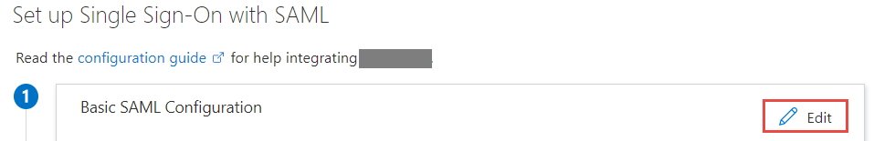
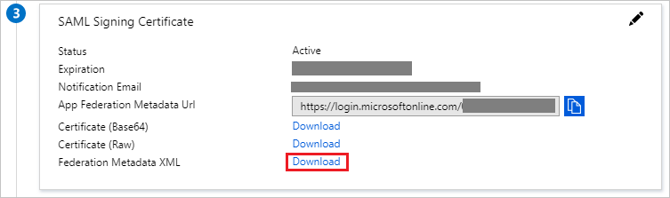
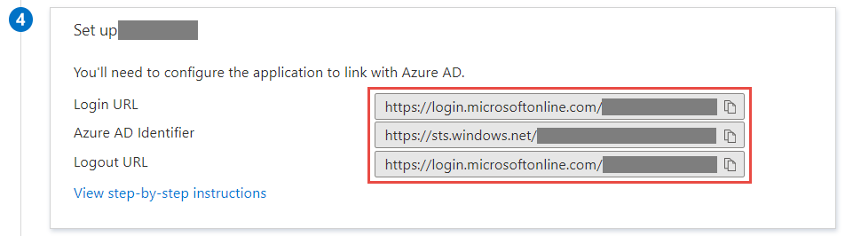
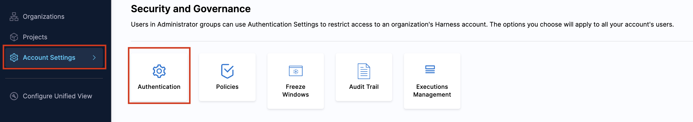
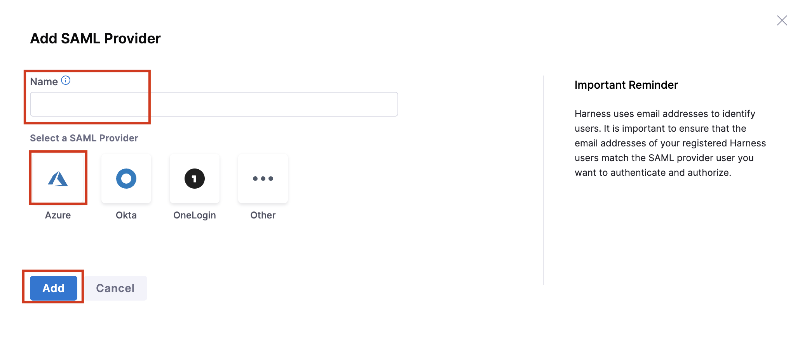
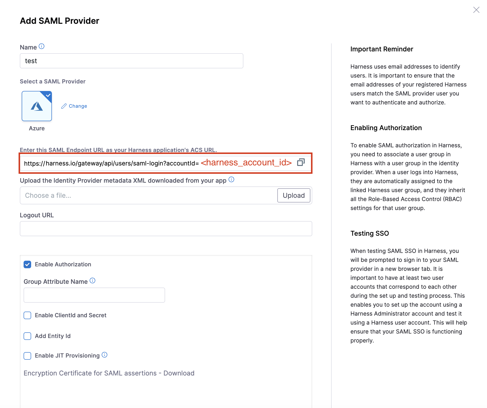
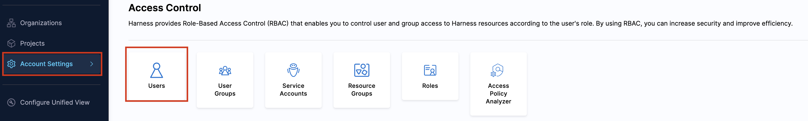
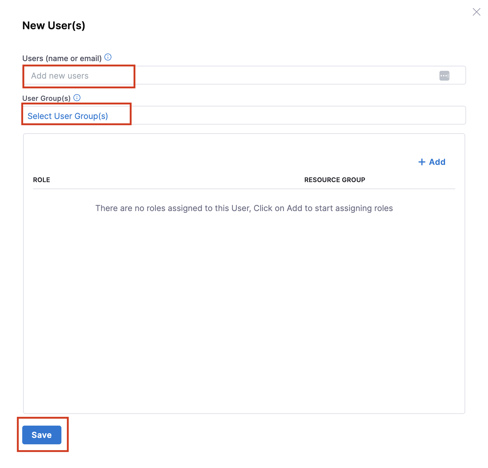

# Configure Harness for Single sign-on with Microsoft Entra ID

In this article, you learn how to integrate Harness with Microsoft Entra ID. When you integrate Harness with Microsoft Entra ID, you can:

* Control who has access to Harness from Microsoft Entra ID.
* Enable your users to sign in to Harness automatically with their Microsoft Entra accounts.
* Manage your accounts in one central location.

## Prerequisites

The scenario outlined in this article assumes that you already have the following prerequisites:

[!INCLUDE [common-prerequisites.md](~/identity/saas-apps/includes/common-prerequisites.md)]
* A Harness subscription with single sign-on (SSO) enabled.

## Scenario description

In this article, you configure and test Microsoft Entra SSO in a test environment.

* Harness supports **SP (Service Provider) and IDP (Identity Provider)** initiated SSO.

* Harness supports [Automated user provisioning](harness-provisioning-tutorial.md).

> [!NOTE]
> The identifier of this application is a fixed string value, so you can configure only one instance in one tenant.

## Add Harness from the gallery

To configure the integration of Harness into Microsoft Entra ID, add Harness from the gallery to your list of managed SaaS apps.

1. Sign in to the [Microsoft Entra admin center](https://entra.microsoft.com) as at least a [Cloud Application Administrator](~/identity/role-based-access-control/permissions-reference.md#cloud-application-administrator).
1. Browse to **Entra ID** > **Enterprise apps** > **New application**.
1. In the **Add from the gallery** section, enter **Harness** in the search box.
1. Select **Harness** from the results panel, and then add the app. Wait a few seconds while Microsoft Entra ID adds the app to your tenant.

[!INCLUDE [sso-wizard.md](~/identity/saas-apps/includes/sso-wizard.md)]

## Configure and test Microsoft Entra SSO for Harness

Configure and test Microsoft Entra SSO with Harness using a test user called **B.Simon**. For SSO to work, you need to establish a link relationship between a Microsoft Entra user and the related user in Harness.

To configure and test Microsoft Entra SSO with Harness, follow these steps:

1. **[Configure Microsoft Entra SSO](#configure-azure-ad-sso)** - to enable your users to use this feature.
    1. **Create a Microsoft Entra test user** - to test Microsoft Entra single sign-on with B.Simon.
    1. **Assign the Microsoft Entra test user** - to enable B.Simon to use Microsoft Entra single sign-on.
1. **[Configure Harness SSO](#configure-harness-sso)** - to configure the single sign-on settings on the application side.
    1. **[Create Harness test user](#create-harness-test-user)** - to have a counterpart of B.Simon in Harness that's linked to the Microsoft Entra representation of the user.
1. **[Test SSO](#test-sso)** - to verify whether the configuration works.

## Configure Microsoft Entra SSO

Follow these steps to enable Microsoft Entra SSO.

1. Sign in to the [Microsoft Entra admin center](https://entra.microsoft.com) as at least a [Cloud Application Administrator](~/identity/role-based-access-control/permissions-reference.md#cloud-application-administrator).
1. Browse to **Entra ID** > **Enterprise apps** > **Harness** > **Single sign-on**.
1. On the **Select a single sign-on method** page, select **SAML**.
1. On the **Set up single sign-on with SAML** page, select the pencil icon for **Basic SAML Configuration** to edit the settings.

   

1. In the **Basic SAML Configuration** section, if you want to configure the application in **IDP** initiated mode, follow this step:

    In the **Reply URL** text box, enter a URL that uses the following pattern:
    `https://app.harness.io/gateway/api/users/saml-login?accountId=<harness_account_id>`

1. Select **Set additional URLs**, and follow this step if you want to configure the application in **SP** initiated mode:

    In the **Sign-on URL** text box, enter the following URL:
    `https://app.harness.io/`

    > [!NOTE]
    > The Reply URL value isn't real. You get the actual Reply URL from the **Configure Harness SSO** section, which this article explains later. You can also use the patterns shown in the **Basic SAML Configuration** section.

1. On the **Set up single sign-on with SAML** page, in the **SAML Signing Certificate** section, find **Federation Metadata XML** and select **Download** to download the certificate and save it on your computer.

    

1. In the **Set up Harness** section, copy the appropriate URLs based on your requirement.

    

### Create a Microsoft Entra test user

In this section, you create a test user called B.Simon.

1. Sign in to the [Microsoft Entra admin center](https://entra.microsoft.com) as at least a [User Administrator](~/identity/role-based-access-control/permissions-reference.md#user-administrator).
1. Browse to **Entra ID** > **Users**.
1. Select **New user** > **Create new user** at the top of the screen.
1. In the **User** properties, follow these steps:
   1. In the **Display name** field, enter `B.Simon`.
   1. In the **User principal name** field, enter the username@companydomain.extension. For example, `B.Simon@contoso.com`.
   1. Select the **Show password** check box, and then copy the value in the **Password** box.
   1. Select **Review + create**.
1. Select **Create**.

### Assign the Microsoft Entra test user

In this section, you enable B.Simon to use single sign-on by granting access to Harness.

1. Sign in to the [Microsoft Entra admin center](https://entra.microsoft.com) as at least a [Cloud Application Administrator](~/identity/role-based-access-control/permissions-reference.md#cloud-application-administrator).
1. Browse to **Entra ID** > **Enterprise apps** > **Harness**.
1. On the app's overview page, select **Users and groups**.
1. Select **Add user/group**, then select **Users and groups** in the **Add Assignment** dialog.
   1. In the **Users and groups** dialog, select **B.Simon** from the Users list, then select the **Select** button at the bottom of the screen.
   1. If you want to assign a role to the users, select the role from the **Select a role** dropdown. If you haven't set up a role for this app, you see the **Default Access** role selected.
   1. In the **Add Assignment** dialog, select the **Assign** button.

## Configure Harness SSO

1. In a different web browser window, sign in to your Harness company site as an administrator.

1. On the bottom-left corner of the page, navigate to **Account Settings** > **Security and Governance** > **Authentication**.

    

1. In **Authentication**, select **+ SAML Provider**. The **Add SAML ProvideR** page opens. Specify a name and select **Azure** as the SAML Provider. 

    

1. On the **SAML Provider** pop-up, follow these steps:

    

    a. Copy the URL under **Enter this SAML Endpoint URL as your Harness application's ACS URL**, and paste it in the **Reply URL** in your Azure app.

    b. Select **Upload** to upload the Identity Provider Metadata XML file that you downloaded from Microsoft Entra ID.

    c. Click **Add**.

### Create Harness test user

To enable Microsoft Entra users to sign in to Harness, you must provision them in Harness. In Harness, provisioning is a manual task.

To provision a user account, follow these steps:

1. Sign in to Harness as an administrator.

1. On the bottom-left corner of the page, navigate to **Account Settings** > **Access Control** > **Users**.

    

1. On the top of the page, select **+ New User**.

1. On the **New User(s)** pop-up, follow these steps:

    

    a. In the **Users (name or email)** text box, enter the user's email address, as `B.simon@contoso.com`.

    b. In the **User Group(s)** filed, click **Select User Group(s)**. Create a user group or select an existing user group. Click **Apply Selected**. 

    c. Select **Save**.

Harness also supports automatic user provisioning. Go to [Configure Harness for automatic user provisioning](./harness-provisioning-tutorial.md) for the configuration steps.

## Test SSO

In this section, you test your Microsoft Entra single sign-on configuration with the following options.

#### SP initiated

* Select **Test**. This option redirects you to the Harness sign-on URL, where you can initiate the sign-in flow.

* Go to the Harness sign-on URL directly and initiate the sign-in flow from there.

#### IDP initiated

* Select **Test this application**. Microsoft Entra ID signs you in automatically to the Harness account for which you set up SSO.

You can also use Microsoft My Apps to test the application in any mode. When you select the Harness tile in My Apps, one of two things happens. If you configured the application in SP mode, My Apps redirects you to the application sign-on page, where you initiate the sign-in flow. If you configured the application in IDP mode, Microsoft Entra ID signs you in automatically to the Harness account for which you set up SSO. For more information about My Apps, go to [Introduction to the My Apps](https://support.microsoft.com/account-billing/sign-in-and-start-apps-from-the-my-apps-portal-2f3b1bae-0e5a-4a86-a33e-876fbd2a4510).

## Related content

After you configure Harness, you can enforce session control, which protects against exfiltration and infiltration of your organization's sensitive data in real time. Session control extends from Conditional Access. [Learn how to enforce session control with Microsoft Defender for Cloud Apps](/cloud-app-security/proxy-deployment-aad).
