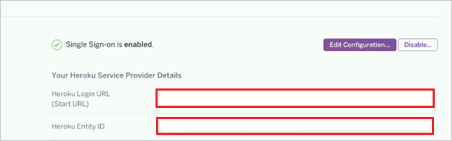

# Configure Heroku for Single sign-on with Microsoft Entra ID

In this article,  you learn how to integrate Heroku with Microsoft Entra ID. When you integrate Heroku with Microsoft Entra ID, you can:

* Control in Microsoft Entra ID who has access to Heroku.
* Enable your users to be automatically signed-in to Heroku with their Microsoft Entra accounts.
* Manage your accounts in one central location.

## Prerequisites

The scenario outlined in this article assumes that you already have the following prerequisites:

[!INCLUDE [common-prerequisites.md](~/identity/saas-apps/includes/common-prerequisites.md)]
* Heroku single sign-on (SSO) enabled subscription.

## Scenario description

In this article,  you configure and test Microsoft Entra single sign-on in a test environment.

* Heroku supports **SP** initiated SSO.
* Heroku supports **Just In Time** user provisioning.

## Add Heroku from the gallery

To configure the integration of Heroku into Microsoft Entra ID, you need to add Heroku from the gallery to your list of managed SaaS apps.

1. Sign in to the [Microsoft Entra admin center](https://entra.microsoft.com) as at least a [Cloud Application Administrator](~/identity/role-based-access-control/permissions-reference.md#cloud-application-administrator).
1. Browse to **Entra ID** > **Enterprise apps** > **New application**.
1. In the **Add from the gallery** section, type **Heroku** in the search box.
1. Select **Heroku** from results panel and then add the app. Wait a few seconds while the app is added to your tenant.

 [!INCLUDE [sso-wizard.md](~/identity/saas-apps/includes/sso-wizard.md)]

## Configure and test Microsoft Entra SSO for Heroku

Configure and test Microsoft Entra SSO with Heroku using a test user called **B.Simon**. For SSO to work, you need to establish a link relationship between a Microsoft Entra user and the related user in Heroku.

To configure and test Microsoft Entra SSO with Heroku, perform the following steps:

1. **[Configure Microsoft Entra SSO](#configure-azure-ad-sso)** - to enable your users to use this feature.
    1. **Create a Microsoft Entra test user** - to test Microsoft Entra single sign-on with B.Simon.
    1. **Assign the Microsoft Entra test user** - to enable B.Simon to use Microsoft Entra single sign-on.
1. **[Configure Heroku SSO](#configure-heroku-sso)** - to configure the single sign-on settings on application side.
    1. **[Create Heroku test user](#create-heroku-test-user)** - to have a counterpart of B.Simon in Heroku that's linked to the Microsoft Entra representation of user.
1. **[Test SSO](#test-sso)** - to verify whether the configuration works.

## Configure Microsoft Entra SSO

Follow these steps to enable Microsoft Entra SSO.

1. Sign in to the [Microsoft Entra admin center](https://entra.microsoft.com) as at least a [Cloud Application Administrator](~/identity/role-based-access-control/permissions-reference.md#cloud-application-administrator).
1. Browse to **Entra ID** > **Enterprise apps** > **Heroku** > **Single sign-on**.
1. On the **Select a single sign-on method** page, select **SAML**.
1. On the **Set up single sign-on with SAML** page, select the pencil icon for **Basic SAML Configuration** to edit the settings.

   

1. On the **Basic SAML Configuration** section, perform the following steps:

	a. In the **Sign on URL** text box, type a URL using the following pattern:
    `https://sso.heroku.com/saml/<company-name>/init`

    b. In the **Identifier (Entity ID)** text box, type a URL using the following pattern:
    `https://sso.heroku.com/saml/<company-name>`

	> [!NOTE]
	> These values aren't real. Update these values with the actual Sign-On URL and Identifier. You get these values from Heroku team, which is described in later sections of this article.

1. On the **Set up Single Sign-On with SAML** page, in the **SAML Signing Certificate** section, select **Download** to download the **Federation Metadata XML** from the given options as per your requirement and save it on your computer.

	

6. On the **Set up Heroku** section, copy the appropriate URL(s) as per your requirement.

	

### Create a Microsoft Entra test user

In this section, you create a test user called B.Simon.

1. Sign in to the [Microsoft Entra admin center](https://entra.microsoft.com) as at least a [User Administrator](~/identity/role-based-access-control/permissions-reference.md#user-administrator).
1. Browse to **Entra ID** > **Users**.
1. Select **New user** > **Create new user**, at the top of the screen.
1. In the **User** properties, follow these steps:
   1. In the **Display name** field, enter `B.Simon`.  
   1. In the **User principal name** field, enter the username@companydomain.extension. For example, `B.Simon@contoso.com`.
   1. Select the **Show password** check box, and then write down the value that's displayed in the **Password** box.
   1. Select **Review + create**.
1. Select **Create**.

### Assign the Microsoft Entra test user

In this section, you enable B.Simon to use single sign-on by granting access to Heroku.

1. Sign in to the [Microsoft Entra admin center](https://entra.microsoft.com) as at least a [Cloud Application Administrator](~/identity/role-based-access-control/permissions-reference.md#cloud-application-administrator).
1. Browse to **Entra ID** > **Enterprise apps** > **Heroku**.
1. In the app's overview page, select **Users and groups**.
1. Select **Add user/group**, then select **Users and groups** in the **Add Assignment** dialog.
   1. In the **Users and groups** dialog, select **B.Simon** from the Users list, then select the **Select** button at the bottom of the screen.
   1. If you're expecting a role to be assigned to the users, you can select it from the **Select a role** dropdown. If no role has been set up for this app, you see "Default Access" role selected.
   1. In the **Add Assignment** dialog, select the **Assign** button.

## Configure Heroku SSO

1. In a different web browser window, sign-on to your Heroku tenant as an administrator.

2. Select the **Settings** tab.

3. On the **Single Sign On Page**, select **Upload Metadata**.

4. Upload the metadata file, which you have downloaded.

5. When the setup is successful, administrators see a confirmation dialog and the URL of the SSO Login for end users is displayed.

6. Copy the **Heroku Login URL** and **Heroku Entity ID** values and go back to **Basic SAML Configuration** section in Azure portal and paste these values into the **Sign-On Url** and **Identifier (Entity ID)** textboxes respectively.

	

7. Select **Next**.

### Create Heroku test user

In this section, a user called B.Simon is created in Heroku. Heroku supports just-in-time user provisioning, which is enabled by default. There's no action item for you in this section. If a user doesn't already exist in Heroku, a new one is created after authentication.

## Test SSO

In this section, you test your Microsoft Entra single sign-on configuration with following options. 

* Select **Test this application**, this option redirects to Heroku Sign-on URL where you can initiate the login flow. 

* Go to Heroku Sign-on URL directly and initiate the login flow from there.

* You can use Microsoft My Apps. When you select the Heroku tile in the My Apps, this option redirects to Heroku Sign-on URL. For more information about the My Apps, see [Introduction to the My Apps](https://support.microsoft.com/account-billing/sign-in-and-start-apps-from-the-my-apps-portal-2f3b1bae-0e5a-4a86-a33e-876fbd2a4510).

## Related content

Once you configure Heroku you can enforce session control, which protects exfiltration and infiltration of your organization’s sensitive data in real time. Session control extends from Conditional Access. [Learn how to enforce session control with Microsoft Defender for Cloud Apps](/cloud-app-security/proxy-deployment-any-app).
