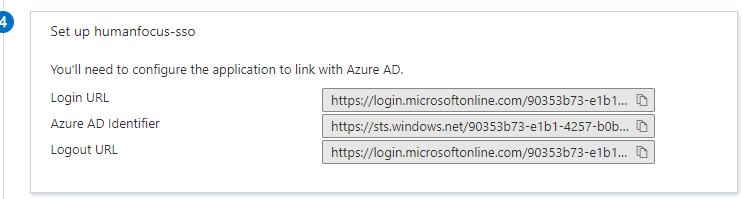

# Human Focus Single Sign-On (SSO) Setup for Microsoft Entra ID

Follow these steps to set up Single Sign-On (SSO) for Human Focus using Microsoft Entra ID formerly Azure Active Directory (Azure AD).

## Step 1: Log in to Microsoft Entra ID

1. Login to Microsoft Entra ID.
2. Click on **Enterprise Applications**.
   

## Step 2: Create a New Application

1. Click the **+ New application** button.
   
2. Select **Create your own application**.
   
3. Provide a name for your application.
4. Select the last option appearing on the page and click **Create**.
   

## Step 3: Set up Single Sign-On

1. Click on **Set up single sign on**.
   
2. Select the **SAML** option.
   

## Step 4: Configure SAML

1. Enter the following values:

    - **Identifier**: `https://www.humanfocus.org.uk/`
    - **Reply URL**: `https://www.humanfocus.org.uk/CBTbyB/SAML/AssertionConsumerService.aspx`
   

## Step 5: Edit User Attributes & Claims

1. Edit the **User Attributes & Claims** section.
2. In the **Unique User Identifier (Name ID)** claim, ensure the value is set to `user.userprincipalname [nameid-format:emailAddress]`.
    

3. Delete any default attributes under the **Additional claims** section.
    

4. Add the following attributes:

    - **first_name**: `user.givenname`
    - **last_name**: `user.surname`
    - **email**: `user.userprincipalname`
    - **roles**: `user.assignedroles`

    If you want to enable Role Mapping in Contentstack, ensure you add the `roles` attribute for IdP Role Mapping.
    

## Step 6: Download SAML Signing Certificate

1. In the **SAML Signing Certificate** section, click the **Download** link next to **Certificate (Base64)**.
2. Save the Base64 version of the certificate and send it to Human Focus.
   
3. If needed, edit the Notification Email Addresses section, change the notification
email, and click on Save.
   

## Step 7: Provide Configuration Details

1. In the **Set up <app_name>** section, you will find important data such as:

    - Login URL
    - Microsoft Entra ID Identifier
    - Logout URL

2. Send this information to Human Focus.
   
