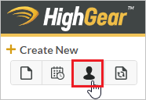
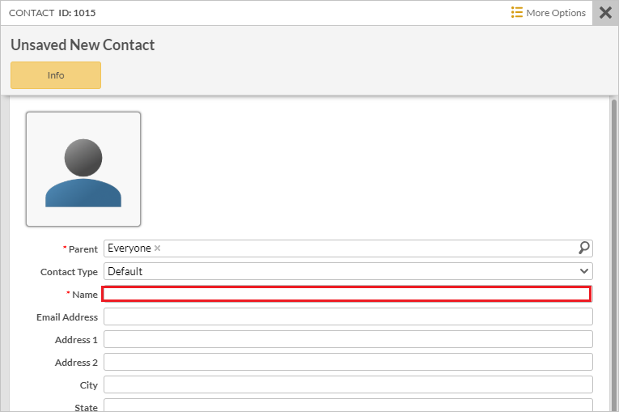
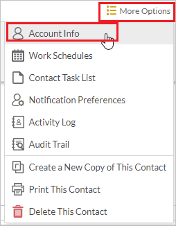
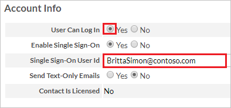

# Tutorial: Microsoft Entra integration with HighGear

In this tutorial, you can learn how to integrate HighGear with Microsoft Entra ID. Integrating HighGear with Microsoft Entra ID provides you with the following benefits:

* You can control in Microsoft Entra ID who has access to HighGear.
* You can enable your users to be automatically signed-in to HighGear (Single Sign-On) with their Microsoft Entra accounts.
* You can manage your accounts in one central location.

If you want to know more details about SaaS app integration with Microsoft Entra ID, see [What is application access and single sign-on with Microsoft Entra ID](~/identity/enterprise-apps/what-is-single-sign-on.md).
If you don't have an Azure subscription, [create a free account](https://azure.microsoft.com/free/) before you begin.

## Prerequisites

To configure Microsoft Entra integration with HighGear, you need the following items:

* A Microsoft Entra subscription. If you don't have a Microsoft Entra environment, you can get a one-month trial [here](https://azure.microsoft.com/pricing/free-trial/)
* A HighGear system with an Enterprise or Unlimited license

## Scenario description

In this tutorial, you can learn how to configure and test Microsoft Entra single sign-on in a test environment.

* HighGear supports **SP and IdP** initiated SSO

## Adding HighGear from the gallery

To configure the integration of HighGear into Microsoft Entra ID, you need to add HighGear from the gallery to your list of managed SaaS apps.

**To add HighGear from the gallery, perform the following steps:**

1. Sign in to the [Microsoft Entra admin center](https://entra.microsoft.com) as at least a [Cloud Application Administrator](~/identity/role-based-access-control/permissions-reference.md#cloud-application-administrator).
1. Browse to **Identity** > **Applications** > **Enterprise applications** > **New application**.
1. In the **Add from the gallery** section, type **HighGear** in the search box.
1. Select **HighGear** from results panel and then add the app. Wait a few seconds while the app is added to your tenant.

## Configure and test Microsoft Entra single sign-on

In this section, you can learn how to configure and test Microsoft Entra single sign-on with your HighGear system based on a test user called **Britta Simon**.
For single sign-on to work, a link relationship between a Microsoft Entra user and the related user in your HighGear system needs to be established.

To configure and test Microsoft Entra single sign-on with your HighGear system, you need to complete the following building blocks:

1. **[Configure Microsoft Entra Single Sign-On](#configure-azure-ad-single-sign-on)** - to enable your users to use this feature.
2. **[Configure HighGear Single Sign-On](#configure-highgear-single-sign-on)** - to configure the Single Sign-On settings on the HighGear application side.
3. **[Create a Microsoft Entra test user](#create-an-azure-ad-test-user)** - to test Microsoft Entra single sign-on with Britta Simon.
4. **[Assign the Microsoft Entra test user](#assign-the-azure-ad-test-user)** - to enable Britta Simon to use Microsoft Entra single sign-on.
5. **[Create HighGear test user](#create-highgear-test-user)** - to have a counterpart of Britta Simon in HighGear that is linked to the Microsoft Entra representation of the user. 
6. **[Test single sign-on](#test-single-sign-on)** - to verify whether the configuration works.

### Configure Microsoft Entra single sign-on

In this section, you can learn how to enable Microsoft Entra single sign-on.

To configure Microsoft Entra single sign-on with your HighGear system, perform the following steps:

1. Sign in to the [Microsoft Entra admin center](https://entra.microsoft.com) as at least a [Cloud Application Administrator](~/identity/role-based-access-control/permissions-reference.md#cloud-application-administrator).
1. Browse to **Identity** > **Applications** > **Enterprise applications** > **HighGear** application integration page, select **Single sign-on**.

    

1. On the **Select a Single sign-on method** dialog, select **SAML/WS-Fed** mode to enable single sign-on.

    

1. On the **Set up Single Sign-On with SAML** page, click the **Edit** icon to open the **Basic SAML Configuration** dialog.

    

1. On the **Basic SAML Configuration** section, perform the following steps:

    

    1. In the **Identifier** text box, paste the value of the **Service Provider Entity ID** field that is on the Single Sign-On Settings page in your HighGear system.

       

       > [!NOTE]
       > You will need to log in to your HighGear system to access the Single Sign-On Settings page. Once you're logged in, move your mouse over the Administration tab in HighGear and click the Single Sign-On Settings menu item.

       

    1. In the **Reply URL** text box, paste the value of the **Assertion Consumer Service (ACS) URL** from the Single Sign-On Settings page in your HighGear system.

       

    1. Click **Set additional URLs** and perform the following step if you wish to configure the application in **SP** initiated mode:

       

       In the **Sign-on URL** text box, paste the value of the **Service Provider Entity ID** field that is on the Single Sign-On Settings page in your HighGear system. (This Entity ID is also the base URL of the HighGear system that is to be used for SP-initiated sign-on.)

       

       > [!NOTE]
       > These values are not real. Update these values with the actual Identifier, Reply URL and Sign-on URL from the **Single Sign-On Settings** page in your HighGear system. If you need help, please contact the [HighGear Support Team](mailto:support@highgear.com).

4. On the **Set up Single Sign-On with SAML** page, in the **SAML Signing Certificate** section, click **Download** to download the **Certificate (Base64)** and save it on your computer. You'll need it in a later step of the Single Sign-On configuration.

    

1. On the **Set up HighGear** section, note the location of the following URLs.

    

    1. Login URL. You will need this value in Step #2 under **Configure HighGear Single Sign-On** below.

    1. Microsoft Entra Identifier. You will need this value in Step #3 under **Configure HighGear Single Sign-On** below.

    1. Logout URL. You will need this value in Step #4 under **Configure HighGear Single Sign-On** below.

### Configure HighGear Single Sign-On

To configure HighGear for Single Sign-On, please log in to your HighGear system. Once you're logged in, move your mouse over the Administration tab in HighGear and click the Single Sign-On Settings menu item.

1. In the **Identity Provider Name**, type a short description that will appear in HighGear's Single Sign-On button on the Login page. For example: Microsoft Entra ID

2. In the **Single Sign-On (SSO) URL** field in HighGear, paste the value from the **Login URL** field that is in the **Set up HighGear** section in Azure.

3. In the **Identity Provider Entity ID** field in HighGear, paste the value from the **Microsoft Entra Identifier** field that is in the **Set up HighGear** section in Azure.

4. In the **Single Logout (SLO) URL** field in HighGear, paste the value from the **Logout URL** field that is in the **Set up HighGear** section in Azure.

5. Use Notepad to open the certificate that you downloaded from the **SAML Signing Certificate** section in Azure. You should have downloaded the **Certificate (Base64)** format. Copy the contents of the certificate from Notepad and paste it into the **Identity Provider Certificate** field in HighGear.

6. Email the [HighGear Support Team](mailto:support@highgear.com) to request your HighGear Certificate. Follow the instructions you receive from them to fill out the **HighGear Certificate** and **HighGear Certificate Password** fields.

7. Click the **Save** button to save your HighGear Single Sign-On configuration.

### Create a Microsoft Entra test user 

The objective of this section is to create a test user called Britta Simon.

1. Sign in to the [Microsoft Entra admin center](https://entra.microsoft.com) as at least a [User Administrator](~/identity/role-based-access-control/permissions-reference.md#user-administrator).
1. Browse to **Identity** > **Users** > **All users**.
1. Select **New user** > **Create new user**, at the top of the screen.
1. In the **User** properties, follow these steps:
   1. In the **Display name** field, enter `B.Simon`.  
   1. In the **User principal name** field, enter the username@companydomain.extension. For example, `B.Simon@contoso.com`.
   1. Select the **Show password** check box, and then write down the value that's displayed in the **Password** box.
   1. Select **Review + create**.
1. Select **Create**.

### Assign the Microsoft Entra test user

In this section, you enable Britta Simon to use Azure single sign-on by granting access to HighGear.

1. Sign in to the [Microsoft Entra admin center](https://entra.microsoft.com) as at least a [Cloud Application Administrator](~/identity/role-based-access-control/permissions-reference.md#cloud-application-administrator).
1. Browse to **Identity** > **Applications** > **Enterprise applications** > **HighGear**.

    

1. In the app's overview page, select **Users and groups**.
1. Select **Add user/group**, then select **Users and groups** in the **Add Assignment** dialog.
   1. In the **Users and groups** dialog, select **B.Simon** from the Users list, then click the **Select** button at the bottom of the screen.
   1. If you are expecting a role to be assigned to the users, you can select it from the **Select a role** dropdown. If no role has been set up for this app, you see "Default Access" role selected.
   1. In the **Add Assignment** dialog, click the **Assign** button.

### Create HighGear test user

To create a HighGear test user to test your Single Sign-On configuration, please log in to your HighGear system.

1. Click the **Create New Contact** button.

    

    A menu will appear allowing you to choose the kind of contact you want to create.

2. Click the **Individual** menu item to create a HighGear user.

    A pane will slide out on the right so that you can type in the information for the new user.  
    

3. In the **Name** field, type a name for the contact. For example: Britta Simon

4. Click the **More Options** menu and select the **Account Info** menu item.

    

5. Set the **Can Log In** field to Yes.

    The **Enable Single Sign-On** field will automatically be set to Yes as well.

6. In the **Single Sign-On User Id** field, type the id of the user. For example: BrittaSimon@contoso.com

    The Account Info section should now look something like this:  
    

7. To save the contact, click the **Save** button at the bottom of the pane.

### Test single sign-on 

In this section, you test your Microsoft Entra single sign-on configuration using the Access Panel.

When you click the HighGear tile in the Access Panel, you should be automatically signed in to the HighGear for which you set up SSO. For more information about the Access Panel, see [Introduction to the Access Panel](https://support.microsoft.com/account-billing/sign-in-and-start-apps-from-the-my-apps-portal-2f3b1bae-0e5a-4a86-a33e-876fbd2a4510).

## Additional Resources

- [List of Tutorials on How to Integrate SaaS Apps with Microsoft Entra ID](./tutorial-list.md)

- [What is application access and single sign-on with Microsoft Entra ID?](~/identity/enterprise-apps/what-is-single-sign-on.md)

- [What is Conditional Access in Microsoft Entra ID?](~/identity/conditional-access/overview.md)
