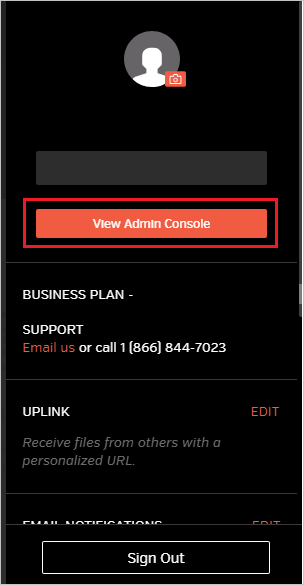
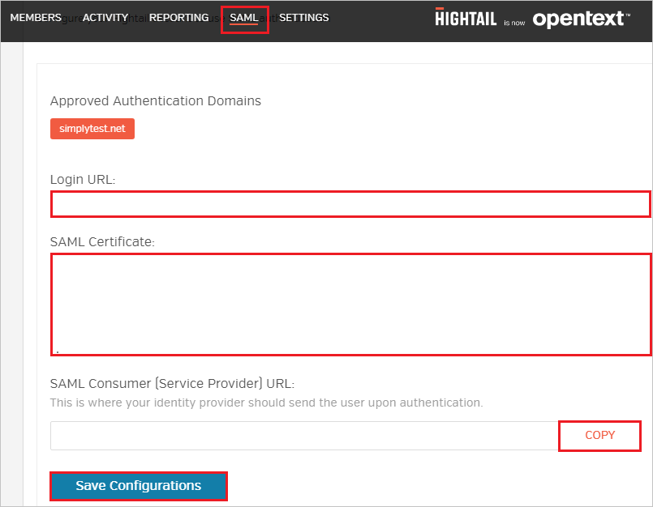

# Configure Hightail for Single sign-on with Microsoft Entra ID

In this article,  you learn how to integrate Hightail with Microsoft Entra ID. When you integrate Hightail with Microsoft Entra ID, you can:

* Control in Microsoft Entra ID who has access to Hightail.
* Enable your users to be automatically signed-in to Hightail with their Microsoft Entra accounts.
* Manage your accounts in one central location.

## Prerequisites

The scenario outlined in this article assumes that you already have the following prerequisites:

[!INCLUDE [common-prerequisites.md](~/identity/saas-apps/includes/common-prerequisites.md)]
* Hightail single sign-on (SSO) enabled subscription.

## Scenario description

In this article,  you configure and test Microsoft Entra SSO in a test environment.

* Hightail supports **SP and IDP** initiated SSO.
* Hightail supports **Just In Time** user provisioning.

> [!NOTE]
> Identifier of this application is a fixed string value so only one instance can be configured in one tenant.

## Add Hightail from the gallery

To configure the integration of Hightail into Microsoft Entra ID, you need to add Hightail from the gallery to your list of managed SaaS apps.

1. Sign in to the [Microsoft Entra admin center](https://entra.microsoft.com) as at least a [Cloud Application Administrator](~/identity/role-based-access-control/permissions-reference.md#cloud-application-administrator).
1. Browse to **Entra ID** > **Enterprise apps** > **New application**.
1. In the **Add from the gallery** section, type **Hightail** in the search box.
1. Select **Hightail** from results panel and then add the app. Wait a few seconds while the app is added to your tenant.

 [!INCLUDE [sso-wizard.md](~/identity/saas-apps/includes/sso-wizard.md)]

## Configure and test Microsoft Entra SSO for Hightail

Configure and test Microsoft Entra SSO with Hightail using a test user called **B.Simon**. For SSO to work, you need to establish a link relationship between a Microsoft Entra user and the related user in Hightail.

To configure and test Microsoft Entra SSO with Hightail, perform the following steps:

1. **[Configure Microsoft Entra SSO](#configure-azure-ad-sso)** - to enable your users to use this feature.
    1. **Create a Microsoft Entra test user** - to test Microsoft Entra single sign-on with B.Simon.
    1. **Assign the Microsoft Entra test user** - to enable B.Simon to use Microsoft Entra single sign-on.
1. **[Configure Hightail SSO](#configure-hightail-sso)** - to configure the single sign-on settings on application side.
    1. **[Create Hightail test user](#create-hightail-test-user)** - to have a counterpart of B.Simon in Hightail that's linked to the Microsoft Entra representation of user.
1. **[Test SSO](#test-sso)** - to verify whether the configuration works.

## Configure Microsoft Entra SSO

Follow these steps to enable Microsoft Entra SSO.

1. Sign in to the [Microsoft Entra admin center](https://entra.microsoft.com) as at least a [Cloud Application Administrator](~/identity/role-based-access-control/permissions-reference.md#cloud-application-administrator).
1. Browse to **Entra ID** > **Enterprise apps** > **Hightail** > **Single sign-on**.
1. On the **Select a single sign-on method** page, select **SAML**.
1. On the **Set up single sign-on with SAML** page, select the pencil icon for **Basic SAML Configuration** to edit the settings.

   

1. On the **Basic SAML Configuration** section, if you wish to configure the application in **IDP** initiated mode, perform the following steps:

	a. In the **Identifier (Entity ID)** text box, type the URL:
    `https://api.spaces.hightail.com/api/v1/saml/consumer`
	
    b. In the **Reply URL** text box, type the URL:
    `https://api.spaces.hightail.com/api/v1/saml/consumer`

1. Select **Set additional URLs** and perform the following step if you wish to configure the application in **SP** initiated mode:

    In the **Sign-on URL** text box, type the URL:
    `https://spaces.hightail.com/corp-login`

1. Hightail application expects the SAML assertions in a specific format, which requires you to add custom attribute mappings to your SAML token attributes configuration. The following screenshot shows the list of default attributes.

	

1. In addition to above, Hightail application expects few more attributes to be passed back in SAML response which are shown below. These attributes are also pre populated but you can review them as per your requirements.

	| Name | Source Attribute|
	| -------- |-------- |
	| FirstName | user.givenname |
	| LastName | user.surname |
	| Email | user.mail |
	| UserIdentity | user.mail |

1. On the **Set up single sign-on with SAML** page, in the **SAML Signing Certificate** section,  find **Certificate (Base64)** and select **Download** to download the certificate and save it on your computer.

	

1. On the **Set up Hightail** section, copy the appropriate URL(s) based on your requirement.

	

> [!NOTE]
> Before configuring the Single Sign On at Hightail app, please add your email domain to the allowed list with Hightail team so that all the users who are using this domain can use Single Sign On functionality.

### Create a Microsoft Entra test user

In this section, you create a test user called B.Simon.

1. Sign in to the [Microsoft Entra admin center](https://entra.microsoft.com) as at least a [User Administrator](~/identity/role-based-access-control/permissions-reference.md#user-administrator).
1. Browse to **Entra ID** > **Users**.
1. Select **New user** > **Create new user**, at the top of the screen.
1. In the **User** properties, follow these steps:
   1. In the **Display name** field, enter `B.Simon`.  
   1. In the **User principal name** field, enter the username@companydomain.extension. For example, `B.Simon@contoso.com`.
   1. Select the **Show password** check box, and then write down the value that's displayed in the **Password** box.
   1. Select **Review + create**.
1. Select **Create**.

### Assign the Microsoft Entra test user

In this section, you enable B.Simon to use single sign-on by granting access to Hightail.

1. Sign in to the [Microsoft Entra admin center](https://entra.microsoft.com) as at least a [Cloud Application Administrator](~/identity/role-based-access-control/permissions-reference.md#cloud-application-administrator).
1. Browse to **Entra ID** > **Enterprise apps** > **Hightail**.
1. In the app's overview page, select **Users and groups**.
1. Select **Add user/group**, then select **Users and groups** in the **Add Assignment** dialog.
   1. In the **Users and groups** dialog, select **B.Simon** from the Users list, then select the **Select** button at the bottom of the screen.
   1. If you're expecting a role to be assigned to the users, you can select it from the **Select a role** dropdown. If no role has been set up for this app, you see "Default Access" role selected.
   1. In the **Add Assignment** dialog, select the **Assign** button.

## Configure Hightail SSO

1. In a different web browser window, sign in to your Hightail company site as an administrator

1. Select **User icon** from the top right corner of the page. 

	

1. Select **View Admin Console** tab.

	

1. In the menu on the top, select the **SAML** tab and perform the following steps:

	

	a. In the **Login URL** textbox, paste the value of **Login URL** copied from Azure portal.

    b. Open your base-64 encoded certificate in notepad downloaded from Azure portal, copy the content of it into your clipboard, and then paste it to the **SAML Certificate** textbox.

	c. Select **COPY** to copy the SAML consumer URL for your instance and paste it in **Reply URL** textbox in **Basic SAML Configuration** section.

    d. Select **Save Configurations**.

### Create Hightail test user

In this section, a user called Britta Simon is created in Hightail. Hightail supports just-in-time user provisioning, which is enabled by default. There's no action item for you in this section. If a user doesn't already exist in Hightail, a new one is created after authentication.

## Test SSO 

In this section, you test your Microsoft Entra single sign-on configuration with following options. 

#### SP initiated:

* Select **Test this application**, this option redirects to Hightail Sign on URL where you can initiate the login flow.  

* Go to Hightail Sign-on URL directly and initiate the login flow from there.

#### IDP initiated:

* Select **Test this application**, and you should be automatically signed in to the Hightail for which you set up the SSO. 

You can also use Microsoft My Apps to test the application in any mode. When you select the Hightail tile in the My Apps, if configured in SP mode you would be redirected to the application sign on page for initiating the login flow and if configured in IDP mode, you should be automatically signed in to the Hightail for which you set up the SSO. For more information about the My Apps, see [Introduction to the My Apps](https://support.microsoft.com/account-billing/sign-in-and-start-apps-from-the-my-apps-portal-2f3b1bae-0e5a-4a86-a33e-876fbd2a4510).

## Related content

Once you configure Hightail you can enforce session control, which protects exfiltration and infiltration of your organization’s sensitive data in real time. Session control extends from Conditional Access. [Learn how to enforce session control with Microsoft Defender for Cloud Apps](/cloud-app-security/proxy-deployment-aad).
