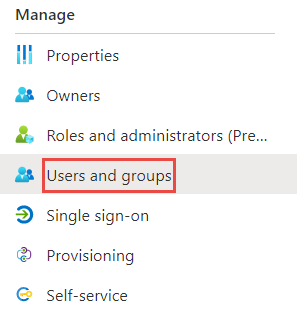
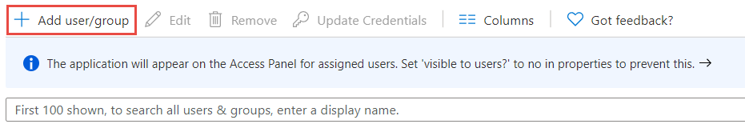

# Configure Honestly for Single sign-on with Microsoft Entra ID

In this article,  you learn how to integrate Honestly with Microsoft Entra ID. When you integrate Honestly with Microsoft Entra ID, you can:

* Control in Microsoft Entra ID who has access to Honestly.
* Enable your users to be automatically signed-in to Honestly with their Microsoft Entra accounts.
* Manage your accounts in one central location.

To learn more about SaaS app integration with Microsoft Entra ID, see [What is application access and single sign-on with Microsoft Entra ID](~/identity/enterprise-apps/what-is-single-sign-on.md).

## Prerequisites

The scenario outlined in this article assumes that you already have the following prerequisites:

[!INCLUDE [common-prerequisites.md](~/identity/saas-apps/includes/common-prerequisites.md)]
* Honestly single sign-on (SSO) enabled subscription.

## Scenario description

In this article,  you configure and test Microsoft Entra SSO in a test environment.

* Honestly supports **SP and IDP** initiated SSO
* Once you configure Honestly you can enforce session control, which protect exfiltration and infiltration of your organization’s sensitive data in real-time. Session control extend from Conditional Access. [Learn how to enforce session control with Microsoft Defender for Cloud Apps](/cloud-app-security/proxy-deployment-any-app).

## Adding Honestly from the gallery

To configure the integration of Honestly into Microsoft Entra ID, you need to add Honestly from the gallery to your list of managed SaaS apps.

1. Sign in to the [Microsoft Entra admin center](https://entra.microsoft.com) as at least a [Cloud Application Administrator](~/identity/role-based-access-control/permissions-reference.md#cloud-application-administrator).
1. Browse to **Entra ID** > **Enterprise apps** > **New application**.
1. In the **Add from the gallery** section, type **Honestly** in the search box.
1. Select **Honestly** from results panel and then add the app. Wait a few seconds while the app is added to your tenant.

 [!INCLUDE [sso-wizard.md](~/identity/saas-apps/includes/sso-wizard.md)]

## Configure and test Microsoft Entra single sign-on for Honestly

Configure and test Microsoft Entra SSO with Honestly using a test user called **B.Simon**. For SSO to work, you need to establish a link relationship between a Microsoft Entra user and the related user in Honestly.

To configure and test Microsoft Entra SSO with Honestly, complete the following building blocks:

1. **[Configure Microsoft Entra SSO](#configure-azure-ad-sso)** - to enable your users to use this feature.
    1. **Create a Microsoft Entra test user** - to test Microsoft Entra single sign-on with B.Simon.
    1. **Assign the Microsoft Entra test user** - to enable B.Simon to use Microsoft Entra single sign-on.
1. **[Configure Honestly SSO](#configure-honestly-sso)** - to configure the single sign-on settings on application side.
    1. **[Create Honestly test user](#create-honestly-test-user)** - to have a counterpart of B.Simon in Honestly that's linked to the Microsoft Entra representation of user.
1. **[Test SSO](#test-sso)** - to verify whether the configuration works.

## Configure Microsoft Entra SSO

Follow these steps to enable Microsoft Entra SSO.

1. Sign in to the [Microsoft Entra admin center](https://entra.microsoft.com) as at least a [Cloud Application Administrator](~/identity/role-based-access-control/permissions-reference.md#cloud-application-administrator).
1. Browse to **Entra ID** > **Enterprise apps** > **Honestly**
1. On the **Honestly** App page, select **2. Set up single sign on**.
1. On the **Set up single sign-on with SAML** page, select the edit/pen icon for **Basic SAML Configuration** to edit the settings.

   

1. On the **Basic SAML Configuration** section, if you wish to configure the application in **IDP** initiated mode, enter the values for the following fields:

    a. In the **Identifier (Entity ID)** text box, type a URL using the following pattern:
   
    `https://webapp.honestly.de/saml2/<client-id>/metadata`
   
   	You can find this value of your Honestly account on the **Honestly SSO** page in the field **Honestly Entity ID**

    b. In the **Reply URL (Assertion Consumer Service URL)** text box, type a URL using the following pattern:
   
    `https://webapp.honestly.de/saml2/<client-id>/acs`
   
   	You can find this value of your Honestly account on the **Honestly SSO** page in the field **Honestly ACS URL**

1. Select **Set additional URLs** and perform the following step if you wish to configure the application in **SP** initiated mode:

    In the **Sign-on URL** text box, type a URL:
    `https://webapp.honestly.de/sso`

## Configure Honestly SSO

1. Go to the **Honestly SSO** page in your Honestly account.

    a. In the **Your provider's SSO URL** text box, type your **Login URL** with the following pattern:
    `https://login.microsoftonline.com/<client-id>/saml2`

    b. In the **Your provider's Entity ID** text box, type your **Microsoft Entra Identifier** with the following pattern:
    `https://sts.windows.net/<client-id>/`
   
   	You can find both of these values on the **Set up single sign-on with SAML** page in Azure und der the **Set up Honestly section**
	

1. On the **Set up single sign-on with SAML** page, in the **SAML Signing Certificate** section,  find **Certificate (Base64)** and select **Download** to download the certificate and save it on your computer.

	

1. Open the certificate in any text editor.
1. Copy everything, including the *-----BEGIN CERTIFICATE-----* and *-----END CERTIFICATE-----* tags and the beginning and end of the file.
1. Paste it into the **x509 Certificate** field on the **Honestly SSO** page in your Honestly account.
1. You can enable the checkbox at the bottom of the page in order to fall back to the reglular login in case anything went wrong and click on save.

### Create a Microsoft Entra test user

In this section, you create a test user called B.Simon.

1. Sign in to the [Microsoft Entra admin center](https://entra.microsoft.com) as at least a [User Administrator](~/identity/role-based-access-control/permissions-reference.md#user-administrator).
1. Browse to **Entra ID** > **Users**.
1. Select **New user** > **Create new user**, at the top of the screen.
1. In the **User** properties, follow these steps:
   1. In the **Display name** field, enter `B.Simon`.  
   1. In the **User principal name** field, enter the username@companydomain.extension. For example, `B.Simon@contoso.com`.
   1. Select the **Show password** check box, and then write down the value that's displayed in the **Password** box.
   1. Select **Review + create**.
1. Select **Create**.

### Assign the Microsoft Entra test user

In this section, you enable B.Simon to use single sign-on by granting access to Honestly.

1. Sign in to the [Microsoft Entra admin center](https://entra.microsoft.com) as at least a [Cloud Application Administrator](~/identity/role-based-access-control/permissions-reference.md#cloud-application-administrator).
1. Browse to **Entra ID** > **Enterprise apps** > **Honestly**.
1. In the app's overview page, find the **Manage** section and select **Users and groups**.

   

1. Select **Add user**, then select **Users and groups** in the **Add Assignment** dialog.

	

1. In the **Users and groups** dialog, select **B.Simon** from the Users list, then select the **Select** button at the bottom of the screen.
1. If you're expecting any role value in the SAML assertion, in the **Select Role** dialog, select the appropriate role for the user from the list and then select the **Select** button at the bottom of the screen.
1. In the **Add Assignment** dialog, select the **Assign** button.

## Test SSO 

In this section, you test your Microsoft Entra single sign-on configuration using the Access Panel.

When you select the Honestly tile in the Access Panel, you should be automatically signed in to the Honestly for which you set up SSO. For more information about the Access Panel, see [Introduction to the Access Panel](https://support.microsoft.com/account-billing/sign-in-and-start-apps-from-the-my-apps-portal-2f3b1bae-0e5a-4a86-a33e-876fbd2a4510).

## Additional resources

- [List of articles on How to Integrate SaaS Apps with Microsoft Entra ID](./tutorial-list.md)

- [What is application access and single sign-on with Microsoft Entra ID?](~/identity/enterprise-apps/what-is-single-sign-on.md)

- [What is Conditional Access in Microsoft Entra ID?](~/identity/conditional-access/overview.md)

- [What is session control in Microsoft Defender for Cloud Apps?](/cloud-app-security/proxy-intro-aad)

- [How to protect Honestly with advanced visibility and controls](/cloud-app-security/proxy-intro-aad)
