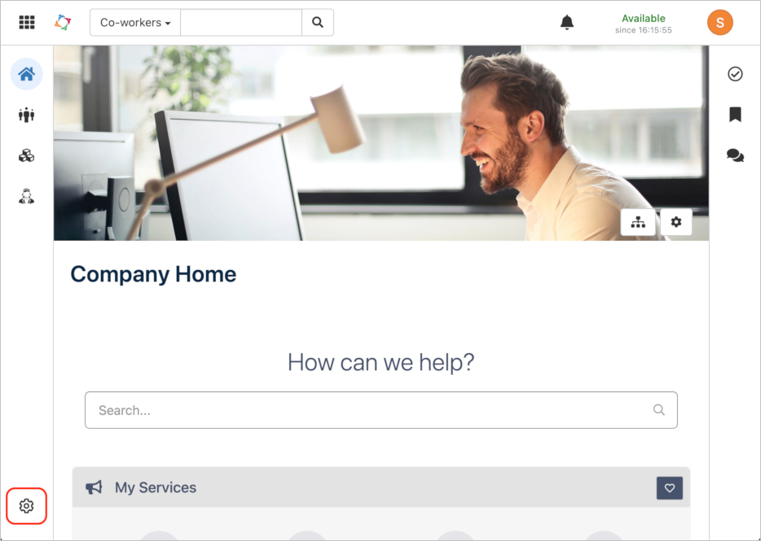
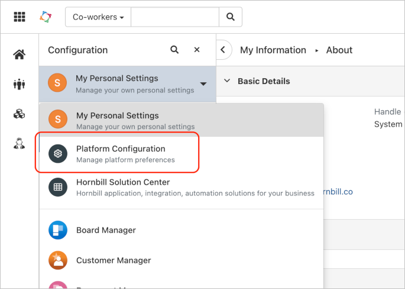
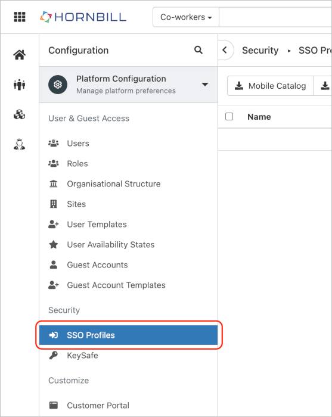
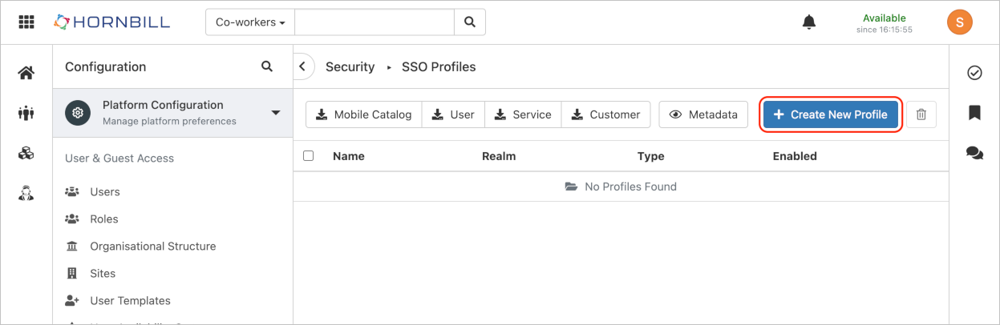
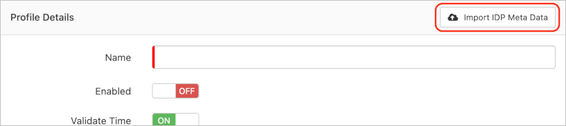
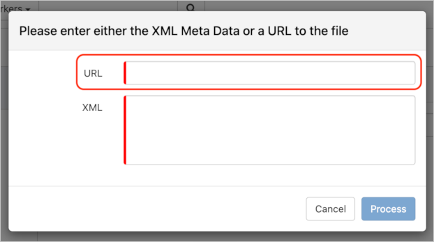
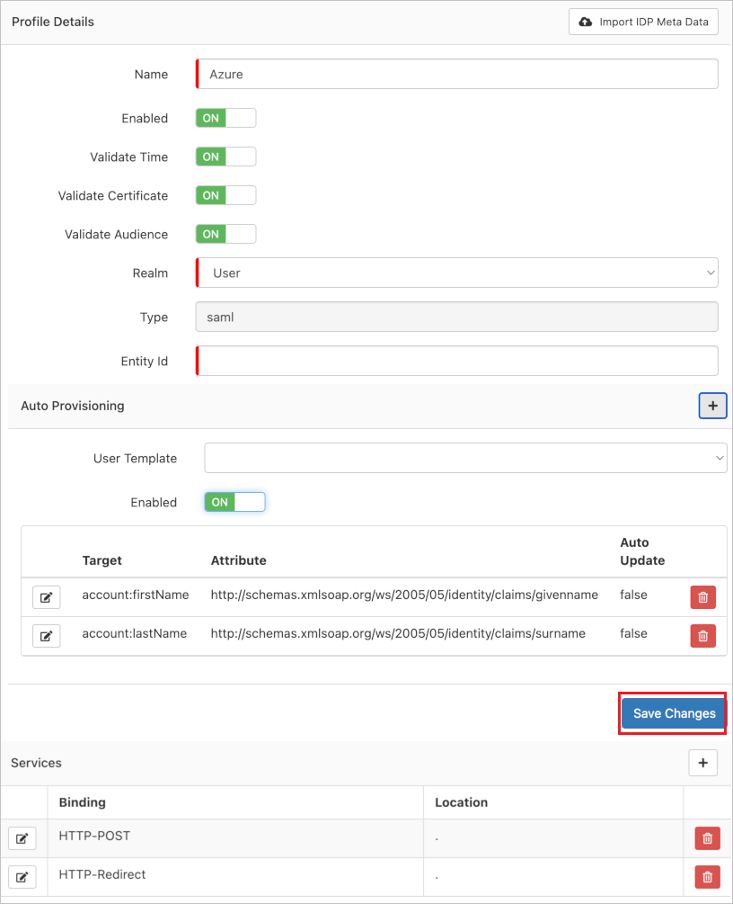

# Configure Hornbill for Single sign-on with Microsoft Entra ID

In this article,  you learn how to integrate Hornbill with Microsoft Entra ID. When you integrate Hornbill with Microsoft Entra ID, you can:

* Control in Microsoft Entra ID who has access to Hornbill.
* Enable your users to be automatically signed-in to Hornbill with their Microsoft Entra accounts.
* Manage your accounts in one central location.

## Prerequisites

The scenario outlined in this article assumes that you already have the following prerequisites:

[!INCLUDE [common-prerequisites.md](~/identity/saas-apps/includes/common-prerequisites.md)]
* Hornbill single sign-on (SSO) enabled subscription.

> [!NOTE]
> This integration is also available to use from Microsoft Entra US Government Cloud environment. You can find this application in the Microsoft Entra US Government Cloud Application Gallery and configure it in the same way as you do from public cloud.

## Scenario description

In this article,  you configure and test Microsoft Entra single sign-on in a test environment.

* Hornbill supports **SP** initiated SSO.
* Hornbill supports **Just In Time** user provisioning.

## Add Hornbill from the gallery

To configure the integration of Hornbill into Microsoft Entra ID, you need to add Hornbill from the gallery to your list of managed SaaS apps.

1. Sign in to the [Microsoft Entra admin center](https://entra.microsoft.com) as at least a [Cloud Application Administrator](~/identity/role-based-access-control/permissions-reference.md#cloud-application-administrator).
1. Browse to **Entra ID** > **Enterprise apps** > **New application**.
1. In the **Add from the gallery** section, type **Hornbill** in the search box.
1. Select **Hornbill** from results panel and then add the app. Wait a few seconds while the app is added to your tenant.

 [!INCLUDE [sso-wizard.md](~/identity/saas-apps/includes/sso-wizard.md)]

## Configure and test Microsoft Entra SSO for Hornbill

Configure and test Microsoft Entra SSO with Hornbill using a test user called **B.Simon**. For SSO to work, you need to establish a link relationship between a Microsoft Entra user and the related user in Hornbill.

To configure and test Microsoft Entra SSO with Hornbill, perform the following steps:

1. **[Configure Microsoft Entra SSO](#configure-azure-ad-sso)** - to enable your users to use this feature.
    1. **Create a Microsoft Entra test user** - to test Microsoft Entra single sign-on with B.Simon.
    1. **Assign the Microsoft Entra test user** - to enable B.Simon to use Microsoft Entra single sign-on.
1. **[Configure Hornbill SSO](#configure-hornbill-sso)** - to configure the single sign-on settings on application side.
    1. **[Create Hornbill test user](#create-hornbill-test-user)** - to have a counterpart of B.Simon in Hornbill that's linked to the Microsoft Entra representation of user.
1. **[Test SSO](#test-sso)** - to verify whether the configuration works.

## Configure Microsoft Entra SSO

Follow these steps to enable Microsoft Entra SSO.

1. Sign in to the [Microsoft Entra admin center](https://entra.microsoft.com) as at least a [Cloud Application Administrator](~/identity/role-based-access-control/permissions-reference.md#cloud-application-administrator).
1. Browse to **Entra ID** > **Enterprise apps** > **Hornbill** > **Single sign-on**.
1. On the **Select a single sign-on method** page, select **SAML**.
1. On the **Set up single sign-on with SAML** page, select the pencil icon for **Basic SAML Configuration** to edit the settings.

   

1. On the **Basic SAML Configuration** section, perform the following steps:

	a. In the **Identifier (Entity ID)** text box, type a URL using the following pattern:
`https://sso.hornbill.com/<INSTANCE_NAME>/live`

	> [!NOTE]
	> If you're deploying the Hornbill Mobile Catalog to your organization, you need to add an additional identifier URL, as so:
`https://sso.hornbill.com/hornbill/mcatalog`
    
	b. In the **Reply URL (Assertion Consumer Service URL)** section, add the following:
`https://<API_SUBDOMAIN>.hornbill.com/<INSTANCE_NAME>/xmlmc/sso/saml2/authorize/user/live`

	> [!NOTE]
	> If you're deploying the Hornbill Mobile Catalog to your organization, you need to add an additional Reply URL, as so:
`https://<API_SUBDOMAIN>.hornbill.com/hornbill/xmlmc/sso/saml2/authorize/user/mcatalog`
   
	c. In the **Sign on URL** text box, type a URL using the following pattern:
`https://live.hornbill.com/<INSTANCE_NAME>/`

	> [!NOTE]
	> These values aren't real. Update the <INSTANCE_NAME> and <API_SUBDOMAIN> values with the actual values in the Identifier(s), Reply URL(s) and Sign on URL. These values can be retrieved from the Hornbill Solution Center in your Hornbill instance, under **_Your usage > Support_**.  Contact [Hornbill Support](https://www.hornbill.com/support) for assistance in getting these values. You can also refer to the patterns shown in the **Basic SAML Configuration** section.

6. On the **Set up Single Sign-On with SAML** page, In the **SAML Signing Certificate** section, select copy button to copy **App Federation Metadata Url** and save it on your computer.

	

### Create a Microsoft Entra test user

In this section, you create a test user called B.Simon.

1. Sign in to the [Microsoft Entra admin center](https://entra.microsoft.com) as at least a [User Administrator](~/identity/role-based-access-control/permissions-reference.md#user-administrator).
1. Browse to **Entra ID** > **Users**.
1. Select **New user** > **Create new user**, at the top of the screen.
1. In the **User** properties, follow these steps:
   1. In the **Display name** field, enter `B.Simon`.  
   1. In the **User principal name** field, enter the username@companydomain.extension. For example, `B.Simon@contoso.com`.
   1. Select the **Show password** check box, and then write down the value that's displayed in the **Password** box.
   1. Select **Review + create**.
1. Select **Create**.

### Assign the Microsoft Entra test user

In this section, you enable B.Simon to use single sign-on by granting access to Hornbill.

1. Sign in to the [Microsoft Entra admin center](https://entra.microsoft.com) as at least a [Cloud Application Administrator](~/identity/role-based-access-control/permissions-reference.md#cloud-application-administrator).
1. Browse to **Entra ID** > **Enterprise apps** > **Hornbill**.
1. In the app's overview page, select **Users and groups**.
1. Select **Add user/group**, then select **Users and groups** in the **Add Assignment** dialog.
   1. In the **Users and groups** dialog, select **B.Simon** from the Users list, then select the **Select** button at the bottom of the screen.
   1. If you're expecting a role to be assigned to the users, you can select it from the **Select a role** dropdown. If no role has been set up for this app, you see "Default Access" role selected.
   1. In the **Add Assignment** dialog, select the **Assign** button.

## Configure Hornbill SSO

1. In a different web browser window, log in to Hornbill as a Security Administrator.

2. On the Home page, select the **Configuration** settings icon at the bottom left of the page.

	

3. Navigate to **Platform Configuration**.

	

4. Select **SSO Profiles** under Security.

	

5. On the right side of the page, select **+ Create New Profile**.

	

6. On the **Profile Details** bar, select the **Import IDP Meta Data** button.

	

7. On the pop-up, in the **URL** text box, paste the **App Federation Metadata Url**,. and select **Process**.

	

8. After selecting process the values get auto populated automatically under **Profile Details** section.

	

9. Select **Save Changes**.

### Create Hornbill test user

In this section, a user called Britta Simon is created in Hornbill. Hornbill supports just-in-time user provisioning, which is enabled by default. There's no action item for you in this section. If a user doesn't already exist in Hornbill, a new one is created after authentication.

> [!Note]
> If you need to create a user manually, contact [Hornbill Client support team](https://www.hornbill.com/support/?request/).

## Test SSO

In this section, you test your Microsoft Entra single sign-on configuration with following options. 

* Select **Test this application**, this option redirects to Hornbill Sign-on URL where you can initiate the login flow. 

* Go to Hornbill Sign-on URL directly and initiate the login flow from there.

* You can use Microsoft My Apps. When you select the Hornbill tile in the My Apps, this option redirects to Hornbill Sign-on URL. For more information about the My Apps, see [Introduction to the My Apps](https://support.microsoft.com/account-billing/sign-in-and-start-apps-from-the-my-apps-portal-2f3b1bae-0e5a-4a86-a33e-876fbd2a4510).

## Related content

Once you configure Hornbill you can enforce session control, which protects exfiltration and infiltration of your organization’s sensitive data in real time. Session control extends from Conditional Access. [Learn how to enforce session control with Microsoft Defender for Cloud Apps](/cloud-app-security/proxy-deployment-aad).
