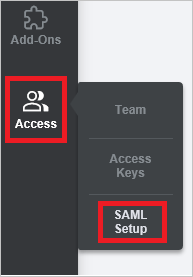
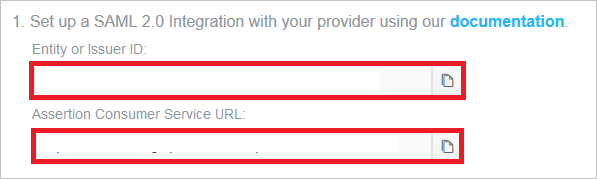
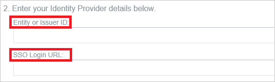
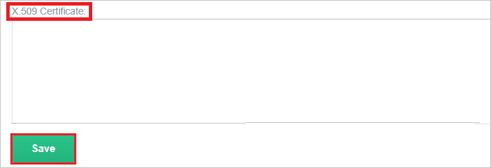

# Configure Hosted Graphite for Single sign-on with Microsoft Entra ID

In this article,  you learn how to integrate Hosted Graphite with Microsoft Entra ID. When you integrate Hosted Graphite with Microsoft Entra ID, you can:

* Control in Microsoft Entra ID who has access to Hosted Graphite.
* Enable your users to be automatically signed-in to Hosted Graphite with their Microsoft Entra accounts.
* Manage your accounts in one central location.

## Prerequisites

The scenario outlined in this article assumes that you already have the following prerequisites:

[!INCLUDE [common-prerequisites.md](~/identity/saas-apps/includes/common-prerequisites.md)]
* Hosted Graphite single sign-on (SSO) enabled subscription.

## Scenario description

In this article,  you configure and test Microsoft Entra single sign-on in a test environment.

* Hosted Graphite supports **SP and IDP** initiated SSO.
* Hosted Graphite supports **Just In Time** user provisioning.

## Add Hosted Graphite from the gallery

To configure the integration of Hosted Graphite into Microsoft Entra ID, you need to add Hosted Graphite from the gallery to your list of managed SaaS apps.

1. Sign in to the [Microsoft Entra admin center](https://entra.microsoft.com) as at least a [Cloud Application Administrator](~/identity/role-based-access-control/permissions-reference.md#cloud-application-administrator).
1. Browse to **Entra ID** > **Enterprise apps** > **New application**.
1. In the **Add from the gallery** section, type **Hosted Graphite** in the search box.
1. Select **Hosted Graphite** from results panel and then add the app. Wait a few seconds while the app is added to your tenant.

 [!INCLUDE [sso-wizard.md](~/identity/saas-apps/includes/sso-wizard.md)]

## Configure and test Microsoft Entra SSO for Hosted Graphite

Configure and test Microsoft Entra SSO with Hosted Graphite using a test user called **B.Simon**. For SSO to work, you need to establish a link relationship between a Microsoft Entra user and the related user in Hosted Graphite.

To configure and test Microsoft Entra SSO with Hosted Graphite, perform the following steps:

1. **[Configure Microsoft Entra SSO](#configure-azure-ad-sso)** - to enable your users to use this feature.
    1. **Create a Microsoft Entra test user** - to test Microsoft Entra single sign-on with B.Simon.
    1. **Assign the Microsoft Entra test user** - to enable B.Simon to use Microsoft Entra single sign-on.
1. **[Configure Hosted Graphite SSO](#configure-hosted-graphite-sso)** - to configure the single sign-on settings on application side.
    1. **[Create Hosted Graphite test user](#create-hosted-graphite-test-user)** - to have a counterpart of B.Simon in Hosted Graphite that's linked to the Microsoft Entra representation of user.
1. **[Test SSO](#test-sso)** - to verify whether the configuration works.

## Configure Microsoft Entra SSO

Follow these steps to enable Microsoft Entra SSO.

1. Sign in to the [Microsoft Entra admin center](https://entra.microsoft.com) as at least a [Cloud Application Administrator](~/identity/role-based-access-control/permissions-reference.md#cloud-application-administrator).
1. Browse to **Entra ID** > **Enterprise apps** > **Hosted Graphite** > **Single sign-on**.
1. On the **Select a single sign-on method** page, select **SAML**.
1. On the **Set up single sign-on with SAML** page, select the pencil icon for **Basic SAML Configuration** to edit the settings.

   

1. On the **Basic SAML Configuration** section, If you wish to configure the application in **IDP** initiated mode, perform the following steps:

    a. In the **Identifier** text box, type a URL using the following pattern:
    `https://www.hostedgraphite.com/metadata/<USER_ID>`

    b. In the **Reply URL** text box, type a URL using the following pattern:
    `https://www.hostedgraphite.com/complete/saml/<USER_ID>`

5. Select **Set additional URLs** and perform the following step if you wish to configure the application in **SP** initiated mode:

    In the **Sign-on URL** text box, type a URL using the following pattern:
    `https://www.hostedgraphite.com/login/saml/<USER_ID>/`

    > [!NOTE]
    > Please note that these aren't the real values. You have to update these values with the actual Identifier, Reply URL and Sign On URL. To get these values, you can go to Access->SAML setup on your Application side or Contact [Hosted Graphite support team](mailto:help@hostedgraphite.com).

6. On the **Set up Single Sign-On with SAML** page, in the **SAML Signing Certificate** section, select **Download** to download the **Certificate (Base64)** from the given options as per your requirement and save it on your computer.

	

7. On the **Set up Hosted Graphite** section, copy the appropriate URL(s) as per your requirement.

	

### Create a Microsoft Entra test user

In this section, you create a test user called B.Simon.

1. Sign in to the [Microsoft Entra admin center](https://entra.microsoft.com) as at least a [User Administrator](~/identity/role-based-access-control/permissions-reference.md#user-administrator).
1. Browse to **Entra ID** > **Users**.
1. Select **New user** > **Create new user**, at the top of the screen.
1. In the **User** properties, follow these steps:
   1. In the **Display name** field, enter `B.Simon`.  
   1. In the **User principal name** field, enter the username@companydomain.extension. For example, `B.Simon@contoso.com`.
   1. Select the **Show password** check box, and then write down the value that's displayed in the **Password** box.
   1. Select **Review + create**.
1. Select **Create**.

### Assign the Microsoft Entra test user

In this section, you enable B.Simon to use single sign-on by granting access to Hosted Graphite.

1. Sign in to the [Microsoft Entra admin center](https://entra.microsoft.com) as at least a [Cloud Application Administrator](~/identity/role-based-access-control/permissions-reference.md#cloud-application-administrator).
1. Browse to **Entra ID** > **Enterprise apps** > **Hosted Graphite**.
1. In the app's overview page, select **Users and groups**.
1. Select **Add user/group**, then select **Users and groups** in the **Add Assignment** dialog.
   1. In the **Users and groups** dialog, select **B.Simon** from the Users list, then select the **Select** button at the bottom of the screen.
   1. If you're expecting a role to be assigned to the users, you can select it from the **Select a role** dropdown. If no role has been set up for this app, you see "Default Access" role selected.
   1. In the **Add Assignment** dialog, select the **Assign** button.

## Configure Hosted Graphite SSO

1. Sign-on to your Hosted Graphite tenant as an administrator.

2. Go to the **SAML Setup page** in the sidebar (**Access -> SAML Setup**).

    

3. Confirm these URLs match your configuration done on the **Basic SAML Configuration** section.

    

4. In  **Entity or Issuer ID** and **SSO Login URL** textboxes, paste the value of **Microsoft Entra Identifier** and **Login URL**..

    

5. Select **Read-only** as **Default User Role**.

    

6. Open your base-64 encoded certificate in notepad downloaded from Azure portal, copy the content of it into your clipboard, and then paste it to the **X.509 Certificate** textbox.

    

7. Select **Save** button.

### Create Hosted Graphite test user

In this section, a user called Britta Simon is created in Hosted Graphite. Hosted Graphite supports just-in-time user provisioning, which is enabled by default. There's no action item for you in this section. If a user doesn't already exist in Hosted Graphite, a new one is created after authentication.

> [!NOTE]
> If you need to create a user manually, you need to contact the [Hosted Graphite support team](mailto:help@hostedgraphite.com).

## Test SSO

In this section, you test your Microsoft Entra single sign-on configuration with following options. 

#### SP initiated:

* Select **Test this application**, this option redirects to Hosted Graphite Sign on URL where you can initiate the login flow.  

* Go to Hosted Graphite Sign-on URL directly and initiate the login flow from there.

#### IDP initiated:

* Select **Test this application**, and you should be automatically signed in to the Hosted Graphite for which you set up the SSO. 

You can also use Microsoft My Apps to test the application in any mode. When you select the Hosted Graphite tile in the My Apps, if configured in SP mode you would be redirected to the application sign on page for initiating the login flow and if configured in IDP mode, you should be automatically signed in to the Hosted Graphite for which you set up the SSO. For more information about the My Apps, see [Introduction to the My Apps](https://support.microsoft.com/account-billing/sign-in-and-start-apps-from-the-my-apps-portal-2f3b1bae-0e5a-4a86-a33e-876fbd2a4510).

## Related content

Once you configure Hosted Graphite you can enforce session control, which protects exfiltration and infiltration of your organization’s sensitive data in real time. Session control extends from Conditional Access. [Learn how to enforce session control with Microsoft Defender for Cloud Apps](/cloud-app-security/proxy-deployment-aad).
