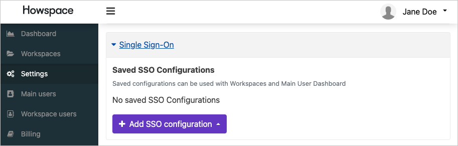
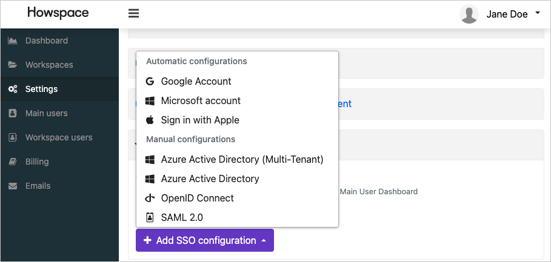
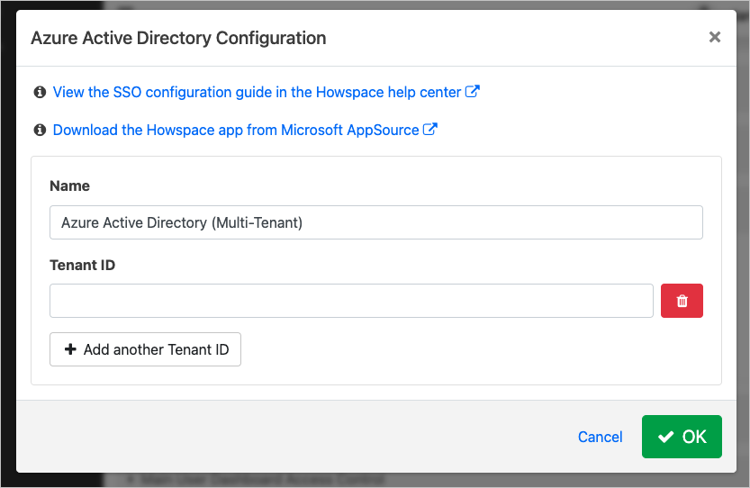
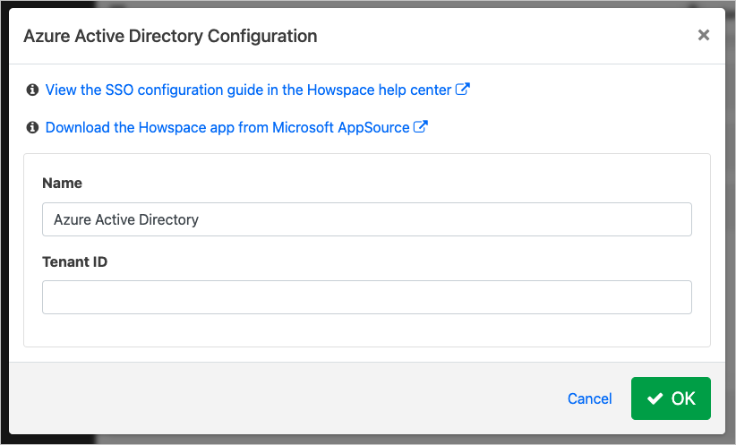
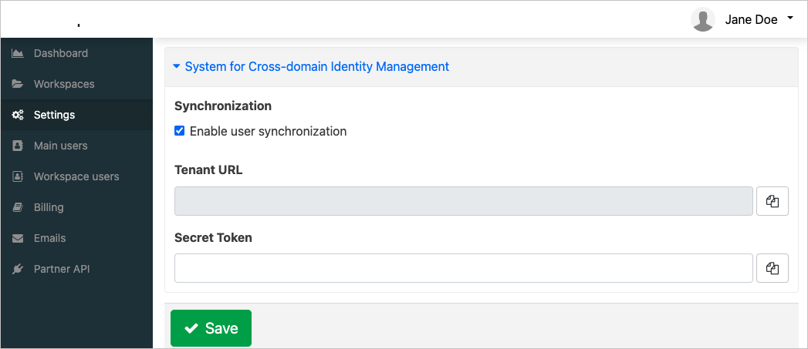
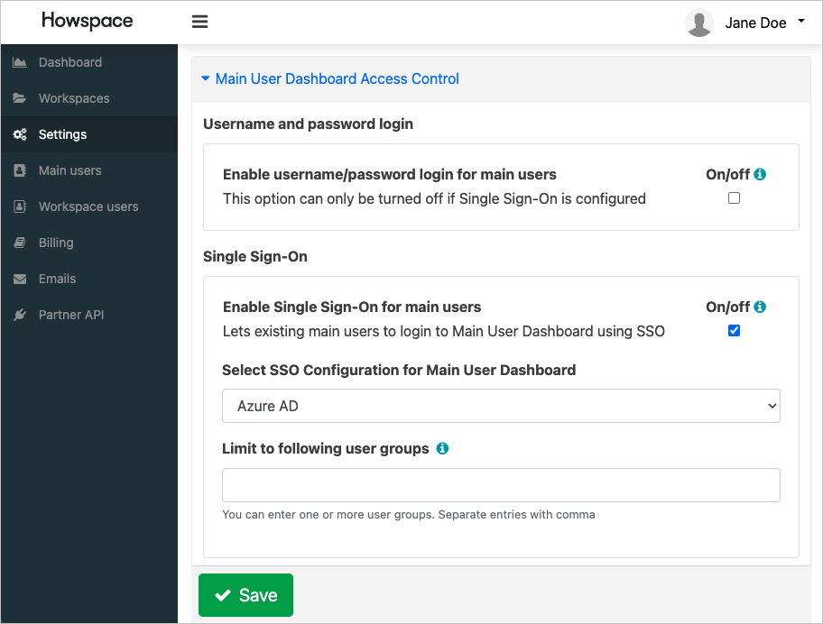
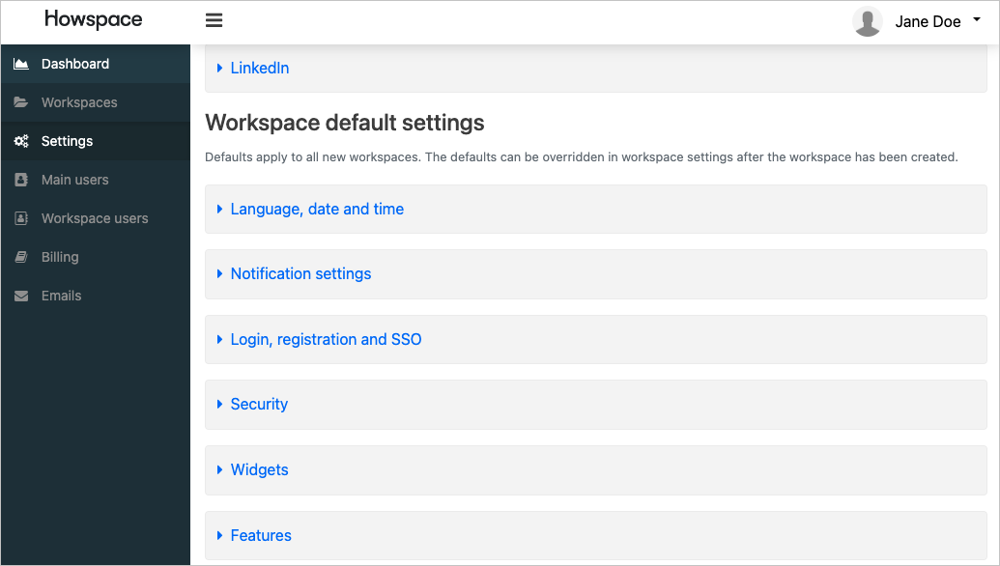
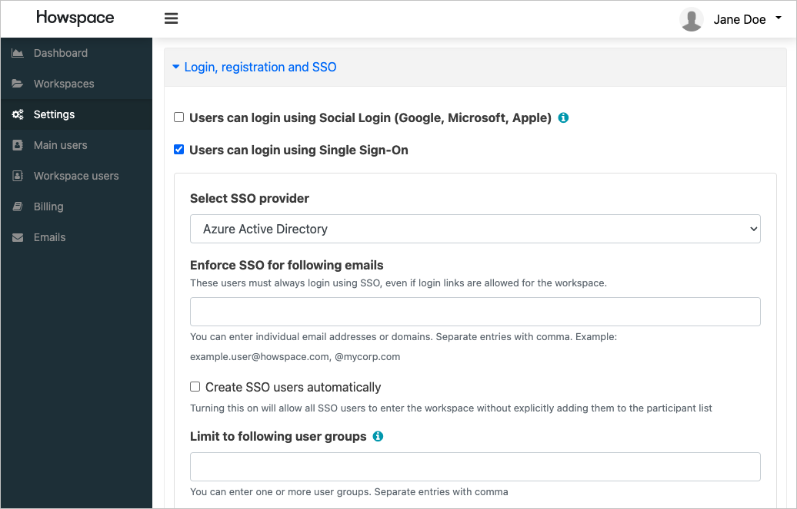

# Configure Howspace for automatic user provisioning with Microsoft Entra ID

This article describes the steps you need to perform in both Howspace and Microsoft Entra ID to configure automatic user provisioning. When configured, Microsoft Entra ID automatically provisions and deprovisions users and groups to [Howspace](https://www.howspace.com/) using the Microsoft Entra provisioning service. For important details on what this service does, how it works, and frequently asked questions, see [Automate user provisioning and deprovisioning to SaaS applications with Microsoft Entra ID](~/identity/app-provisioning/user-provisioning.md). 

## Supported capabilities
> [!div class="checklist"]
> * Create users in Howspace.
> * Remove users in Howspace when they don't require access anymore.
> * Keep user attributes synchronized between Microsoft Entra ID and Howspace.
> * Provision groups and group memberships in Howspace.
> * [Single sign-on](~/identity/enterprise-apps/add-application-portal-setup-oidc-sso.md) to Howspace (recommended).

## Prerequisites

The scenario outlined in this article assumes that you already have the following prerequisites:

* [A Microsoft Entra tenant](~/identity-platform/quickstart-create-new-tenant.md) 
* One of the following roles: [Application Administrator](/entra/identity/role-based-access-control/permissions-reference#application-administrator), [Cloud Application Administrator](/entra/identity/role-based-access-control/permissions-reference#cloud-application-administrator), or [Application Owner](/entra/fundamentals/users-default-permissions#owned-enterprise-applications).
* A Howspace subscription with single sign-on and SCIM features enabled.
* A user account in Howspace with Main User Dashboard privileges.

## Step 1: Plan your provisioning deployment
1. Learn about [how the provisioning service works](~/identity/app-provisioning/user-provisioning.md).
1. Determine who's in [scope for provisioning](~/identity/app-provisioning/define-conditional-rules-for-provisioning-user-accounts.md).
1. Determine what data to [map between Microsoft Entra ID and Howspace](~/identity/app-provisioning/customize-application-attributes.md).

## Step 2: Configure Howspace to support provisioning with Microsoft Entra ID
### Single sign-on configuration
1. Sign in to the Howspace Main User Dashboard, then select **Settings** from the menu.
1. In the settings list, select **single sign-on**.

   

1. Select the **Add SSO configuration** button.

   

1. Select either **Microsoft Entra ID (Multi-Tenant)** or **Microsoft Entra ID** based on your organization's Microsoft Entra topology.

   
   

1. Enter your Microsoft Entra tenant ID, and select **OK** to save the configuration.

### Provisioning configuration
1. In the settings list, select **System for Cross-domain Identity Management**.

   

1. Check the **Enable user synchronization** checkbox.
1. Copy the Tenant URL and Secret Token for later use in Microsoft Entra ID.
1. Select **Save** to save the configuration.

### Main user dashboard access control configuration
1. In the settings list, select **Main User Dashboard Access Control**

   

1. Check the **Enable single sign-on for main users** checkbox.
1. Select the SSO configuration you created in the previous step.
1. Enter the object IDs of the Microsoft Entra user groups that should have access to the Main User Dashboard to the **Limit to following user groups** field. You can specify multiple groups by separating the object IDs with a comma.
1. Select **Save** to save the configuration.

### Workspace default access control configuration
1. In the settings list, select **Workspace default settings**

   

1. In the Workspace default settings list, select **Login, registration and SSO**

   

1. Check the **Users can login using single sign-on** checkbox.
1. Select the SSO configuration you created in the previous step.
1. Enter the object IDs of the Microsoft Entra user groups that should have access to workspaces to the **Limit to following user groups** field. You can specify multiple groups by separating the object IDs with a comma.
1. You can modify the user groups for each workspace individually after creating the workspace.

## Step 3: Add Howspace from the Microsoft Entra application gallery

Add Howspace from the Microsoft Entra application gallery to start managing provisioning to Howspace. If you have previously setup Howspace for SSO, you can use the same application. However it's recommended that you create a separate app when testing out the integration initially. Learn more about adding an application from the gallery [here](~/identity/enterprise-apps/add-application-portal.md). 

## Step 4: Define who is in scope for provisioning 

[!INCLUDE [create-assign-users-provisioning.md](~/identity/saas-apps/includes/create-assign-users-provisioning.md)]

## Step 5: Configure automatic user provisioning to Howspace 

This section guides you through the steps to configure the Microsoft Entra provisioning service to create, update, and disable users and/or groups in TestApp based on user and/or group assignments in Microsoft Entra ID.

### To configure automatic user provisioning for Howspace in Microsoft Entra ID:

1. Sign in to the [Microsoft Entra admin center](https://entra.microsoft.com) as at least a [Cloud Application Administrator](~/identity/role-based-access-control/permissions-reference.md#cloud-application-administrator).
1. Browse to **Entra ID** > **Enterprise apps**

	

1. In the applications list, select **Howspace**.

	

1. Select the **Provisioning** tab.

	

1. Set the **Provisioning Mode** to **Automatic**.

	

1. Under the **Admin Credentials** section, input your Howspace Tenant URL and Secret Token. Select **Test Connection** to ensure Microsoft Entra ID can connect to Howspace. If the connection fails, ensure your Howspace account has Admin permissions and try again.

 	

1. In the **Notification Email** field, enter the email address of a person or group who should receive the provisioning error notifications and select the **Send an email notification when a failure occurs** check box.

	

1. Select **Save**.

1. Under the **Mappings** section, select **Synchronize Microsoft Entra users to Howspace**.

1. Review the user attributes that are synchronized from Microsoft Entra ID to Howspace in the **Attribute-Mapping** section. The attributes selected as **Matching** properties are used to match the user accounts in Howspace for update operations. If you choose to change the [matching target attribute](~/identity/app-provisioning/customize-application-attributes.md), you need to ensure that the Howspace API supports filtering users based on that attribute. Select the **Save** button to commit any changes.

   |Attribute|Type|Supported for filtering|Required by Howspace|
   |---|---|---|---|
   |userName|String|&check;|&check;|
   |active|Boolean|||
   |name.givenName|String|||
   |name.familyName|String|||
   |phoneNumbers[type eq "mobile"].value|String|||
   |externalId|String|||

1. Under the **Mappings** section, select **Synchronize Microsoft Entra groups to Howspace**.

1. Review the group attributes that are synchronized from Microsoft Entra ID to Howspace in the **Attribute-Mapping** section. The attributes selected as **Matching** properties are used to match the groups in Howspace for update operations. Select the **Save** button to commit any changes.

   |Attribute|Type|Supported for filtering|Required by Howspace|
   |---|---|---|---|
   |displayName|String|&check;|&check;|
   |externalId|String||&check;|
   |members|Reference|||
   
1. To configure scoping filters, refer to the following instructions provided in the [Scoping filter article](~/identity/app-provisioning/define-conditional-rules-for-provisioning-user-accounts.md).

1. To enable the Microsoft Entra provisioning service for Howspace, change the **Provisioning Status** to **On** in the **Settings** section.

	

1. Define the users and/or groups that you would like to provision to Howspace by choosing the desired values in **Scope** in the **Settings** section.

	

1. When you're ready to provision, select **Save**.

	

This operation starts the initial synchronization cycle of all users and groups defined in **Scope** in the **Settings** section. The initial cycle takes longer to perform than subsequent cycles, which occur approximately every 40 minutes as long as the Microsoft Entra provisioning service is running. 

## Step 6: Monitor your deployment

[!INCLUDE [monitor-deployment.md](~/identity/saas-apps/includes/monitor-deployment.md)]

## More resources

* [Managing user account provisioning for Enterprise Apps](~/identity/app-provisioning/configure-automatic-user-provisioning-portal.md)
* [What is application access and single sign-on with Microsoft Entra ID?](~/identity/enterprise-apps/what-is-single-sign-on.md)

## Related content

* [Learn how to review logs and get reports on provisioning activity](~/identity/app-provisioning/check-status-user-account-provisioning.md)
