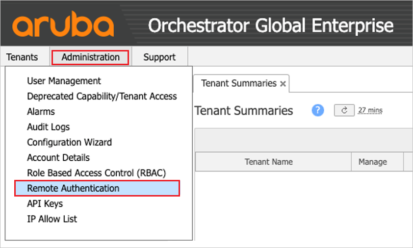
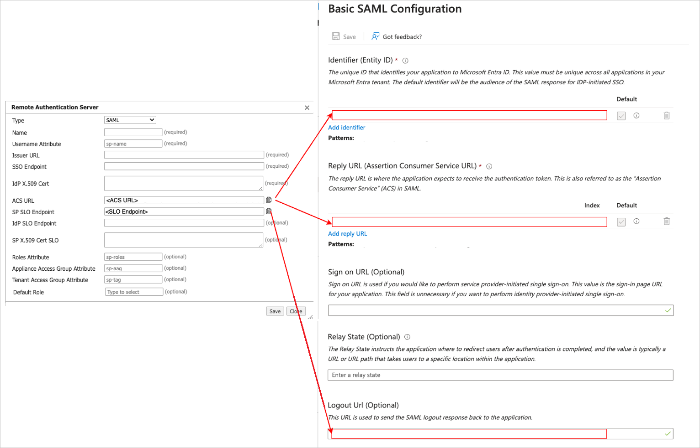
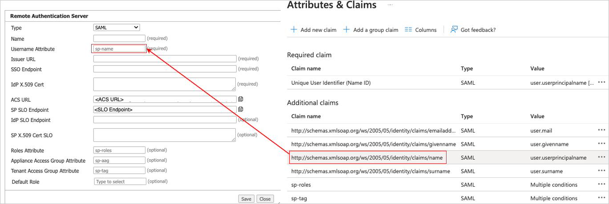
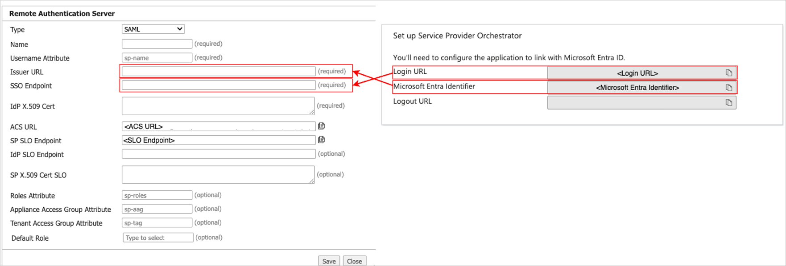

# Configure HPE Aruba Networking EdgeConnect Global Enterprise Orchestrator for Single sign-on with Microsoft Entra ID

In this article,  you learn how to integrate HPE Aruba Networking EdgeConnect Global Enterprise Orchestrator with Microsoft Entra ID. When you integrate HPE Aruba Networking EdgeConnect Global Enterprise Orchestrator with Microsoft Entra ID, you can:

* Control in Microsoft Entra ID who has access to HPE Aruba Networking EdgeConnect Global Enterprise Orchestrator.
* Enable your users to be automatically signed-in to HPE Aruba Networking EdgeConnect Global Enterprise Orchestrator with their Microsoft Entra accounts.
* Manage your accounts in one central location.

## Prerequisites

The scenario outlined in this article assumes that you already have the following prerequisites:

[!INCLUDE [common-prerequisites.md](~/identity/saas-apps/includes/common-prerequisites.md)]
* HPE Aruba Networking EdgeConnect Global Enterprise version:
    -	9.0.6 or newer.
    -	10.0.2 or newer.

## Scenario description

In this article,  you configure and test Microsoft Entra SSO in a test environment.

* HPE Aruba Networking EdgeConnect Global Enterprise Orchestrator supports **SP and IDP** initiated SSO.

## Add HPE Aruba Networking EdgeConnect Global Enterprise Orchestrator from the gallery

To configure the integration of HPE Aruba Networking EdgeConnect Global Enterprise Orchestrator into Microsoft Entra ID, you need to add HPE Aruba Networking EdgeConnect Global Enterprise Orchestrator from the gallery to your list of managed SaaS apps.

1. Sign in to the [Microsoft Entra admin center](https://entra.microsoft.com) as at least a [Cloud Application Administrator](~/identity/role-based-access-control/permissions-reference.md#cloud-application-administrator).
1. Browse to **Entra ID** > **Enterprise apps** > **New application**.
1. In the **Add from the gallery** section, type **HPE Aruba Networking EdgeConnect Global Enterprise Orchestrator** in the search box.
1. Select **HPE Aruba Networking EdgeConnect Global Enterprise Orchestrator** from results panel and then add the app. Wait a few seconds while the app is added to your tenant.

[!INCLUDE [sso-wizard.md](~/identity/saas-apps/includes/sso-wizard.md)]

## Configure and test Microsoft Entra SSO for HPE Aruba Networking EdgeConnect Global Enterprise Orchestrator

Configure and test Microsoft Entra SSO with HPE Aruba Networking EdgeConnect Global Enterprise Orchestrator using a test user called **B.Simon**. For SSO to work, you need to establish a link relationship between a Microsoft Entra user and the related user in HPE Aruba Networking EdgeConnect Global Enterprise Orchestrator.

To configure and test Microsoft Entra SSO with HPE Aruba Networking EdgeConnect Global Enterprise Orchestrator, perform the following steps:

1. **[Configure Microsoft Entra SSO](#configure-microsoft-entra-sso)** - This step will enable your users to use this feature.
1. **Create a Microsoft Entra test user** - This step allows you to test Microsoft Entra single sign-on with B.Simon.
1. **[Assign the Test user to the HPE Aruba Networking EdgeConnect Global Enterprise Orchestrator application](#assign-the-test-user-to-the-hpe-aruba-networking-edgeconnect-global-enterprise-orchestrator-application)** - This step allows you to enable B.Simon to use Microsoft Entra single sign-on on EdgeConnect Orchestrator.
1. **[Test SSO](#test-sso)** - to verify whether the configuration works.

## Configure Microsoft Entra SSO

Follow these steps to enable Microsoft Entra SSO in the Microsoft Entra admin center.

1. Sign in to the [Microsoft Entra admin center](https://entra.microsoft.com) as at least a [Cloud Application Administrator](~/identity/role-based-access-control/permissions-reference.md#cloud-application-administrator).
1. Browse to **Entra ID** > **Enterprise apps** > **HPE Aruba Networking EdgeConnect Global Enterprise Orchestrator** > **Single sign-on**.
1. On the **Select a single sign-on method** page, select **SAML**.
1. On the **Set up single sign-on with SAML** page, select the pencil icon for **Basic SAML Configuration** to edit the settings.

   

1. On the **Basic SAML Configuration** section, perform the following steps:

    a. Enter the values in **Identifier (Entity ID)** text box, **Reply URL (Assertion Consumer Service URL)** text box, and **Logout URL (Optional)** in the **Basic SAML Configuration** section. To find these values, first log in to Global Enterprise Orchestrator and navigate to the **Remote Authentication** dialog box **(Administration > Remote Authentication)**.

    

    b. In the **Remote Authentication** dialog, select **+Add New Server**.

    c. Select **SAML** from the **Type** field.

    d. In the **Name** field, enter a name for your SAML configuration.

    e. Select the copy icon next to the **ACS URL** field.

    f. Navigate back to **Basic SAML Configuration** section on **Microsoft Set up single sign-on with SAML** page and paste the values as shown in the image below:

    

    g. Select **Save** to close the **Basic SAML Configuration** section.

1. On the **Set up single sign-on with SAML** page, in the **Attributes & Claims** section, select the edit icon and copy the highlighted entry below, and paste the information into the **Username Attribute** field in Orchestrator as shown below:

    

1. On the **Set up single sign-on with SAML** page, in the **SAML Signing Certificate** section,  find **Certificate (Base64)** and select **Download** to download the certificate and save it on your computer.

	

1. Open the certificate using a text editor such as Notepad. Copy and paste the content of the certificate on the **IdP X.509 Cert** field in Orchestrator as shown below:

    

1. On the **Set up single sign-on with SAML** page, in the **Set up HPE Aruba Networking EdgeConnect Global Enterprise Orchestrator** section, copy the **Microsoft Entra Identifier** and paste it into the **Issuer URL** field. Copy the **Login URL** and paste it into the **SSO Endpoint** field:

    

1. On the **Remote Authentication Server** dialog, set the **Default role** field. Example: SuperAdmin. (This is the last item on the dropdown list.) The Default role is needed if you did not define Role Based Access Control (RBAC) in the roles attributes in the Attributes & Claims section.

1. Select **Save** on the Remote Authentication Server dialog.

1. You have successfully configured SAML SSO authentication on the Orchestrator. The next step is to create a test user and assign the Orchestrator application to that user to verify if SAML is configured successfully.

### Create a Microsoft Entra ID test user

In this section, you create a test user in the Microsoft Entra admin center called B.Simon.

1. Sign in to the [Microsoft Entra admin center](https://entra.microsoft.com) as at least a [User Administrator](~/identity/role-based-access-control/permissions-reference.md#user-administrator).
1. Browse to **Entra ID** > **Users**.
1. Select **New user** > **Create new user**, at the top of the screen.
1. In the **User** properties, follow these steps:
   1. In the **Display name** field, enter `B.Simon`.  
   1. In the **User principal name** field, enter the username@companydomain.extension. For example, `B.Simon@contoso.com`.
   1. Select the **Show password** check box, and then write down the value that's displayed in the **Password** box.
   1. Select **Review + create**.
1. Select **Create**.

### Assign the Test user to the HPE Aruba Networking EdgeConnect Global Enterprise Orchestrator application

In this section, you enable B.Simon to use Microsoft Entra single sign-on by granting access to HPE Aruba Networking EdgeConnect Global Enterprise Orchestrator.

1.	Sign in to the [Microsoft Entra admin center](https://entra.microsoft.com) as at least a [Cloud Application Administrator](~/identity/role-based-access-control/permissions-reference.md#cloud-application-administrator).
2.	Browse to **Entra ID** > **Enterprise apps** > **HPE Aruba Networking EdgeConnect Global Enterprise Orchestrator**.
3.	In the app's overview page, select **Users and groups**.
4.	Select **Add user/group**, then select **Users and groups** in the **Add Assignment** dialog.

    a. In the **Users and groups** dialog, select **B.Simon** from the Users list, then select the **Select** button at the bottom of the screen.

    b. If you're expecting a role to be assigned to the users, you can select it from the **Select a role** dropdown. If no role has been set up for this app, you see "Default Access" role selected.

    c. In the **Add Assignment** dialog, select the **Assign** button.

## Test SSO 

In this section, you test your Microsoft Entra single sign-on configuration with following options.
 
#### SP initiated:
 
* Select **Test this application** in Microsoft Entra admin center. this option redirects to HPE Aruba Networking EdgeConnect Global Enterprise Orchestrator Sign on URL where you can initiate the login flow.  
 
* Go to HPE Aruba Networking EdgeConnect Global Enterprise Orchestrator Sign-on URL directly and initiate the login flow from there.
 
#### IDP initiated:
 
* Select **Test this application** in Microsoft Entra admin center and you should be automatically signed in to the HPE Aruba Networking EdgeConnect Global Enterprise Orchestrator for which you set up the SSO.
 
You can also use Microsoft My Apps to test the application in any mode. When you select the HPE Aruba Networking EdgeConnect Global Enterprise Orchestrator tile in the My Apps, if configured in SP mode you would be redirected to the application sign-on page for initiating the login flow and if configured in IDP mode, you should be automatically signed in to the HPE Aruba Networking EdgeConnect Global Enterprise Orchestrator for which you set up the SSO. For more information about the My Apps, see [Introduction to the My Apps](https://support.microsoft.com/account-billing/sign-in-and-start-apps-from-the-my-apps-portal-2f3b1bae-0e5a-4a86-a33e-876fbd2a4510).

## Related content

Once you configure HPE Aruba Networking EdgeConnect Global Enterprise Orchestrator you can enforce session control, which protects exfiltration and infiltration of your organization's sensitive data in real time. Session control extends from Conditional Access. [Learn how to enforce session control with Microsoft Defender for Cloud Apps](/cloud-app-security/proxy-deployment-any-app).