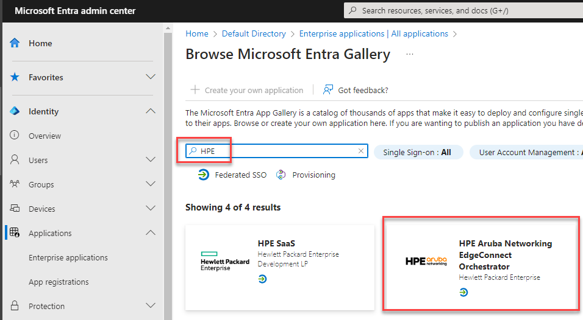
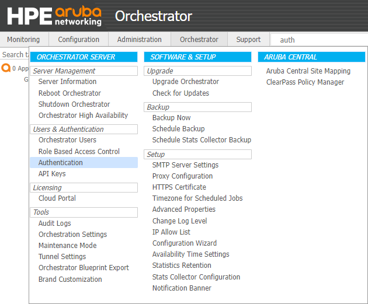

# Microsoft Entra SSO integration with HPE Aruba Networking EdgeConnect Orchestrator

In this tutorial, you'll learn how to integrate HPE Aruba Networking EdgeConnect Orchestrator with Microsoft Entra ID. When you integrate HPE Aruba Networking EdgeConnect Orchestrator with Microsoft Entra ID, you can:

* Control in Microsoft Entra ID who has access to HPE Aruba Networking EdgeConnect Orchestrator.
* Enable your users to be automatically signed-in to HPE Aruba Networking EdgeConnect Orchestrator with their Microsoft Entra accounts.
* Manage your accounts in one central location.

## Prerequisites

To integrate Microsoft Entra ID with HPE Aruba Networking EdgeConnect Orchestrator, you need:

* A Microsoft Entra subscription. If you don't have a subscription, you can get a [free account](https://azure.microsoft.com/free/).
* HPE Aruba Networking EdgeConnect Orchestrator version 9.4.1 or newer.

## Scenario description

In this tutorial, you configure and test Microsoft Entra SSO in a test environment.

* HPE Aruba Networking EdgeConnect Orchestrator supports both **SP and IDP** initiated SSO.

## Add HPE Aruba Networking EdgeConnect Orchestrator from the gallery

To configure the integration of HPE Aruba Networking EdgeConnect Orchestrator into Microsoft Entra ID, you need to add HPE Aruba Networking EdgeConnect Orchestrator from the gallery to your list of managed SaaS apps.

1. Sign in to the [Microsoft Entra admin center](https://entra.microsoft.com) as at least a [Cloud Application Administrator](~/identity/role-based-access-control/permissions-reference.md#cloud-application-administrator).
1. Browse to **Identity** > **Applications** > **Enterprise applications** > **New application**.
1. In the **Add from the gallery** section, type **HPE Aruba Networking EdgeConnect Orchestrator** in the search box.
1. Select **HPE Aruba Networking EdgeConnect Orchestrator** tile from results panel. Enter a **name**, and click **Create** to add the app. Wait a few seconds while the app is added to your tenant.

   

Alternatively, you can also use the [Enterprise App Configuration Wizard](https://portal.office.com/AdminPortal/home?Q=Docs#/azureadappintegration). In this wizard, you can add an application to your tenant, add users/groups to the app, assign roles, and walk through the SSO configuration as well. [Learn more about Microsoft 365 wizards.](/microsoft-365/admin/misc/azure-ad-setup-guides)

## Configure and test Microsoft Entra SSO for HPE Aruba Networking EdgeConnect Orchestrator

Configure and test Microsoft Entra SSO with HPE Aruba Networking EdgeConnect Orchestrator using a test user called **B.Simon**. For SSO to work, you need to establish a link relationship between a Microsoft Entra user and the related user in HPE Aruba Networking EdgeConnect Orchestrator.

To configure and test Microsoft Entra SSO with HPE Aruba Networking EdgeConnect Orchestrator, perform the following steps:

1. **[Configure Microsoft Entra SSO](#configure-microsoft-entra-sso)** - This step will enable your users to use this feature.
1. **[Create a Microsoft Entra ID test user](#create-a-microsoft-entra-id-test-user)** - This step allows you to test Microsoft Entra single sign-on with B.Simon.
1. **[Assign the Test user to the HPE Aruba Networking EdgeConnect Orchestrator application](#assign-the-test-user-to-the-hpe-aruba-networking-edgeconnect-orchestrator-application)** - This step allows you to enable B.Simon to use Microsoft Entra single sign-on on EdgeConnect Orchestrator
1. **[Test SSO](#test-sso)** - to verify whether the configuration works.

## Configure Microsoft Entra SSO

Follow these steps to enable Microsoft Entra SSO in the Microsoft Entra admin center.

1. Sign in to the [Microsoft Entra admin center](https://entra.microsoft.com) as at least a [Cloud Application Administrator](~/identity/role-based-access-control/permissions-reference.md#cloud-application-administrator).
1. Browse to **Identity** > **Applications** > **Enterprise applications**. In the search bar, type the name of the **HPE Aruba Networking EdgeConnect Orchestrator** app you created earlier. The **Overview** page opens.
1. In the left pane, under **Manage**, click **Single sign-on**.
1. On the **Select a single sign-on method** page, select **SAML**.
1. On the **Set up single sign-on with SAML** page, click the pencil icon for **Basic SAML Configuration** to edit the settings.

   

1. On the **Basic SAML Configuration** section, perform the following steps:

   a. You must enter the values of **Identifier (Entity ID)** text box, **Reply URL (Assertion Consumer Service URL)** text box, and Logout Url (Optional) values. To find these values, first, **log in to Orchestrator** and navigate to the **Authentication** dialog box **(Orchestrator > Users & Authentication > Authentication)**.

   

   b. In the **Authentication** dialog, click **+Add New Server**.

   c. Select **SAML** from the **Type** field.

   d. In the **Name** field, enter a name for your SAML configuration.

   e. Click the copy icon next to the **ACS URL** field.

   f. Go to the **Basic SAML Configuration** section on Microsoft **Set up single sign-on with SAML** page:

 	1. Under **Identifier (Entity ID)**, click **Add identifier** link. Paste the ACS URL value on the Identifier field.

         > [!Note]
         > 1. Use below pattern if you are configuring SAML SSO on any of the following three Orchestrator products: "HPE Aruba Networking EdgeConnect Cloud Orchestrator", "HPE Aruba Networking EdgeConnect Service Provider Orchestrator" and "HPE Aruba Networking EdgeConnect Global Enterprise Orchestrator"- `https://<SUBDOMAIN>.silverpeak.cloud/gms/rest/authentication/saml2/consume`.
         > 1.  Use below pattern if you are configuring SAML SSO on a self-deployed HPE Aruba Networking EdgeConnect Orchestrator (whether it's deployed on-premises or in a public cloud environment such as Microsoft Entra)- `https://<PUBLIC-IP-ADDRESS-OF-ORCHESTRATOR>/gms/rest/authentication/saml2/consume`.

	2. Under **Reply URL (Assertion Consumer Service URL)**, click **Add reply URL link**. Paste the same ACS URL value on the Reply URL field.

         > [!Note]
         > 1. Use below pattern if you are configuring SAML SSO on any of the following three Orchestrator products: "HPE Aruba Networking EdgeConnect Cloud Orchestrator", "HPE Aruba Networking EdgeConnect Service Provider Orchestrator" and "HPE Aruba Networking EdgeConnect Global Enterprise Orchestrator"- `https://<SUBDOMAIN>.silverpeak.cloud/gms/rest/authentication/saml2/consume`.
         > 1. Use below pattern if you are configuring SAML SSO on a self-deployed HPE Aruba Networking EdgeConnect Orchestrator (whether it's deployed on-premises or in a public cloud environment such as Microsoft Entra)- `https://<PUBLIC-IP-ADDRESS-OF-ORCHESTRATOR>/gms/rest/authentication/saml2/consume`.

	3. Under **Logout URL (Optional)**, paste the **EdgeConnect SLO Endpoint** value from the Orchestrator’s Remote Authentication Server page as shown on the image below:

	> [!NOTE]
	> On self-hosted Orchestrators, if the Orchestrator is displaying the private IP address on the ACS URL field and the EdgeConnect SLO Endpoint field, please update it with the public IP address of the Orchestrator. As shown on the screenshot below, all five fields must contain the public IP address of the Orchestrator (not the private IP).

	

    g. Click **Save** to close the **Basic SAML Configuration** section

1. On the **Set up single sign-on with SAML** page, in the **Attributes & Claims** section, click the edit icon and copy the highlighted entry below, and paste the information into the **Username Attribute** field in Orchestrator as shown below:

    

1. On the **Set up single sign-on with SAML** page, in the **SAML Signing Certificate** section, find **Certificate (Base64)** and select **Download** to download the certificate:

	

1. Open the certificate using a text editor such as Notepad. Copy and paste the content of the certificate on the **IdP X.509 Cert** field in Orchestrator as shown below:

    

1. On the **Set up single sign-on with SAML** page, in the **Set up HPE Aruba Networking EdgeConnect Orchestrator** section, copy the **Microsoft Entra Identifier** and paste it into the **Issuer URL** field in Orchestrator:

	

1. Click the Properties tab and copy the **User access URL** and paste it into the **SSO Endpoint** field in Orchestrator as shown below: 

	

1. On the Orchestrator Remote Authentication Server dialog, set the **Default role** field. Example: SuperAdmin. (This is the last item on the dropdown list.) The Default role is needed if you did not define Role Based Access Control (RBAC) in the user attributes in the Attributes & Claims section.

1. Click **Save** on the Remote Authentication Server dialog.

1. You have successfully configured SAML SSO authentication on the Orchestrator. The next step is to create a test user and assign the Orchestrator application to that user to verify if SAML is configured successfully.

### Create a Microsoft Entra ID test user

In this section, you'll create a test user in the Microsoft Entra admin center called B.Simon.

1. Sign in to the [Microsoft Entra admin center](https://entra.microsoft.com) as at least a [User Administrator](~/identity/role-based-access-control/permissions-reference.md#user-administrator).
1. Browse to **Identity** > **Users** > **All users**.
1. Select **New user** > **Create new user**, at the top of the screen.
1. In the **User** properties, follow these steps:
   1. In the **Display name** field, enter `B.Simon`.  
   1. In the **User principal name** field, enter the username@companydomain.extension. For example, `B.Simon@contoso.com`.
   1. Select the **Show password** check box, and then write down the value that's displayed in the **Password** box.
   1. Select **Review + create**.
1. Select **Create**.

### Assign the Test user to the HPE Aruba Networking EdgeConnect Orchestrator application

In this section, you'll enable B.Simon to use Microsoft Entra single sign-on by granting access to HPE Aruba Networking EdgeConnect Orchestrator.

1. Sign in to the [Microsoft Entra admin center](https://entra.microsoft.com) as at least a [Cloud Application Administrator](~/identity/role-based-access-control/permissions-reference.md#cloud-application-administrator).
1. Browse to **Identity** > **Applications** > **Enterprise applications** > **HPE Aruba Networking EdgeConnect Orchestrator**.
1. In the app's overview page, select **Users and groups**.
1. Select **Add user/group**, then select **Users and groups** in the **Add Assignment** dialog.
   1. In the **Users and groups** dialog, select **B.Simon** from the Users list, then click the **Select** button at the bottom of the screen.
   1. If you are expecting a role to be assigned to the users, you can select it from the **Select a role** dropdown. If no role has been set up for this app, you see "Default Access" role selected.
   1. In the **Add Assignment** dialog, click the **Assign** button.

## Test SSO 

In this section, you test your Microsoft Entra single sign-on configuration with following options.
 
#### SP initiated:
 
* Click on **Test this application** in Microsoft Entra admin center. This will redirect to HPE Aruba Networking EdgeConnect Orchestrator Sign on URL where you can initiate the login flow.  
 
* Go to HPE Aruba Networking EdgeConnect Orchestrator Sign on URL directly and initiate the login flow from there.
 
#### IDP initiated:
 
* Click on **Test this application** in Microsoft Entra admin center and you should be automatically signed in to the HPE Aruba Networking EdgeConnect Orchestrator for which you set up the SSO.
 
You can also use Microsoft My Apps to test the application in any mode. When you click the HPE Aruba Networking EdgeConnect Orchestrator tile in the My Apps, if configured in SP mode you would be redirected to the application sign-on page for initiating the login flow and if configured in IDP mode, you should be automatically signed in to the HPE Aruba Networking EdgeConnect Orchestrator for which you set up the SSO. For more information about the My Apps, see [Introduction to the My Apps](https://support.microsoft.com/account-billing/sign-in-and-start-apps-from-the-my-apps-portal-2f3b1bae-0e5a-4a86-a33e-876fbd2a4510).

## Next steps

Once you configure HPE Aruba Networking EdgeConnect Orchestrator you can enforce session control, which protects exfiltration and infiltration of your organization's sensitive data in real time. Session control extends from Conditional Access. [Learn how to enforce session control with Microsoft Defender for Cloud Apps](/cloud-app-security/proxy-deployment-any-app).