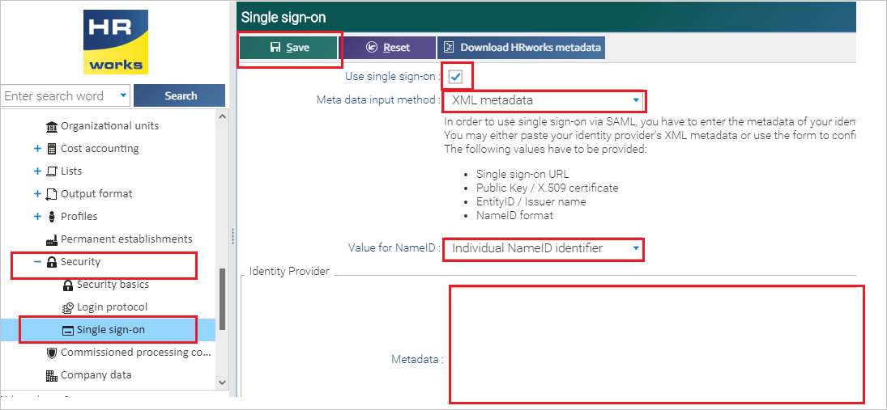
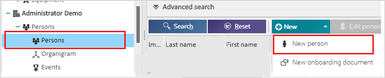
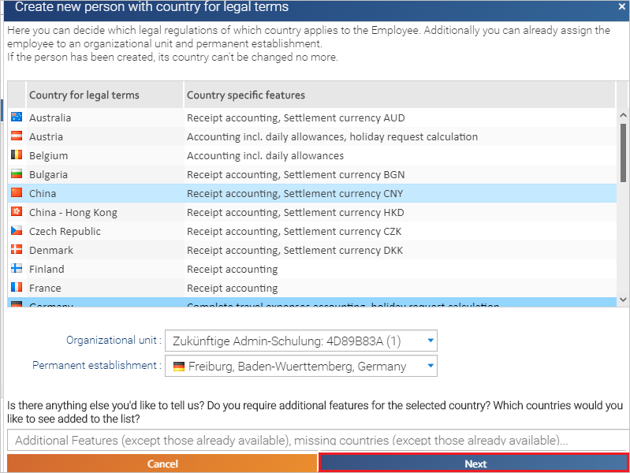
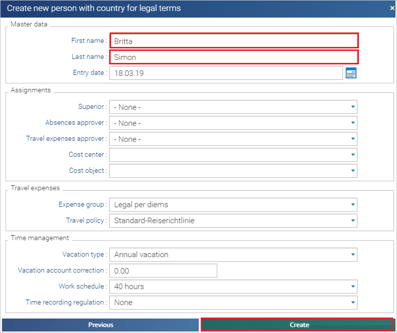

# Configure HRworks Single Sign-On for Single sign-on with Microsoft Entra ID

In this article,  you learn how to integrate HRworks Single Sign-On with Microsoft Entra ID. When you integrate HRworks Single Sign-On with Microsoft Entra ID, you can:

* Control in Microsoft Entra ID who has access to HRworks Single Sign-On.
* Enable your users to be automatically signed-in to HRworks Single Sign-On with their Microsoft Entra accounts.
* Manage your accounts in one central location.

## Prerequisites

The scenario outlined in this article assumes that you already have the following prerequisites:

[!INCLUDE [common-prerequisites.md](~/identity/saas-apps/includes/common-prerequisites.md)]
* HRworks Single Sign-On single sign-on (SSO) enabled subscription.

## Scenario description

In this article,  you configure and test Microsoft Entra SSO in a test environment.

* HRworks Single Sign-On supports **SP** initiated SSO.

> [!NOTE]
> Identifier of this application is a fixed string value so only one instance can be configured in one tenant.

## Add HRworks Single Sign-On from the gallery

To configure the integration of HRworks Single Sign-On into Microsoft Entra ID, you need to add HRworks Single Sign-On from the gallery to your list of managed SaaS apps.

1. Sign in to the [Microsoft Entra admin center](https://entra.microsoft.com) as at least a [Cloud Application Administrator](~/identity/role-based-access-control/permissions-reference.md#cloud-application-administrator).
1. Browse to **Entra ID** > **Enterprise apps** > **New application**.
1. In the **Add from the gallery** section, type **HRworks Single Sign-On** in the search box.
1. Select **HRworks Single Sign-On** from results panel and then add the app. Wait a few seconds while the app is added to your tenant.

 [!INCLUDE [sso-wizard.md](~/identity/saas-apps/includes/sso-wizard.md)]

## Configure and test Microsoft Entra SSO for HRworks Single Sign-On

Configure and test Microsoft Entra SSO with HRworks Single Sign-On using a test user called **B.Simon**. For SSO to work, you need to establish a link relationship between a Microsoft Entra user and the related user in HRworks Single Sign-On.

To configure and test Microsoft Entra SSO with HRworks Single Sign-On, perform the following steps:

1. **[Configure Microsoft Entra SSO](#configure-azure-ad-sso)** - to enable your users to use this feature.
    1. **Create a Microsoft Entra test user** - to test Microsoft Entra single sign-on with B.Simon.
    1. **Assign the Microsoft Entra test user** - to enable B.Simon to use Microsoft Entra single sign-on.
1. **[Configure HRworks Single Sign-On SSO](#configure-hrworks-single-sign-on-sso)** - to configure the single sign-on settings on application side.
    1. **[Create HRworks Single Sign-On test user](#create-hrworks-single-sign-on-test-user)** - to have a counterpart of B.Simon in HRworks Single Sign-On that's linked to the Microsoft Entra representation of user.
1. **[Test SSO](#test-sso)** - to verify whether the configuration works.

## Configure Microsoft Entra SSO

Follow these steps to enable Microsoft Entra SSO.

1. Sign in to the [Microsoft Entra admin center](https://entra.microsoft.com) as at least a [Cloud Application Administrator](~/identity/role-based-access-control/permissions-reference.md#cloud-application-administrator).
1. Browse to **Entra ID** > **Enterprise apps** > **HRworks Single Sign-On** > **Single sign-on**.
1. On the **Select a single sign-on method** page, select **SAML**.
1. On the **Set up single sign-on with SAML** page, select the pencil icon for **Basic SAML Configuration** to edit the settings.

   

1. On the **Basic SAML Configuration** section, perform the following step:

    In the **Sign-on URL** text box, type a URL using the following pattern:
    `https://login.hrworks.de/?companyId=<COMPANY_ID>&directssologin=true`

	> [!NOTE]
	> The value isn't real. Update the value with the actual Sign-On URL. See [HRworks Single Sign-On Help center article](https://help.hrworks.de/en/single-sign-on) to get the value. You can also refer to the patterns shown in the **Basic SAML Configuration** section.

1. On the **Set up single sign-on with SAML** page, in the **SAML Signing Certificate** section,  find **Federation Metadata XML** and select **Download** to download the certificate and save it on your computer.

	

1. On the **Set up HRworks Single Sign-On** section, copy the appropriate URL(s) based on your requirement.

	

[!INCLUDE [create-assign-users-sso.md](~/identity/saas-apps/includes/create-assign-users-sso.md)]

## Configure HRworks Single Sign-On SSO

1. In a different web browser window, sign in to your HRworks Single Sign-On company site as an administrator

1. Select **Administrator** > **Basics** > **Security** > **Single Sign-on** from the left side of menu bar and perform the following steps:

    

	a. Check the **Use Single Sign-on** box.

	b. Select **XML Metadata** as **Meta data input method**.

	c. Select **Individual NameID identifier** as **Value for NameID**.

	d. In Notepad, open the Metadata XML that you downloaded, copy its content, and then paste it into the **Metadata** textbox.

	e. Select **Save**.

### Create HRworks Single Sign-On test user

To enable Microsoft Entra users, sign in to HRworks Single Sign-On, they must be provisioned into HRworks Single Sign-On. In HRworks Single Sign-On, provisioning is a manual task.

**To provision a user account, perform the following steps:**

1. Sign in to HRworks Single Sign-On as an Administrator.

1. Select **Administrator** > **Persons** > **Persons** > **New person** from the left side of menu bar.

	 

1. On the Pop-up, select **Next**.

	

1. On the **Create new person with country for legal terms** pop-up, fill the respective details like **First name**, **Last name** and select **Create**.

	

## Test SSO

In this section, you test your Microsoft Entra single sign-on configuration with following options. 

* Select **Test this application**, this link redirects to HRworks Single Sign-On sign-in URL where you can initiate the sign-in flow. 

* Go to HRworks Single Sign-On sign-in URL directly and initiate the sign-in flow from there.

* You can use Microsoft My Apps. When you select the HRworks Single Sign-On tile in the My Apps, this option redirects to HRworks Single Sign-On sign-in URL. For more information about the My Apps, see [Introduction to the My Apps](https://support.microsoft.com/account-billing/sign-in-and-start-apps-from-the-my-apps-portal-2f3b1bae-0e5a-4a86-a33e-876fbd2a4510).

## Related content

Once you configure HRworks Single Sign-On you can enforce session control, which protects exfiltration and infiltration of your organization’s sensitive data in real time. Session control extends from Conditional Access. [Learn how to enforce session control with Microsoft Defender for Cloud Apps](/cloud-app-security/proxy-deployment-aad).
