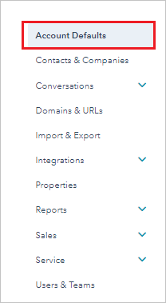
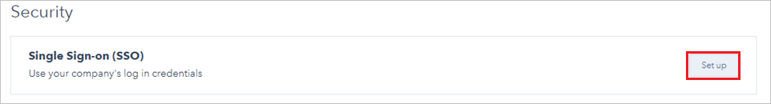
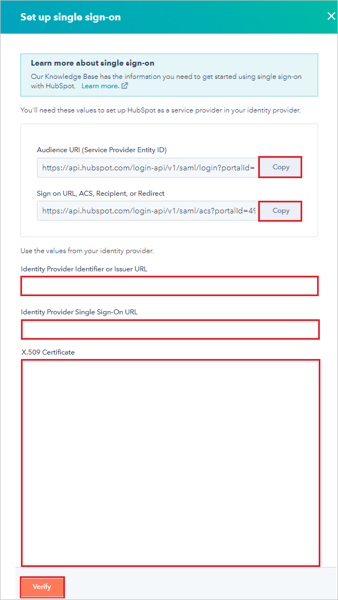
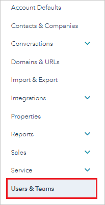
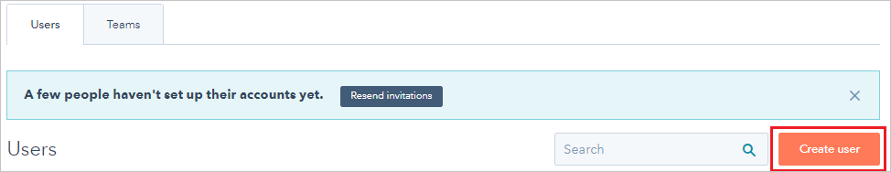
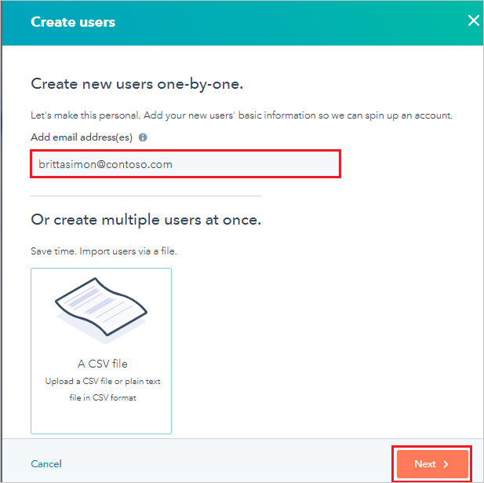
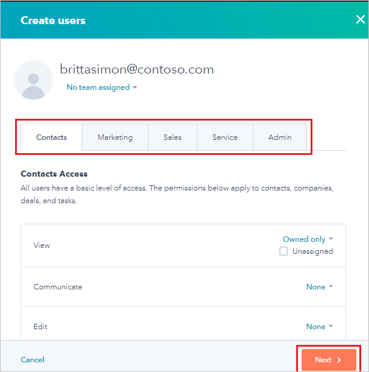
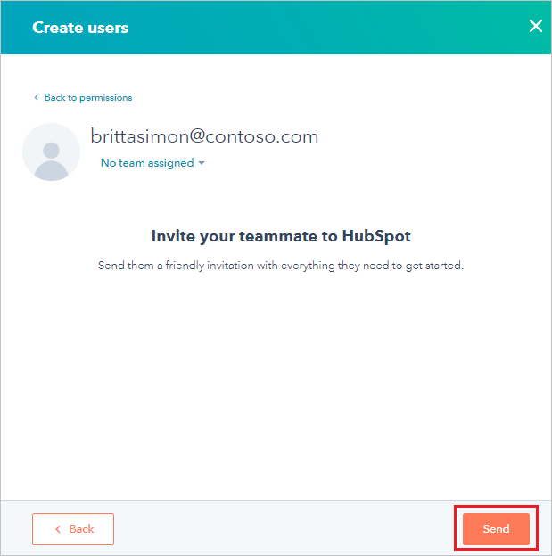

# Configure HubSpot for Single sign-on with Microsoft Entra ID

In this article,  you learn how to integrate HubSpot with Microsoft Entra ID. When you integrate HubSpot with Microsoft Entra ID, you can:

* Control in Microsoft Entra ID who has access to HubSpot.
* Enable your users to be automatically signed-in to HubSpot with their Microsoft Entra accounts.
* Manage your accounts in one central location.

## Prerequisites

The scenario outlined in this article assumes that you already have the following prerequisites:

[!INCLUDE [common-prerequisites.md](~/identity/saas-apps/includes/common-prerequisites.md)]
* A HubSpot subscription with single sign-on enabled.

## Scenario description

In this article,  you configure and test Microsoft Entra single sign-on in a test environment and integrate HubSpot with Microsoft Entra ID.

HubSpot supports the following features:

* **SP-initiated single sign-on**.
* **IDP-initiated single sign-on**.

## Add HubSpot from the gallery

To configure the integration of HubSpot into Microsoft Entra ID, you need to add HubSpot from the gallery to your list of managed SaaS apps.

1. Sign in to the [Microsoft Entra admin center](https://entra.microsoft.com) as at least a [Cloud Application Administrator](~/identity/role-based-access-control/permissions-reference.md#cloud-application-administrator).
1. Browse to **Entra ID** > **Enterprise apps** > **New application**.
1. In the **Add from the gallery** section, type **HubSpot** in the search box.
1. Select **HubSpot** from results panel and then add the app. Wait a few seconds while the app is added to your tenant.

 [!INCLUDE [sso-wizard.md](~/identity/saas-apps/includes/sso-wizard.md)]

## Configure and test Microsoft Entra SSO for HubSpot

Configure and test Microsoft Entra SSO with HubSpot using a test user called **B.Simon**. For SSO to work, you need to establish a link relationship between a Microsoft Entra user and the related user in HubSpot.

To configure and test Microsoft Entra SSO with HubSpot, perform the following steps:

1. **[Configure Microsoft Entra SSO](#configure-azure-ad-sso)** - to enable your users to use this feature.
    1. **Create a Microsoft Entra test user** - to test Microsoft Entra single sign-on with B.Simon.
    1. **Assign the Microsoft Entra test user** - to enable B.Simon to use Microsoft Entra single sign-on.
1. **[Configure HubSpot SSO](#configure-hubspot-sso)** - to configure the single sign-on settings on application side.
    1. **[Create HubSpot test user](#create-hubspot-test-user)** - to have a counterpart of B.Simon in HubSpot that's linked to the Microsoft Entra representation of user.
1. **[Test SSO](#test-sso)** - to verify whether the configuration works.

## Configure Microsoft Entra SSO

1. Sign in to the [Microsoft Entra admin center](https://entra.microsoft.com) as at least a [Cloud Application Administrator](~/identity/role-based-access-control/permissions-reference.md#cloud-application-administrator).
1. Browse to **Entra ID** > **Enterprise apps** > **HubSpot** application integration page, find the **Manage** section and select **Single sign-on**.
1. On the **Select a Single sign-on method** page, select **SAML**.
1. On the **Set up Single Sign-On with SAML** page, select the pencil icon for **Basic SAML Configuration** to edit the settings.

   

1. In the **Basic SAML Configuration** pane, to configure **IDP-initiated mode**, perform the following steps:

    1. In the **Identifier** box, enter a URL that has the following pattern: https:\//api.hubspot.com/login-api/v1/saml/login?portalId=\<CUSTOMER ID\>.

    1. In the **Reply URL** box, enter a URL that has the following pattern: https:\//api.hubspot.com/login-api/v1/saml/acs?portalId=\<CUSTOMER ID\>.

    > [!NOTE]
	> To format the URLs, you can also refer to the patterns shown in the **Basic SAML Configuration** pane.

1. To configure the application in *SP-initiated* mode:

    1. Select **Set additional URLs**.

	1. In the **Sign on URL** box, enter **https:\//app.hubspot.com/login**.

1. In the **Set up Single Sign-On with SAML** pane, in the **SAML Signing Certificate** section, select **Download** next to **Certificate (Base64)**. Select a download option based on your requirements. Save the certificate on your computer.

	

1. In the **Set up HubSpot** section, copy the following URLs based on your requirements:

	

[!INCLUDE [create-assign-users-sso.md](~/identity/saas-apps/includes/create-assign-users-sso.md)]

## Configure HubSpot SSO

1. Open a new tab in your browser and sign in to your HubSpot administrator account.

1. Select the **Settings** icon in the upper-right corner of the page.

	

1. Select **Account Defaults**.

	

1. Scroll down to the **Security** section, and then select **Set up**.

	

1. In the **Set up single sign-on** section, perform the following steps:

	1. In the **Audience URl (Service Provider Entity ID)** box, select **Copy** to copy the value. In the Azure portal, in the **Basic SAML Configuration** pane, paste the value in the **Identifier** box.

	1. In the **Sign on URL, ACS, Recipient, or Redirect** box, select **Copy** to copy the value. In the Azure portal, in the **Basic SAML Configuration** pane, paste the value in the **Reply URL** box.

	1. In HubSpot, in the **Identity Provider Identifier or Issuer URL** box, paste the value for **Microsoft Entra Identifier** that you copied.

	1. In HubSpot, in the **Identity Provider Single Sign-On URL** box, paste the value for **Login URL** that you copied.

	1. In Windows Notepad, open the **Certificate(Base64)** file that you downloaded. Select and copy the contents of the file. Then, in HubSpot, paste it in the **X.509 Certificate** box.

	1. Select **Verify**.

		

### Create HubSpot test user

To enable Microsoft Entra ID a user to sign in to HubSpot, the user must be provisioned in HubSpot. In HubSpot, provisioning is a manual task.

To provision a user account in HubSpot:

1. Sign in to your HubSpot company site as administrator.

1. Select the **Settings** icon in the upper-right corner of the page.

	

1. Select **Users & Teams**.

	

1. Select **Create user**.

	

1. In the **Add email address(es)** box, enter the email address of the user in the format brittasimon\@contoso.com, and then select **Next**.

	

1. In the **Create users** section, select each tab. On each tab, set the relevant options and permissions for the user. Then, select **Next**.

	

1. To send the invitation to the user, select **Send**.

	

	> [!NOTE]
	> The user is activated after the user accepts the invitation.

## Test SSO

In this section, you test your Microsoft Entra single sign-on configuration with following options. 

#### SP initiated:

* Select **Test this application**, this option redirects to HubSpot Sign on URL where you can initiate the login flow.  

* Go to HubSpot Sign-on URL directly and initiate the login flow from there.

#### IDP initiated:

* Select **Test this application**, and you should be automatically signed in to the HubSpot for which you set up the SSO. 

You can also use Microsoft My Apps to test the application in any mode. When you select the HubSpot tile in the My Apps, if configured in SP mode you would be redirected to the application sign on page for initiating the login flow and if configured in IDP mode, you should be automatically signed in to the HubSpot for which you set up the SSO. For more information about the My Apps, see [Introduction to the My Apps](https://support.microsoft.com/account-billing/sign-in-and-start-apps-from-the-my-apps-portal-2f3b1bae-0e5a-4a86-a33e-876fbd2a4510).

## Related content

Once you configure HubSpot you can enforce Session control, which protects exfiltration and infiltration of your organization’s sensitive data in real time. Session control extends from Conditional Access. [Learn how to enforce session control with Microsoft Defender for Cloud Apps](/cloud-app-security/proxy-deployment-aad).
