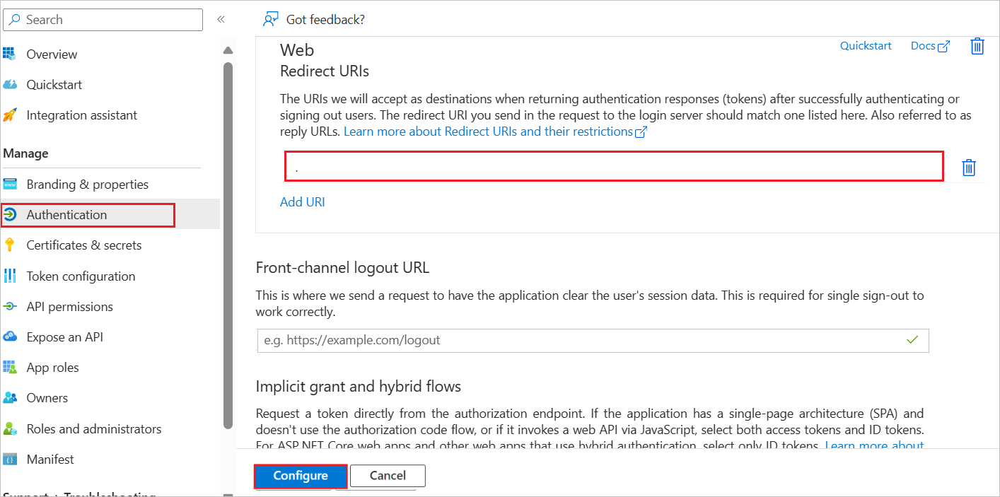

# Configure IBM Storage Virtualize for Single sign-on with Microsoft Entra ID

In this article,  you learn how to integrate IBM Storage Virtualize with Microsoft Entra ID. When you integrate IBM Storage Virtualize with Microsoft Entra ID, you can:

Use Microsoft Entra ID to control who can access IBM Storage Virtualize.
Enable your users to be automatically signed in to IBM Storage Virtualize with their Microsoft Entra accounts.
Manage your accounts in one central location: the Azure portal.

## Prerequisites

The scenario outlined in this article assumes that you already have the following prerequisites:

[!INCLUDE [common-prerequisites.md](~/identity/saas-apps/includes/common-prerequisites.md)]
* IBM Storage Virtualize single sign-on (SSO) enabled subscription.

## Add IBM Storage Virtualize from the gallery

To configure the integration of IBM Storage Virtualize into Microsoft Entra ID, you need to add IBM Storage Virtualize from the gallery to your list of managed SaaS apps.

1. Sign in to the [Microsoft Entra admin center](https://entra.microsoft.com) as at least a [Cloud Application Administrator](~/identity/role-based-access-control/permissions-reference.md#cloud-application-administrator).

1. Browse to **Entra ID** > **Enterprise apps** > **New application**.

1. In the **Add from the gallery** section, enter **IBM Storage Virtualize** in the search box.

1. Select **IBM Storage Virtualize** in the results panel and then add the app. Wait a few seconds while the app is added to your tenant.

## Configure Microsoft Entra SSO

Follow these steps to enable Microsoft Entra SSO in the Microsoft Entra admin center.

1. Sign in to the [Microsoft Entra admin center](https://entra.microsoft.com) as at least a [Cloud Application Administrator](~/identity/role-based-access-control/permissions-reference.md#cloud-application-administrator).

1. Browse to **Entra ID** > **Enterprise apps** > **IBM Storage Virtualize** > **Single sign-on**.

1. Perform the following steps in the below section:

    1. Select **Go to application**.

        

    1. Copy **Application (client) ID** and use it later in the IBM Storage Virtualize side configuration.

        
        
1. Navigate to **Authentication** tab on the left menu and perform the following steps:

    1. In the **Redirect URIs** textbox, paste the **Redirect URI** value, which you have copied from the IBM Storage Virtualize side.

        

    1. Select **Configure** button.

1. Navigate to **Certificates & secrets** on the left menu and perform the following steps:

    1. Go to **Client secrets** tab and select **+New client secret**.
    1. Enter a valid **Description** in the textbox and select **Expires** days from the drop-down as per your requirement and select **Add**.

        

    1. Once you add a client secret, **Value** is generated. Copy the value and use it later in the IBM Storage Virtualize side configuration.

        

[!INCLUDE [create-assign-users-sso.md](~/identity/saas-apps/includes/create-assign-users-sso.md)]

## Configure IBM Storage Virtualize SSO

Below are the configuration steps to complete the OAuth/OIDC federation setup:

1. Sign in to the IBM Storage Virtualize administrator dashboard by using the following URL:
`https://tenant.verify.ibm.com/ui/admin`.

1. In the IBM Security Verify interface, select **Applications **Add application**.

    > [!Note]
    >  Each system must be added as a separate application.

1. Navigate to **General tab** and perform the following steps:

    1. In the **Name** field, enter a unique name to identity the system.

    1. In the **Description** field, enter a brief description of the system.

    1. In the **Company name** field, enter name of organization or company.

1. Navigate to **Sign-on** tab and perform the following steps:

    1. Enter your **Application URL** which is used to access the management GUI for your system.

    1. Select **Authorization code** and **JWT bearer** Grant type.

    1. In the **Client ID** field, paste the **Application ID** value, which you have copied from Entra page.

    1. In the **Client Secret** field, paste the value, which you have copied from **Certificates & secrets** section at Entra side.

    1. For User consent, select **don't ask for consent** button.

    1. Copy the **Redirect URIs** and use it later in the Entra configuration.

    1. Select **Username** from the JWT bearer user identification.

    1. Ensure **Cloud Directory** is selected in JWT bearer default identity source.

    1. Ensure **Generate refresh token** option is unchecked.

    1. Ensure **Send all known user attributes in the ID token** option is checked.

    1. Under **Access policies**, Deselect **Use default policy** > select the **Edit** icon > **Select Always require 2FA in all devices** > select **OK**.

    1. Ensure **Restrict custom scopes** option is unchecked.

    1. Select **Save**.

    1. On the confirmation page, select **Confirm** to enable single sign-on for the system.
