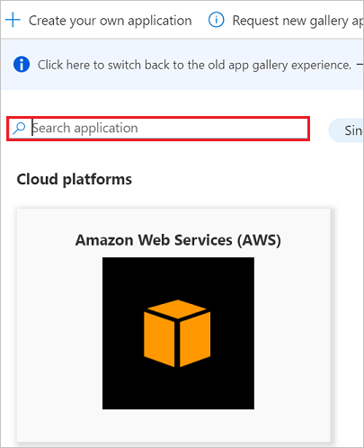
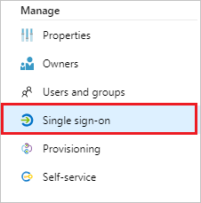
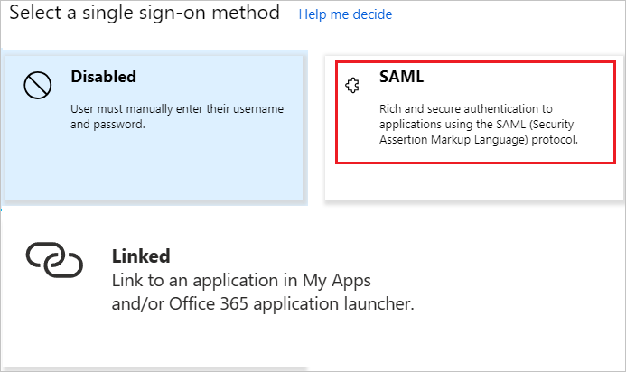
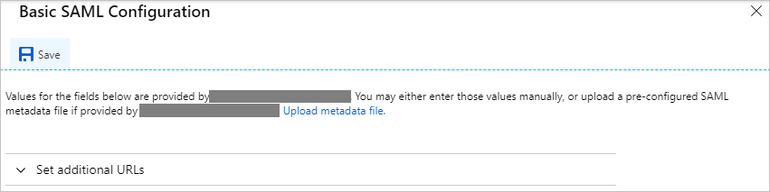
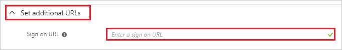

# Configure iDiD Manager for Single sign-on with Microsoft Entra ID

In this article,  you learn how to integrate iDiD Manager with Microsoft Entra ID.
Integrating iDiD Manager with Microsoft Entra ID provides you with the following benefits:

* You can control in Microsoft Entra ID who has access to iDiD Manager.
* You can enable your users to be automatically signed-in to iDiD Manager (Single Sign-On) with their Microsoft Entra accounts.
* You can manage your accounts in one central location.

If you want to know more details about SaaS app integration with Microsoft Entra ID, see [What is application access and single sign-on with Microsoft Entra ID](~/identity/enterprise-apps/what-is-single-sign-on.md).
If you don't have an Azure subscription, [create a free account](https://azure.microsoft.com/free/) before you begin.

## Prerequisites

The scenario outlined in this article assumes that you already have the following prerequisites:

[!INCLUDE [common-prerequisites.md](~/identity/saas-apps/includes/common-prerequisites.md)]
* iDiD Manager single sign-on enabled subscription

## Scenario description

In this article,  you configure and test Microsoft Entra single sign-on in a test environment.

* iDiD Manager supports **SP and IDP** initiated SSO

## Adding iDiD Manager from the gallery

To configure the integration of iDiD Manager into Microsoft Entra ID, you need to add iDiD Manager from the gallery to your list of managed SaaS apps.

**To add iDiD Manager from the gallery, perform the following steps:**

1. Sign in to the [Microsoft Entra admin center](https://entra.microsoft.com) as at least a [Cloud Application Administrator](~/identity/role-based-access-control/permissions-reference.md#cloud-application-administrator).
1. Browse to **Entra ID** > **Enterprise apps** > **New application**.
1. In the search box, type **iDiD Manager**, select **iDiD Manager** from result panel then select **Add** button to add the application.

	 

## Configure and test Microsoft Entra single sign-on

In this section, you configure and test Microsoft Entra single sign-on with iDiD Manager based on a test user called **Britta Simon**.
For single sign-on to work, a link relationship between a Microsoft Entra user and the related user in iDiD Manager needs to be established.

To configure and test Microsoft Entra single sign-on with iDiD Manager, you need to complete the following building blocks:

1. **[Configure Microsoft Entra Single Sign-On](#configure-azure-ad-single-sign-on)** - to enable your users to use this feature.
2. **[Configure iDiD Manager Single Sign-On](#configure-idid-manager-single-sign-on)** - to configure the Single Sign-On settings on application side.
3. **Create a Microsoft Entra test user** - to test Microsoft Entra single sign-on with Britta Simon.
4. **Assign the Microsoft Entra test user** - to enable Britta Simon to use Microsoft Entra single sign-on.
5. **[Create iDiD Manager test user](#create-idid-manager-test-user)** - to have a counterpart of Britta Simon in iDiD Manager that's linked to the Microsoft Entra representation of user.
6. **[Test single sign-on](#test-single-sign-on)** - to verify whether the configuration works.

### Configure Microsoft Entra single sign-on

In this section, you enable Microsoft Entra single sign-on.

To configure Microsoft Entra single sign-on with iDiD Manager, perform the following steps:

1. Sign in to the [Microsoft Entra admin center](https://entra.microsoft.com) as at least a [Cloud Application Administrator](~/identity/role-based-access-control/permissions-reference.md#cloud-application-administrator).
1. Browse to **Entra ID** > **Enterprise apps** > **iDiD Manager** application integration page, select **Single sign-on**.

    

1. On the **Select a Single sign-on method** dialog, select **SAML/WS-Fed** mode to enable single sign-on.

    

1. On the **Set up Single Sign-On with SAML** page, select **Edit** icon to open **Basic SAML Configuration** dialog.

	

1. On the **Basic SAML Configuration** section, the user doesn't have to perform any step as the app is already pre-integrated with Azure.

    

5. Select **Set additional URLs** and perform the following step if you wish to configure the application in **SP** initiated mode:

    

    In the **Sign-on URL** text box, type a URL using the following pattern:
    `https://idid2.fi/saml/login/<domain>`

    > [!NOTE]
	> The value isn't real. Update the value with the actual Sign-on URL. Contact [iDiD Manager Client support team](mailto:support@idid.fi) to get the value. You can also refer to the patterns shown in the **Basic SAML Configuration** section.

6. On the **Set up Single Sign-On with SAML** page, In the **SAML Signing Certificate** section, select copy button to copy **App Federation Metadata Url** and save it on your computer.

	

### Configure iDiD Manager Single Sign-On

To configure single sign-on on **iDiD Manager** side, you need to send the **App Federation Metadata Url** to [iDiD Manager support team](mailto:support@idid.fi). They set this setting to have the SAML SSO connection set properly on both sides.

[!INCLUDE [create-assign-users-sso.md](~/identity/saas-apps/includes/create-assign-users-sso.md)]

### Create iDiD Manager test user

In this section, you create a user called Britta Simon in iDiD Manager. Work with [iDiD Manager support team](mailto:support@idid.fi) to add the users in the iDiD Manager platform. Users must be created and activated before you use single sign-on.

### Test single sign-on 

In this section, you test your Microsoft Entra single sign-on configuration using the Access Panel.

When you select the iDiD Manager tile in the Access Panel, you should be automatically signed in to the iDiD Manager for which you set up SSO. For more information about the Access Panel, see [Introduction to the Access Panel](https://support.microsoft.com/account-billing/sign-in-and-start-apps-from-the-my-apps-portal-2f3b1bae-0e5a-4a86-a33e-876fbd2a4510).

## Additional Resources

- [List of articles on How to Integrate SaaS Apps with Microsoft Entra ID](./tutorial-list.md)

- [What is application access and single sign-on with Microsoft Entra ID?](~/identity/enterprise-apps/what-is-single-sign-on.md)

- [What is Conditional Access in Microsoft Entra ID?](~/identity/conditional-access/overview.md)
