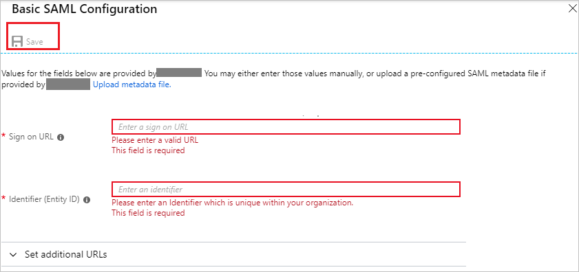

# Configure Imagineer WebVision for Single sign-on with Microsoft Entra ID

In this article,  you learn how to integrate Imagineer WebVision with Microsoft Entra ID.
Integrating Imagineer WebVision with Microsoft Entra ID provides you with the following benefits:

* You can control in Microsoft Entra ID who has access to Imagineer WebVision.
* You can enable your users to be automatically signed-in to Imagineer WebVision (Single Sign-On) with their Microsoft Entra accounts.
* You can manage your accounts in one central location.

If you want to know more details about SaaS app integration with Microsoft Entra ID, see [What is application access and single sign-on with Microsoft Entra ID](~/identity/enterprise-apps/what-is-single-sign-on.md).
If you don't have an Azure subscription, [create a free account](https://azure.microsoft.com/free/) before you begin.

## Prerequisites

The scenario outlined in this article assumes that you already have the following prerequisites:

[!INCLUDE [common-prerequisites.md](~/identity/saas-apps/includes/common-prerequisites.md)]
* Imagineer WebVision single sign-on enabled subscription

## Scenario description

In this article,  you configure and test Microsoft Entra single sign-on in a test environment.

* Imagineer WebVision supports **SP** initiated SSO

## Adding Imagineer WebVision from the gallery

To configure the integration of Imagineer WebVision into Microsoft Entra ID, you need to add Imagineer WebVision from the gallery to your list of managed SaaS apps.

**To add Imagineer WebVision from the gallery, perform the following steps:**

1. Sign in to the [Microsoft Entra admin center](https://entra.microsoft.com) as at least a [Cloud Application Administrator](~/identity/role-based-access-control/permissions-reference.md#cloud-application-administrator).
1. Browse to **Entra ID** > **Enterprise apps** > **New application**.
1. In the search box, type **Imagineer WebVision**, select **Imagineer WebVision** from result panel then select **Add** button to add the application.

	

## Configure and test Microsoft Entra single sign-on

In this section, you configure and test Microsoft Entra single sign-on with Imagineer WebVision based on a test user called **Britta Simon**.
For single sign-on to work, a link relationship between a Microsoft Entra user and the related user in Imagineer WebVision needs to be established.

To configure and test Microsoft Entra single sign-on with Imagineer WebVision, you need to complete the following building blocks:

1. **[Configure Microsoft Entra Single Sign-On](#configure-azure-ad-single-sign-on)** - to enable your users to use this feature.
2. **[Configure Imagineer WebVision Single Sign-On](#configure-imagineer-webvision-single-sign-on)** - to configure the Single Sign-On settings on application side.
3. **Create a Microsoft Entra test user** - to test Microsoft Entra single sign-on with Britta Simon.
4. **Assign the Microsoft Entra test user** - to enable Britta Simon to use Microsoft Entra single sign-on.
5. **[Create Imagineer WebVision test user](#create-imagineer-webvision-test-user)** - to have a counterpart of Britta Simon in Imagineer WebVision that's linked to the Microsoft Entra representation of user.
6. **[Test single sign-on](#test-single-sign-on)** - to verify whether the configuration works.

### Configure Microsoft Entra single sign-on

In this section, you enable Microsoft Entra single sign-on.

To configure Microsoft Entra single sign-on with Imagineer WebVision, perform the following steps:

1. Sign in to the [Microsoft Entra admin center](https://entra.microsoft.com) as at least a [Cloud Application Administrator](~/identity/role-based-access-control/permissions-reference.md#cloud-application-administrator).
1. Browse to **Entra ID** > **Enterprise apps** > **Imagineer WebVision** application integration page, select **Single sign-on**.

    

1. On the **Select a Single sign-on method** dialog, select **SAML/WS-Fed** mode to enable single sign-on.

    

1. On the **Set up Single Sign-On with SAML** page, select **Edit** icon to open **Basic SAML Configuration** dialog.

	

1. On the **Basic SAML Configuration** section, perform the following steps:

    

	a. In the **Sign on URL** text box, type a URL using the following pattern:
    `https://<YOUR SERVER URL>/<yourapplicationloginpage>`

    b. In the **Identifier (Entity ID)** text box, type a URL using the following pattern:
    `https://<YOUR SERVER URL>/<yourapplicationloginpage>`

	> [!NOTE]
	> These values aren't real. Update these values with the actual Sign on URL and Identifier. Contact [Imagineer WebVision Client support team](mailto:support@itgny.com) to get these values. You can also refer to the patterns shown in the **Basic SAML Configuration** section.

1. On the **Set up Single Sign-On with SAML** page, In the **SAML Signing Certificate** section, select copy button to copy **App Federation Metadata Url** and save it on your computer.

	

### Configure Imagineer WebVision Single Sign-On

To configure single sign-on on **Imagineer WebVision** side, you need to send the **App Federation Metadata Url** to [Imagineer WebVision support team](mailto:support@itgny.com). They set this setting to have the SAML SSO connection set properly on both sides.

[!INCLUDE [create-assign-users-sso.md](~/identity/saas-apps/includes/create-assign-users-sso.md)]

### Create Imagineer WebVision test user

In this section, you create a user called Britta Simon in Imagineer WebVision. Work with [Imagineer WebVision support team](mailto:support@itgny.com) to add the users in the Imagineer WebVision platform. Users must be created and activated before you use single sign-on.

### Test single sign-on

In this section, you test your Microsoft Entra single sign-on configuration using the Access Panel.

When you select the Imagineer WebVision tile in the Access Panel, you should be automatically signed in to the Imagineer WebVision for which you set up SSO. For more information about the Access Panel, see [Introduction to the Access Panel](https://support.microsoft.com/account-billing/sign-in-and-start-apps-from-the-my-apps-portal-2f3b1bae-0e5a-4a86-a33e-876fbd2a4510).

## Additional Resources

- [List of articles on How to Integrate SaaS Apps with Microsoft Entra ID](./tutorial-list.md)

- [What is application access and single sign-on with Microsoft Entra ID?](~/identity/enterprise-apps/what-is-single-sign-on.md)

- [What is Conditional Access in Microsoft Entra ID?](~/identity/conditional-access/overview.md)
