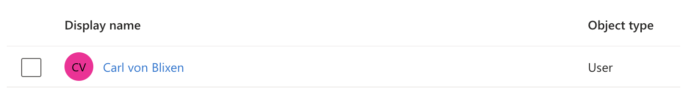

# Tutorial: Configure Infobric Equipment for automatic user provisioning

This tutorial describes the steps you need to perform in both Infobric Equipment and Microsoft Entra ID to configure automatic user and group provisioning.

When configured, Microsoft Entra ID automatically provisions and deprovisions users and groups to Infobric Equipment using the Microsoft Entra provisioning service.

For important details on what this service does, how it works, and frequently asked questions, see [What is application provisioning in Microsoft Entra ID?](~/identity/application-provisioning/user-provisioning.md).

## Supported capabilities

> [!div class="checklist"]
>
> - Create users in Infobric Equipment.
> - Remove users from Infobric Equipment.
> - Synchronize Microsoft Entra ID and Infobric Equipment user attributes.
> - Create groups in Infobric Equipment.
> - Remove groups from Infobric Equipment.
> - Synchronize Microsoft Entra ID and Infobric Equipment group memberships.

## Prerequisites

The scenario outlined in this tutorial assumes that you already have the following prerequisites:

- [A Microsoft Entra tenant](~/identity-platform/quickstart-create-new-tenant.md)
- A user in said tenant that is either an [Application Administrator](/entra/identity/role-based-access-control/permissions-reference#application-administrator) or a [Cloud Application Administrator](/entra/identity/role-based-access-control/permissions-reference#cloud-application-administrator).
- A user in Infobric Equipment with administrator permissions in the Infobric Equipment company for which we are setting up user provisioning.

## Step 1: Obtain your Infobric Equipment endpoint and token

1. Log in to Infobric Equipment [here](https://company.infobricequipment.application/).
1. If you are a member of multiple companies: Make sure you have picked the correct company in the top left corner:

   

1. Browse to **Admin** > **Settings** and **enable Microsoft Entra user provisioning**. Note the endpoint and token. You will need them in Step 4.

   

## Step 2: Create the Infobric Equipment application in Microsoft Entra ID

If the Infobric Equipment application has already been created in Microsoft Entra ID, you can skip this step.

Infobric is not yet listed in the [Microsoft Entra App Gallery](https://www.microsoft.com/en-us/security/business/identity-access/microsoft-entra-integrated-apps), so you need to create the application manually, like so:

1. Go to the [Microsoft Entra admin center](https://entra.microsoft.com) and browse to **Applications** > **Enterprise applications**.
1. Click **New application**.
1. Click **Create your own application**.
1. Name the application "Infobric Equipment". If this is a test or if you are running multiple Infobric Equipment companies, then consider adding something to tell this new application apart from others, such as the company name or "Test".
1. Choose "Integrate any other application you don't find in the gallery (Non-gallery)" for what you want to do with the application.
1. Click **Create**.

## Step 3: Give users and groups access to Infobric Equipment

1. If you are not already there, browse to the newly created application's **Overview** page.
1. Click **Users and groups** (under the **Manage** heading).
1. Click **Add user/group** and add the users and groups you want to have access to Infobric Equipment. (Tip: Start with a small set of users and groups before rolling out to everyone.)

   

## Step 4: Connect the Entra application to Infobric Equipment

1. Click **Provisioning**.
1. Click **Connect you application**.

   

1. Enter the endpoint and token you noted in Step 1.

   

1. Click **Test Connection** to ensure Microsoft Entra ID can connect to Infobric Equipment. If the connection fails, please go back to Infobric Equipment and use the support chat for assistance. If the connection is successful (see image below), click **Create**.

   

## Step 5: Map user attributes

1. Click **Attribute mapping** (may still be **Attribute mapping (Preview)**)
1. Click **Provision Microsoft Entra ID Users**.
1. Remove mappings that are not in the table below.
1. Add any mappings that are in the table but not already among the Entra mappings.
1. Make sure that all fields match exactly as shown in the table below.
1. Keep all other defaults on the Attribute mapping page.
1. Click **Save**.

| Equipment                              | Entra                                                         | Matching | When?  |
| -------------------------------------- | ------------------------------------------------------------- | :------: | ------ |
| `active`                               | `Switch([IsSoftDeleted], , "False", "True", "True", "False")` |          | Always |
| `displayName`                          | `displayName`                                                 |          | Always |
| `emails[type eq "work"].value`         | `mail`                                                        |          | Always |
| `name.familyName`                      | `surname`                                                     |          | Always |
| `name.givenName`                       | `givenName`                                                   |          | Always |
| `phoneNumbers[type eq "mobile"].value` | `mobile`                                                      |          | Always |
| `userName`                             | `userPrincipalName`                                           |    1     | Always |

## Step 6: Map group attributes

1. Click **Attribute mapping** (may still be **Attribute mapping (Preview)**)
1. Click **Provision Microsoft Entra ID Groups**.
1. Remove mappings that are not in the table below.
1. Add any mappings that are in the table but not already among the Entra mappings.
1. Make sure that all fields match exactly as shown in the table below.
1. Keep all other defaults on the Attribute mapping page.
1. Click **Save**.

| Equipment     | Entra         | Matching | When?  |
| ------------- | ------------- | :------: | ------ |
| `displayName` | `displayName` |    1     | Always |
| `externalId`  | `objectId`    |          | Always |
| `members`     | `members`     |          | Always |

## Step 7: Provision a single user and a single group

1. Go back to the application's **Overview** page.
1. Click **Provision on demand**. (It may take a few minutes for the provisioning service to be ready after Step 6.)
1. Select a single user and click **Provision**. The users should be created in Infobric Equipment, and you should see a success message in Entra, similar to this:

   

1. Select a single group and click **Provision**. As with the user, success should be obvious.

If you encounter any issues with provisioning on demand, please check the mappings in steps 5 and 6. Then try again. If that does not work, please contact Infobric Equipment via the chat.

## Step 8: Enable e-mail notifications on failure

1. Go to the application's **Overview (Preview)** page.
1. Click **Properties** and the pen to edit.
1. Fill in you email and click **Apply**. The result should look something like this:

   

Find the field for this and fill in you email.

## Step 9: Enable automatic provisioning

1. Click **Start provisioning**.

   

## Step 10: Monitor the provisioning service

1. Wait for about 40 minutes.
1. Make sure that users and groups are created in Infobric Equipment.
