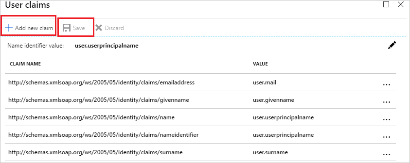
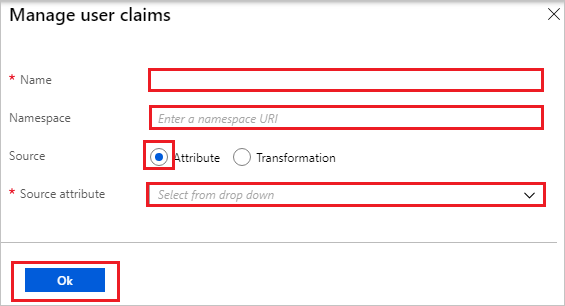

# Configure Infogix Data3Sixty Govern for Single sign-on with Microsoft Entra ID

In this article,  you learn how to integrate Infogix Data3Sixty Govern with Microsoft Entra ID. When you integrate Infogix Data3Sixty Govern with Microsoft Entra ID, you can:

* Control in Microsoft Entra ID who has access to Infogix Data3Sixty Govern.
* Enable your users to be automatically signed-in to Infogix Data3Sixty Govern with their Microsoft Entra accounts.
* Manage your accounts in one central location.

## Prerequisites

To get started, you need the following items:

* A Microsoft Entra subscription. If you don't have a subscription, you can get a [free account](https://azure.microsoft.com/free/).
* Infogix Data3Sixty Govern single sign-on (SSO) enabled subscription.
* Along with Cloud Application Administrator, Application Administrator can also add or manage applications in Microsoft Entra ID.
For more information, see [Azure built-in roles](~/identity/role-based-access-control/permissions-reference.md).

## Scenario description

In this article,  you configure and test Microsoft Entra single sign-on in a test environment.

* Infogix Data3Sixty Govern supports **SP and IDP** initiated SSO.
* Infogix Data3Sixty Govern supports **Just In Time** user provisioning.

> [!NOTE]
> Identifier of this application is a fixed string value so only one instance can be configured in one tenant.

## Add Infogix Data3Sixty Govern from the gallery

To configure the integration of Infogix Data3Sixty Govern into Microsoft Entra ID, you need to add Infogix Data3Sixty Govern from the gallery to your list of managed SaaS apps.

1. Sign in to the [Microsoft Entra admin center](https://entra.microsoft.com) as at least a [Cloud Application Administrator](~/identity/role-based-access-control/permissions-reference.md#cloud-application-administrator).
1. Browse to **Entra ID** > **Enterprise apps** > **New application**.
1. In the **Add from the gallery** section, type **Infogix Data3Sixty Govern** in the search box.
1. Select **Infogix Data3Sixty Govern** from results panel and then add the app. Wait a few seconds while the app is added to your tenant.

 [!INCLUDE [sso-wizard.md](~/identity/saas-apps/includes/sso-wizard.md)]

## Configure and test Microsoft Entra SSO for Infogix Data3Sixty Govern

Configure and test Microsoft Entra SSO with Infogix Data3Sixty Govern using a test user called **B.Simon**. For SSO to work, you need to establish a link relationship between a Microsoft Entra user and the related user in Infogix Data3Sixty Govern.

To configure and test Microsoft Entra SSO with Infogix Data3Sixty Govern, perform the following steps:

1. **[Configure Microsoft Entra SSO](#configure-azure-ad-sso)** - to enable your users to use this feature.
   1. **Create a Microsoft Entra test user** - to test Microsoft Entra single sign-on with B.Simon.
   1. **Assign the Microsoft Entra test user** - to enable B.Simon to use Microsoft Entra single sign-on.
1. **[Configure Infogix Data3Sixty Govern SSO](#configure-infogix-data3sixty-govern-sso)** - to configure the single sign-on settings on application side.
   1. **[Create Infogix Data3Sixty Govern test user](#create-infogix-data3sixty-govern-test-user)** - to have a counterpart of B.Simon in Infogix Data3Sixty Govern that's linked to the Microsoft Entra representation of user.
1. **[Test SSO](#test-sso)** - to verify whether the configuration works.

## Configure Microsoft Entra SSO

Follow these steps to enable Microsoft Entra SSO.

1. Sign in to the [Microsoft Entra admin center](https://entra.microsoft.com) as at least a [Cloud Application Administrator](~/identity/role-based-access-control/permissions-reference.md#cloud-application-administrator).
1. Browse to **Entra ID** > **Enterprise apps** > **Infogix Data3Sixty Govern** > **Single sign-on**.
1. On the **Select a single sign-on method** page, select **SAML**.
1. On the **Set up single sign-on with SAML** page, select the pencil icon for **Basic SAML Configuration** to edit the settings.

   

1. On the **Basic SAML Configuration** section, perform the following steps:

    a. In the **Identifier** text box, type the URL:
    `https://data3sixty.com/ui`

    b. In the **Reply URL** text box, type a URL using the following pattern:
    `https://<subdomain>.data3sixty.com/sso/acs`

1. Select **Set additional URLs** and perform the following step if you wish to configure the application in **SP** initiated mode:

    In the **Sign-on URL** text box, type a URL using the following pattern:
    `https://<subdomain>.data3sixty.com`

    > [!NOTE]
    > These values aren't real. Update these values with the actual Reply URL and Sign-On URL. Contact [Infogix Data3Sixty Govern Client support team](mailto:data3sixtysupport@infogix.com) to get these values. You can also refer to the patterns shown in the **Basic SAML Configuration** section.

1. Infogix Data3Sixty Govern application expects the SAML assertions in a specific format. Configure the following claims for this application. You can manage the values of these attributes from the **User Attributes** section on application integration page. On the **Set up Single Sign-On with SAML** page, select **Edit** button to open **User Attributes** dialog.

    

1. In the **User Claims** section on the **User Attributes** dialog, edit the claims by using **Edit icon** or add the claims by using **Add new claim** to configure SAML token attribute as shown in the image above and perform the following steps:

    | Name | Source Attribute|
    | -----------| -------------- |
    | firstname  | user.givenname |
    | lastname | user.surname |
    | username | user.mail |

    a. Select **Add new claim** to open the **Manage user claims** dialog.

    

    

    b. In the **Name** textbox, type the attribute name shown for that row.

    c. Leave the **Namespace** blank.

    d. Select Source as **Attribute**.

    e. From the **Source attribute** list, type the attribute value shown for that row.

    f. Select **Ok**

    g. Select **Save**.

1. On the **Set up Single Sign-On with SAML** page, in the **SAML Signing Certificate** section, select **Download** to download the **Certificate (Raw)** from the given options as per your requirement and save it on your computer.

    

1. On the **Set up Infogix Data3Sixty Govern** section, copy the appropriate URL(s) as per your requirement.

    

[!INCLUDE [create-assign-users-sso.md](~/identity/saas-apps/includes/create-assign-users-sso.md)]

## Configure Infogix Data3Sixty Govern SSO

To configure single sign-on on **Infogix Data3Sixty Govern** side, you need to send the downloaded **Certificate (Raw)** and appropriate copied URLs from the application configuration to [Infogix Data3Sixty Govern support team](mailto:data3sixtysupport@infogix.com). They set this setting to have the SAML SSO connection set properly on both sides.

### Create Infogix Data3Sixty Govern test user

In this section, a user called Britta Simon is created in Infogix Data3Sixty Govern. Infogix Data3Sixty Govern supports just-in-time user provisioning, which is enabled by default. There's no action item for you in this section. If a user doesn't already exist in Infogix Data3Sixty Govern, a new one is created after authentication.

> [!Note]
> If you need to create a user manually, contact [Infogix Data3Sixty Govern support team](mailto:data3sixtysupport@infogix.com).

## Test SSO

In this section, you test your Microsoft Entra single sign-on configuration with following options. 

#### SP initiated:

* Select **Test this application**, this option redirects to Infogix Data3Sixty Govern Sign-on URL where you can initiate the login flow.  

* Go to Infogix Data3Sixty Govern Sign-on URL directly and initiate the login flow from there.

#### IDP initiated:

* Select **Test this application**, and you should be automatically signed in to the Infogix Data3Sixty Govern for which you set up the SSO. 

You can also use Microsoft My Apps to test the application in any mode. When you select the Infogix Data3Sixty Govern tile in the My Apps, if configured in SP mode you would be redirected to the application sign-on page for initiating the login flow and if configured in IDP mode, you should be automatically signed in to the Infogix Data3Sixty Govern for which you set up the SSO. For more information, see [Microsoft Entra My Apps](/azure/active-directory/manage-apps/end-user-experiences#azure-ad-my-apps).

## Related content

Once you configure Infogix Data3Sixty Govern you can enforce session control, which protects exfiltration and infiltration of your organization’s sensitive data in real time. Session control extends from Conditional Access. [Learn how to enforce session control with Microsoft Cloud App Security](/cloud-app-security/proxy-deployment-aad).
