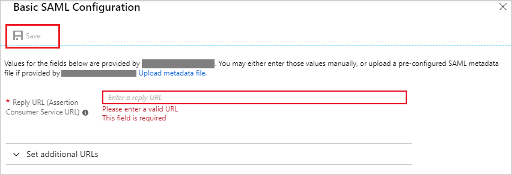
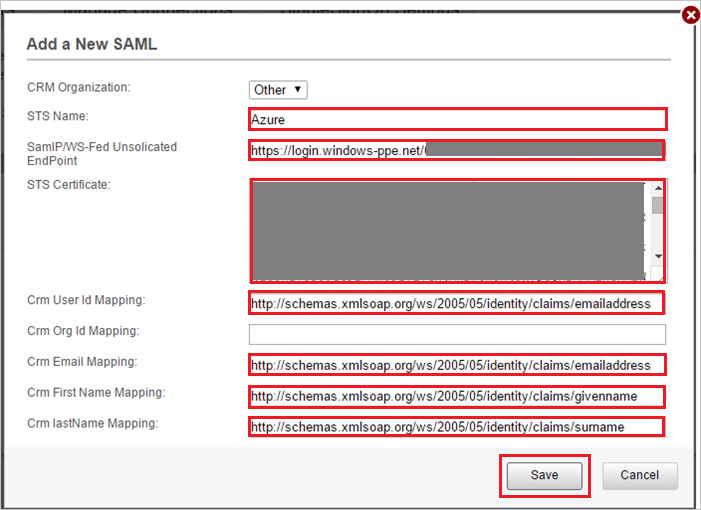

# Configure InsideView for Single sign-on with Microsoft Entra ID

In this article,  you learn how to integrate InsideView with Microsoft Entra ID.
This integration provides these benefits:

* You can use Microsoft Entra ID to control who has access to InsideView.
* You can enable your users to be automatically signed in to InsideView (single sign-on) with their Microsoft Entra accounts.
* You can manage your accounts in one central location: the Azure portal.

To learn more about SaaS app integration with Microsoft Entra ID, see [Single sign-on to applications in Microsoft Entra ID](~/identity/enterprise-apps/what-is-single-sign-on.md).

If you don't have an Azure subscription, [create a free account](https://azure.microsoft.com/free/) before you begin.

## Prerequisites

To configure Microsoft Entra integration with InsideView, you need to have:

* A Microsoft Entra subscription. If you don't have a Microsoft Entra environment, you can get a [free account](https://azure.microsoft.com/free/).
* An InsideView subscription that has single sign-on enabled.

## Scenario description

In this article,  you configure and test Microsoft Entra single sign-on in a test environment.

* InsideView supports IdP-initiated SSO.

## Add InsideView from the gallery

To set up the integration of InsideView into Microsoft Entra ID, you need to add InsideView from the gallery to your list of managed SaaS apps.

1. Sign in to the [Microsoft Entra admin center](https://entra.microsoft.com) as at least a [Cloud Application Administrator](~/identity/role-based-access-control/permissions-reference.md#cloud-application-administrator).
1. Browse to **Entra ID** > **Enterprise apps**.

	

3. To add an application, select **New application** at the top of the window:

	

4. In the search box, enter **InsideView**. Select **InsideView** in the search results and then select **Add**.

	

## Configure and test Microsoft Entra single sign-on

In this section, you configure and test Microsoft Entra single sign-on with InsideView by using a test user named Britta Simon.
To enable single sign-on, you need to establish a relationship between a Microsoft Entra user and the corresponding user in InsideView.

To configure and test Microsoft Entra single sign-on with InsideView, you need to complete these steps:

1. **[Configure Microsoft Entra single sign-on](#configure-azure-ad-single-sign-on)** to enable the feature for your users.
2. **[Configure InsideView single sign-on](#configure-insideview-single-sign-on)** on the application side.
3. **Create a Microsoft Entra test user** to test Microsoft Entra single sign-on.
4. **Assign the Microsoft Entra test user** to enable Microsoft Entra single sign-on for the user.
5. **[Create an InsideView test user](#create-an-insideview-test-user)** that's linked to the Microsoft Entra representation of the user.
6. **[Test single sign-on](#test-single-sign-on)** to verify that the configuration works.

### Configure Microsoft Entra single sign-on

In this section, you enable Microsoft Entra single sign-on.

To configure Microsoft Entra single sign-on with InsideView, take these steps:

1. Sign in to the [Microsoft Entra admin center](https://entra.microsoft.com) as at least a [Cloud Application Administrator](~/identity/role-based-access-control/permissions-reference.md#cloud-application-administrator).
1. Browse to **Entra ID** > **Enterprise apps** > **InsideView**
1. Select **Single sign-on**:

   

1. In the **Select a single sign-on method** dialog box, select **SAML/WS-Fed** mode to enable single sign-on:

   

1. On the **Set up Single Sign-On with SAML** page, select the **Edit** icon to open the **Basic SAML Configuration** dialog box:

   

1. In the **Basic SAML Configuration** dialog box, take the following steps.

   

   In the **Reply URL** box, enter a URL in this pattern:

   `https://my.insideview.com/iv/<STS Name>/login.iv`

	> [!NOTE]
	> This value is a placeholder. You need to use the actual reply URL. Contact the [InsideView support team](mailto:support@insideview.com) to get the value. You can also refer to the patterns shown in the **Basic SAML Configuration** dialog box.

1. On the **Set up Single Sign-On with SAML** page, in the **SAML Signing Certificate** section, select the **Download** link next to **Certificate (Raw)**, per your requirements, and save the certificate on your computer:

	

1. In the **Set up InsideView** section, copy the appropriate URLs, based on your requirements:

   

   1. **Login URL**.
   1. **Microsoft Entra Identifier**.
   1. **Logout URL**.

### Configure InsideView single sign-on

1. In a new web browser window, sign in to your InsideView company site as an admin.

1. At the top of the window, select **Admin**, **SingleSignOn Settings**, and then **Add SAML**.
   
   

1. In the **Add a New SAML** section, take the following steps.

	

	1. In the **STS Name** box, enter a name for your configuration.

	1. In the **SamlP/WS-Fed Unsolicited EndPoint** box, paste the **Login URL** value that you copied.

	1. Open the Raw certificate that you downloaded. Copy the contents of the certificate to the clipboard, and then paste the contents into the **STS Certificate** box.

	1. In the **Crm User Id Mapping** box, enter **`http://schemas.xmlsoap.org/ws/2005/05/identity/claims/emailaddress`**.

	1. In the **Crm Email Mapping** box, enter **`http://schemas.xmlsoap.org/ws/2005/05/identity/claims/emailaddress`**.

	1. In the **Crm First Name Mapping** box, enter **`http://schemas.xmlsoap.org/ws/2005/05/identity/claims/givenname`**.

	1. In the **Crm lastName Mapping** box, enter **`http://schemas.xmlsoap.org/ws/2005/05/identity/claims/surname`**.  

	1. Select **Save**.

### Create a Microsoft Entra test user

In this section, you create a test user named Britta Simon.

1. Sign in to the [Microsoft Entra admin center](https://entra.microsoft.com) as at least a [User Administrator](~/identity/role-based-access-control/permissions-reference.md#user-administrator).
1. Browse to **Entra ID** > **Users**.
1. Select **New user** > **Create new user**, at the top of the screen.
1. In the **User** properties, follow these steps:
   1. In the **Display name** field, enter `B.Simon`.  
   1. In the **User principal name** field, enter the username@companydomain.extension. For example, `B.Simon@contoso.com`.
   1. Select the **Show password** check box, and then write down the value that's displayed in the **Password** box.
   1. Select **Review + create**.
1. Select **Create**.

### Assign the Microsoft Entra test user

In this section, you enable Britta Simon to use Azure single sign-on by granting her access to InsideView.

1. Sign in to the [Microsoft Entra admin center](https://entra.microsoft.com) as at least a [Cloud Application Administrator](~/identity/role-based-access-control/permissions-reference.md#cloud-application-administrator).
1. Browse to **Entra ID** > **Enterprise apps** > **InsideView**.

   

1. In the left pane, select **Users and groups**:

   

1. Select **Add user**, and then select **Users and groups** in the **Add Assignment** dialog box.

   

1. In the **Users and groups** dialog box, select **Britta Simon** in the users list, and then select the **Select** button at the bottom of the window.

1. If you expect a role value in the SAML assertion, in the **Select Role** dialog box, select the appropriate role for the user from the list. Select the **Select** button at the bottom of the window.

1. In the **Add Assignment** dialog box, select **Assign**.

### Create an InsideView test user

To enable Microsoft Entra users to sign in to InsideView, you need to add them to InsideView. You need to add them manually.

To create users or contacts in InsideView, contact the [InsideView support team](mailto:support@insideview.com).

> [!NOTE]
> You can use any user account creation tool or API provided by InsideView to provision Microsoft Entra user accounts.

### Test single sign-on

Now you need to test your Microsoft Entra single sign-on configuration by using the Access Panel.

When you select the InsideView tile in the Access Panel, you should be automatically signed in to the InsideView instance for which you set up SSO. For more information about the Access Panel, see [Access and use apps on the My Apps portal](https://support.microsoft.com/account-billing/sign-in-and-start-apps-from-the-my-apps-portal-2f3b1bae-0e5a-4a86-a33e-876fbd2a4510).

## Additional resources

- [Tutorials for integrating SaaS applications with Microsoft Entra ID](./tutorial-list.md)

- [What is application access and single sign-on with Microsoft Entra ID?](~/identity/enterprise-apps/what-is-single-sign-on.md)

- [What is Conditional Access in Microsoft Entra ID?](~/identity/conditional-access/overview.md)
