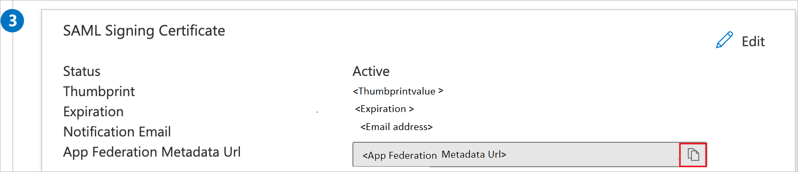

# Configure Insight4GRC for Single sign-on with Microsoft Entra ID

In this article,  you learn how to integrate Insight4GRC with Microsoft Entra ID. When you integrate Insight4GRC with Microsoft Entra ID, you can:

* Control in Microsoft Entra ID who has access to Insight4GRC.
* Enable your users to be automatically signed-in to Insight4GRC with their Microsoft Entra accounts.
* Manage your accounts in one central location.

## Prerequisites

The scenario outlined in this article assumes that you already have the following prerequisites:

[!INCLUDE [common-prerequisites.md](~/identity/saas-apps/includes/common-prerequisites.md)]
* Insight4GRC single sign-on (SSO) enabled subscription.

> [!NOTE]
> This integration is also available to use from Microsoft Entra US Government Cloud environment. You can find this application in the Microsoft Entra US Government Cloud Application Gallery and configure it in the same way as you do from public cloud.

## Scenario description

In this article,  you configure and test Microsoft Entra single sign-on in a test environment.

* Insight4GRC supports **SP and IDP** initiated SSO.
* Insight4GRC supports **Just In Time** user provisioning.
* Insight4GRC supports [Automated user provisioning](insight4grc-provisioning-tutorial.md).

## Add Insight4GRC from the gallery

To configure the integration of Insight4GRC into Microsoft Entra ID, you need to add Insight4GRC from the gallery to your list of managed SaaS apps.

1. Sign in to the [Microsoft Entra admin center](https://entra.microsoft.com) as at least a [Cloud Application Administrator](~/identity/role-based-access-control/permissions-reference.md#cloud-application-administrator).
1. Browse to **Entra ID** > **Enterprise apps** > **New application**.
1. In the **Add from the gallery** section, type **Insight4GRC** in the search box.
1. Select **Insight4GRC** from results panel and then add the app. Wait a few seconds while the app is added to your tenant.

 [!INCLUDE [sso-wizard.md](~/identity/saas-apps/includes/sso-wizard.md)]

## Configure and test Microsoft Entra SSO for Insight4GRC

Configure and test Microsoft Entra SSO with Insight4GRC using a test user called **B.Simon**. For SSO to work, you need to establish a link relationship between a Microsoft Entra user and the related user in Insight4GRC.

To configure and test Microsoft Entra SSO with Insight4GRC, perform the following steps:

1. **[Configure Microsoft Entra SSO](#configure-azure-ad-sso)** - to enable your users to use this feature.
    1. **Create a Microsoft Entra test user** - to test Microsoft Entra single sign-on with Britta Simon.
    1. **Assign the Microsoft Entra test user** - to enable Britta Simon to use Microsoft Entra single sign-on.
2. **[Configure Insight4GRC SSO](#configure-insight4grc-sso)** - to configure the Single Sign-On settings on application side.
    1. **[Create Insight4GRC test user](#create-insight4grc-test-user)** - to have a counterpart of Britta Simon in Insight4GRC that's linked to the Microsoft Entra representation of user.
1. **[Test SSO](#test-sso)** - to verify whether the configuration works.

## Configure Microsoft Entra SSO

Follow these steps to enable Microsoft Entra SSO.

1. Sign in to the [Microsoft Entra admin center](https://entra.microsoft.com) as at least a [Cloud Application Administrator](~/identity/role-based-access-control/permissions-reference.md#cloud-application-administrator).
1. Browse to **Entra ID** > **Enterprise apps** > **Insight4GRC** > **Single sign-on**.
1. On the **Select a single sign-on method** page, select **SAML**.
1. On the **Set up single sign-on with SAML** page, select the pencil icon for **Basic SAML Configuration** to edit the settings.

   

1. On the **Basic SAML Configuration** section, If you wish to configure the application in **IDP** initiated mode, perform the following steps:

    a. In the **Identifier** text box, type a URL using the following pattern:
    `https://<SUBDOMAIN>.Insight4GRC.com/SAML`

    b. In the **Reply URL** text box, type a URL using the following pattern:
    `https://<SUBDOMAIN>.Insight4GRC.com/auth/saml/sp/assertion-consumer-service`

5. Select **Set additional URLs** and perform the following step if you wish to configure the application in **SP** initiated mode:

    In the **Sign-on URL** text box, type a URL using the following pattern:
    `https://<SUBDOMAIN>.Insight4GRC.com`

	> [!NOTE]
	> These values aren't real. Update these values with the actual Identifier, Reply URL and Sign-on URL. Contact [Insight4GRC Client support team](mailto:support.ss@rsmuk.com) to get these values. You can also refer to the patterns shown in the **Basic SAML Configuration** section.

6. On the **Set up Single Sign-On with SAML** page, In the **SAML Signing Certificate** section, select copy button to copy **App Federation Metadata Url** and save it on your computer.

	

[!INCLUDE [create-assign-users-sso.md](~/identity/saas-apps/includes/create-assign-users-sso.md)]

## Configure Insight4GRC SSO

To configure single sign-on on **Insight4GRC** side, you need to send the **App Federation Metadata Url** to [Insight4GRC support team](mailto:support.ss@rsmuk.com). They set this setting to have the SAML SSO connection set properly on both sides.

### Create Insight4GRC test user

In this section, a user called Britta Simon is created in Insight4GRC. Insight4GRC supports just-in-time user provisioning, which is enabled by default. There's no action item for you in this section. If a user doesn't already exist in Insight4GRC, a new one is created after authentication.

> [!Note]
> Insight4GRC also supports automatic user provisioning, you can find more details [here](./insight4grc-provisioning-tutorial.md) on how to configure automatic user provisioning.

## Test SSO 

In this section, you test your Microsoft Entra single sign-on configuration with following options. 

#### SP initiated:

* Select **Test this application**, this option redirects to Insight4GRC Sign on URL where you can initiate the login flow.  

* Go to Insight4GRC Sign-on URL directly and initiate the login flow from there.

#### IDP initiated:

* Select **Test this application**, and you should be automatically signed in to the Insight4GRC for which you set up the SSO. 

You can also use Microsoft My Apps to test the application in any mode. When you select the Insight4GRC tile in the My Apps, if configured in SP mode you would be redirected to the application sign on page for initiating the login flow and if configured in IDP mode, you should be automatically signed in to the Insight4GRC for which you set up the SSO. For more information, see [Microsoft Entra My Apps](/azure/active-directory/manage-apps/end-user-experiences#azure-ad-my-apps).

## Related content

Once you configure Insight4GRC you can enforce session control, which protects exfiltration and infiltration of your organization’s sensitive data in real time. Session control extends from Conditional Access. [Learn how to enforce session control with Microsoft Defender for Cloud Apps](/cloud-app-security/proxy-deployment-any-app).
