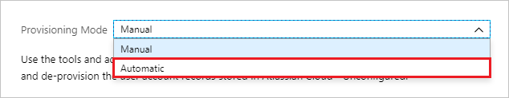

# Configure Insite LMS for automatic user provisioning with Microsoft Entra ID

This article describes the steps you need to do in both Insite LMS and Microsoft Entra ID to configure automatic user provisioning. When configured, Microsoft Entra ID automatically provisions and deprovisions users and groups to [Insite LMS](https://www.insite-it.net/) using the Microsoft Entra provisioning service. For important details on what this service does, how it works, and frequently asked questions, see [Automate user provisioning and deprovisioning to SaaS applications with Microsoft Entra ID](~/identity/app-provisioning/user-provisioning.md). 

## Capabilities Supported
> [!div class="checklist"]
> * Create users in Insite LMS
> * Remove users in Insite LMS when they don't require access anymore
> * Keep user attributes synchronized between Microsoft Entra ID and Insite LMS

## Prerequisites

The scenario outlined in this article assumes that you already have the following prerequisites:

[!INCLUDE [common-prerequisites.md](~/identity/saas-apps/includes/common-prerequisites.md)]
* A [Insite LMS tenant](https://www.insite-it.net/).
* A user account in Insite LMS with Admin permissions.

## Step 1: Plan your provisioning deployment

1. Learn about [how the provisioning service works](~/identity/app-provisioning/user-provisioning.md).
1. Determine who is in [scope for provisioning](~/identity/app-provisioning/define-conditional-rules-for-provisioning-user-accounts.md).
1. Determine what data to [map between Microsoft Entra ID and Insite LMS](~/identity/app-provisioning/customize-application-attributes.md).

## Step 2: Configure Insite LMS to support provisioning with Microsoft Entra ID
To generate the Secret Token

1. Log in to [Insite LMS Console](https://portal.insitelms.net) with your Admin account. 
1. Navigate to **Applications** module on the left hand side menu.
1. In the section **Self hosted Jobs**, you find a job named “SCIM”. If you can't find the job, contact the Insite LMS support team.

	

1. Select **Generate Api Key**.
Copy and save the **Api Key**. This value is entered in the **Secret Token** field in the Provisioning tab of your Insite LMS application.

> [!NOTE]
> The Api Key is only valid for 1 year and needs to be renewed manually before it expires.

## Step 3: Add Insite LMS from the Microsoft Entra application gallery

Add Insite LMS from the Microsoft Entra application gallery to start managing provisioning to Insite LMS. If you have previously setup Insite LMS for SSO, you can use the same application. However it's recommended that you create a separate app when testing out the integration initially. Learn more about adding an application from the gallery [here](~/identity/enterprise-apps/add-application-portal.md). 

## Step 4: Define who is in scope for provisioning 

[!INCLUDE [create-assign-users-provisioning.md](~/identity/saas-apps/includes/create-assign-users-provisioning.md)]

## Step 5: Configure automatic user provisioning to Insite LMS

This section guides you through the steps to configure the Microsoft Entra provisioning service to create, update, and disable users and/or groups in Insite LMS app based on user and group assignments in Microsoft Entra ID.

### To configure automatic user provisioning for Insite LMS in Microsoft Entra ID:

1. Sign in to the [Microsoft Entra admin center](https://entra.microsoft.com) as at least a [Cloud Application Administrator](~/identity/role-based-access-control/permissions-reference.md#cloud-application-administrator).
1. Browse to **Entra ID** > **Enterprise apps**

	

1. In the applications list, select **Insite LMS**.

	

1. Select the **Provisioning** tab.

	

1.  Set the **Provisioning Mode** to **Automatic**.

	

1. In the **Admin Credentials** section, enter your Insite LMS **Tenant URL** as `https://api.insitelms.net/scim` and enter the **Secret token** generated in Step 2 above. Select **Test Connection** to ensure that Microsoft Entra ID can connect to Insite LMS. If the connection fails, ensure that your Insite LMS account has admin permissions and try again.

 	

1. In the **Notification Email** field, enter the email address of a person or group who should receive the provisioning error notifications. Select the **Send an email notification when a failure occurs** check box.

	

1. Select **Save**.

1. In the **Mappings** section, select **Synchronize Microsoft Entra users to Insite LMS**.

1. Review the user attributes that are synchronized from Microsoft Entra ID to Insite LMS in the **Attribute Mapping** section. The attributes selected as **Matching** properties are used to match the user accounts in Insite LMS for update operations. If you change the [matching target attribute](~/identity/app-provisioning/customize-application-attributes.md), you need to ensure that the Insite LMS API supports filtering users based on that attribute. Select **Save** to commit any changes.

   |Attribute|Type|Supported for filtering|Required by Insite LMS|
   |---|---|---|---|
   |userName|String|&check;|&check;|
   |emails[type eq "work"].value|String|&check;|&check;|
   |active|Boolean|||
   |name.givenName|String|||
   |name.familyName|String|||
   |phoneNumbers[type eq "work"].value|String|||

1. To configure scoping filters, see the instructions provided in the [Scoping filter article](~/identity/app-provisioning/define-conditional-rules-for-provisioning-user-accounts.md).

1. To enable the Microsoft Entra provisioning service for Insite LMS, change **Provisioning Status** to **On** in the **Settings** section.

	

1. Define the users or groups that you want to provision to Insite LMS by selecting the desired values in **Scope** in the **Settings** section.

	

1. When you're ready to provision, select **Save**.

	

This operation starts the initial synchronization cycle of all users and groups defined in **Scope** in the **Settings** section. The initial cycle takes longer to do than next cycles, which occur about every 40 minutes as long as the Microsoft Entra provisioning service is running.

## Step 6: Monitor your deployment

[!INCLUDE [monitor-deployment.md](~/identity/saas-apps/includes/monitor-deployment.md)]

## More resources

* [Managing user account provisioning for enterprise apps](~/identity/app-provisioning/configure-automatic-user-provisioning-portal.md)
* [What is application access and single sign-on with Microsoft Entra ID?](~/identity/enterprise-apps/what-is-single-sign-on.md)

## Related content

* [Learn how to review logs and get reports on provisioning activity](~/identity/app-provisioning/check-status-user-account-provisioning.md)
