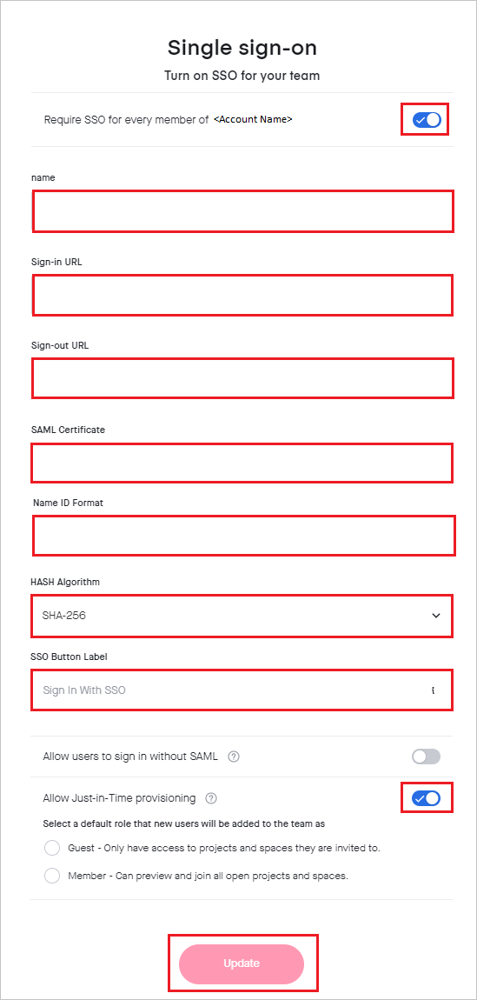
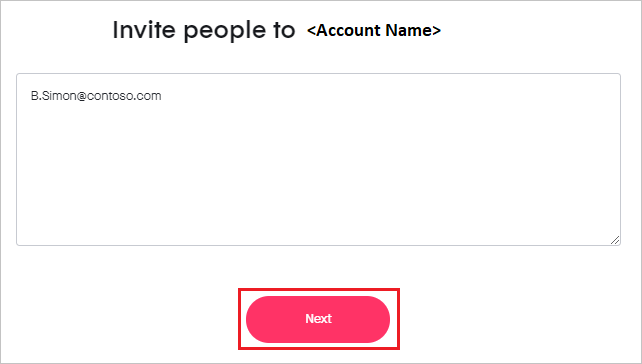
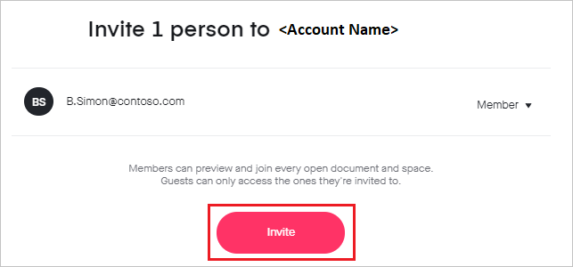

# Microsoft Entra single sign-on (SSO) integration with InVision

In this article,  you learn how to integrate InVision with Microsoft Entra ID. When you integrate InVision with Microsoft Entra ID, you can:

* Control in Microsoft Entra ID who has access to InVision.
* Enable your users to be automatically signed-in to InVision with their Microsoft Entra accounts.
* Manage your accounts in one central location.

## Prerequisites
The scenario outlined in this article assumes that you already have the following prerequisites:
[!INCLUDE [common-prerequisites.md](~/identity/saas-apps/includes/common-prerequisites.md)]
* InVision single sign-on (SSO) enabled subscription.

## Scenario description

In this article,  you configure and test Microsoft Entra SSO in a test environment.

* InVision supports **SP and IDP** initiated SSO.
* InVision supports [Automated user provisioning](invision-provisioning-tutorial.md).

## Adding InVision from the gallery

To configure the integration of InVision into Microsoft Entra ID, you need to add InVision from the gallery to your list of managed SaaS apps.

1. Sign in to the [Microsoft Entra admin center](https://entra.microsoft.com) as at least a [Cloud Application Administrator](~/identity/role-based-access-control/permissions-reference.md#cloud-application-administrator).
1. Browse to **Entra ID** > **Enterprise apps** > **New application**.
1. In the **Add from the gallery** section, type **InVision** in the search box.
1. Select **InVision** from results panel and then add the app. Wait a few seconds while the app is added to your tenant.

 Alternatively, you can also use the [Enterprise App Configuration Wizard](https://portal.office.com/AdminPortal/home?Q=Docs#/azureadappintegration). In this wizard, you can add an application to your tenant, add users/groups to the app, assign roles, and walk through the SSO configuration as well. [Learn more about Microsoft 365 wizards.](/microsoft-365/admin/misc/azure-ad-setup-guides)

## Configure and test Microsoft Entra SSO for InVision

Configure and test Microsoft Entra SSO with InVision using a test user called **B.Simon**. For SSO to work, you need to establish a link relationship between a Microsoft Entra user and the related user in InVision.

To configure and test Microsoft Entra SSO with InVision, perform the following steps:

1. **[Configure Microsoft Entra SSO](#configure-azure-ad-sso)** - to enable your users to use this feature.
    1. **Create a Microsoft Entra test user** - to test Microsoft Entra single sign-on with B.Simon.
    1. **Assign the Microsoft Entra test user** - to enable B.Simon to use Microsoft Entra single sign-on.
1. **[Configure InVision SSO](#configure-invision-sso)** - to configure the single sign-on settings on application side.
    1. **[Create InVision test user](#create-invision-test-user)** - to have a counterpart of B.Simon in InVision that's linked to the Microsoft Entra representation of user.
1. **[Test SSO](#test-sso)** - to verify whether the configuration works.

## Configure Microsoft Entra SSO

Follow these steps to enable Microsoft Entra SSO.

1. Sign in to the [Microsoft Entra admin center](https://entra.microsoft.com) as at least a [Cloud Application Administrator](~/identity/role-based-access-control/permissions-reference.md#cloud-application-administrator).
1. Browse to **Entra ID** > **Enterprise apps** > **InVision** > **Single sign-on**.
1. On the **Select a single sign-on method** page, select **SAML**.
1. On the **Set up single sign-on with SAML** page, select the pencil icon for **Basic SAML Configuration** to edit the settings.

   

1. On the **Basic SAML Configuration** section, if you wish to configure the application in **IDP** initiated mode, enter the values for the following fields:

    a. In the **Identifier** text box, type a URL using the following pattern:
    `https://<SUBDOMAIN>.invisionapp.com`

    b. In the **Reply URL** text box, type a URL using the following pattern:
    `https://<SUBDOMAIN>.invisionapp.com//sso/auth`

1. Select **Set additional URLs** and perform the following step if you wish to configure the application in **SP** initiated mode:

    In the **Sign-on URL** text box, type a URL using the following pattern:
    `https://<SUBDOMAIN>.invisionapp.com`

	> [!NOTE]
	> These values aren't real. Update these values with the actual Identifier, Reply URL and Sign-on URL. Contact [InVision Client support team](mailto:support@invisionapp.com) to get these values. You can also refer to the patterns shown in the **Basic SAML Configuration** section.

1. On the **Set up single sign-on with SAML** page, in the **SAML Signing Certificate** section,  find **Certificate (Base64)** and select **Download** to download the certificate and save it on your computer.

	

1. On the **Set up InVision** section, copy the appropriate URL(s) based on your requirement.

	

[!INCLUDE [create-assign-users-sso.md](~/identity/saas-apps/includes/create-assign-users-sso.md)]

## Configure InVision SSO

1. In a different web browser window, sign in to your InVision company site as an administrator

1. Select **Team** and select **Settings**.

    

1. Scroll down to **Single sign-on** and then select **Change**.

    

1. On the **Single sign-on** page, perform the following steps:

    

    a. Change **Require SSO for every member of < account name >** to **On**.

    b. In the **name** textbox, enter the name for example like `azureadsso`.

    c. Enter the Sign-on URL value in the **Sign-in URL** textbox.

    d. In the **Sign-out URL** textbox, paste the **Log out** URL value, which you copied previously.

    e. In the **SAML Certificate** textbox, open the downloaded **Certificate (Base64)** into Notepad, copy the content and paste it into SAML Certificate textbox.

    f. In the **Name ID Format** textbox, use `urn:oasis:names:tc:SAML:1.1:nameid-format:Unspecified` for the **Name ID Format**.

    g. Select **SHA-256** from the dropdown for the **HASH Algorithm**.

    h. Enter appropriate name for the **SSO Button Label**.

    i. Make **Allow Just-in-Time provisioning** On.

    j. Select **Update**.

### Create InVision test user

1. In a different web browser window, sign into InVision site as an administrator.

1. Select **Team** and select **People**.

    

1. Select the **+ ICON** to add new user.

    

1. Enter the email address of the user and select **Next**.

    

1. Once verify the email address and then select **Invite**.

    

> [!NOTE]
> InVision also supports automatic user provisioning, you can find more details [here](./invision-provisioning-tutorial.md) on how to configure automatic user provisioning.

## Test SSO

In this section, you test your Microsoft Entra single sign-on configuration with following options.

#### SP initiated:

* Select **Test this application**, this option redirects to InVision Sign on URL where you can initiate the login flow.

* Go to InVision Sign-on URL directly and initiate the login flow from there.

#### IDP initiated:

* Select **Test this application**, and you should be automatically signed in to the InVision for which you set up the SSO

You can also use Microsoft My Apps to test the application in any mode. When you select the InVision tile in the My Apps, if configured in SP mode you would be redirected to the application sign on page for initiating the login flow and if configured in IDP mode, you should be automatically signed in to the InVision for which you set up the SSO. For more information about the My Apps, see [Introduction to the My Apps](https://support.microsoft.com/account-billing/sign-in-and-start-apps-from-the-my-apps-portal-2f3b1bae-0e5a-4a86-a33e-876fbd2a4510).

## Related content

Once you configure InVision you can enforce session control, which protects exfiltration and infiltration of your organization’s sensitive data in real time. Session control extends from Conditional Access. [Learn how to enforce session control with Microsoft Defender for Cloud Apps](/cloud-app-security/proxy-deployment-any-app).
