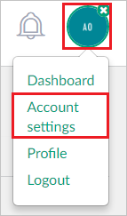
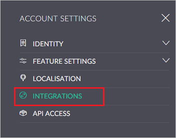
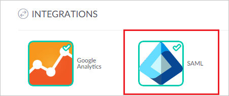
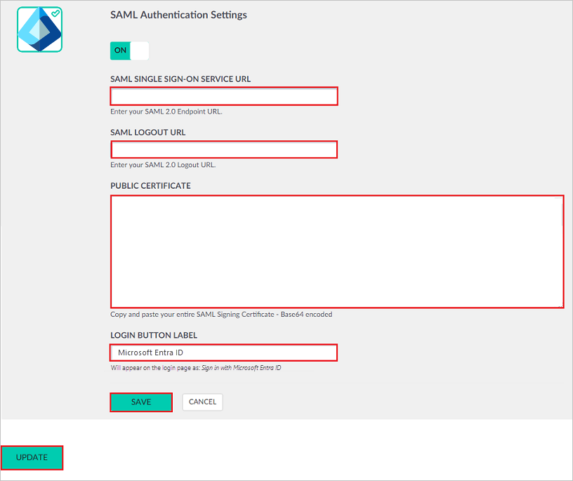
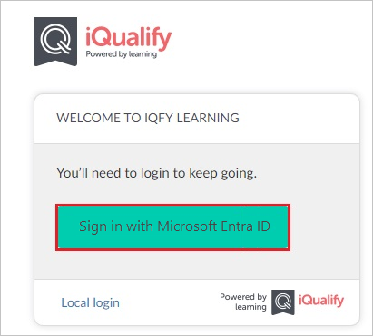

# Configure iQualify LMS for Single sign-on with Microsoft Entra ID

In this article,  you learn how to integrate iQualify LMS with Microsoft Entra ID. When you integrate iQualify LMS with Microsoft Entra ID, you can:

* Control in Microsoft Entra ID who has access to iQualify LMS.
* Enable your users to be automatically signed-in to iQualify LMS with their Microsoft Entra accounts.
* Manage your accounts in one central location.

## Prerequisites

To get started, you need the following items:

* A Microsoft Entra subscription. If you don't have a subscription, you can get a [free account](https://azure.microsoft.com/free/).
* iQualify LMS single sign-on (SSO) enabled subscription.
* Along with Cloud Application Administrator, Application Administrator can also add or manage applications in Microsoft Entra ID.
For more information, see [Azure built-in roles](~/identity/role-based-access-control/permissions-reference.md).

## Scenario description

In this article,  you configure and test Microsoft Entra single sign-on in a test environment.

* iQualify LMS supports **SP and IDP** initiated SSO.
* iQualify LMS supports **Just In Time** user provisioning.

## Add iQualify LMS from the gallery

To configure the integration of iQualify LMS into Microsoft Entra ID, you need to add iQualify LMS from the gallery to your list of managed SaaS apps.

1. Sign in to the [Microsoft Entra admin center](https://entra.microsoft.com) as at least a [Cloud Application Administrator](~/identity/role-based-access-control/permissions-reference.md#cloud-application-administrator).
1. Browse to **Entra ID** > **Enterprise apps** > **New application**.
1. In the **Add from the gallery** section, type **iQualify LMS** in the search box.
1. Select **iQualify LMS** from results panel and then add the app. Wait a few seconds while the app is added to your tenant.

 Alternatively, you can also use the [Enterprise App Configuration Wizard](https://portal.office.com/AdminPortal/home?Q=Docs#/azureadappintegration). In this wizard, you can add an application to your tenant, add users/groups to the app, assign roles, and walk through the SSO configuration as well. [Learn more about Microsoft 365 wizards.](/microsoft-365/admin/misc/azure-ad-setup-guides)

## Configure and test Microsoft Entra SSO for iQualify LMS

Configure and test Microsoft Entra SSO with iQualify LMS using a test user called **B.Simon**. For SSO to work, you need to establish a link relationship between a Microsoft Entra user and the related user in iQualify LMS.

To configure and test Microsoft Entra SSO with iQualify LMS, perform the following steps:

1. **[Configure Microsoft Entra SSO](#configure-azure-ad-sso)** - to enable your users to use this feature.
    1. **Create a Microsoft Entra test user** - to test Microsoft Entra single sign-on with B.Simon.
    1. **Assign the Microsoft Entra test user** - to enable B.Simon to use Microsoft Entra single sign-on.
1. **[Configure iQualify LMS SSO](#configure-iqualify-lms-sso)** - to configure the single sign-on settings on application side.
    1. **[Create iQualify LMS test user](#create-iqualify-lms-test-user)** - to have a counterpart of B.Simon in iQualify LMS that's linked to the Microsoft Entra representation of user.
1. **[Test SSO](#test-sso)** - to verify whether the configuration works.

## Configure Microsoft Entra SSO

Follow these steps to enable Microsoft Entra SSO.

1. Sign in to the [Microsoft Entra admin center](https://entra.microsoft.com) as at least a [Cloud Application Administrator](~/identity/role-based-access-control/permissions-reference.md#cloud-application-administrator).
1. Browse to **Entra ID** > **Enterprise apps** > **iQualify LMS** > **Single sign-on**.
1. On the **Select a single sign-on method** page, select **SAML**.
1. On the **Set up single sign-on with SAML** page, select the pencil icon for **Basic SAML Configuration** to edit the settings.

    

1. On the **Basic SAML Configuration** section, perform the following steps:

   a. In the **Identifier** text box, type a URL using one the following patterns:

    | **Identifier** |
    |------|
    | Production Environment: `https://<yourorg>.iqualify.com/` |
    | Test Environment: `https://<yourorg>.iqualify.io` |

   b. In the **Reply URL** text box, type a URL using one of the following patterns:

    | **Reply URL** |
    |--------|
    | Production Environment: `https://<yourorg>.iqualify.com/auth/saml2/callback` |
    | Test Environment: `https://<yourorg>.iqualify.io/auth/saml2/callback` |

1. Select **Set additional URLs** and perform the following step if you wish to configure the application in **SP** initiated mode:

   In the **Sign-on URL** text box, type a URL using one of the following patterns:

    | **Sign-on URL** |
    |-------|
    | Production Environment: `https://<yourorg>.iqualify.com/login` |
    | Test Environment: `https://<yourorg>.iqualify.io/login` |

   > [!NOTE]
   > These values aren't real. Update these values with the actual Identifier, Reply URL and Sign-on URL. Contact [iQualify LMS Client support team](https://www.iqualify.com/) to get these values. You can also refer to the patterns shown in the **Basic SAML Configuration** section.

1. Your iQualify LMS application expects the SAML assertions in a specific format, which requires you to add custom attribute mappings to your SAML token attributes configuration. The following screenshot shows the list of default attributes. Select **Edit** icon to open **User Attributes** dialog.

    

1. In the **User Claims** section on the **User Attributes** dialog, edit the claims by using **Edit icon** or add the claims by using **Add new claim** to configure SAML token attribute as shown in the image above and perform the following steps:

    | Name | Source Attribute|
    | --- | --- |
    | email | user.mail |
    | first_name | user.givenname |
    | last_name | user.surname |
    | person_id | "your attribute" |

    a. Select **Add new claim** to open the **Manage user claims** dialog.

    

    

    b. In the **Name** textbox, type the attribute name shown for that row.

    c. Leave the **Namespace** blank.

    d. Select Source as **Attribute**.

    e. From the **Source attribute** list, type the attribute value shown for that row.

    f. Select **Ok**

    g. Select **Save**.

    > [!Note]
    > The **person_id** attribute is **Optional**

1. On the **Set up Single Sign-On with SAML** page, in the **SAML Signing Certificate** section, select **Download** to download the **Certificate (Base64)** from the given options as per your requirement and save it on your computer.

    

1. On the **Set up iQualify LMS** section, copy the appropriate URL(s) as per your requirement.

     

[!INCLUDE [create-assign-users-sso.md](~/identity/saas-apps/includes/create-assign-users-sso.md)]

## Configure iQualify LMS SSO

1. Open a new browser window, and then sign in to your iQualify environment as an administrator.

1. Once you're logged in, select your avatar at the top right, then select **Account settings**

    

1. In the account settings area, select the ribbon menu on the left and select **INTEGRATIONS**

    

1. Under INTEGRATIONS, select the **SAML** icon.

    

1. In the **SAML Authentication Settings** dialog box, perform the following steps:

    

    a. In the **SAML SINGLE SIGN-ON SERVICE URL** box, paste the **Login URL** value copied from the Microsoft Entra application configuration window.

    b. In the **SAML LOGOUT URL** box, paste the **Logout URL** value copied from the Microsoft Entra application configuration window.

    c. Open the downloaded certificate file in notepad, copy the content, and then paste it in the **PUBLIC CERTIFICATE** box.

    d. In **LOGIN BUTTON LABEL** enter the name for the button to be displayed on login page.

    e. Select **SAVE**.

    f. Select **UPDATE**.

### Create iQualify LMS test user

In this section, a user called Britta Simon is created in iQualify LMS. iQualify LMS supports just-in-time user provisioning, which is enabled by default. There's no action item for you in this section. If a user doesn't already exist in iQualify LMS, a new one is created after authentication.

## Test SSO

In this section, you test your Microsoft Entra single sign-on configuration using the My Apps.

When you select the iQualify LMS tile in the My Apps, you should get login page of your iQualify LMS application. 

    

Select **Sign in with Microsoft Entra ID** button and you should get automatically signed-on to your iQualify LMS application.

For more information about the My Apps, see [Introduction to the My Apps](https://support.microsoft.com/account-billing/sign-in-and-start-apps-from-the-my-apps-portal-2f3b1bae-0e5a-4a86-a33e-876fbd2a4510). 

## Related content

Once you configure iQualify LMS you can enforce session control, which protects exfiltration and infiltration of your organization’s sensitive data in real time. Session control extends from Conditional Access. [Learn how to enforce session control with Microsoft Cloud App Security](/cloud-app-security/proxy-deployment-aad).
