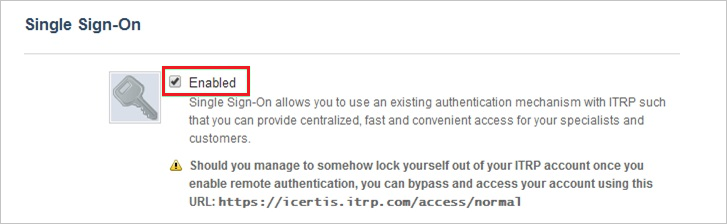

# Configure ITRP for Single sign-on with Microsoft Entra ID

In this article,  you learn how to integrate ITRP with Microsoft Entra ID. When you integrate ITRP with Microsoft Entra ID, you can:

* Control in Microsoft Entra ID who has access to ITRP.
* Enable your users to be automatically signed-in to ITRP with their Microsoft Entra accounts.
* Manage your accounts in one central location.

## Prerequisites
The scenario outlined in this article assumes that you already have the following prerequisites:

[!INCLUDE [common-prerequisites.md](~/identity/saas-apps/includes/common-prerequisites.md)]
* An ITRP subscription that has single sign-on enabled.

## Scenario description

In this article,  you configure and test Microsoft Entra single sign-on in a test environment.

* ITRP supports SP-initiated SSO.

## Add ITRP from the gallery

To configure the integration of ITRP into Microsoft Entra ID, you need to add ITRP from the gallery to your list of managed SaaS apps.

1. Sign in to the [Microsoft Entra admin center](https://entra.microsoft.com) as at least a [Cloud Application Administrator](~/identity/role-based-access-control/permissions-reference.md#cloud-application-administrator).
1. Browse to **Entra ID** > **Enterprise apps** > **New application**.
1. In the **Add from the gallery** section, type **ITRP** in the search box.
1. Select **ITRP** from results panel and then add the app. Wait a few seconds while the app is added to your tenant.

 Alternatively, you can also use the [Enterprise App Configuration Wizard](https://portal.office.com/AdminPortal/home?Q=Docs#/azureadappintegration). In this wizard, you can add an application to your tenant, add users/groups to the app, assign roles, and walk through the SSO configuration as well. [Learn more about Microsoft 365 wizards.](/microsoft-365/admin/misc/azure-ad-setup-guides)

## Configure and test Microsoft Entra SSO for ITRP

Configure and test Microsoft Entra SSO with ITRP using a test user called **B.Simon**. For SSO to work, you need to establish a link relationship between a Microsoft Entra user and the related user in ITRP.

To configure and test Microsoft Entra SSO with ITRP, perform the following steps:

1. **[Configure Microsoft Entra SSO](#configure-azure-ad-sso)** - to enable your users to use this feature.
    1. **Create a Microsoft Entra test user** - to test Microsoft Entra single sign-on with B.Simon.
    1. **Assign the Microsoft Entra test user** - to enable B.Simon to use Microsoft Entra single sign-on.
1. **[Configure ITRP SSO](#configure-itrp-sso)** - to configure the single sign-on settings on application side.
    1. **[Create an ITRP test user](#create-an-itrp-test-user)** - to have a counterpart of B.Simon in ITRP that's linked to the Microsoft Entra representation of user.
1. **[Test SSO](#test-sso)** - to verify whether the configuration works.

## Configure Microsoft Entra SSO

Follow these steps to enable Microsoft Entra SSO.

1. Sign in to the [Microsoft Entra admin center](https://entra.microsoft.com) as at least a [Cloud Application Administrator](~/identity/role-based-access-control/permissions-reference.md#cloud-application-administrator).
1. Browse to **Entra ID** > **Enterprise apps** > **ITRP** > **Single sign-on**.
1. On the **Select a single sign-on method** page, select **SAML**.
1. On the **Set up single sign-on with SAML** page, select the pencil icon for **Basic SAML Configuration** to edit the settings.

   

4. In the **Basic SAML Configuration** dialog box, perform the following steps.

    1. In the **Identifier (Entity ID)** textbox, type a URL using the following pattern:

       `https://<tenant-name>.itrp.com`

    1. In the **Sign on URL** textbox, type a URL using the following pattern:
    
       `https://<tenant-name>.itrp.com`   

	> [!NOTE]
	> These values are placeholders. You need to use the actual Identifier and Sign on URL. Contact the [ITRP support team](https://www.4me.com/support/) to get the values. You can also refer to the patterns shown in the **Basic SAML Configuration** dialog box.

5. In the **SAML Signing Certificate** section, select the **Edit** icon to open the **SAML Signing Certificate** dialog box:

	

6. In the **SAML Signing Certificate** dialog box, copy the **Thumbprint** value and save it:

    

7. In the **Set up ITRP** section, copy the appropriate URLs, based on your requirements:

	

[!INCLUDE [create-assign-users-sso.md](~/identity/saas-apps/includes/create-assign-users-sso.md)]

## Configure ITRP SSO

1. In a new web browser window, sign in to your ITRP company site as an admin.

1. At the top of the window, select the **Settings** icon:

    

1. In the left pane, select **Single Sign-On**:

    

1. In the **Single Sign-On** configuration section, take the following steps.

    

	1. Select **Enabled**.

	1. In the **Remote logout URL** box, paste the **Logout URL** value that you copied.

	1. In the **SAML SSO URL** box, paste the **Login URL** value that you copied.

	1. In the **Certificate fingerprint** box, paste the **Thumbprint** value of the certificate, which you copied.

    1. Select **Save**.

### Create an ITRP test user

To enable Microsoft Entra users to sign in to ITRP, you need to add them to ITRP. You need to add them manually.

To create a user account, take these steps:

1. Sign in to your ITRP tenant.

1. At the top of the window, select the **Records** icon:

    

1. In the menu, select **People**:

    

1. Select the plus sign (**+**) to add a new person:

    

1. In the **Add New Person** dialog box, take the following steps.

    

    1. Enter the name and email address of a valid Microsoft Entra account that you want to add.

    1. Select **Save**.

> [!NOTE]
> You can use any user account creation tool or API provided by ITRP to provision Microsoft Entra user accounts.

## Test SSO

In this section, you test your Microsoft Entra single sign-on configuration with following options. 

* Select **Test this application**, this option redirects to ITRP Sign-on URL where you can initiate the login flow. 

* Go to ITRP Sign-on URL directly and initiate the login flow from there.

* You can use Microsoft My Apps. When you select the ITRP tile in the My Apps, this option redirects to ITRP Sign-on URL. For more information, see [Microsoft Entra My Apps](/azure/active-directory/manage-apps/end-user-experiences#azure-ad-my-apps).

## Related content

Once you configure ITRP you can enforce session control, which protects exfiltration and infiltration of your organization’s sensitive data in real time. Session control extends from Conditional Access. [Learn how to enforce session control with Microsoft Defender for Cloud Apps](/cloud-app-security/proxy-deployment-aad).
