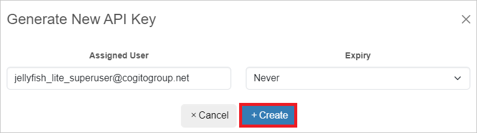

# Tutorial: Configure Jellyfish for automatic user provisioning

This tutorial describes the steps you need to perform in both Jellyfish and Microsoft Entra ID to configure automatic user provisioning. When configured, Microsoft Entra ID automatically provisions and deprovisions users to [Jellyfish](https://cogitogroup.net/jellyfish/) using the Microsoft Entra provisioning service. For important details on what this service does, how it works, and frequently asked questions, see [Automate user provisioning and deprovisioning to SaaS applications with Microsoft Entra ID](~/identity/app-provisioning/user-provisioning.md). 

## Supported capabilities
> [!div class="checklist"]
> * Create users in Jellyfish.
> * Remove users in Jellyfish when they do not require access anymore.
> * Keep user attributes synchronized between Microsoft Entra ID and Jellyfish.
> * [Single sign-on](~/identity/enterprise-apps/add-application-portal-setup-oidc-sso.md) to Jellyfish (recommended).

## Prerequisites

The scenario outlined in this tutorial assumes that you already have the following prerequisites:

* [A Microsoft Entra tenant](~/identity-platform/quickstart-create-new-tenant.md) 
* One of the following roles: [Application Administrator](/entra/identity/role-based-access-control/permissions-reference#application-administrator), [Cloud Application Administrator](/entra/identity/role-based-access-control/permissions-reference#cloud-application-administrator), or [Application Owner](/entra/fundamentals/users-default-permissions#owned-enterprise-applications).
* A user account in Jellyfish with Admin permissions.

## Step 1: Plan your provisioning deployment
* Learn about [how the provisioning service works](~/identity/app-provisioning/user-provisioning.md).
* Determine who will be in [scope for provisioning](~/identity/app-provisioning/define-conditional-rules-for-provisioning-user-accounts.md).
* Determine what data to [map between Microsoft Entra ID and Jellyfish](~/identity/app-provisioning/customize-application-attributes.md).

## Step 2: Generate Credential for provisioning

1. Login to the **Jellyfish** portal and navigate to **Key Management > API Keys**.
2. Click on **Generate New**

   

3. Search for the admin account created as part of the prerequisites and click **Create**. (Optionally) set an expiry, noting that the credential *must* be updated once expired.

   

4. The API key will be downloaded, ensure that this key is kept safe as this will grant access to the user account it was generated for. It is recommended to delete the downloaded API key once user provisioning is configured.

## Step 3: Add Jellyfish from the Microsoft Entra application gallery

Add Jellyfish from the Microsoft Entra application gallery to start managing provisioning to Jellyfish. If you have previously setup Jellyfish for SSO, you can use the same application. However it's recommended that you create a separate app when testing out the integration initially. Learn more about adding an application from the gallery [here](~/identity/enterprise-apps/add-application-portal.md). 

## Step 4: Define who will be in scope for provisioning 

The Microsoft Entra provisioning service allows you to scope who will be provisioned based on assignment to the application and or based on attributes of the user. If you choose to scope who will be provisioned to your app based on assignment, you can use the following [steps](~/identity/enterprise-apps/assign-user-or-group-access-portal.md) to assign users to the application. If you choose to scope who will be provisioned based solely on attributes of the user, you can use a scoping filter as described [here](~/identity/app-provisioning/define-conditional-rules-for-provisioning-user-accounts.md). 

* Start small. Test with a small set of users before rolling out to everyone. When scope for provisioning is set to assigned users, you can control this by assigning one or two users to the app. When scope is set to all users, you can specify an [attribute based scoping filter](~/identity/app-provisioning/define-conditional-rules-for-provisioning-user-accounts.md).

* If you need more roles, you can [update the application manifest](~/identity-platform/howto-add-app-roles-in-apps.md) to add new roles.

## Step 5: Configure automatic user provisioning to Jellyfish 

This section guides you through the steps to configure the Microsoft Entra provisioning service to create, update, and disable users in Jellyfish based on user assignments in Microsoft Entra ID.

### To configure automatic user provisioning for Jellyfish in Microsoft Entra ID:

1. Sign in to the [Microsoft Entra admin center](https://entra.microsoft.com) as at least a [Cloud Application Administrator](~/identity/role-based-access-control/permissions-reference.md#cloud-application-administrator).
1. Browse to **Identity** > **Applications** > **Enterprise applications**

	

1. In the applications list, select **Jellyfish**.

	

1. Select the **Provisioning** tab.

	

1. Set the **Provisioning Mode** to **Automatic**.

	

1. In the **Admin Credentials** section, enter the **Tenant Url** which will be in the form of **https://\<organisation\>.securesme.com**. This will be the same address used to log in to the Jellyfish portal. For the *Secret Token* input the API key generated earlier in step 2. Then click on Authorize, make sure that you enter your Jellyfish account's Admin credentials. Click **Test Connection** to ensure Microsoft Entra ID can connect to Jellyfish. If the connection fails, ensure your Jellyfish account has Admin permissions and try again.

 	

1. In the **Notification Email** field, enter the email address of a person who should receive the provisioning error notifications and select the **Send an email notification when a failure occurs** check box.

	

1. Select **Save**.

1. Under the **Mappings** section, select **Synchronize Microsoft Entra users to Jellyfish**.

1. Review the user attributes that are synchronized from Microsoft Entra ID to Jellyfish in the **Attribute-Mapping** section. The attributes selected as **Matching** properties are used to match the user accounts in Jellyfish for update operations. If you choose to change the [matching target attribute](~/identity/app-provisioning/customize-application-attributes.md), you need to ensure that the Jellyfish API supports filtering users based on that attribute. Select the **Save** button to commit any changes.

      |Attribute|Type|Supported for filtering|Required by Jellyfish|
      |---|---|---|---|
      |userName|String|&check;|&check;
      |active|Boolean||&check;
      |title|String||
      |emails[type eq "work"].value|String||
      |name.givenName|String||
      |name.familyName|String||

1. To configure scoping filters, refer to the following instructions provided in the [Scoping filter tutorial](~/identity/app-provisioning/define-conditional-rules-for-provisioning-user-accounts.md).

1. To enable the Microsoft Entra provisioning service for Jellyfish, change the **Provisioning Status** to **On** in the **Settings** section.

	

1. Define the users that you would like to provision to Jellyfish by choosing the desired values in **Scope** in the **Settings** section.

	

1. When you're ready to provision, click **Save**.

	

This operation starts the initial synchronization cycle of all users defined in **Scope** in the **Settings** section. The initial cycle takes longer to perform than subsequent cycles, which occur approximately every 40 minutes as long as the Microsoft Entra provisioning service is running. 

## Step 6: Monitor your deployment
Once you've configured provisioning, use the following resources to monitor your deployment:

* Use the [provisioning logs](~/identity/monitoring-health/concept-provisioning-logs.md) to determine which users have been provisioned successfully or unsuccessfully
* Check the [progress bar](~/identity/app-provisioning/application-provisioning-when-will-provisioning-finish-specific-user.md) to see the status of the provisioning cycle and how close it's to completion
* If the provisioning configuration seems to be in an unhealthy state, the application goes into quarantine. Learn more about quarantine states [here](~/identity/app-provisioning/application-provisioning-quarantine-status.md).

## More resources

* [Managing user account provisioning for Enterprise Apps](~/identity/app-provisioning/configure-automatic-user-provisioning-portal.md)
* [What is application access and single sign-on with Microsoft Entra ID?](~/identity/enterprise-apps/what-is-single-sign-on.md)

## Next steps

* [Learn how to review logs and get reports on provisioning activity](~/identity/app-provisioning/check-status-user-account-provisioning.md)