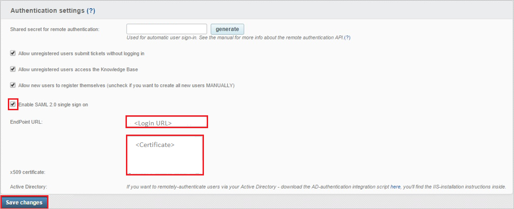
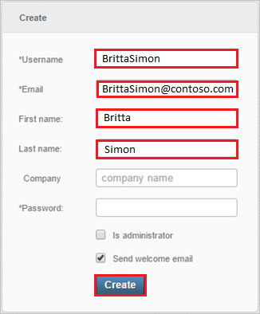

# Microsoft Entra integration with Jitbit Helpdesk

In this article,  you learn how to integrate Jitbit Helpdesk with Microsoft Entra ID. When you integrate Jitbit Helpdesk with Microsoft Entra ID, you can:

* Control in Microsoft Entra ID who has access to Jitbit Helpdesk.
* Enable your users to be automatically signed-in to Jitbit Helpdesk with their Microsoft Entra accounts.
* Manage your accounts in one central location.

## Prerequisites
The scenario outlined in this article assumes that you already have the following prerequisites:
[!INCLUDE [common-prerequisites.md](~/identity/saas-apps/includes/common-prerequisites.md)]
* Jitbit Helpdesk single sign-on (SSO) enabled subscription.

> [!NOTE]
> This integration is also available to use from Microsoft Entra US Government Cloud environment. You can find this application in the Microsoft Entra US Government Cloud Application Gallery and configure it in the same way as you do from public cloud.

## Scenario description

In this article,  you configure and test Microsoft Entra single sign-on in a test environment.

* Jitbit Helpdesk supports **SP** initiated SSO.

> [!NOTE]
> Identifier of this application is a fixed string value so only one instance can be configured in one tenant.

## Add Jitbit Helpdesk from the gallery

To configure the integration of Jitbit Helpdesk into Microsoft Entra ID, you need to add Jitbit Helpdesk from the gallery to your list of managed SaaS apps.

1. Sign in to the [Microsoft Entra admin center](https://entra.microsoft.com) as at least a [Cloud Application Administrator](~/identity/role-based-access-control/permissions-reference.md#cloud-application-administrator).
1. Browse to **Entra ID** > **Enterprise apps** > **New application**.
1. In the **Add from the gallery** section, type **Jitbit Helpdesk** in the search box.
1. Select **Jitbit Helpdesk** from results panel and then add the app. Wait a few seconds while the app is added to your tenant.

 Alternatively, you can also use the [Enterprise App Configuration Wizard](https://portal.office.com/AdminPortal/home?Q=Docs#/azureadappintegration). In this wizard, you can add an application to your tenant, add users/groups to the app, assign roles, and walk through the SSO configuration as well. [Learn more about Microsoft 365 wizards.](/microsoft-365/admin/misc/azure-ad-setup-guides)

## Configure and test Microsoft Entra SSO for Jitbit Helpdesk

Configure and test Microsoft Entra SSO with Jitbit Helpdesk using a test user called **B.Simon**. For SSO to work, you need to establish a link relationship between a Microsoft Entra user and the related user in Jitbit Helpdesk.

To configure and test Microsoft Entra SSO with Jitbit Helpdesk, perform the following steps:

1. **[Configure Microsoft Entra SSO](#configure-azure-ad-sso)** - to enable your users to use this feature.
    1. **Create a Microsoft Entra test user** - to test Microsoft Entra single sign-on with B.Simon.
    1. **Assign the Microsoft Entra test user** - to enable B.Simon to use Microsoft Entra single sign-on.
1. **[Configure Jitbit Helpdesk SSO](#configure-jitbit-helpdesk-sso)** - to configure the single sign-on settings on application side.
    1. **[Create Jitbit Helpdesk test user](#create-jitbit-helpdesk-test-user)** - to have a counterpart of B.Simon in Jitbit Helpdesk that's linked to the Microsoft Entra representation of user.
1. **[Test SSO](#test-sso)** - to verify whether the configuration works.

## Configure Microsoft Entra SSO

Follow these steps to enable Microsoft Entra SSO.

1. Sign in to the [Microsoft Entra admin center](https://entra.microsoft.com) as at least a [Cloud Application Administrator](~/identity/role-based-access-control/permissions-reference.md#cloud-application-administrator).
1. Browse to **Entra ID** > **Enterprise apps** > **Jitbit Helpdesk** > **Single sign-on**.
1. On the **Select a single sign-on method** page, select **SAML**.
1. On the **Set up single sign-on with SAML** page, select the pencil icon for **Basic SAML Configuration** to edit the settings.

   

1. On the **Basic SAML Configuration** section, perform the following steps:

	a. In the **Sign on URL** text box, type one of the URLs using the following pattern:
	| |
    | ----------------------------------------|
	| `https://<hostname>/helpdesk/User/Login`|
	| `https://<tenant-name>.Jitbit.com`|
	| |
    
	> [!NOTE] 
	> This value isn't real. Update this value with the actual Sign-On URL. Contact [Jitbit Helpdesk Client support team](https://www.jitbit.com/support/) to get this value.

    b. In the **Identifier (Entity ID)** text box, type the URL:
    `https://www.jitbit.com/web-helpdesk/`

1. On the **Set up Single Sign-On with SAML** page, in the **SAML Signing Certificate** section, select **Download** to download the **Certificate (Base64)** from the given options as per your requirement and save it on your computer.

	

6. In the **Set up Jitbit Helpdesk** section, copy the appropriate URL(s) as per your requirement.

	

[!INCLUDE [create-assign-users-sso.md](~/identity/saas-apps/includes/create-assign-users-sso.md)]

## Configure Jitbit Helpdesk SSO

1. In a different web browser window, sign in to your Jitbit Helpdesk company site as an administrator.

1. In the toolbar on the top, select **Administration**.

    

1. Select **General settings**.

    

1. In the **Authentication settings** configuration section, perform the following steps:

    

	a. Select **Enable SAML 2.0 single sign on**, to sign in using Single Sign-On (SSO), with **OneLogin**.

	b. In the **EndPoint URL** textbox, paste the value of **Login URL**..

	c. Open your **base-64** encoded certificate in notepad, copy the content of it into your clipboard, and then paste it to the **X.509 Certificate** textbox

	d. Select **Save changes**.

### Create Jitbit Helpdesk test user

In order to enable Microsoft Entra users to sign in to Jitbit Helpdesk, they must be provisioned into Jitbit Helpdesk. In the case of Jitbit Helpdesk, provisioning is a manual task.

**To provision a user account, perform the following steps:**

1. Sign in to your **Jitbit Helpdesk** tenant.

1. In the menu on the top, select **Administration**.

    

1. Select **Users, companies and permissions**.

    

1. Select **Add user**.

    

1. In the Create section, type the data of the Microsoft Entra account you want to provision as follows:

    

   a. In the **Username** textbox, type the username of the user like **BrittaSimon**.

   b. In the **Email** textbox, type email of the user like **BrittaSimon@contoso.com**.

   c. In the **First Name** textbox, type first name of the user like **Britta**.

   d. In the **Last Name** textbox, type last name of the user like **Simon**.

   e. Select **Create**.

> [!NOTE]
> You can use any other Jitbit Helpdesk user account creation tools or APIs provided by Jitbit Helpdesk to provision Microsoft Entra user accounts.

## Test SSO

In this section, you test your Microsoft Entra single sign-on configuration with following options. 

* Select **Test this application**, this option redirects to Jitbit Helpdesk Sign-on URL where you can initiate the login flow. 

* Go to Jitbit Helpdesk Sign-on URL directly and initiate the login flow from there.

* You can use Microsoft My Apps. When you select the Jitbit Helpdesk tile in the My Apps, this option redirects to Jitbit Helpdesk Sign-on URL. For more information about the My Apps, see [Introduction to the My Apps](https://support.microsoft.com/account-billing/sign-in-and-start-apps-from-the-my-apps-portal-2f3b1bae-0e5a-4a86-a33e-876fbd2a4510).

## Related content

Once you configure Jitbit Helpdesk you can enforce session control, which protects exfiltration and infiltration of your organization’s sensitive data in real time. Session control extends from Conditional Access. [Learn how to enforce session control with Microsoft Defender for Cloud Apps](/cloud-app-security/proxy-deployment-any-app).
