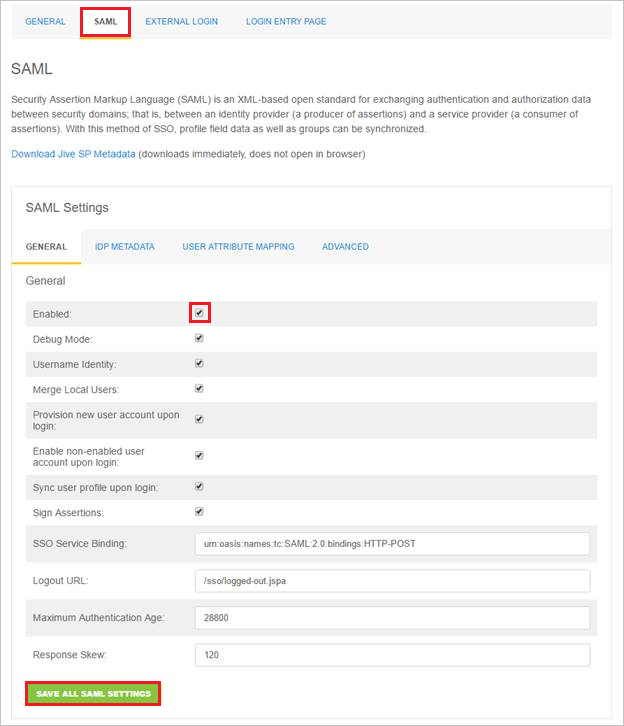
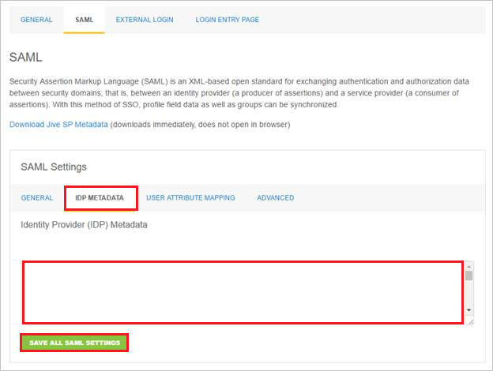
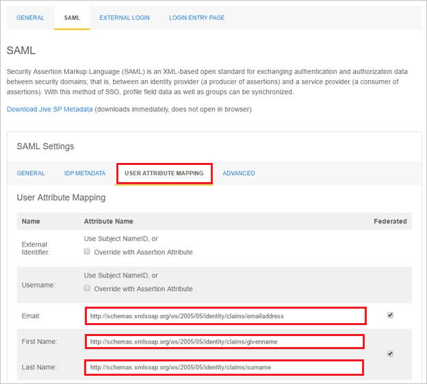

# Configure Jive for Single sign-on with Microsoft Entra ID

In this article,  you learn how to integrate Jive with Microsoft Entra ID. When you integrate Jive with Microsoft Entra ID, you can:

* Control in Microsoft Entra ID who has access to Jive.
* Enable your users to be automatically signed-in to Jive with their Microsoft Entra accounts.
* Manage your accounts in one central location.

## Prerequisites
The scenario outlined in this article assumes that you already have the following prerequisites:

[!INCLUDE [common-prerequisites.md](~/identity/saas-apps/includes/common-prerequisites.md)]
* Jive single sign-on (SSO) enabled subscription.

## Scenario description

In this article,  you configure and test Microsoft Entra SSO in a test environment.

* Jive supports **SP** initiated SSO.
* Jive supports [**Automated** user provisioning](jive-provisioning-tutorial.md).

## Add Jive from the gallery

To configure the integration of Jive into Microsoft Entra ID, you need to add Jive from the gallery to your list of managed SaaS apps.

1. Sign in to the [Microsoft Entra admin center](https://entra.microsoft.com) as at least a [Cloud Application Administrator](~/identity/role-based-access-control/permissions-reference.md#cloud-application-administrator).
1. Browse to **Entra ID** > **Enterprise apps** > **New application**.
1. In the **Add from the gallery** section, type **Jive** in the search box.
1. Select **Jive** from results panel and then add the app. Wait a few seconds while the app is added to your tenant.

 Alternatively, you can also use the [Enterprise App Configuration Wizard](https://portal.office.com/AdminPortal/home?Q=Docs#/azureadappintegration). In this wizard, you can add an application to your tenant, add users/groups to the app, assign roles, and walk through the SSO configuration as well. [Learn more about Microsoft 365 wizards.](/microsoft-365/admin/misc/azure-ad-setup-guides)


<a name='configure-and-test-azure-ad-sso-for-jive'></a>

## Configure and test Microsoft Entra SSO for Jive

Configure and test Microsoft Entra SSO with Jive using a test user called **B.Simon**. For SSO to work, you need to establish a link relationship between a Microsoft Entra user and the related user in Jive.

To configure and test Microsoft Entra SSO with Jive, perform the following steps:

1. **[Configure Microsoft Entra SSO](#configure-azure-ad-sso)** - to enable your users to use this feature.
    1. **Create a Microsoft Entra test user** - to test Microsoft Entra single sign-on with B.Simon.
    1. **Assign the Microsoft Entra test user** - to enable B.Simon to use Microsoft Entra single sign-on.
1. **[Configure Jive SSO](#configure-jive-sso)** - to configure the single sign-on settings on application side.
    1. **[Create Jive test user](#create-jive-test-user)** - to have a counterpart of B.Simon in Jive that's linked to the Microsoft Entra representation of user.
1. **[Test SSO](#test-sso)** - to verify whether the configuration works.

<a name='configure-azure-ad-sso'></a>

## Configure Microsoft Entra SSO

Follow these steps to enable Microsoft Entra SSO.

1. Sign in to the [Microsoft Entra admin center](https://entra.microsoft.com) as at least a [Cloud Application Administrator](~/identity/role-based-access-control/permissions-reference.md#cloud-application-administrator).
1. Browse to **Entra ID** > **Enterprise apps** > **Jive** > **Single sign-on**.
1. On the **Select a single sign-on method** page, select **SAML**.
1. On the **Set up single sign-on with SAML** page, select the pencil icon for **Basic SAML Configuration** to edit the settings.

   

1. On the **Basic SAML Configuration** section, enter the values for the following fields:

   a. In the **Sign on URL** text box, type a URL using the following pattern:
    `https://<instance name>.jivecustom.com`

   b. In the **Identifier (Entity ID)** text box, type a URL using the following pattern:
   ```http
   https://<instance name>.jiveon.com
   ```

	> [!NOTE]
	> These values aren't real. Update these values with the actual Sign on URL and Identifier. Contact [Jive Client support team](https://www.jivesoftware.com/services-support/) to get these values. You can also refer to the patterns shown in the **Basic SAML Configuration** section.

1. On the **Set up Single Sign-On with SAML** page, in the **SAML Signing Certificate** section, select **Download** to download the **Federation Metadata XML** from the given options as per your requirement and save it on your computer.

	

6. On the **Set up Jive** section, copy the appropriate URL(s) as per your requirement.

	

<a name='create-an-azure-ad-test-user'></a>

[!INCLUDE [create-assign-users-sso.md](~/identity/saas-apps/includes/create-assign-users-sso.md)]

## Configure Jive SSO

1. To configure single sign-on on **Jive** side, sign-on to your Jive tenant as an administrator.

1. In the menu on the top, Select **SAML**.

	

	a. Select **Enabled** under the **General** tab.

	b. Select the **SAVE ALL SAML SETTINGS** button.

1. Navigate to the **IDP METADATA** tab.

    

    a. Copy the content of the downloaded metadata XML file, and then paste it into the **Identity Provider (IDP) Metadata** textbox.

	b. Select the **SAVE ALL SAML SETTINGS** button.

1. Select **USER ATTRIBUTE MAPPING** tab.

    

    a. In the **Email** textbox, copy and paste the attribute name of **mail** value.

    b. In the **First Name** textbox, copy and paste the attribute name of **givenname** value.

    c. In the **Last Name** textbox, copy and paste the attribute name of **surname** value.

### Create Jive test user

The objective of this section is to create a user called Britta Simon in Jive. Jive supports automatic user provisioning, which is by default enabled. You can find more details [here](jive-provisioning-tutorial.md) on how to configure automatic user provisioning.

If you need to create user manually, work with [Jive Client support team](https://www.jivesoftware.com/services-support/) to add the users in the Jive platform.

## Test SSO 

In this section, you test your Microsoft Entra single sign-on configuration with following options. 

* Select **Test this application**, this option redirects to Jive Sign-on URL where you can initiate the login flow. 

* Go to Jive Sign-on URL directly and initiate the login flow from there.

* You can use Microsoft My Apps. When you select the Jive tile in the My Apps, this option redirects to Jive Sign-on URL. For more information about the My Apps, see [Introduction to the My Apps](https://support.microsoft.com/account-billing/sign-in-and-start-apps-from-the-my-apps-portal-2f3b1bae-0e5a-4a86-a33e-876fbd2a4510).

## Related content

Once you configure Jive you can enforce session control, which protects exfiltration and infiltration of your organization’s sensitive data in real time. Session control extends from Conditional Access. [Learn how to enforce session control with Microsoft Defender for Cloud Apps](/cloud-app-security/proxy-deployment-any-app).
