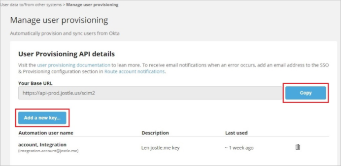
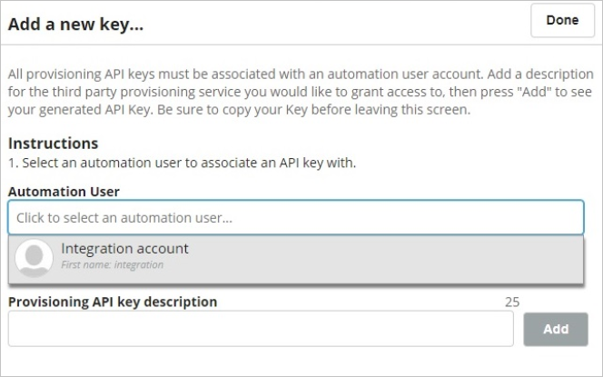

# Configure Jostle for automatic user provisioning with Microsoft Entra ID

This article describes the steps you need to perform in both Jostle and Microsoft Entra ID to configure automatic user provisioning. When configured, Microsoft Entra ID automatically provisions and de-provisions users and groups to [Jostle](https://www.jostle.me/) using the Microsoft Entra provisioning service. For important details on what this service does, how it works, and frequently asked questions, see [Automate user provisioning and deprovisioning to SaaS applications with Microsoft Entra ID](~/identity/app-provisioning/user-provisioning.md). 

## Capabilities Supported
> [!div class="checklist"]
> * Create users in Jostle
> * Remove users in Jostle when they don't require access anymore
> * Keep user attributes synchronized between Microsoft Entra ID and Jostle
> * [Single sign-on](jostle-tutorial.md) to Jostle (recommended)

## Prerequisites

The scenario outlined in this article assumes that you already have the following prerequisites:

* [!INCLUDE [common-prerequisites.md](~/identity/saas-apps/includes/common-prerequisites.md)]
* A [Jostle tenant](https://www.jostle.me/).
* A user account in Jostle with Admin permissions.

## Step 1: Plan your provisioning deployment

1. Learn about [how the provisioning service works](~/identity/app-provisioning/user-provisioning.md).
1. Determine who's in [scope for provisioning](~/identity/app-provisioning/define-conditional-rules-for-provisioning-user-accounts.md).
1. Determine what data to [map between Microsoft Entra ID and Jostle](~/identity/app-provisioning/customize-application-attributes.md).

## Step 2: Configure Jostle to support provisioning with Microsoft Entra ID

### Automation account

Before you begin, you’ll need to create an **Automation user** in your Jostle intranet. This is the account you’ll use to configure with Azure. Automation users can be created in Admin **Settings > User accounts and data > Manage Automation users**.

For more details on Automation users and how to create one, see [this article](https://forum.jostle.us/hc/en-us/articles/360057364073).

Once created, the Automation user account **must be activated** (that is, logged in to your intranet at least once) before it can be used to configure Azure.

### Manage user provisioning

Before you begin, ensure that your account subscription **includes SSO/user provisioning features**. If it doesn't, you can contact your Customer Success Manager <success@jostle.me> and they can assist you in adding it to your account.

The next step is to obtain the **API URL** and **API key** from Jostle:

1. Go to the Main Navigation and select **Admin Settings**.
1. Under **User data to/from other systems** select **Manage user provisioning** .If you don't see "Manage user provisioning" here and have verified that your account includes SSO/user provisioning, contact Support <support@jostle.me> to have this page enabled in your Admin Settings).
1. In the **User Provisioning API details** section, go to **Your Base URL** field, select the Copy button and save the URL somewhere you can easily access it later.                                                           

   
                
1. Next, select the **Add a new key**... button
1. On the following screen, go to the **Automation User** field and use the drop-down menu to select your Automation user account. 

                                                                                                                                        
1. In the **Provisioning API key description** field give your key a name (such as `Azure`) and then select the **Add** button.

1. Once your key is generated, **make sure to copy it right away** and save it where you saved your URL (since it's the only time your key appears).                                                               
1. Next, you’ll use the **API URL** and **API key** to configure the integration in Azure.

## Step 3: Add Jostle from the Microsoft Entra application gallery

Add Jostle from the Microsoft Entra application gallery to start managing provisioning to Jostle. If you have previously setup Jostle for SSO, you can use the same application. However it's recommended that you create a separate app when testing out the integration initially. Learn more about adding an application from the gallery [here](~/identity/enterprise-apps/add-application-portal.md). 

## Step 4: Define who is in scope for provisioning 

[!INCLUDE [create-assign-users-provisioning.md](~/identity/saas-apps/includes/create-assign-users-provisioning.md)]

## Step 5: Configure automatic user provisioning to Jostle 

This section guides you through the steps to configure the Microsoft Entra provisioning service to create, update, and disable users and groups in Jostle app based on user and group assignments in Microsoft Entra ID.

> [!NOTE]
> For more information on automatic user provisioning to Jostle, see [User-Provisioning-Azure-Integration](https://forum.jostle.us/hc/en-us/articles/360056368534-User-Provisioning-Azure-Integration).

### To configure automatic user provisioning for Jostle in Microsoft Entra ID:

1. Sign in to the [Microsoft Entra admin center](https://entra.microsoft.com) as at least a [Cloud Application Administrator](~/identity/role-based-access-control/permissions-reference.md#cloud-application-administrator).
1. Browse to **Entra ID** > **Enterprise apps**

	

1. In the applications list, select **Jostle**.

	

1. Select the **Provisioning** tab and select **Get Started**.

	

1. Select **+ New configuration**.

	

1. In the **Tenant URL** field, enter your Jostle Tenant URL and Secret Token. Select **Test Connection** to ensure Microsoft Entra ID can connect to Jostle. If the connection fails, ensure your Jostle account has the required admin permissions and try again.

   

1. Select **Create** to create your configuration.

1. Select **Properties** on the **Overview** page.

1. In the **Notification Email** field, enter the email address of a person who should receive the provisioning error notifications and select the **Send an email notification when a failure occurs** check box.

   

1. Select **Attribute Mapping** in the left panel and select **users**.

1. Review the user attributes that are synchronized from Microsoft Entra ID to Jostle in the **Attribute-Mapping** section. The attributes selected as **Matching** properties are used to match the user accounts in Jostle for update operations. If you choose to change the [matching target attribute](~/identity/app-provisioning/customize-application-attributes.md), you need to ensure that the Jostle API supports filtering users based on that attribute. Select the **Save** button to commit any changes.

   |Attribute|Type|Supported for filtering|
   |---|---|---|
   |userName|String|&check;|
   |active|Boolean||
   |name.givenName|String||
   |name.familyName|String||
   |emails[type eq "work"].value|String||
   |emails[type eq "personal"].value|String||
   |emails[type eq "alternate1"].value|String||
   |emails[type eq "alternate2"].value|String||
   |urn:ietf:params:scim:schemas:extension:jostle:2.0:User:alternateEmail1Label|String||
   |urn:ietf:params:scim:schemas:extension:jostle:2.0:User:alternateEmail2Label|String||

1. To configure scoping filters, refer to the instructions provided in the [Scoping filter article](~/identity/app-provisioning/define-conditional-rules-for-provisioning-user-accounts.md).

1. Use [on-demand provisioning](~/identity/app-provisioning/provision-on-demand.md) to validate sync with a small number of users before deploying more broadly in your organization.

1. When you're ready to provision, select **Start Provisioning** from the **Overview** page.

## Step 6: Monitor your deployment

[!INCLUDE [monitor-deployment.md](~/identity/saas-apps/includes/monitor-deployment.md)]

## More resources

* [Managing user account provisioning for enterprise apps](~/identity/app-provisioning/configure-automatic-user-provisioning-portal.md)
* [What is application access and single sign-on with Microsoft Entra ID?](~/identity/enterprise-apps/what-is-single-sign-on.md)

## Related content

* [Learn how to review logs and get reports on provisioning activity](~/identity/app-provisioning/check-status-user-account-provisioning.md)
