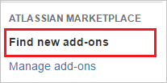
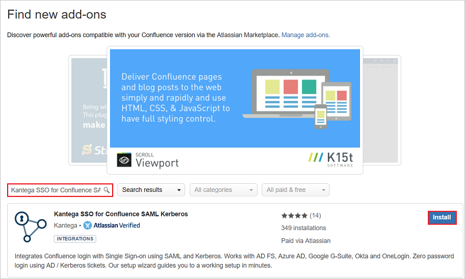
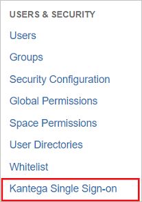
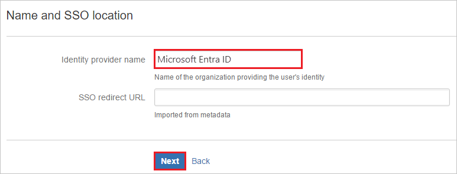
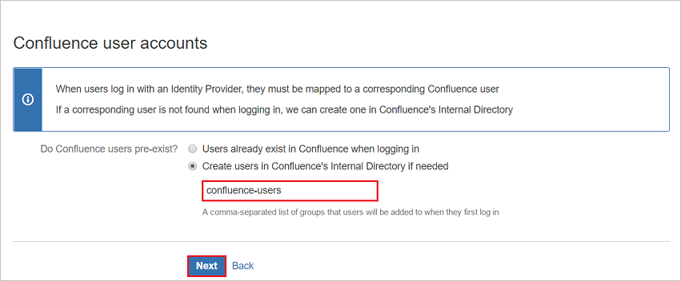

# Microsoft Entra SSO integration with Kantega SSO for Confluence

In this article,  you learn how to integrate Kantega SSO for Confluence with Microsoft Entra ID. When you integrate Kantega SSO for Confluence with Microsoft Entra ID, you can:

* Control in Microsoft Entra ID who has access to Kantega SSO for Confluence.
* Enable your users to be automatically signed-in to Kantega SSO for Confluence with their Microsoft Entra accounts.
* Manage your accounts in one central location.

## Prerequisites
The scenario outlined in this article assumes that you already have the following prerequisites:
[!INCLUDE [common-prerequisites.md](~/identity/saas-apps/includes/common-prerequisites.md)]
* Kantega SSO for Confluence single sign-on enabled subscription.

## Scenario description

In this article,  you configure and test Microsoft Entra single sign-on in a test environment.

* Kantega SSO for Confluence supports **SP and IDP** initiated SSO.

## Add Kantega SSO for Confluence from the gallery

To configure the integration of Kantega SSO for Confluence into Microsoft Entra ID, you need to add Kantega SSO for Confluence from the gallery to your list of managed SaaS apps.

1. Sign in to the [Microsoft Entra admin center](https://entra.microsoft.com) as at least a [Cloud Application Administrator](~/identity/role-based-access-control/permissions-reference.md#cloud-application-administrator).
1. Browse to **Entra ID** > **Enterprise apps** > **New application**.
1. In the **Add from the gallery** section, type **Kantega SSO for Confluence** in the search box.
1. Select **Kantega SSO for Confluence** from results panel and then add the app. Wait a few seconds while the app is added to your tenant.

 Alternatively, you can also use the [Enterprise App Configuration Wizard](https://portal.office.com/AdminPortal/home?Q=Docs#/azureadappintegration). In this wizard, you can add an application to your tenant, add users/groups to the app, assign roles, and walk through the SSO configuration as well. [Learn more about Microsoft 365 wizards.](/microsoft-365/admin/misc/azure-ad-setup-guides)

## Configure and test Microsoft Entra SSO for Kantega SSO for Confluence

Configure and test Microsoft Entra SSO with Kantega SSO for Confluence using a test user called **B.Simon**. For SSO to work, you need to establish a link relationship between a Microsoft Entra user and the related user in Kantega SSO for Confluence.

To configure and test Microsoft Entra SSO with Kantega SSO for Confluence, perform the following steps:

1. **[Configure Microsoft Entra SSO](#configure-azure-ad-sso)** - to enable your users to use this feature.
    1. **Create a Microsoft Entra test user** - to test Microsoft Entra single sign-on with B.Simon.
    1. **Assign the Microsoft Entra test user** - to enable B.Simon to use Microsoft Entra single sign-on.
1. **[Configure Kantega SSO for Confluence SSO](#configure-kantega-sso-for-confluence-sso)** - to configure the single sign-on settings on application side.
    1. **[Create Kantega SSO for Confluence test user](#create-kantega-sso-for-confluence-test-user)** - to have a counterpart of B.Simon in Kantega SSO for Confluence that's linked to the Microsoft Entra representation of user.
1. **[Test SSO](#test-sso)** - to verify whether the configuration works.

## Configure Microsoft Entra SSO

Follow these steps to enable Microsoft Entra SSO.

1. Sign in to the [Microsoft Entra admin center](https://entra.microsoft.com) as at least a [Cloud Application Administrator](~/identity/role-based-access-control/permissions-reference.md#cloud-application-administrator).
1. Browse to **Entra ID** > **Enterprise apps** > **Kantega SSO for Confluence** > **Single sign-on**.
1. On the **Select a single sign-on method** page, select **SAML**.
1. On the **Set up single sign-on with SAML** page, select the pencil icon for **Basic SAML Configuration** to edit the settings.

   

1. On the **Basic SAML Configuration** section, if you wish to configure the application in **IDP** initiated mode, perform the following steps:

    a. In the **Identifier** text box, type a URL using the following pattern:
    `https://<server-base-url>/plugins/servlet/no.kantega.saml/sp/<uniqueid>/login`

    b. In the **Reply URL** text box, type a URL using the following pattern:
    `https://<server-base-url>/plugins/servlet/no.kantega.saml/sp/<uniqueid>/login`

5. Select **Set additional URLs** and perform the following step if you wish to configure the application in **SP** initiated mode:

    In the **Sign-on URL** text box, type a URL using the following pattern:
    `https://<server-base-url>/plugins/servlet/no.kantega.saml/sp/<uniqueid>/login`

	> [!NOTE]
	> These values aren't real. Update these values with the actual Identifier, Reply URL and Sign-On URL. These values are received during the configuration of Confluence plugin, which is explained later in the article.

6. On the **Set up Single Sign-On with SAML** page, in the **SAML Signing Certificate** section, select **Download** to download the **Federation Metadata XML** from the given options as per your requirement and save it on your computer.

	

7. On the **Set up Kantega SSO for Confluence** section, copy the appropriate URL(s) as per your requirement.

	

[!INCLUDE [create-assign-users-sso.md](~/identity/saas-apps/includes/create-assign-users-sso.md)]

## Configure Kantega SSO for Confluence SSO

1. In a different web browser window, sign in to your **Confluence admin portal** as an administrator.

1. Hover on cog and select the **Add-ons**.

	

1. Under **ATLASSIAN MARKETPLACE** tab, select **Find new add-ons**.

	

1. Search **Kantega SSO for Confluence SAML Kerberos** and select **Install** button to install the new SAML plugin.

	

1. The plugin installation starts.

	

1. Once the installation is complete. Select **Close**.

	

1. In the **Kantega SSO for Confluence SAML Kerberos** page, select **Manage**.

1. Select **Configure** to configure the new plugin.

	

1. This new plugin can also be found under **USERS & SECURITY** tab.

	

1. In the **SAML** section, select **Microsoft Entra ID** from the **Add identity provider** dropdown.

1. In the **Kantega Single Sign-on** page, select **Basic**.

1. On the **App properties** section, perform following steps:

	

	a. Copy the **App ID URI** value and use it as **Identifier, Reply URL, and Sign-On URL** on the **Basic SAML Configuration** section in Azure portal.

	b. Select **Next**.

1. On the **Metadata import** section, select **Metadata file on my computer**.

1. Select **Browse file** to upload the metadata file that you previously downloaded, then select **Next**.

1. On the **Name and SSO location** section, perform following steps:

	

	a. Add Name of the Identity Provider in **Identity provider name** textbox (such as Microsoft Entra ID).

	b. Select **Next**.

1. Verify the Signing certificate and select **Next**.

	

1. On the **Confluence user accounts** section, perform following steps:

	

	a. Select **Create users in Confluence's internal Directory if needed** and enter the appropriate name of the group for users (can be multiple no. of groups separated by comma).

	b. Select **Next**.

1. Select **Finish**.

1. On the **Known domains for Microsoft Entra ID** section, perform following steps: 

	a. Select **Known domains** from the left panel of the page.

	b. Enter domain name in the **Known domains** textbox.

	c. Select **Save**.

### Create Kantega SSO for Confluence test user

To enable Microsoft Entra users to sign in to Confluence, they must be provisioned into Confluence. In the case of Kantega SSO for Confluence, provisioning is a manual task.

**To provision a user account, perform the following steps:**

1. Sign in to your Kantega SSO for Confluence company site as an administrator.

1. Hover on cog and select the **User management**.

    

1. Under Users section, select **Add Users** tab. On the **Add a User** dialog page, perform the following steps:

	

	a. In the **Username** textbox, type the email of user like Brittasimon@contoso.com.

	b. In the **Full Name** textbox, type the full name of user like Britta Simon.

	c. In the **Email** textbox, type the email address of user like Brittasimon@contoso.com.

	d. In the **Password** textbox, type the password for user.

	e. Select **Confirm Password** reenter the password.

	f. Select **Add** button.

## Test SSO

In this section, you test your Microsoft Entra single sign-on configuration with following options. 

#### SP initiated:

* Select **Test this application**, this option redirects to Kantega SSO for Confluence Sign on URL where you can initiate the login flow.  

* Go to Kantega SSO for Confluence Sign-on URL directly and initiate the login flow from there.

#### IDP initiated:

* Select **Test this application**, and you should be automatically signed in to the Kantega SSO for Confluence for which you set up the SSO. 

You can also use Microsoft My Apps to test the application in any mode. When you select the Kantega SSO for Confluence tile in the My Apps, if configured in SP mode you would be redirected to the application sign on page for initiating the login flow and if configured in IDP mode, you should be automatically signed in to the Kantega SSO for Confluence for which you set up the SSO. For more information, see [Microsoft Entra My Apps](/azure/active-directory/manage-apps/end-user-experiences#azure-ad-my-apps).

## Related content

Once you configure Kantega SSO for Confluence you can enforce session control, which protects exfiltration and infiltration of your organization’s sensitive data in real time. Session control extends from Conditional Access. [Learn how to enforce session control with Microsoft Defender for Cloud Apps](/cloud-app-security/proxy-deployment-aad).
