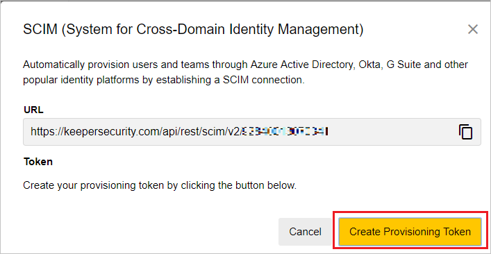
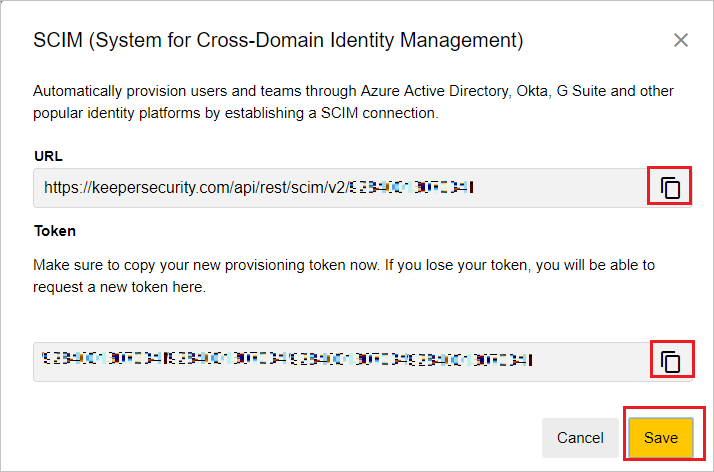
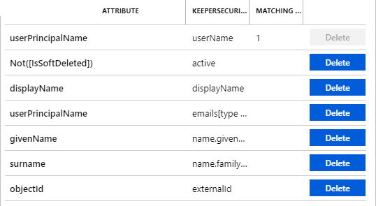

# Configure Keeper Password Manager & Digital Vault for automatic user provisioning

The objective of this article is to demonstrate the steps to be performed in Keeper Password Manager & Digital Vault and Microsoft Entra ID to configure Microsoft Entra ID to automatically provision and de-provision users and/or groups to Keeper Password Manager & Digital Vault.

> [!NOTE]
> This article describes a connector built on top of the Microsoft Entra user Provisioning Service. For important details on what this service does, how it works, and frequently asked questions, see [Automate user provisioning and deprovisioning to SaaS applications with Microsoft Entra ID](~/identity/app-provisioning/user-provisioning.md).
>

## Prerequisites

The scenario outlined in this article assumes that you already have the following prerequisites:

[!INCLUDE [common-prerequisites.md](~/identity/saas-apps/includes/common-prerequisites.md)]
* [A Keeper Password Manager & Digital Vault tenant](https://keepersecurity.com/pricing.html?t=e)
* A user account in Keeper Password Manager & Digital Vault with Admin permissions.

## Add Keeper Password Manager & Digital Vault from the gallery

Before configuring Keeper Password Manager & Digital Vault for automatic user provisioning with Microsoft Entra ID, you need to add Keeper Password Manager & Digital Vault from the Microsoft Entra application gallery to your list of managed SaaS applications.

**To add Keeper Password Manager & Digital Vault from the Microsoft Entra application gallery, perform the following steps:**

1. Sign in to the [Microsoft Entra admin center](https://entra.microsoft.com) as at least a [Cloud Application Administrator](~/identity/role-based-access-control/permissions-reference.md#cloud-application-administrator).
1. Browse to **Identity** > **Applications** > **Enterprise applications** > **New application**.
1. In the **Add from the gallery** section, type **Keeper Password Manager & Digital Vault**, select **Keeper Password Manager & Digital Vault** in the search box.
1. Select **Keeper Password Manager & Digital Vault** from results panel and then add the app. Wait a few seconds while the app is added to your tenant.
	

## Assigning users to Keeper Password Manager & Digital Vault

Microsoft Entra ID uses a concept called *assignments* to determine which users should receive access to selected apps. In the context of automatic user provisioning, only the users and/or groups that have been assigned to an application in Microsoft Entra ID are synchronized.

Before configuring and enabling automatic user provisioning, you should decide which users and/or groups in Microsoft Entra ID need access to Keeper Password Manager & Digital Vault. Once decided, you can assign these users and/or groups to Keeper Password Manager & Digital Vault by following the instructions here:

* [Assign a user or group to an enterprise app](~/identity/enterprise-apps/assign-user-or-group-access-portal.md)

### Important tips for assigning users to Keeper Password Manager & Digital Vault

* It's recommended that a single Microsoft Entra user is assigned to Keeper Password Manager & Digital Vault to test the automatic user provisioning configuration. Additional users and/or groups may be assigned later.

* When assigning a user to Keeper Password Manager & Digital Vault, you must select any valid application-specific role (if available) in the assignment dialog. Users with the **Default Access** role are excluded from provisioning.

## Configuring automatic user provisioning to Keeper Password Manager & Digital Vault 

This section guides you through the steps to configure the Microsoft Entra provisioning service to create, update, and disable users and/or groups in Keeper Password Manager & Digital Vault based on user and/or group assignments in Microsoft Entra ID.

> [!TIP]
> You may also choose to enable SAML-based single sign-on for Keeper Password Manager & Digital Vault, following the instructions provided in the [Keeper Password Manager & Digital Vault single sign-on  article](keeperpasswordmanager-tutorial.md). Single sign-on can be configured independently of automatic user provisioning, though these two features complement each other.

### To configure automatic user provisioning for Keeper Password Manager & Digital Vault in Microsoft Entra ID:

1. Sign in to the [Microsoft Entra admin center](https://entra.microsoft.com) as at least a [Cloud Application Administrator](~/identity/role-based-access-control/permissions-reference.md#cloud-application-administrator).
1. Browse to **Identity** > **Applications** > **Enterprise applications**

	

1. In the applications list, select **Keeper Password Manager & Digital Vault**.

	

3. Select the **Provisioning** tab.

	

4. Set the **Provisioning Mode** to **Automatic**.

	

5. Under the **Admin Credentials** section, input the **Tenant URL** and **Secret Token** of your Keeper Password Manager & Digital Vault's account as described in Step 6.

6. Sign in to your [Keeper Admin Console](https://keepersecurity.com/console/#login). Select **Admin** and select an existing node or create a new one. Navigate to the **Provisioning** tab and select **Add Method**.

	

	Select **SCIM (System for Cross-Domain Identity Management**.

	

	Select **Create Provisioning Token**.

	

	Copy the values for **URL** and **Token** and paste them into **Tenant URL** and **Secret Token** in Microsoft Entra ID. Select **Save** to complete the provisioning setup on Keeper.

	

7. Upon populating the fields shown in Step 5, select **Test Connection** to ensure Microsoft Entra ID can connect to Keeper Password Manager & Digital Vault. If the connection fails, ensure your Keeper Password Manager & Digital Vault account has Admin permissions and try again.

	

8. In the **Notification Email** field, enter the email address of a person or group who should receive the provisioning error notifications and check the checkbox - **Send an email notification when a failure occurs**.

	

9. Select **Save**.

10. Under the **Mappings** section, select **Synchronize Microsoft Entra users to Keeper Password Manager & Digital Vault**.

11. Review the user attributes that are synchronized from Microsoft Entra ID to Keeper Password Manager & Digital Vault in the **Attribute Mapping** section. The attributes selected as **Matching** properties are used to match the user accounts in Keeper Password Manager & Digital Vault for update operations. Select the **Save** button to commit any changes.

	

12. Under the **Mappings** section, select **Synchronize Microsoft Entra groups to Keeper Password Manager & Digital Vault**.

13. Review the group attributes that are synchronized from Microsoft Entra ID to Keeper Password Manager & Digital Vault in the **Attribute Mapping** section. The attributes selected as **Matching** properties are used to match the groups in Keeper Password Manager & Digital Vault for update operations. Select the **Save** button to commit any changes.

	

14. To configure scoping filters, refer to the following instructions provided in the [Scoping filter  article](~/identity/app-provisioning/define-conditional-rules-for-provisioning-user-accounts.md).

15. To enable the Microsoft Entra provisioning service for Keeper Password Manager & Digital Vault, change the **Provisioning Status** to **On** in the **Settings** section.

	

16. Define the users and/or groups that you would like to provision to Keeper Password Manager & Digital Vault by choosing the desired values in **Scope** in the **Settings** section.

	

17. When you're ready to provision, select **Save**.

	

This operation starts the initial synchronization of all users and/or groups defined in **Scope** in the **Settings** section. The initial sync takes longer to perform than subsequent syncs, which occur approximately every 40 minutes as long as the Microsoft Entra provisioning service is running. You can use the **Synchronization Details** section to monitor progress and follow links to provisioning activity report, which describes all actions performed by the Microsoft Entra provisioning service on Keeper Password Manager & Digital Vault.

For more information on how to read the Microsoft Entra provisioning logs, see [Reporting on automatic user account provisioning](~/identity/app-provisioning/check-status-user-account-provisioning.md).

## Connector Limitations

* Keeper Password Manager & Digital Vault requires **emails** and **userName** to have the same source value, as any updates to either attributes will modify the other value.
* Keeper Password Manager & Digital Vault doesn't support user deletes, only disable. Disabled users appear as locked in the Keeper Admin Console UI.

## Additional resources

* [Managing user account provisioning for Enterprise Apps](~/identity/app-provisioning/configure-automatic-user-provisioning-portal.md)
* [What is application access and single sign-on with Microsoft Entra ID?](~/identity/enterprise-apps/what-is-single-sign-on.md)

## Related content

* [Learn how to review logs and get reports on provisioning activity](~/identity/app-provisioning/check-status-user-account-provisioning.md)
