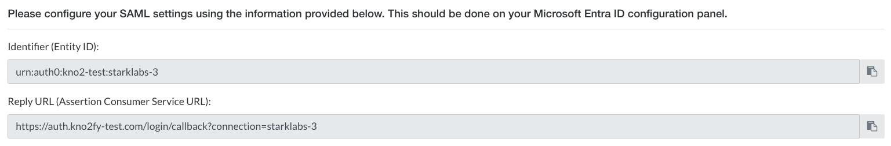

# Configure Kno2fy for Single sign-on with Microsoft Entra ID

In this article, you learn how to integrate Kno2fy with Microsoft Entra ID. Kno2fy empowers healthcare organizations to send, receive, and find patient information across the healthcare ecosystem with just a few quick selects. When you integrate Kno2fy with Microsoft Entra ID, you can:

* Control in Microsoft Entra ID who has access to Kno2fy.
* Enable your users to be automatically signed-in to Kno2fy with their Microsoft Entra accounts.
* Manage your accounts in one central location.

You'll configure and test Microsoft Entra single sign-on for Kno2fy in a test environment. Kno2fy supports only **SP** initiated single sign-on.

> [!NOTE]
> Identifier of this application is a fixed string value so only one instance can be configured in one tenant.

## Prerequisites

To integrate Microsoft Entra ID with Kno2fy, you need:

* A Microsoft Entra user account. If you don't already have one, you can [Create an account for free](https://azure.microsoft.com/free/?WT.mc_id=A261C142F).
* One of the following roles: [Application Administrator](/entra/identity/role-based-access-control/permissions-reference#application-administrator), [Cloud Application Administrator](/entra/identity/role-based-access-control/permissions-reference#cloud-application-administrator), or [Application Owner](/entra/fundamentals/users-default-permissions#owned-enterprise-applications).
* A Microsoft Entra subscription. If you don't have a subscription, you can get a [free account](https://azure.microsoft.com/free/).
* Kno2fy single sign-on (SSO) enabled subscription.

## Add application and assign a test user

Before you begin the process of configuring single sign-on, you need to add the Kno2fy application from the Microsoft Entra gallery. You need a test user account to assign to the application and test the single sign-on configuration.

### Add Kno2fy from the Microsoft Entra gallery

Add Kno2fy from the Microsoft Entra application gallery to configure single sign-on with Kno2fy. For more information on how to add application from the gallery, see the [Quickstart: Add application from the gallery](~/identity/enterprise-apps/add-application-portal.md).

### Create and assign Microsoft Entra test user

Follow the guidelines in the [create and assign a user account](~/identity/enterprise-apps/add-application-portal-assign-users.md) article to create a test user account called B.Simon.

Alternatively, you can also use the [Enterprise App Configuration Wizard](https://portal.office.com/AdminPortal/home?Q=Docs#/azureadappintegration). In this wizard, you can add an application to your tenant, add users/groups to the app, and assign roles. The wizard also provides a link to the single sign-on configuration pane. [Learn more about Microsoft 365 wizards.](/microsoft-365/admin/misc/azure-ad-setup-guides). 

## Access Microsoft Entra information in Kno2fy

1. Login to https://kno2fy.com as a Network Administrator.
1. Select the settings gear in the right-hand corner at the top of the screen.
1. Under Network, Select **Identity Provider**.
1. In the dropdown, Select **Microsoft Entra ID**.
1. Continue setup in [Configure Microsoft Entra SSO](#configure-microsoft-entra-sso) section below.
    
Kno2fy will display the information needed to setup the **Basic SAML Configuration**

## Configure Microsoft Entra SSO

Complete the following steps to enable Microsoft Entra single sign-on.

1. Sign in to the [Microsoft Entra admin center](https://entra.microsoft.com) as at least a [Cloud Application Administrator](~/identity/role-based-access-control/permissions-reference.md#cloud-application-administrator).
1. Browse to **Entra ID** > **Enterprise apps** > **Kno2fy** > **Single sign-on**.
1. On the **Select a single sign-on method** page, select **SAML**.
1. On the **Set up single sign-on with SAML** page, select the pencil icon for **Basic SAML Configuration** to edit the settings.

   

   To access the information to setup **Basic SAML Configuration** review the [Microsoft Entra Information Section](#access-microsoft-entra-information-in-kno2fy) above.

1. On the **Basic SAML Configuration** section, perform the following steps:

    a. In the **Identifier** textbox, paste the value from:
    `Identifier (Entity ID)`

    b. In the **Reply URL** textbox, paste the URL from:
    `Reply URL (Assertion Consumer Service URL)`

    c. In the **Sign on URL** textbox:

   > [!Note]
   > This value appears once the Kno2fy Identity Provider has been saved.
   > For now leave it blank.

1. Save the **Basic SAML Configuration** section. 
    
1. Scroll down and copy the **App Federation Metadata URL** generated.
1. Continue setup in the [Configure Kno2fy SSO](#configure-kno2fy-sso) section

## Configure Kno2fy SSO

1. Paste the **App Federation Metadata URL** from Microsoft Entra ID SSO setup into the **App Federation Metadata URL** field inside Kno2fy.
1. In the **Authentication Settings**, login without SSO is off by default.

   To allow time to conduct a login test, the **Allow non-admins to bypass SSO and login with a Kno2 username and password** setting can be enabled temporarily. It's recommended this setting remain off once SSO is fully enabled and setup.

1. Select the **Save** button to complete the setup.

Once complete, an **SSO Integration Activated** banner appears at the top of the screen.
Copy the URL and paste the URL into the **Sign on URL** section of the **Basic SAML Configuration** [Configure Microsoft Entra SSO](#configure-microsoft-entra-sso)

### Create Kno2fy test user

In this section, you create a user called Britta Simon at Kno2fy. Work with [Kno2fy support team](mailto:support@kno2.com) to add the users in the Kno2fy platform. Users must be created and activated before you use single sign-on.

## Test SSO 

In this section, you test your Microsoft Entra single sign-on configuration with following options. 

* Select **Test this application**, this option redirects to Kno2fy Sign-on URL where you can initiate the login flow. 

* Go to Kno2fy Sign-on URL directly and initiate the login flow from there.

* You can use Microsoft My Apps. When you select the Kno2fy tile in the My Apps, this option redirects to Kno2fy Sign-on URL. For more information, see [Microsoft Entra My Apps](/azure/active-directory/manage-apps/end-user-experiences#azure-ad-my-apps).

## Additional resources

* [What is single sign-on with Microsoft Entra ID?](~/identity/enterprise-apps/what-is-single-sign-on.md)
* [Plan a single sign-on deployment](~/identity/enterprise-apps/plan-sso-deployment.md).

## Related content

Once you configure Kno2fy you can enforce session control, which protects exfiltration and infiltration of your organization’s sensitive data in real time. Session control extends from Conditional Access. [Learn how to enforce session control with Microsoft Cloud App Security](/cloud-app-security/proxy-deployment-aad).
