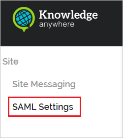
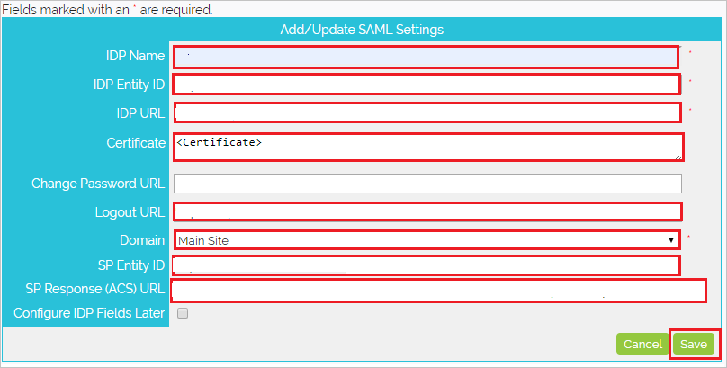

# Configure Knowledge Anywhere LMS for Single sign-on with Microsoft Entra ID

In this article,  you learn how to integrate Knowledge Anywhere LMS with Microsoft Entra ID. When you integrate Knowledge Anywhere LMS with Microsoft Entra ID, you can:

* Control in Microsoft Entra ID who has access to Knowledge Anywhere LMS.
* Enable your users to be automatically signed-in to Knowledge Anywhere LMS with their Microsoft Entra accounts.
* Manage your accounts in one central location.

## Prerequisites
The scenario outlined in this article assumes that you already have the following prerequisites:

[!INCLUDE [common-prerequisites.md](~/identity/saas-apps/includes/common-prerequisites.md)]
* Knowledge Anywhere LMS single sign-on (SSO) enabled subscription.

## Scenario description

In this article,  you configure and test Microsoft Entra SSO in a test environment. 
* Knowledge Anywhere LMS supports **SP** initiated SSO.
* Knowledge Anywhere LMS supports **Just In Time** user provisioning.

## Add Knowledge Anywhere LMS from the gallery

To configure the integration of Knowledge Anywhere LMS into Microsoft Entra ID, you need to add Knowledge Anywhere LMS from the gallery to your list of managed SaaS apps.

1. Sign in to the [Microsoft Entra admin center](https://entra.microsoft.com) as at least a [Cloud Application Administrator](~/identity/role-based-access-control/permissions-reference.md#cloud-application-administrator).
1. Browse to **Entra ID** > **Enterprise apps** > **New application**.
1. In the **Add from the gallery** section, type **Knowledge Anywhere LMS** in the search box.
1. Select **Knowledge Anywhere LMS** from results panel and then add the app. Wait a few seconds while the app is added to your tenant.

 Alternatively, you can also use the [Enterprise App Configuration Wizard](https://portal.office.com/AdminPortal/home?Q=Docs#/azureadappintegration). In this wizard, you can add an application to your tenant, add users/groups to the app, assign roles, and walk through the SSO configuration as well. [Learn more about Microsoft 365 wizards.](/microsoft-365/admin/misc/azure-ad-setup-guides)

## Configure and test Microsoft Entra SSO for Knowledge Anywhere LMS

Configure and test Microsoft Entra SSO with Knowledge Anywhere LMS using a test user called **B.Simon**. For SSO to work, you need to establish a link relationship between a Microsoft Entra user and the related user in Knowledge Anywhere LMS.

To configure and test Microsoft Entra SSO with Knowledge Anywhere LMS, perform the following steps:

1. **[Configure Microsoft Entra SSO](#configure-azure-ad-sso)** - to enable your users to use this feature.
    1. **Create a Microsoft Entra test user** - to test Microsoft Entra single sign-on with B.Simon.
    1. **Assign the Microsoft Entra test user** - to enable B.Simon to use Microsoft Entra single sign-on.
1. **[Configure Knowledge Anywhere LMS SSO](#configure-knowledge-anywhere-lms-sso)** - to configure the single sign-on settings on application side.
    1. **[Create Knowledge Anywhere LMS test user](#create-knowledge-anywhere-lms-test-user)** - to have a counterpart of B.Simon in Knowledge Anywhere LMS that's linked to the Microsoft Entra representation of user.
1. **[Test SSO](#test-sso)** - to verify whether the configuration works.

## Configure Microsoft Entra SSO

Follow these steps to enable Microsoft Entra SSO.

1. Sign in to the [Microsoft Entra admin center](https://entra.microsoft.com) as at least a [Cloud Application Administrator](~/identity/role-based-access-control/permissions-reference.md#cloud-application-administrator).
1. Browse to **Entra ID** > **Enterprise apps** > **Knowledge Anywhere LMS** application integration page, find the **Manage** section and select **Single sign-on**.
1. On the **Select a Single sign-on method** page, select **SAML**.
1. On the **Set up Single Sign-On with SAML** page, select the pencil icon for **Basic SAML Configuration** to edit the settings.

   

1. On the **Basic SAML Configuration** section, if you wish to configure the application in **IDP** initiated mode, perform the following steps:

    1. In the **Identifier** text box, type a URL using the following pattern:
    `https://<CLIENT_NAME>.knowledgeanywhere.com/`

    1. In the **Reply URL** text box, type a URL using the following pattern:
    `https://<CLIENT_NAME>.knowledgeanywhere.com/SSO/SAML/Response.aspx?<IDP_NAME>`

    > [!NOTE]
    > These values aren't real. Update these values with the actual Identifier and Reply URL which is explained later in the article.

1. Select **Set additional URLs** and perform the following step if you wish to configure the application in **SP** initiated mode:

    In the **Sign-on URL** text box, type a URL using the following pattern:
    `https://<CLIENTNAME>.knowledgeanywhere.com/`

	> [!NOTE]
	> The Sign-on URL value isn't real. Update this value with the actual Sign-on URL. Contact [Knowledge Anywhere LMS Client support team](https://knowany.zendesk.com/hc/en-us/articles/360000469034-SAML-2-0-Single-Sign-On-SSO-Set-Up-Guide) to get this value. You can also refer to the patterns shown in the **Basic SAML Configuration** section.

1. On the **Set up Single Sign-On with SAML** page, in the **SAML Signing Certificate** section, find **Certificate (Base64)** and select **Download** to download the certificate and save it on your computer.

   

1. On the **Set up Knowledge Anywhere LMS** section, copy the appropriate URL(s) based on your requirement.

   

[!INCLUDE [create-assign-users-sso.md](~/identity/saas-apps/includes/create-assign-users-sso.md)]

## Configure Knowledge Anywhere LMS SSO

1. In a different web browser window, sign in to your Knowledge Anywhere LMS company site as an administrator

4. Select the **Site** tab.

    

5. Select the **SAML Settings** tab.

    

6. Select the **Add New**.

    

7. On the **Add/Update SAML Settings** page, perform the following steps:

    

    a. Enter the IDP Name as per your organization. For ex:- `Azure`.

    b. In the **IDP Entity ID** textbox, paste **Microsoft Entra Identifier** value ,which you have copied from Azure portal.

    c. In the **IDP URL** textbox, paste **Login URL** value.

    d. Open the downloaded certificate file into notepad, copy the content of the certificate and paste it into **Certificate** textbox.

    e. In the **Logout URL** textbox, paste **Logout URL** value.

    f. Select **Main Site** from the dropdown for the **Domain**.

    g. Copy the **SP Entity ID** value and paste it into **Identifier** text box in the **Basic SAML Configuration** section.

    h. Copy the **SP Response(ACS) URL** value and paste it into **Reply URL** text box in the **Basic SAML Configuration** section.

    i. Select **Save**.

### Create Knowledge Anywhere LMS test user

In this section, a user called B. Simon is created in Knowledge Anywhere LMS. Knowledge Anywhere LMS supports just-in-time user provisioning, which is enabled by default. There's no action item for you in this section. If a user doesn't already exist in Knowledge Anywhere LMS, a new one is created after authentication.

## Test SSO

In this section, you test your Microsoft Entra single sign-on configuration with following options. 

* Select **Test this application**, this option redirects to Knowledge Anywhere LMS Sign-on URL where you can initiate the login flow. 

* Go to Knowledge Anywhere LMS Sign-on URL directly and initiate the login flow from there.

* You can use Microsoft My Apps. When you select the Knowledge Anywhere LMS tile in the My Apps, this option redirects to Knowledge Anywhere LMS Sign-on URL. For more information about the My Apps, see [Introduction to the My Apps](https://support.microsoft.com/account-billing/sign-in-and-start-apps-from-the-my-apps-portal-2f3b1bae-0e5a-4a86-a33e-876fbd2a4510).

## Related content

Once you configure Knowledge Anywhere LMS you can enforce session control, which protects exfiltration and infiltration of your organization’s sensitive data in real time. Session control extends from Conditional Access. [Learn how to enforce session control with Microsoft Defender for Cloud Apps](/cloud-app-security/proxy-deployment-aad).
