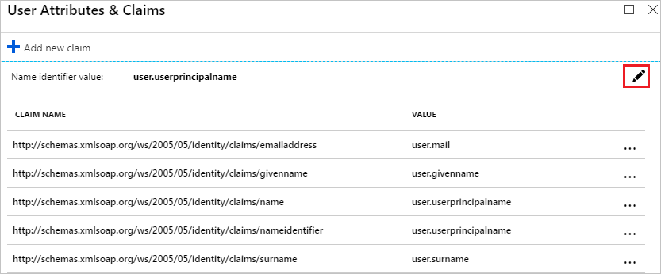
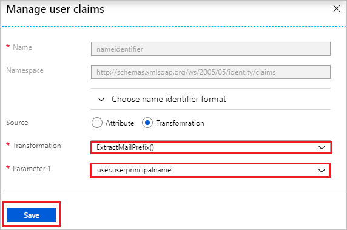

# Configure Kronos for Single sign-on with Microsoft Entra ID

In this article,  you learn how to integrate Kronos with Microsoft Entra ID. When you integrate Kronos with Microsoft Entra ID, you can:

* Control in Microsoft Entra ID who has access to Kronos.
* Enable your users to be automatically signed-in to Kronos with their Microsoft Entra accounts.
* Manage your accounts in one central location.

## Prerequisites
The scenario outlined in this article assumes that you already have the following prerequisites:

[!INCLUDE [common-prerequisites.md](~/identity/saas-apps/includes/common-prerequisites.md)]
* Kronos single sign-on (SSO) enabled subscription.

## Scenario description

In this article,  you configure and test Microsoft Entra SSO in a test environment.

* Kronos supports **IDP** initiated SSO

## Adding Kronos from the gallery

To configure the integration of Kronos into Microsoft Entra ID, you need to add Kronos from the gallery to your list of managed SaaS apps.

1. Sign in to the [Microsoft Entra admin center](https://entra.microsoft.com) as at least a [Cloud Application Administrator](~/identity/role-based-access-control/permissions-reference.md#cloud-application-administrator).
1. Browse to **Entra ID** > **Enterprise apps** > **New application**.
1. In the **Add from the gallery** section, type **Kronos** in the search box.
1. Select **Kronos** from results panel and then add the app. Wait a few seconds while the app is added to your tenant.

 Alternatively, you can also use the [Enterprise App Configuration Wizard](https://portal.office.com/AdminPortal/home?Q=Docs#/azureadappintegration). In this wizard, you can add an application to your tenant, add users/groups to the app, assign roles, and walk through the SSO configuration as well. [Learn more about Microsoft 365 wizards.](/microsoft-365/admin/misc/azure-ad-setup-guides)

## Configure and test Microsoft Entra SSO for Kronos

Configure and test Microsoft Entra SSO with Kronos using a test user called **B.Simon**. For SSO to work, you need to establish a link relationship between a Microsoft Entra user and the related user in Kronos.

To configure and test Microsoft Entra SSO with Kronos, perform the following steps:

1. **[Configure Microsoft Entra SSO](#configure-azure-ad-sso)** - to enable your users to use this feature.
	1. **Create a Microsoft Entra test user** - to test Microsoft Entra single sign-on with B.Simon.
	1. **Assign the Microsoft Entra test user** - to enable B.Simon to use Microsoft Entra single sign-on.
1. **[Configure Kronos SSO](#configure-kronos-sso)** - to configure the Single Sign-On settings on application side.
	1. **[Create Kronos test user](#create-kronos-test-user)** - to have a counterpart of B.Simon in Kronos that's linked to the Microsoft Entra representation of user.
1. **[Test SSO](#test-sso)** - to verify whether the configuration works.

## Configure Microsoft Entra SSO

Follow these steps to enable Microsoft Entra SSO.

1. Sign in to the [Microsoft Entra admin center](https://entra.microsoft.com) as at least a [Cloud Application Administrator](~/identity/role-based-access-control/permissions-reference.md#cloud-application-administrator).
1. Browse to **Entra ID** > **Enterprise apps** > **Kronos** application integration page, find the **Manage** section and select **Single sign-on**.
1. On the **Select a Single sign-on method** page, select **SAML**.
1. On the **Set up Single Sign-On with SAML** page, select the pencil icon for **Basic SAML Configuration** to edit the settings.

   

1. On the **Set up Single Sign-On with SAML** page, enter the values for the following fields:

    a. In the **Identifier** text box, type a URL using the following pattern:
    `https://<company name>.kronos.net/`

    b. In the **Reply URL** text box, type a URL using the following pattern:
    `https://<company name>.kronos.net/wfc/navigator/logonWithUID`

	> [!NOTE]
	> These values aren't real. Update these values with the actual Identifier and Reply URL. Contact [Kronos Client support team](https://www.kronos.in/contact/en-in/form) to get these values. You can also refer to the patterns shown in the **Basic SAML Configuration** section.

1. Kronos application expects the SAML assertions in a specific format. Configure the following claims for this application. You can manage the values of these attributes from the **User Attributes** section on application integration page. On the **Set up Single Sign-On with SAML** page, select **Edit** button to open **User Attributes** dialog.

	

1. In the **User Claims** section on the **User Attributes** dialog, configure SAML token attribute as shown in the image above and perform the following steps:

	a. Select **Edit icon** to open the **Manage user claims** dialog.

	

	

	b. From the **Transformation** list, select **ExtractMailPrefix()**.

	c. From the **Parameter 1** list, select **user.userprincipalname**.

	d. Select **Save**.

1. On the **Set up Single Sign-On with SAML** page, in the **SAML Signing Certificate** section,  find **Federation Metadata XML** and select **Download** to download the certificate and save it on your computer.

	

1. On the **Set up Kronos** section, copy the appropriate URL(s) based on your requirement.

	

[!INCLUDE [create-assign-users-sso.md](~/identity/saas-apps/includes/create-assign-users-sso.md)]

## Configure Kronos SSO

To configure single sign-on on **Kronos** side, you need to send the downloaded **Federation Metadata XML** and appropriate copied URLs from the application configuration to [Kronos support team](https://www.kronos.in/contact/en-in/form). They set this setting to have the SAML SSO connection set properly on both sides.

### Create Kronos test user

In this section, you create a user called Britta Simon in Kronos. Work with [Kronos support team](https://www.kronos.in/contact/en-in/form) to add the users in the Kronos platform. Users must be created and activated before you use single sign-on.

## Test SSO

In this section, you test your Microsoft Entra single sign-on configuration with following options.

* Select **Test this application**, and you should be automatically signed in to the Kronos for which you set up the SSO

* You can use Microsoft My Apps. When you select the Kronos tile in the My Apps, you should be automatically signed in to the Kronos for which you set up the SSO. For more information about the My Apps, see [Introduction to the My Apps](https://support.microsoft.com/account-billing/sign-in-and-start-apps-from-the-my-apps-portal-2f3b1bae-0e5a-4a86-a33e-876fbd2a4510).

## Related content

Once you configure Kronos you can enforce Session control, which protects exfiltration and infiltration of your organization’s sensitive data in real time. Session control extends from Conditional Access. [Learn how to enforce session control with Microsoft Defender for Cloud Apps](/cloud-app-security/proxy-deployment-aad).
