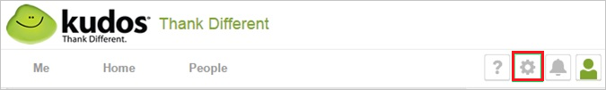
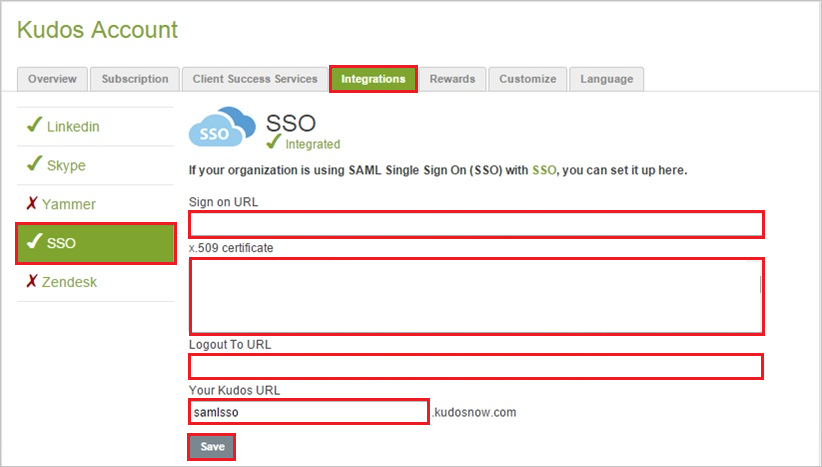
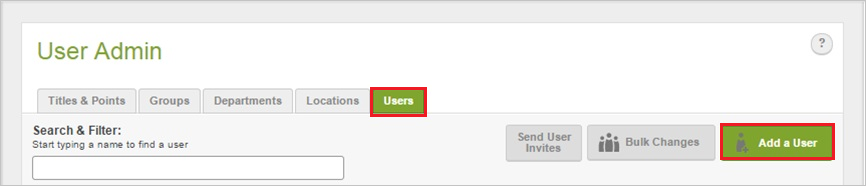
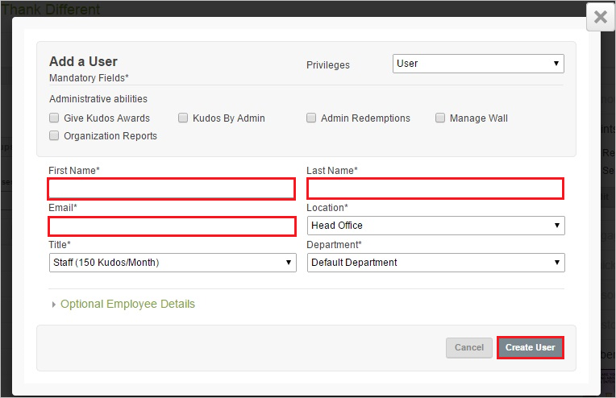

# Configure Kudos for Single sign-on with Microsoft Entra ID

In this article,  you learn how to integrate Kudos with Microsoft Entra ID. When you integrate Kudos with Microsoft Entra ID, you can:

* Control in Microsoft Entra ID who has access to Kudos.
* Enable your users to be automatically signed-in to Kudos with their Microsoft Entra accounts.
* Manage your accounts in one central location.

## Prerequisites
The scenario outlined in this article assumes that you already have the following prerequisites:

[!INCLUDE [common-prerequisites.md](~/identity/saas-apps/includes/common-prerequisites.md)]
* Kudos single sign-on enabled subscription.

## Scenario description

In this article,  you configure and test Microsoft Entra single sign-on in a test environment.

* Kudos supports **SP** initiated SSO.

> [!NOTE]
> Identifier of this application is a fixed string value so only one instance can be configured in one tenant.

## Add Kudos from the gallery

To configure the integration of Kudos into Microsoft Entra ID, you need to add Kudos from the gallery to your list of managed SaaS apps.

1. Sign in to the [Microsoft Entra admin center](https://entra.microsoft.com) as at least a [Cloud Application Administrator](~/identity/role-based-access-control/permissions-reference.md#cloud-application-administrator).
1. Browse to **Entra ID** > **Enterprise apps** > **New application**.
1. In the **Add from the gallery** section, type **Kudos** in the search box.
1. Select **Kudos** from results panel and then add the app. Wait a few seconds while the app is added to your tenant.

 Alternatively, you can also use the [Enterprise App Configuration Wizard](https://portal.office.com/AdminPortal/home?Q=Docs#/azureadappintegration). In this wizard, you can add an application to your tenant, add users/groups to the app, assign roles, and walk through the SSO configuration as well. [Learn more about Microsoft 365 wizards.](/microsoft-365/admin/misc/azure-ad-setup-guides)

## Configure and test Microsoft Entra SSO for Kudos

Configure and test Microsoft Entra SSO with Kudos using a test user called **B.Simon**. For SSO to work, you need to establish a link relationship between a Microsoft Entra user and the related user in Kudos.

To configure and test Microsoft Entra SSO with Kudos, perform the following steps:

1. **[Configure Microsoft Entra SSO](#configure-azure-ad-sso)** - to enable your users to use this feature.
    1. **Create a Microsoft Entra test user** - to test Microsoft Entra single sign-on with B.Simon.
    1. **Assign the Microsoft Entra test user** - to enable B.Simon to use Microsoft Entra single sign-on.
1. **[Configure Kudos SSO](#configure-kudos-sso)** - to configure the single sign-on settings on application side.
    1. **[Create Kudos test user](#create-kudos-test-user)** - to have a counterpart of B.Simon in Kudos that's linked to the Microsoft Entra representation of user.
1. **[Test SSO](#test-sso)** - to verify whether the configuration works.

## Configure Microsoft Entra SSO

Follow these steps to enable Microsoft Entra SSO.

1. Sign in to the [Microsoft Entra admin center](https://entra.microsoft.com) as at least a [Cloud Application Administrator](~/identity/role-based-access-control/permissions-reference.md#cloud-application-administrator).
1. Browse to **Entra ID** > **Enterprise apps** > **Kudos** > **Single sign-on**.
1. On the **Select a single sign-on method** page, select **SAML**.
1. On the **Set up single sign-on with SAML** page, select the pencil icon for **Basic SAML Configuration** to edit the settings.

   

1. On the **Basic SAML Configuration** section, perform the following step:

    In the **Sign-on URL** text box, type a URL using the following pattern:
    `https://<COMPANY>.kudosnow.com`

	> [!NOTE]
	> The value isn't real. Update the value with the actual Sign-On URL. Contact [Kudos Client support team](http://success.kudosnow.com/home) to get the value. You can also refer to the patterns shown in the **Basic SAML Configuration** section.

1. On the **Set up Single Sign-On with SAML** page, in the **SAML Signing Certificate** section, select **Download** to download the **Certificate (Base64)** from the given options as per your requirement and save it on your computer.

	

1. On the **Set up Kudos** section, copy the appropriate URL(s) as per your requirement.

	

[!INCLUDE [create-assign-users-sso.md](~/identity/saas-apps/includes/create-assign-users-sso.md)]

## Configure Kudos SSO

1. In a different web browser window, sign into your Kudos company site as an administrator.

1. In the menu on the top, select **Settings icon**.

    

1. Select **Integrations > SSO** and perform the following steps:

    

    a. In **Sign on URL** textbox, paste the value of  **Login URL**..

    b. Open your base-64 encoded certificate in notepad, copy the content of it into your clipboard, and then paste it to the **X.509 certificate** textbox

    c. In **Logout To URL** textbox, paste the value of  **Logout URL**..

    d. In the **Your Kudos URL** textbox, type your company name.

    e. Select **Save**.

### Create Kudos test user

In order to enable Microsoft Entra users to sign in to Kudos, they must be provisioned into Kudos. In the case of Kudos, provisioning is a manual task.

**To provision a user account, perform the following steps:**

1. Sign in to your **Kudos** company site as administrator.

1. In the menu on the top, select **Settings icon**.

   

1. Select **User Admin**.

1. Select the **Users** tab, and then select **Add a User**.

   

1. In the **Add a User** section, perform the following steps:

    

    a. Type the **First Name**, **Last Name**, **Email** and other details of a valid Microsoft Entra account you want to provision into the related textboxes.

    b. Select **Create User**.

> [!NOTE]
> You can use any other Kudos user account creation tools or APIs provided by Kudos to provision Microsoft Entra user accounts.

## Test SSO

In this section, you test your Microsoft Entra single sign-on configuration with following options. 

* Select **Test this application**, this option redirects to Kudos Sign-on URL where you can initiate the login flow. 

* Go to Kudos Sign-on URL directly and initiate the login flow from there.

* You can use Microsoft My Apps. When you select the Kudos tile in the My Apps, this option redirects to Kudos Sign-on URL. For more information about the My Apps, see [Introduction to the My Apps](https://support.microsoft.com/account-billing/sign-in-and-start-apps-from-the-my-apps-portal-2f3b1bae-0e5a-4a86-a33e-876fbd2a4510).

## Related content

Once you configure Kudos you can enforce session control, which protects exfiltration and infiltration of your organization’s sensitive data in real time. Session control extends from Conditional Access. [Learn how to enforce session control with Microsoft Defender for Cloud Apps](/cloud-app-security/proxy-deployment-aad).
