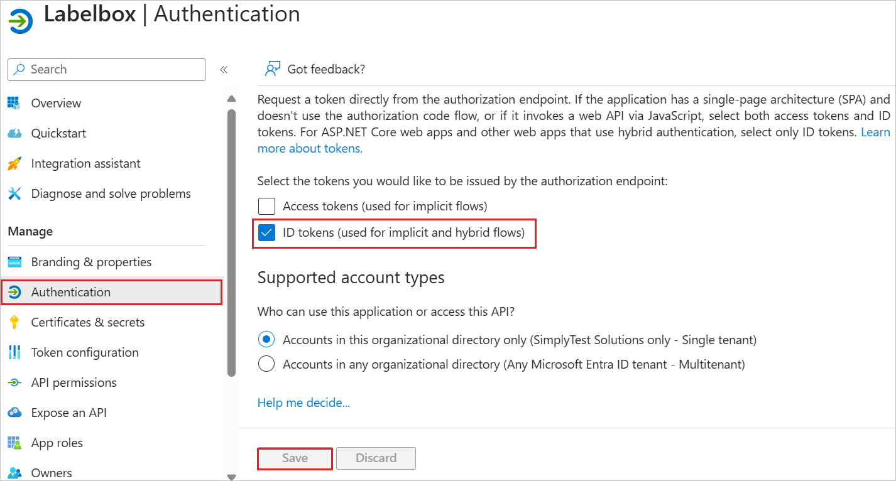

# Configure Labelbox for Single sign-on with Microsoft Entra ID

In this article,  you learn how to integrate Labelbox with Microsoft Entra ID. When you integrate Labelbox with Microsoft Entra ID, you can:

Use Microsoft Entra ID to control who can access Labelbox.
Enable your users to be automatically signed in to Labelbox with their Microsoft Entra accounts.
Manage your accounts in one central location: the Azure portal.

## Prerequisites
The scenario outlined in this article assumes that you already have the following prerequisites:

[!INCLUDE [common-prerequisites.md](~/identity/saas-apps/includes/common-prerequisites.md)]
* Labelbox single sign-on (SSO) enabled subscription.

## Add Labelbox from the gallery

To configure the integration of Labelbox into Microsoft Entra ID, you need to add Labelbox from the gallery to your list of managed SaaS apps.

1. Sign in to the [Microsoft Entra admin center](https://entra.microsoft.com) as at least a [Cloud Application Administrator](~/identity/role-based-access-control/permissions-reference.md#cloud-application-administrator).

1. Browse to **Entra ID** > **Enterprise apps** > **New application**.

1. In the **Add from the gallery** section, enter **Labelbox** in the search box.

1. Select **Labelbox** in the results panel and then add the app. Wait a few seconds while the app is added to your tenant.

## Configure Microsoft Entra SSO

Follow these steps to enable Microsoft Entra SSO in the Microsoft Entra admin center.

1. Sign in to the [Microsoft Entra admin center](https://entra.microsoft.com) as at least a [Cloud Application Administrator](~/identity/role-based-access-control/permissions-reference.md#cloud-application-administrator).

1. Browse to **Entra ID** > **Enterprise apps** > **Labelbox** > **Single sign-on**.

1. Perform the following steps in the below section:

    a. Select **Go to application**.

    

    b. Copy **Application (client) ID** and use it later in the Labelbox side configuration.

    

    c. Under **Endpoints** tab, copy **OpenID Connect metadata document** link and use it later in the Labelbox side configuration.
    
    

1. Navigate to **Authentication** tab on the left menu and perform the following steps:

    a. Enable the **ID tokens (used for implicit and hybrid flows)** checkbox.

    

    b. select **Save**.

    >[!NOTE]
    > The **Redirect URIs** value will auto populate, you don't need to perform any manual configuration here.

1. Navigate to **Certificates & secrets** on the left menu and perform the following steps:

    1. Go to **Client secrets** tab and select **+New client secret**.
    1. Enter a valid **Description** in the textbox and select **Expires** days from the drop-down as per your requirement and select **Add**.

        

    1. Once you add a client secret, **Value** is generated. Copy the value and use it later in the Labelbox side configuration.

        

[!INCLUDE [create-assign-users-sso.md](~/identity/saas-apps/includes/create-assign-users-sso.md)]

## Configure Labelbox SSO

To complete the OAuth/OIDC federation setup on **Labelbox** side, you need to send the copied values like Client ID, Client Secret and OIDC Metadata file from Entra to [Labelbox support team](mailto:support@labelbox.com). They set this setting to have the OIDC connection set properly on both sides.