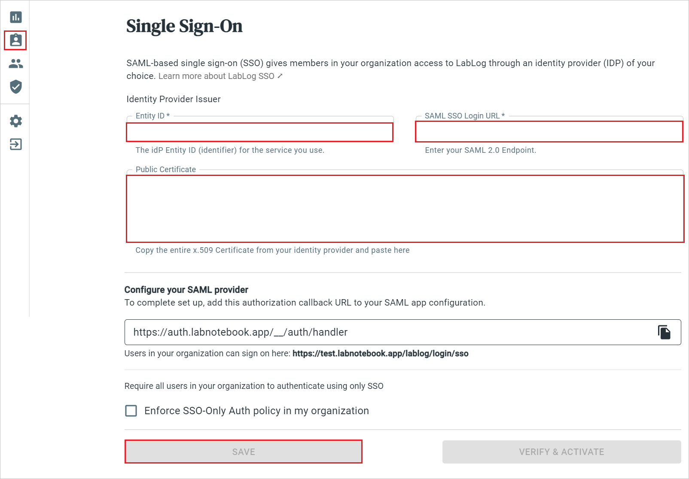

# Configure LabLog for Single sign-on with Microsoft Entra ID

In this article,  you learn how to integrate LabLog with Microsoft Entra ID. When you integrate LabLog with Microsoft Entra ID, you can:

* Control in Microsoft Entra ID who has access to LabLog.
* Enable your users to be automatically signed-in to LabLog with their Microsoft Entra accounts.
* Manage your accounts in one central location.

## Prerequisites
The scenario outlined in this article assumes that you already have the following prerequisites:

[!INCLUDE [common-prerequisites.md](~/identity/saas-apps/includes/common-prerequisites.md)]
* LabLog single sign-on (SSO) enabled subscription.

## Scenario description

In this article,  you configure and test Microsoft Entra SSO in a test environment.

* LabLog supports **SP** initiated SSO

* LabLog supports **Just In Time** user provisioning

## Adding LabLog from the gallery

To configure the integration of LabLog into Microsoft Entra ID, you need to add LabLog from the gallery to your list of managed SaaS apps.

1. Sign in to the [Microsoft Entra admin center](https://entra.microsoft.com) as at least a [Cloud Application Administrator](~/identity/role-based-access-control/permissions-reference.md#cloud-application-administrator).
1. Browse to **Entra ID** > **Enterprise apps** > **New application**.
1. In the **Add from the gallery** section, type **LabLog** in the search box.
1. Select **LabLog** from results panel and then add the app. Wait a few seconds while the app is added to your tenant.

 Alternatively, you can also use the [Enterprise App Configuration Wizard](https://portal.office.com/AdminPortal/home?Q=Docs#/azureadappintegration). In this wizard, you can add an application to your tenant, add users/groups to the app, assign roles, and walk through the SSO configuration as well. [Learn more about Microsoft 365 wizards.](/microsoft-365/admin/misc/azure-ad-setup-guides)

## Configure and test Microsoft Entra SSO for LabLog

Configure and test Microsoft Entra SSO with LabLog using a test user called **B.Simon**. For SSO to work, you need to establish a link relationship between a Microsoft Entra user and the related user in LabLog.

To configure and test Microsoft Entra SSO with LabLog, perform the following steps:

1. **[Configure Microsoft Entra SSO](#configure-azure-ad-sso)** - to enable your users to use this feature.
    1. **Create a Microsoft Entra test user** - to test Microsoft Entra single sign-on with B.Simon.
    1. **Assign the Microsoft Entra test user** - to enable B.Simon to use Microsoft Entra single sign-on.
1. **[Configure LabLog SSO](#configure-lablog-sso)** - to configure the single sign-on settings on application side.
    1. **[Create LabLog test user](#create-lablog-test-user)** - to have a counterpart of B.Simon in LabLog that's linked to the Microsoft Entra representation of user.
1. **[Test SSO](#test-sso)** - to verify whether the configuration works.

## Configure Microsoft Entra SSO

Follow these steps to enable Microsoft Entra SSO.

1. Sign in to the [Microsoft Entra admin center](https://entra.microsoft.com) as at least a [Cloud Application Administrator](~/identity/role-based-access-control/permissions-reference.md#cloud-application-administrator).
1. Browse to **Entra ID** > **Enterprise apps** > **LabLog** > **Single sign-on**.
1. On the **Select a single sign-on method** page, select **SAML**.
1. On the **Set up single sign-on with SAML** page, select the pencil icon for **Basic SAML Configuration** to edit the settings.

   

1. On the **Basic SAML Configuration** section, enter the values for the following fields:

    In the **Sign-on URL** text box, type a URL using the following pattern:
    `https://<CUSTOMER_SUBDOMAIN>.labnotebook.app/lablog/login/sso/`

	> [!NOTE]
	> The value isn't real. Update the value with the actual Sign-On URL. Contact [LabLog Client support team](mailto:support@labnotebook.app) to get the value. You can also refer to the patterns shown in the **Basic SAML Configuration** section.

1. On the **Set up single sign-on with SAML** page, in the **SAML Signing Certificate** section,  find **Certificate (Base64)** and select **Download** to download the certificate and save it on your computer.

	

1. On the **Set up LabLog** section, copy the appropriate URL(s) based on your requirement.

	

[!INCLUDE [create-assign-users-sso.md](~/identity/saas-apps/includes/create-assign-users-sso.md)]

## Configure LabLog SSO

1. Login to the LabLog website as an administrator.

1. Select **Single Sign-On** icon in the left menu.

1. Perform the below steps in the following page.

	

	a. In the **Entity ID** textbox, paste the **Microsoft Entra Identifier** value which you copied previously.

	b. In the **SAML SSO Login URL** textbox, paste the **Login URL** value which you copied previously.

	c. Open the downloaded **Certificate (Base64)** into Notepad and paste the content into the **Public Certificate** textbox.

	d. Select **SAVE**.

### Create LabLog test user

In this section, a user called Britta Simon is created in LabLog. LabLog supports just-in-time user provisioning, which is enabled by default. There's no action item for you in this section. If a user doesn't already exist in LabLog, a new one is created after authentication.

## Test SSO 

In this section, you test your Microsoft Entra single sign-on configuration with following options. 

* Select **Test this application**, this option redirects to LabLog Sign-on URL where you can initiate the login flow. 

* Go to LabLog Sign-on URL directly and initiate the login flow from there.

* You can use Microsoft My Apps. When you select the LabLog tile in the My Apps, this option redirects to LabLog Sign-on URL. For more information about the My Apps, see [Introduction to the My Apps](https://support.microsoft.com/account-billing/sign-in-and-start-apps-from-the-my-apps-portal-2f3b1bae-0e5a-4a86-a33e-876fbd2a4510).

## Related content

Once you configure LabLog you can enforce session control, which protects exfiltration and infiltration of your organization’s sensitive data in real time. Session control extends from Conditional Access. [Learn how to enforce session control with Microsoft Defender for Cloud Apps](/cloud-app-security/proxy-deployment-any-app).
