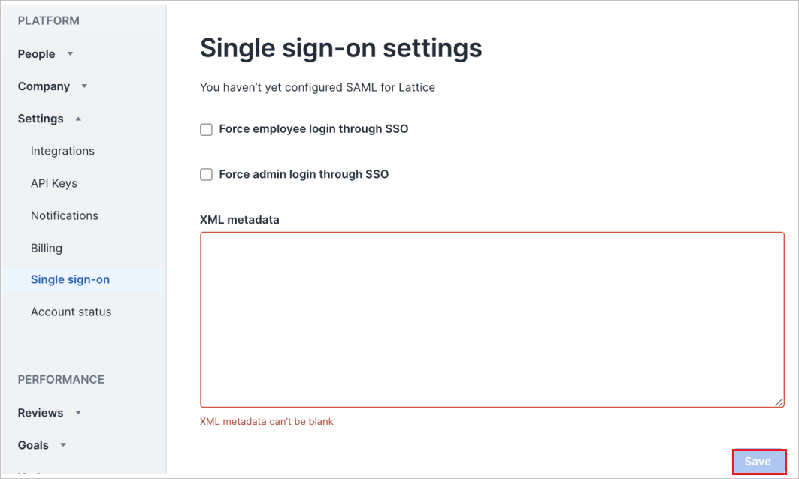

# Configure Lattice for Single sign-on with Microsoft Entra ID

In this article,  you learn how to integrate Lattice with Microsoft Entra ID. When you integrate Lattice with Microsoft Entra ID, you can:

* Control in Microsoft Entra ID who has access to Lattice.
* Enable your users to be automatically signed-in to Lattice with their Microsoft Entra accounts.
* Manage your accounts in one central location.

## Prerequisites

To get started, you need the following items:

* A Microsoft Entra subscription. If you don't have a subscription, you can get a [free account](https://azure.microsoft.com/free/).
* Lattice single sign-on (SSO) enabled subscription.
* Along with Cloud Application Administrator, Application Administrator can also add or manage applications in Microsoft Entra ID.
For more information, see [Azure built-in roles](~/identity/role-based-access-control/permissions-reference.md).

## Scenario description

In this article,  you configure and test Microsoft Entra SSO in a test environment.

* Lattice supports **SP** and **IDP** initiated SSO.

## Add Lattice from the gallery

To configure the integration of Lattice into Microsoft Entra ID, you need to add Lattice from the gallery to your list of managed SaaS apps.

1. Sign in to the [Microsoft Entra admin center](https://entra.microsoft.com) as at least a [Cloud Application Administrator](~/identity/role-based-access-control/permissions-reference.md#cloud-application-administrator).
1. Browse to **Entra ID** > **Enterprise apps** > **New application**.
1. In the **Add from the gallery** section, type **Lattice** in the search box.
1. Select **Lattice** from results panel and then add the app. Wait a few seconds while the app is added to your tenant.

 Alternatively, you can also use the [Enterprise App Configuration Wizard](https://portal.office.com/AdminPortal/home?Q=Docs#/azureadappintegration). In this wizard, you can add an application to your tenant, add users/groups to the app, assign roles, and walk through the SSO configuration as well. [Learn more about Microsoft 365 wizards.](/microsoft-365/admin/misc/azure-ad-setup-guides)

## Configure and test Microsoft Entra SSO for Lattice

Configure and test Microsoft Entra SSO with Lattice using a test user called **B.Simon**. For SSO to work, you need to establish a link relationship between a Microsoft Entra user and the related user in Lattice.

To configure and test Microsoft Entra SSO with Lattice, perform the following steps:

1. **[Configure Microsoft Entra SSO](#configure-azure-ad-sso)** - to enable your users to use this feature.
    1. **Create a Microsoft Entra test user** - to test Microsoft Entra single sign-on with B.Simon.
    1. **Assign the Microsoft Entra test user** - to enable B.Simon to use Microsoft Entra single sign-on.
1. **[Configure Lattice SSO](#configure-lattice-sso)** - to configure the single sign-on settings on application side.
    1. **[Create Lattice test user](#create-lattice-test-user)** - to have a counterpart of B.Simon in Lattice that's linked to the Microsoft Entra representation of user.
1. **[Test SSO](#test-sso)** - to verify whether the configuration works.

## Configure Microsoft Entra SSO

Follow these steps to enable Microsoft Entra SSO.

1. Sign in to the [Microsoft Entra admin center](https://entra.microsoft.com) as at least a [Cloud Application Administrator](~/identity/role-based-access-control/permissions-reference.md#cloud-application-administrator).
1. Browse to **Entra ID** > **Enterprise apps** > **Lattice** > **Single sign-on**.
1. On the **Select a single sign-on method** page, select **SAML**.
1. On the **Set up single sign-on with SAML** page, select the pencil icon for **Basic SAML Configuration** to edit the settings.

    

1. On the **Basic SAML Configuration** section, perform the following steps:

    a. In the **Identifier** textbox, type a URL using the following pattern:
    `https://router.latticehq.com/sso/<subdomain>/metadata`

    b. In the **Reply URL** textbox, type a URL using the following pattern:
    `https://router.latticehq.com/sso/<subdomain>/acs`

1. Select **Set additional URLs** and perform the following step if you wish to configure the application in **SP** initiated mode:    

    In the **Sign-on URL** text box, type the URL:
    `https://router.latticehq.com/sso/lattice/sp-login-redirect`

    > [!Note]
    > These values aren't real. Update these values with the actual Identifier and Reply URL. Contact [Lattice support team](mailto:customercare@lattice.com) to get these values. You can also refer to the patterns shown in the **Basic SAML Configuration** section.

1. On the **Set-up single sign-on with SAML** page, in the **SAML Signing Certificate** section,  find **Federation Metadata XML** and select **Download** to download the certificate and save it on your computer.

    

1. On the **Set up Lattice** section, copy the appropriate URL(s) based on your requirement.

	  

[!INCLUDE [create-assign-users-sso.md](~/identity/saas-apps/includes/create-assign-users-sso.md)]

## Configure Lattice SSO

1. Log in to your Lattice company site as an administrator.

1. Go to **Admin** > **Platform** > **Settings** > **Single sign-on settings** and perform the following steps:

    

    a. In the **XML Metadata** textbox, paste the **Federation Metadata XML** file which you copied previously.

    b. Select **Save**.

### Create Lattice test user

In this section, you create a user called Britta Simon in Lattice. Work with [Lattice support team](mailto:customercare@lattice.com) to add the users in the Lattice platform. Users must be created and activated before you use single sign-on.

## Test SSO 

In this section, you test your Microsoft Entra single sign-on configuration with following options. 

#### SP initiated:

* Select **Test this application**, this option redirects to Lattice Sign-on URL where you can initiate the login flow.  

* Go to Lattice Sign-on URL directly and initiate the login flow from there.

#### IDP initiated:

* Select **Test this application**, and you should be automatically signed in to the Lattice for which you set up the SSO. 

You can also use Microsoft My Apps to test the application in any mode. When you select the Lattice tile in the My Apps, if configured in SP mode you would be redirected to the application sign-on page for initiating the login flow and if configured in IDP mode, you should be automatically signed in to the Lattice for which you set up the SSO. For more information, see [Microsoft Entra My Apps](/azure/active-directory/manage-apps/end-user-experiences#azure-ad-my-apps).

## Related content

Once you configure Lattice you can enforce session control, which protects exfiltration and infiltration of your organization’s sensitive data in real time. Session control extends from Conditional Access. [Learn how to enforce session control with Microsoft Cloud App Security](/cloud-app-security/proxy-deployment-aad).
