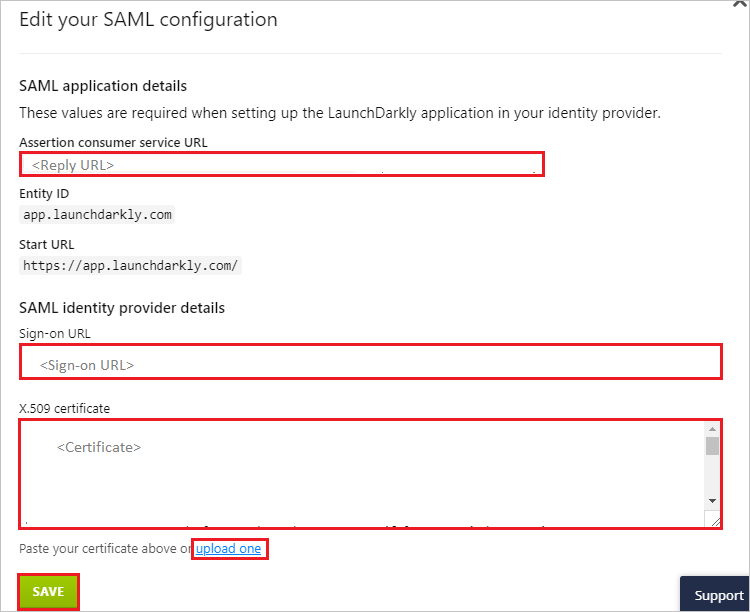

# Configure LaunchDarkly for Single sign-on with Microsoft Entra ID

In this article,  you learn how to integrate LaunchDarkly with Microsoft Entra ID. When you integrate LaunchDarkly with Microsoft Entra ID, you can:

* Control in Microsoft Entra ID who has access to LaunchDarkly.
* Enable your users to be automatically signed-in to LaunchDarkly with their Microsoft Entra accounts.
* Manage your accounts in one central location.

	> [!NOTE]
	> The LaunchDarkly Microsoft Entra integration is one-way. After you configure the integration, you can use Microsoft Entra ID to manage users, SSO, and accounts in LaunchDarkly, but you **can't** use LaunchDarkly to manage users, SSO, and accounts in Azure.

## Prerequisites
The scenario outlined in this article assumes that you already have the following prerequisites:

[!INCLUDE [common-prerequisites.md](~/identity/saas-apps/includes/common-prerequisites.md)]
* LaunchDarkly single sign-on enabled subscription.

## Scenario description

In this article,  you configure and test Microsoft Entra single sign-on in a test environment.

* LaunchDarkly supports **IDP** initiated SSO.
* LaunchDarkly supports **Just In Time** user provisioning.

> [!NOTE]
> Identifier of this application is a fixed string value so only one instance can be configured in one tenant.

## Add LaunchDarkly from the gallery

To configure the integration of LaunchDarkly into Microsoft Entra ID, you need to add LaunchDarkly from the gallery to your list of managed SaaS apps.

1. Sign in to the [Microsoft Entra admin center](https://entra.microsoft.com) as at least a [Cloud Application Administrator](~/identity/role-based-access-control/permissions-reference.md#cloud-application-administrator).
1. Browse to **Entra ID** > **Enterprise apps** > **New application**.
1. In the **Add from the gallery** section, type **LaunchDarkly** in the search box.
1. Select **LaunchDarkly** from results panel and then add the app. Wait a few seconds while the app is added to your tenant.

 Alternatively, you can also use the [Enterprise App Configuration Wizard](https://portal.office.com/AdminPortal/home?Q=Docs#/azureadappintegration). In this wizard, you can add an application to your tenant, add users/groups to the app, assign roles, and walk through the SSO configuration as well. [Learn more about Microsoft 365 wizards.](/microsoft-365/admin/misc/azure-ad-setup-guides)

## Configure and test Microsoft Entra SSO for LaunchDarkly

Configure and test Microsoft Entra SSO with LaunchDarkly using a test user called **B.Simon**. For SSO to work, you need to establish a link relationship between a Microsoft Entra user and the related user in LaunchDarkly.

To configure and test Microsoft Entra SSO with LaunchDarkly, perform the following steps:

1. **[Configure Microsoft Entra SSO](#configure-azure-ad-sso)** - to enable your users to use this feature.
    1. **Create a Microsoft Entra test user** - to test Microsoft Entra single sign-on with B.Simon.
    1. **Assign the Microsoft Entra test user** - to enable B.Simon to use Microsoft Entra single sign-on.
1. **[Configure LaunchDarkly SSO](#configure-launchdarkly-sso)** - to configure the single sign-on settings on application side.
    1. **[Create LaunchDarkly test user](#create-launchdarkly-test-user)** - to have a counterpart of B.Simon in LaunchDarkly that's linked to the Microsoft Entra representation of user.
1. **[Test SSO](#test-sso)** - to verify whether the configuration works.

## Configure Microsoft Entra SSO

Follow these steps to enable Microsoft Entra SSO.

1. Sign in to the [Microsoft Entra admin center](https://entra.microsoft.com) as at least a [Cloud Application Administrator](~/identity/role-based-access-control/permissions-reference.md#cloud-application-administrator).
1. Browse to **Entra ID** > **Enterprise apps** > **LaunchDarkly** > **Single sign-on**.
1. On the **Select a single sign-on method** page, select **SAML**.
1. On the **Set up single sign-on with SAML** page, select the pencil icon for **Basic SAML Configuration** to edit the settings.

   

1. On the **Basic SAML Configuration** section, perform the following steps:

    a. In the **Identifier** text box, type the URL:
    `app.launchdarkly.com`

    b. In the **Reply URL** text box, type a URL using the following pattern:
    `https://app.launchdarkly.com/trust/saml2/acs/<customers-unique-id>`

	> [!NOTE]
	> The Reply URL value isn't real. You update the value with the actual Reply URL, which is explained later in the article. LaunchDarkly currently supports **IDP** initiated SSO. To use this application in **IDP** mode, you need to leave the **Sign on URL** field blank, otherwise you not be able to initiate the login from the **IDP**. You can also refer to the patterns shown in the **Basic SAML Configuration** section.

6. On the **Set up Single Sign-On with SAML** page, in the **SAML Signing Certificate** section, select **Download** to download the **Certificate (Base64)** from the given options as per your requirement and save it on your computer.

	

7. On the **Set up LaunchDarkly** section, copy the appropriate URL(s) as per your requirement.

	

[!INCLUDE [create-assign-users-sso.md](~/identity/saas-apps/includes/create-assign-users-sso.md)]

## Configure LaunchDarkly SSO

1. In a different web browser window, log into your LaunchDarkly company site as an administrator.

2. Select **Account Settings** from the left navigation panel.

	

3. Select **Security** tab.

	

4. Select **ENABLE SSO** and then **EDIT SAML CONFIGURATION**.

	

5. On the **Edit your SAML configuration** section, perform the following steps:

	

	a. Copy the **SAML consumer service URL** for your instance and paste it in Reply URL textbox in **LaunchDarkly Domain and URLs** section on Azure portal.

	b. In the **Sign-on URL** textbox, paste the **Login URL** value, which you copied previously.

	c. Open the downloaded certificate into Notepad, copy the content and then paste it into the **X.509 certificate** box or you can directly upload the certificate by selecting the **upload one**.

	d. Select **Save**.

### Create LaunchDarkly test user

In this section, a user called B.Simon is created in LaunchDarkly. LaunchDarkly supports just-in-time user provisioning, which is enabled by default. There's no action item for you in this section. If a user doesn't already exist in LaunchDarkly, a new one is created after authentication.

## Test SSO

In this section, you test your Microsoft Entra single sign-on configuration with following options.

* Select **Test this application**, and you should be automatically signed in to the LaunchDarkly for which you set up the SSO.

* You can use Microsoft My Apps. When you select the LaunchDarkly tile in the My Apps, you should be automatically signed in to the LaunchDarkly for which you set up the SSO. For more information about the My Apps, see [Introduction to the My Apps](https://support.microsoft.com/account-billing/sign-in-and-start-apps-from-the-my-apps-portal-2f3b1bae-0e5a-4a86-a33e-876fbd2a4510).

## Related content

Once you configure LaunchDarkly you can enforce session control, which protects exfiltration and infiltration of your organization’s sensitive data in real time. Session control extends from Conditional Access. [Learn how to enforce session control with Microsoft Defender for Cloud Apps](/cloud-app-security/proxy-deployment-any-app).
