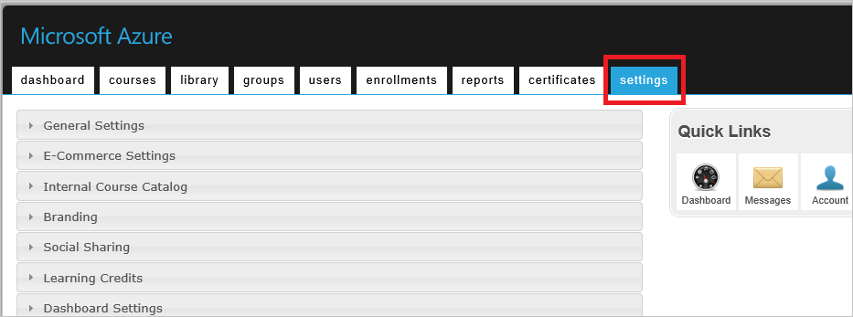
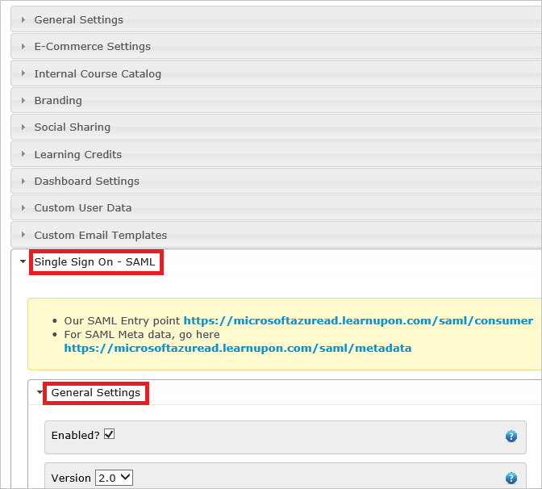
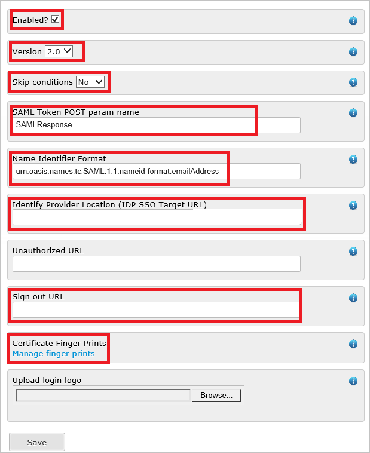
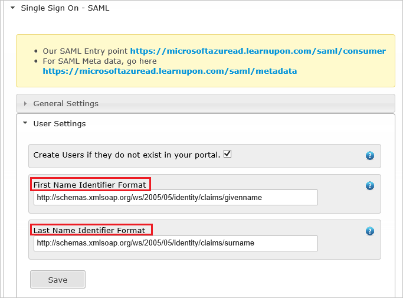

# Configure LearnUpon for Single sign-on with Microsoft Entra ID

In this article,  you learn how to integrate LearnUpon with Microsoft Entra ID. When you integrate LearnUpon with Microsoft Entra ID, you can:

* Control in Microsoft Entra ID who has access to LearnUpon.
* Enable your users to be automatically signed-in to LearnUpon with their Microsoft Entra accounts.
* Manage your accounts in one central location.

## Prerequisites
The scenario outlined in this article assumes that you already have the following prerequisites:

[!INCLUDE [common-prerequisites.md](~/identity/saas-apps/includes/common-prerequisites.md)]
* LearnUpon single sign-on enabled subscription.

## Scenario description

In this article,  you configure and test Microsoft Entra single sign-on in a test environment.

* LearnUpon supports **IDP** initiated SSO.

* LearnUpon supports **Just In Time** user provisioning.

> [!NOTE]
> Identifier of this application is a fixed string value so only one instance can be configured in one tenant.

## Add LearnUpon from the gallery

To configure the integration of LearnUpon into Microsoft Entra ID, you need to add LearnUpon from the gallery to your list of managed SaaS apps.

1. Sign in to the [Microsoft Entra admin center](https://entra.microsoft.com) as at least a [Cloud Application Administrator](~/identity/role-based-access-control/permissions-reference.md#cloud-application-administrator).
1. Browse to **Entra ID** > **Enterprise apps** > **New application**.
1. In the **Add from the gallery** section, type **LearnUpon** in the search box.
1. Select **LearnUpon** from results panel and then add the app. Wait a few seconds while the app is added to your tenant.

 Alternatively, you can also use the [Enterprise App Configuration Wizard](https://portal.office.com/AdminPortal/home?Q=Docs#/azureadappintegration). In this wizard, you can add an application to your tenant, add users/groups to the app, assign roles, and walk through the SSO configuration as well. [Learn more about Microsoft 365 wizards.](/microsoft-365/admin/misc/azure-ad-setup-guides)

## Configure and test Microsoft Entra SSO for LearnUpon

Configure and test Microsoft Entra SSO with LearnUpon using a test user called **B.Simon**. For SSO to work, you need to establish a link relationship between a Microsoft Entra user and the related user in LearnUpon.

To configure and test Microsoft Entra SSO with LearnUpon, perform the following steps:

1. **[Configure Microsoft Entra SSO](#configure-azure-ad-sso)** - to enable your users to use this feature.
    1. **Create a Microsoft Entra test user** - to test Microsoft Entra single sign-on with B.Simon.
    1. **Assign the Microsoft Entra test user** - to enable B.Simon to use Microsoft Entra single sign-on.
1. **[Configure LearnUpon SSO](#configure-learnupon-sso)** - to configure the single sign-on settings on application side.
    1. **[Create LearnUpon test user](#create-learnupon-test-user)** - to have a counterpart of B.Simon in LearnUpon that's linked to the Microsoft Entra representation of user.
1. **[Test SSO](#test-sso)** - to verify whether the configuration works.

## Configure Microsoft Entra SSO

Follow these steps to enable Microsoft Entra SSO.

1. Sign in to the [Microsoft Entra admin center](https://entra.microsoft.com) as at least a [Cloud Application Administrator](~/identity/role-based-access-control/permissions-reference.md#cloud-application-administrator).
1. Browse to **Entra ID** > **Enterprise apps** > **LearnUpon** > **Single sign-on**.
1. On the **Select a single sign-on method** page, select **SAML**.
1. On the **Set up single sign-on with SAML** page, select the pencil icon for **Basic SAML Configuration** to edit the settings.

   

1. On the **Basic SAML Configuration** section, perform the following steps:

    In the **Reply URL** text box, type a URL using the following pattern:
    `https://<companyname>.learnupon.com/saml/consumer`

	> [!NOTE]
	> The value isn't real. Update the value with the actual Reply URL. Contact [LearnUpon Client support team](https://www.learnupon.com/contact/) to get the value. You can also refer to the patterns shown in the **Basic SAML Configuration** section.

1. On the **Set up Single Sign-On with SAML** page, locate the **THUMBPRINT** - This are added to your LearnUpon SAML Settings.

	

6. On the **Set up LearnUpon** section, copy the appropriate URL(s) as per your requirement.

	

[!INCLUDE [create-assign-users-sso.md](~/identity/saas-apps/includes/create-assign-users-sso.md)]

## Configure LearnUpon SSO

1. Open another browser instance and sign in into LearnUpon with an administrator account.

1. Select the **settings** tab.

    

1. Select **Single Sign On - SAML**, and then select **General Settings** to configure SAML settings.
   
     

1. In the **General Settings** section, perform the following steps:
   
      
  
	a. Select **Enabled**.

	b. Select **Version** as **2.0**.

	c. Select **Skip conditions** as **No**.

	d. In the **SAML Token Post param name** textbox, type the name of request post parameter to the SAML consumer URL indicated above that contains the SAML Assertion to be verified and authenticated - for example **SAMLResponse**.

	e. In the **Name Identifier Format** textbox, type the value that indicates where in your SAML Assertion the users identifier (Email address) resides - for example `urn:oasis:names:tc:SAML:1.1:nameid-format:emailAddress`.
  
	f. In the **Identify Provider Location** textbox, type the value that indicates where the users are sent to if they select your uploaded icon from your Azure portal login screen.
  
	g. In the **Sign out URL** textbox, paste the **Logout URL** value, which you copied previously.

	h. Select **Manage finger prints**, and then upload the finger print of your downloaded certificate.

1. Select **User Settings**, and then perform the following steps:

       

	a. In the **First Name Identifier Format** textbox, type the value that tells us where in your SAML Assertion the users firstname resides - for example: `http://schemas.xmlsoap.org/ws/2005/05/identity/claims/givenname`.
  
	b. In the **Last Name Identifier Format** textbox, type the value that tells us where in your SAML Assertion the users lastname resides - for example: `http://schemas.xmlsoap.org/ws/2005/05/identity/claims/surname`.

### Create LearnUpon test user

In this section, a user called Britta Simon is created in LearnUpon. LearnUpon supports just-in-time user provisioning, which is enabled by default. There's no action item for you in this section. If a user doesn't already exist in LearnUpon, a new one is created after authentication. If you need to create a user manually, you need to contact [LearnUpon support team](https://www.learnupon.com/contact/).

## Test SSO 

In this section, you test your Microsoft Entra single sign-on configuration with following options.

* Select **Test this application**, and you should be automatically signed in to the LearnUpon for which you set up the SSO.

* You can use Microsoft My Apps. When you select the LearnUpon tile in the My Apps, you should be automatically signed in to the LearnUpon for which you set up the SSO. For more information about the My Apps, see [Introduction to the My Apps](https://support.microsoft.com/account-billing/sign-in-and-start-apps-from-the-my-apps-portal-2f3b1bae-0e5a-4a86-a33e-876fbd2a4510).

## Related content

Once you configure LearnUpon you can enforce session control, which protects exfiltration and infiltration of your organization’s sensitive data in real time. Session control extends from Conditional Access. [Learn how to enforce session control with Microsoft Defender for Cloud Apps](/cloud-app-security/proxy-deployment-aad).
