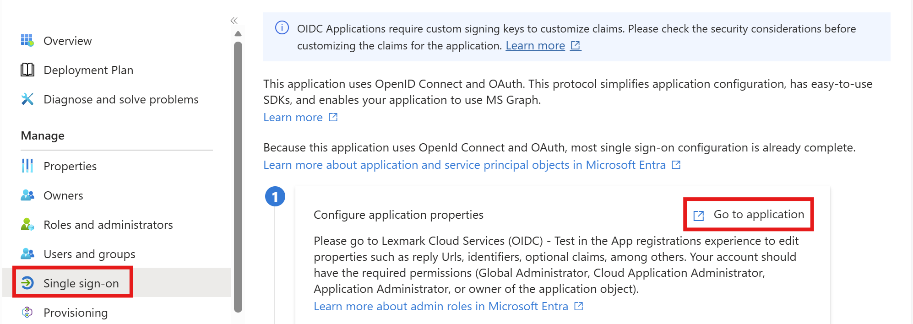
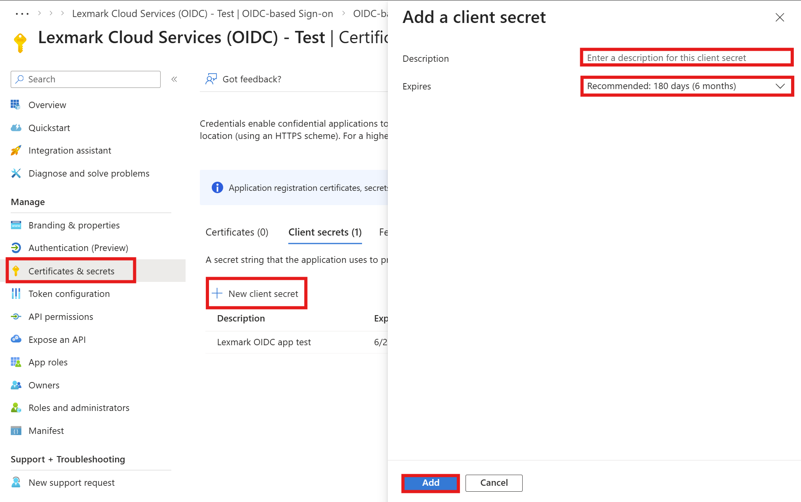
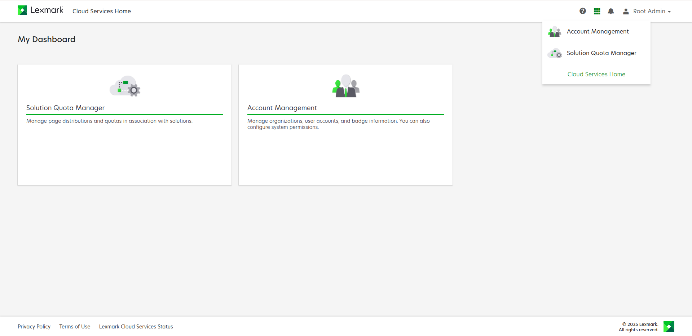
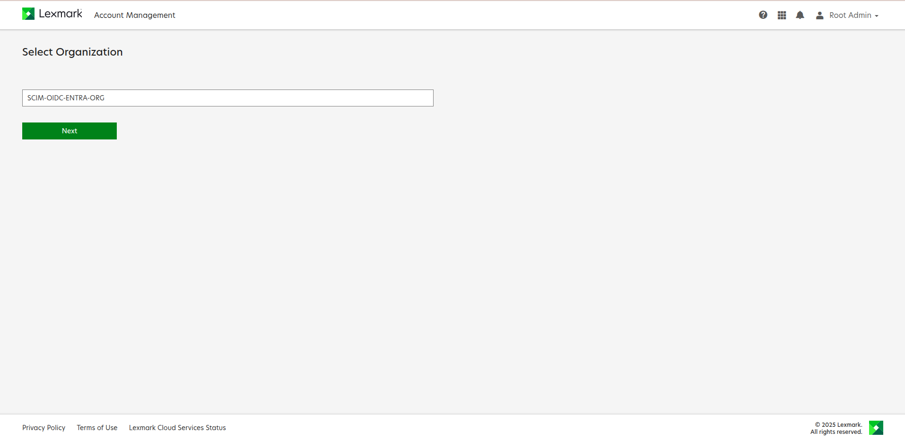
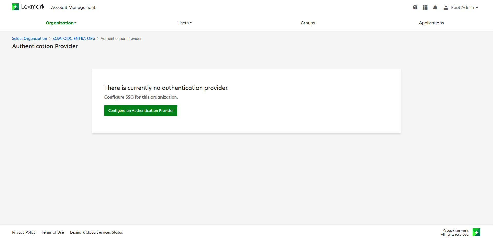
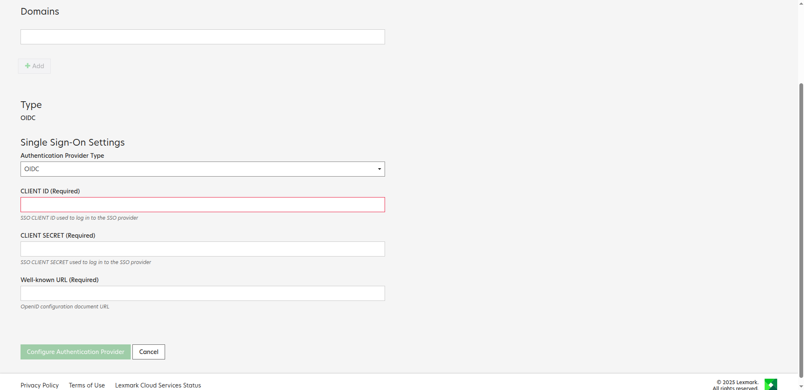

 
# Configure Lexmark Cloud Services (OIDC) for Single sign-on with Microsoft Entra ID
 
In this article,  you learn how to integrate Lexmark Cloud Services (OIDC) with Microsoft Entra ID. When you integrate Lexmark Cloud Services (OIDC) with Microsoft Entra ID, you can:
 
Use Microsoft Entra ID to control who can access Lexmark Cloud Services (OIDC).
Enable your users to be automatically signed in to Lexmark Cloud Services (OIDC) with their Microsoft Entra accounts.
Manage your accounts in one central location: the Azure portal.
 
## Prerequisites
 
To get started, you need the following items:
 
* A Microsoft Entra subscription. If you don't have a subscription, you can get a [free account](https://azure.microsoft.com/free/).
* Lexmark Cloud Services (OIDC) single sign-on (SSO) enabled subscription.
 
## Add Lexmark Cloud Services (OIDC) from the gallery
 
To configure the integration of Lexmark Cloud Services (OIDC) into Microsoft Entra ID, you need to add Lexmark Cloud Services (OIDC) from the gallery to your list of managed SaaS apps.
 
1. Sign in to the [Microsoft Entra admin center](https://entra.microsoft.com) as at least a [Cloud Application Administrator](~/identity/role-based-access-control/permissions-reference.md#cloud-application-administrator).
 
1. Browse to **Entra ID** > **Enterprise apps** > **New application**.
 
1. In the **Browse Microsoft Entra App Gallery** section, enter **Lexmark Cloud Services (OIDC)** in the search box.
 
1. Select **Lexmark Cloud Services (OIDC)** in the results panel and then add the app. Wait a few seconds while the app is added to your tenant.
 
## Configure Microsoft Entra SSO
 
Follow these steps to enable Microsoft Entra SSO in the Microsoft Entra admin center.
 
1. Sign in to the [Microsoft Entra admin center](https://entra.microsoft.com) as at least a [Cloud Application Administrator](~/identity/role-based-access-control/permissions-reference.md#cloud-application-administrator).
 
1. Browse to **Entra ID** > **Enterprise apps** > **Lexmark Cloud Services (OIDC)** > **Single sign-on**.
 
1. Perform the following steps:
 
    1. Select **Go to application**.
 
        
 
    1. Copy **Application (client) ID**. You'll use it later in the Lexmark Cloud Services (OIDC) SSO configuration.
 
        
 
    1. Under **Endpoints** tab, copy **OpenID Connect metadata document** link. You'll use it later in the Lexmark Cloud Services (OIDC) SSO configuration.
 
        
 
1. Navigate to **Authentication** tab on the left menu and perform the following steps:
 
    1. In the **Redirect URIs** textbox, paste the **Relying Party Redirect URI** value, which you have copied from Lexmark Cloud Services (OIDC) side.
 
        
 
    1. Select **Configure** button.
 
1. Navigate to **Certificates & secrets** on the left menu and perform the following steps:
 
    1. Go to **Client secrets** tab and select **+New client secret**.
    1. Enter a valid **Description** in the textbox and select **Expires** days from the drop-down as per your requirement and select **Add**.
 
        
 
    1. Once you add a client secret, **Value** is generated. Copy the value. You'll use it later in the Lexmark Cloud Services (OIDC) SSO configuration.
 
        
 
### Create a Microsoft Entra test user
 
In this section, you create a test user called B.Simon.
 
1. Sign in to the [Microsoft Entra admin center](https://entra.microsoft.com) as at least a [User Administrator](~/identity/role-based-access-control/permissions-reference.md#user-administrator).
1. Browse to **Entra ID** > **Users**.
1. Select **New user** > **Create new user**, at the top of the screen.
1. In the **User** properties, follow these steps:
   1. In the **Display name** field, enter `B.Simon`.  
   1. In the **User principal name** field, enter the username@companydomain.extension. For example, `B.Simon@contoso.com`.
   1. Select the **Show password** check box, and then write down the value that's displayed in the **Password** box.
   1. Select **Review + create**.
1. Select **Create**.
 
### Assign the Microsoft Entra test user
 
In this section, you enable B.Simon to use single sign-on by granting access to Lexmark Cloud Services (OIDC).
 
1. Sign in to the [Microsoft Entra admin center](https://entra.microsoft.com) as at least a [Cloud Application Administrator](~/identity/role-based-access-control/permissions-reference.md#cloud-application-administrator).
1. Browse to **Entra ID** > **Enterprise apps** > **Lexmark Cloud Services (OIDC)**.
1. In the app's overview page, select **Users and groups**.
1. Select **Add user/group**, then select **Users and groups** in the **Add Assignment** dialog.
   1. In the **Users and groups** dialog, select **B.Simon** from the Users list, then select the **Select** button at the bottom of the screen.
   1. If you're expecting a role to be assigned to the users, you can select it from the **Select a role** dropdown. If no role has been set up for this app, you see "Default Access" role selected.
   1. In the **Add Assignment** dialog, select the **Assign** button.
 
## Configure Lexmark Cloud Services (OIDC) SSO

To complete the steps in this section, ensure you have the Organization Administrator role for your organization in Lexmark Cloud Services. Also review the [Lexmark documentation](https://support.lexmark.com/en_us/manuals-guides/online/Lexmark-Cloud-Platform/configuring-azure-ad-federation-for-oidc-overview-.html) on Configuring Microsoft Entra ID with OIDC Federation

## Configure your organization for SSO with OIDC

1. Log in to Lexmark Cloud Services as an Organization Administrator.
2. From the Lexmark Cloud services dashboard or from the navigation menu on the right side of the screen, select **Account Management**.

3. If necessary, select your organization, and then select **Next**.

4. In the Organization section, select **Authentication Provider**.

5. Select **Configure** on **Authentication Provider** pane.

6. From the **Authentication Provider Type** menu, select **OIDC**.
7. Enter the required information copied from Microsoft Entra ID:

    * Client ID (Application client ID)
    * Client Secret (Client secret value)
    * Well-known URL (OpenID Connect metadata document URL)

> [!NOTE]
> The Domains field allows Lexmark Cloud Services to automatically establish a new user account after the user logs in. Listing each organization's domain is not required. If no domain is set, then the new users must be manually added to the organization before they log in.
8. Select **Configure Authentication Provider**.

> [!NOTE]
> Once authentication configuration is completed, you will receive an email on configuration status. In case of configuration failure, contact your Lexmark representative.

9. The relying party redirect URIs for US and EU regions. (To be used in the Microsoft Entra Authentication Configuration)

> [!NOTE] 
> Select ID Tokens in Implicit grant and hybrid flows under Entra Authentication Configuration
    
### Test the SSO configuration

Refer to [Testing a federation] (https://support.lexmark.com/en_us/manuals-guides/online/Lexmark-Cloud-Platform/testing-a-federation-v58742261.html?toc=2.5.4.10) on how to test that your SSO is set up successfully.
