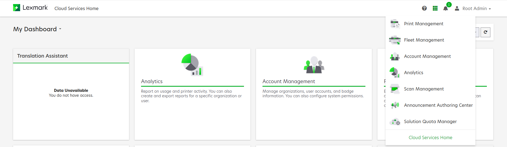
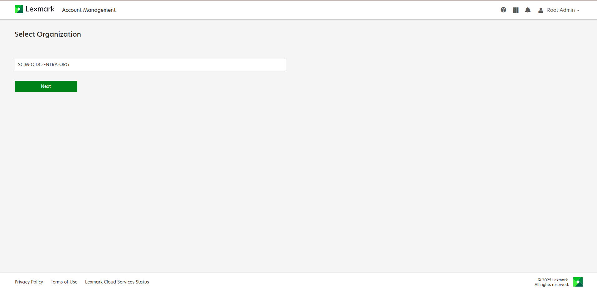
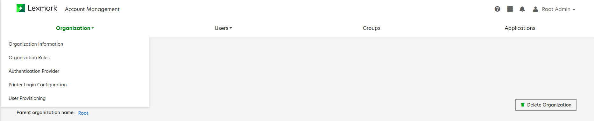
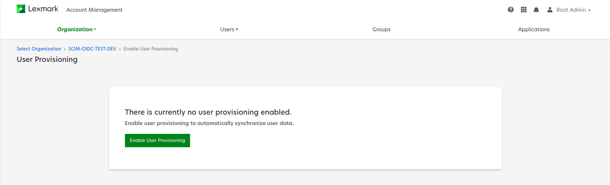
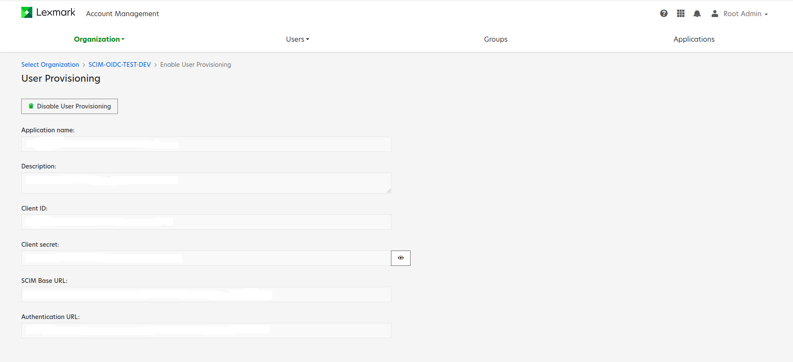
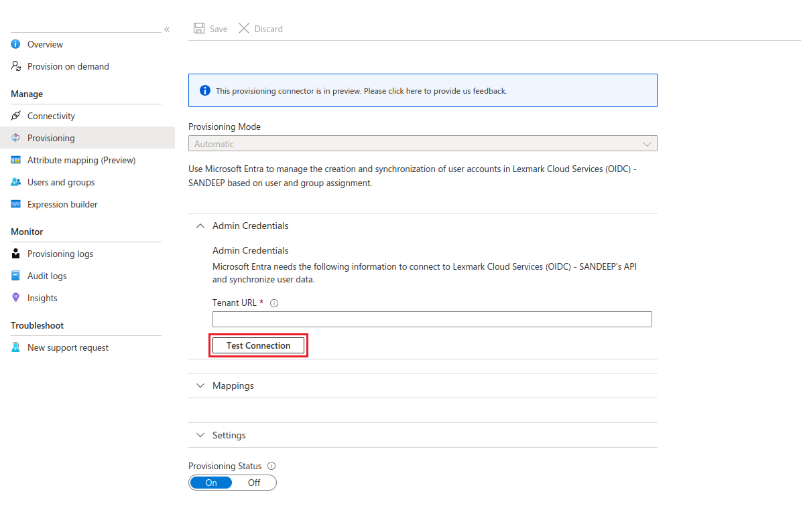
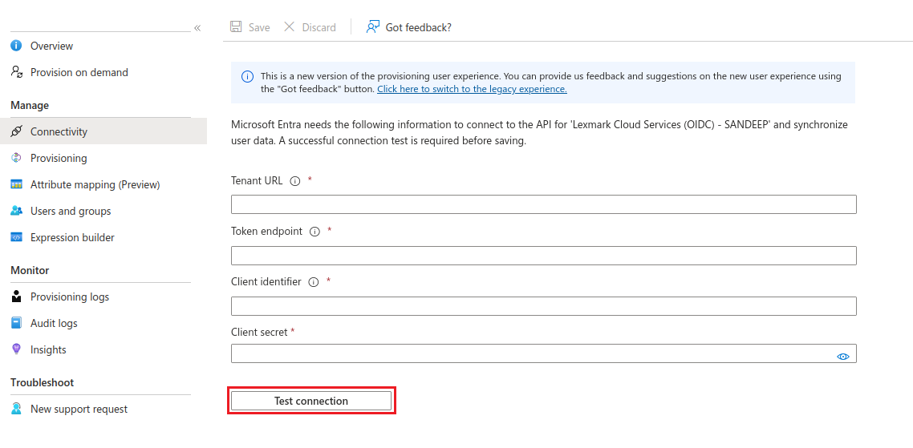

# Configure Lexmark Cloud Services (OIDC) for automatic user provisioning with Microsoft Entra ID

This article describes the steps you need to perform in both Lexmark Cloud Services (OIDC) and Microsoft Entra ID to configure automatic user provisioning. When configured, Microsoft Entra ID automatically provisions and de-provisions users to Lexmark Cloud Services (OIDC) using the Microsoft Entra provisioning service. For important details on what this service does, how it works, and frequently asked questions, see [Automate user provisioning and deprovisioning to SaaS applications with Microsoft Entra ID](~/identity/app-provisioning/user-provisioning.md).

## Capabilities supported
> [!div class="checklist"]
> * Create users in Lexmark Cloud Services (OIDC)
> * Disable users in Lexmark Cloud Services (OIDC) when they don't require access anymore
> * Keep user attributes synchronized between Microsoft Entra ID and Lexmark Cloud Services (OIDC) [Single sign-on](~/identity/enterprise-apps/add-application-portal-setup-oidc-sso.md) to Lexmark Cloud Services (OIDC) (recommended).

> [!NOTE]
> Lexmark Cloud Services (OIDC) application currently only supports user provisioning. Group provisioning isn't supported and is planned for a future release.

## Prerequisites

The scenario outlined in this article assumes that you already have the following prerequisites:

* [A Microsoft Entra tenant](~/identity-platform/quickstart-create-new-tenant.md).
* One of the following roles: [Application Administrator](/entra/identity/role-based-access-control/permissions-reference#application-administrator), [Cloud Application Administrator](/entra/identity/role-based-access-control/permissions-reference#cloud-application-administrator), or [Application Owner](/entra/fundamentals/users-default-permissions#owned-enterprise-applications).
* An OIDC federated organization in Lexmark Cloud Services with Organization Administrator role.
* Review the [lexmark documentation](https://support.lexmark.com/en_us/manuals-guides/online/Lexmark-Cloud-Platform/overview-v54808648.html?toc=2.5.0) on user provisioning.

## Step 1: Plan your provisioning deployment
1. Learn about [how the provisioning service works](~/identity/app-provisioning/user-provisioning.md).
2. Determine who is in [scope for provisioning](~/identity/app-provisioning/define-conditional-rules-for-provisioning-user-accounts.md).
3. Determine what data to [map between Microsoft Entra ID and Adobe Identity Management (OIDC)](~/identity/app-provisioning/customize-application-attributes.md).

## Step 2: Configure Lexmark Cloud Services (OIDC) to support provisioning with Microsoft Entra ID

1. Log in to Lexmark Cloud Services.

2. From the Dashboard card or the navigation waffle menu, select **Account Management**.

    

3. If necessary, select your organization, and then select **Next**.

    

4. Ensure your organization is configured for SSO with [Lexmark Cloud Services (OIDC) application](~/identity/saas-apps/lexmark-cloud-services-oidc-tutorial.md).

5. In the **Select Organization** pane, select **User provisioning**.

    

6. Select  **Enable User Provisioning**.

    

7. Provisioning details will be automatically populated when enabled.

    

## Step 3: Add Lexmark Cloud Services (OIDC) from the Microsoft Entra application gallery

Add Lexmark Cloud Services (OIDC) from the Microsoft Entra application gallery to start managing provisioning to Lexmark Cloud Services (OIDC). If you have previously setup Lexmark Cloud Services (OIDC) for SSO, you can use the same application. However, it is recommended that you create a separate app when testing out the integration initially. Learn more about adding an application from the gallery [here](~/identity/enterprise-apps/add-application-portal.md).

## Step 4: Configure automatic user provisioning to Lexmark Cloud Services (OIDC) 

This section guides you through the steps to configure the Microsoft Entra provisioning service to create, update, and disable users and/or groups in Lexmark Cloud Services (OIDC) based on user and/or group assignments in Microsoft Entra ID

### To configure automatic user provisioning for Lexmark Cloud Services (OIDC) in Microsoft Entra ID

1. Sign in to the [Microsoft Entra admin center](https://entra.microsoft.com) as at least an app owner or a [Cloud Application Administrator](~/identity/role-based-access-control/permissions-reference.md#cloud-application-administrator).
1. Browse to **Entra ID** > **Enterprise apps**

    

1. In the applications list, select **Lexmark Cloud Services (OIDC)**.

    

1. Select the **Provisioning** tab.

    

1. Set **+ New configuration**.

    

1. In the Tenant URL field, input your Lexmark Cloud Services (OIDC) Tenant URL. Select **Test Connection**  to ensure Microsoft Entra ID can connect to Lexmark Cloud Services (OIDC). If the connection fails, ensure your Lexmark Cloud Services (OIDC) account has the required permissions and try again.
    
    

1. In connectivity tab, paste the Tenant URL, Token endpoint, Client identifier, and Client secret which you have copied from Lexmark Cloud Services (OIDC) provisioning page and Select **Test Connection**.

    

1. Select **Create** to create your configuration.  

1. Select **Properties** in the **Overview** page.  

1. Select the pencil to edit the properties: 
    1. Enable notification emails and provide an email to receive quarantine emails. 
    1. Enable accidental deletions prevention.
    1. Select  **Apply**  to save the changes.  

   

1. Select **Attribute Mapping** in the left panel and select users.

1. Review the user attributes that are synchronized from Microsoft Entra ID to Lexmark Cloud Services (OIDC) in the **Attribute-Mapping** section. The attributes selected as **Matching** properties are used to match the user accounts in Lexmark Cloud Services (OIDC) for update operations. If you choose to change the [matching target attribute](~/identity/app-provisioning/customize-application-attributes.md), you need to ensure that the Lexmark Cloud Services (OIDC) API supports filtering users based on that attribute. Select the **Save** button to commit any changes.

    |Attribute|Type|Supported for filtering|Required by Lexmark Cloud Services (OIDC)|
    |---|---|---|---|
    |userName|String|&check;|&check;|
    |active|Boolean|||
    |name.givenName|String||
    |name.familyName|String||
    |displayName|String||
    |preferredLanguage|String||
    |urn:ietf:params:scim:schemas:extension:enterprise:2.0:User:costCenter|String|| 
    |urn:ietf:params:scim:schemas:extension:enterprise:2.0:User:department|String|| 

    > [!NOTE]
    > The sensitive attributes like badge and pin are not supported for mapping.

    > [!NOTE]
    > To create and map the custom attributes please follow the instructions in [this article](~/external-id/customers/how-to-define-custom-attributes.md). 

1. To configure scoping filters, refer to the following instructions provided in the [Scoping filter article](~/identity/app-provisioning/define-conditional-rules-for-provisioning-user-accounts.md) article.

1. When you're ready to provision, select **Start Provisioning** from the **Overview** page.

## Step 5: Monitor your deployment

[!INCLUDE [monitor-deployment.md](~/identity/saas-apps/includes/monitor-deployment.md)]
